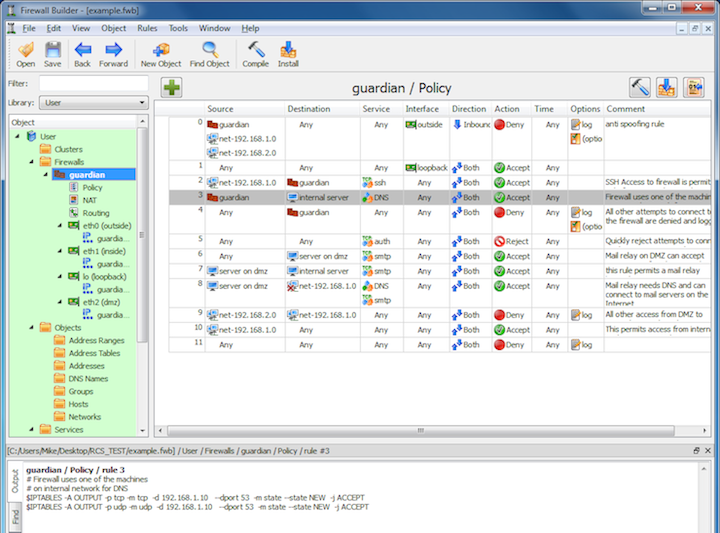

Introduction
============

.. sectnum::
   :start: 1

.. contents::
   :local:
   :depth: 2

Introducing Firewall Builder
-----------------------------

Firewall Builder simplifies the firewall policy management for a number of firewall platforms, including Netfilter/iptables, ipfw, PF, Cisco PIX, and others. Firewall Builder provides a professional-grade GUI to these platforms, simplifying administration tasks.

With Firewall Builder, you can manage the security policy of your firewall efficiently and accurately, without the learning curve usually associated with command line interfaces. Instead of thinking in terms of obscure commands and parameters, you simply create a set of objects describing your firewall, servers, and subnets, and then implement your firewall policy by dragging objects into policy rules. You can also take advantage of a large collection of predefined objects describing many standard protocols and services. Once a policy is built in the GUI, you can compile it and install it on one, or several, firewall machines.

Overview of Firewall Builder Features
--------------------------------------

Firewall Builder helps you write and manage configuration for your firewalls. It writes iptables shell scripts, pf.conf files, Cisco router access lists, or PIX configurations for you. You can then copy and paste configurations generated by Firewall Builder, copy the files manually or using your own scripts, or use built-in functions to configure the firewall. Firewall Builder provides change control and search functions. It allows you to reuse the same address and service objects in the rules of many firewalls. It simplifies coordinated changes of the rules in multi-vendor environments and helps avoid errors in generated configurations.

Firewall Builder can generate complex *iptables*, *PF*, *Cisco IOS extended access lists*, *Cisco ASA (PIX)* configurations. You do not have to remember all the details of their syntax and internal operation. This saves time and helps avoid errors.

Rules built in the GUI look exactly the same and use the same set of objects describing your network regardless of the actual firewall platform you use. You only need to learn the program once to be able to build or modify basic configuration for iptables, PF, or Cisco routers or firewalls. Already an expert in one or several firewall platforms? Firewall Builder can help you utilize advanced features, too.

Configuration files for the target firewall are auto-generated, so they don't have syntax errors and typos. Firewall Builder has information about features and limitations of supported firewall platforms. This means you can detect errors before you actually enter commands on the firewall, when it is too late. Firewall Builder helps you avoid many types of errors at the earliest opportunity; for example, it can detect rule shadowing, a common cause of errors in the policy structure.

Create an object to represent your network, a server, or service once and use it many times. Port number or address changes? No need to scan all the rules of all routers and firewalls to find them. Just change them in the object, recompile, push updated configuration, and you are done. At the same time, the GUI provides *powerful search functions* that help you find all the rules of all firewalls that use some object and perform *search and replace* operations.

If you work for a large distributed organization with many administrators, you can assemble address and service objects that describe your network in a library and save it to a data file, then distribute it for other administrators to use. You can also create your own templates for the firewall objects and rules and use them to quickly create new configurations.

Firewall Builder helps perform transitions between different versions of the same firewall (*iptables*, *PF*, *PIX*); from one platform to another; or from *IPv4* to *IPv6*.

You work with an abstract policy that operates with objects. We spend time studying differences between iptables and PIX or between different versions of each so that you don't have to.

Firewall Builder makes it easy to add IPv6 rules to your existing firewall policies. Create objects describing your IPv6 network, add them to the same rule set that defines your security policy for IPv4, and configure it as a "mixed IPv4+IPv6 rule set". The program generates two configurations, one for IPv4 and another for IPv6, using correct objects for each. There is no need to maintain two policies in parallel for the transition from IPv4 to IPv6.

You can generate configuration for a range of devices, starting from small *Linksys*, *D-Link* and other routers running *DD-WRT* or *OpenWRT*, to firewalls running *Linux*, *FreeBSD* or *OpenBSD* on a regular or purpose-built PC, to *Cisco routers* and *Cisco ASA (PIX)* firewalls.

Firewall Builder has been designed to manage both *dedicated remote firewalls* and *local firewall configurations* for servers, workstations, and laptops.

Firewall Builder can generate scripts that set up *interfaces*, *ip addresses*, *snmp*, *ntp* and *logging* parameters and other aspects of the general configuration of the firewall machine.

*Make coordinated changes in multi-vendor environments:* Do you have Cisco routers with extended ACLs, dedicated Cisco ASA (PIX) firewalls, Linux or BSD firewalls, and servers, and you need to make changes in configurations of all these devices to enable a new service? Firewall Builder helps you make coordinated changes in an environment like this.

Have all the advantages of the GUI and object-oriented policy design with your existing firewalls and routers, whether they are Linux, BSD, or Cisco devices. Protect your investment, and keep existing equipment whose performance you are happy with. You can import existing iptables and Cisco router configuration into Firewall Builder.

The built-in policy installer is flexible, using SSH for a secure communication channel to each firewall, and has many safeguards to make sure you never cut yourself off from a firewall in case of policy mistake. The policy installer can deploy to one firewall or to many firewalls and routers in a batch.

*Is this new stuff?* Not at all. FirewallFabrik is built on a long and proven history. It is a fork of Firewall Builder, a well-established firewall configuration tool that has been registered on `SourceForge <http://sourceforge.net/projects/fwbuilder>`_ since 2000 and has gone through several major releases.

FirewallFabrik carries this great project forward into the modern world. Its core concepts and ideas have been preserved and systematically evolved - including a transition from C++ to Python, from XML to YAML, and toward a more contemporary architecture overall.

While FirewallFabrik is an independent project, it clearly stands on the shoulders of Firewall Builder. The majority of the credit and historical merit therefore belongs to this outstanding tool and its original developers.

Documentation is freely available online. Start with the Firewall Builder User's Guide. The User's Guide explains the program in detail and includes a large "CookBook" section that presents typical firewall rule design problems and demonstrates how they can be solved with Firewall Builder.
