Firewall Builder GUI
====================

.. sectnum::
   :start: 4

.. contents::
   :local:
   :depth: 3

The Firewall Builder GUI is your workspace for creating and compiling a firewall policy. In the workspace, you create *objects*, which are logical representations of your servers, network services, subnetworks, and other aspects of your network. You then use these objects in your policy.

You use Firewall Builder to compile your policy for your target firewall platform, and, if you like, to deploy the policy to the actual firewall.

This chapter provides a high-level overview of the Firewall Builder GUI and how it works. Later chapters describe using the GUI to accomplish specific tasks.

The Firewall Builder GUI consists of a main window and some dialog boxes. In the next section, we describe the main window.

The Main Window
---------------

This figure shows the Firewall Builder GUI with a single object file open.

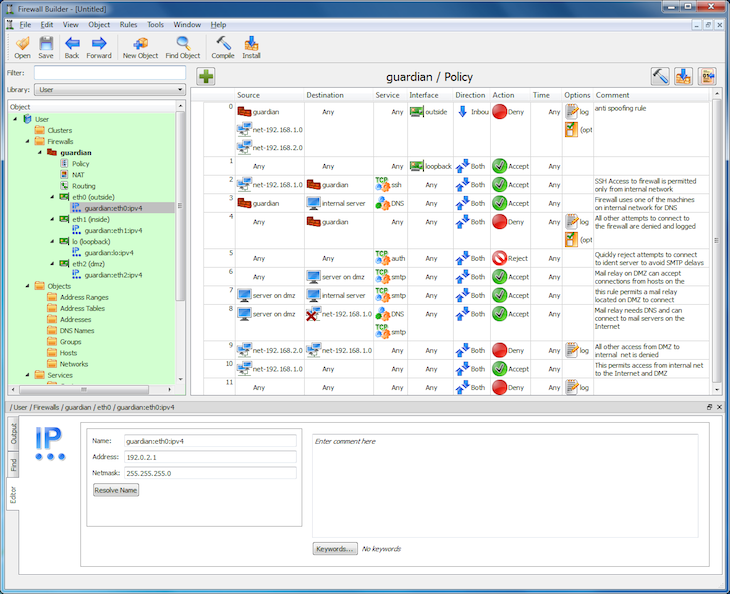

   The Main Window

The sections of the main window are as follows:

**Menus and Tool Bar**

Firewall Builder comes with menus and a tool bar at the top of the window.

.. figure:: img/gui-menu-and-tool-bars.png
   :alt: Menu and Tool Bars

   Menu and Tool Bars

**The Object Tree**

Displayed on the left side of the window, the object tree displays firewalls, hosts, interfaces, services, and other "objects" that you will use when creating policies for your firewall. See the `Object Tree`_ section for details on the objects in the tree and how to filter the object tree.

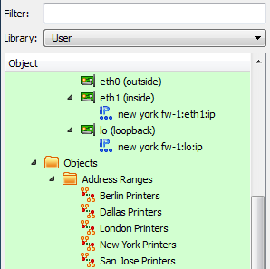

   The Object Tree

**The Policy Rule Set Workspace**

Displayed to the right of the object tree, this area holds the rule set you are currently working on. This space is blank when you first load an object file. It only appears when you double-click a policy, NAT, or routing rule set link in a firewall object. (This means that you have to create a firewall object before you can work on a policy.)

See :doc:`05 - Working with Objects` for instructions on creating a firewall object. See :doc:`07 - Firewall Policies` for instructions on working with policies.

The + button on the left inserts a new rule in the open policy above the currently selected rule. The buttons on the top right of the policy window are shortcuts to compile, compile-and-install and inspect generated files.

.. figure:: img/gui-policy-area.png
   :alt: The Policy Area

   The Policy Area

**The Object Editor Dialog**

The dialog area, across the bottom of the main window, is where you make changes to object parameters, perform find and replace operations, and view the output from single-rule compiles. The dialog area is not visible until you double-click an object.

The dialog has three tabs and three uses: editing an object's parameters, doing a find or find-and-replace on an object, and displaying the output of a single-rule compile run. Close the dialog by clicking the X.

In the object editor dialog, you can make changes to an object's parameters. Changes made to a field in the dialog are saved whenever you click out of the field, or when you press the Tab or Enter key. (Note that this does not change the data in the .fwb file until you save the file itself.) If you wish to cancel a change, select Edit > Undo. For more information on objects and their parameters, see :doc:`05 - Working with Objects`.

.. figure:: img/gui-object-editor.png
   :alt: Object Editor, Partial View

   Object Editor, Partial View

You can search for objects and rule sets across your object files, plus do replacements of objects. See :doc:`05 - Working with Objects` for an explanation of the Find-and-Replace tab.

.. figure:: img/gui-find-and-replace.png
   :alt: Find-and-Replace Object dialog, Partial View

   Find-and-Replace Object dialog, Partial View

You can compile individual rules and see how the rule gets converted into firewall instructions.

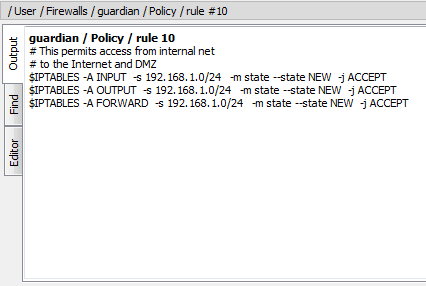

   Output View, Partial View

**Undo Stack**

Displayed on the right side of the window, the Undo Stack is not displayed by default. To activate it, select View > Undo Stack.

As you make changes to your object file, those changes show up in the Undo Stack window. You can "undo" an action by clicking the action above it (in other words, prior to it) in the window. Clicking any action in the window rolls back all changes after that action. However, the "future" changes stay in the Undo Stack until you make another edit. At that point, all changes after the current point in the stack are removed.

The Undo Stack can "float" as its own window by clicking the button at the top of the panel next to the close button.

See the `Undo Stack`_ section for a more detailed explanation of the Undo Stack window.

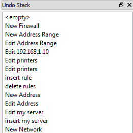

   Undo Stack

You can open more than one object file window at a time, and you can copy objects between them. See `Working with Multiple Data Files`_ for an example.

GUI Menu and Tool Bars
----------------------

This section describes the commands available in the GUI menus and tool bar.

File Menu
~~~~~~~~~

The File menu provides standard file management options, and in addition allows you to import and export libraries and manage your object files with the revision control system.

.. list-table:: File Menu
   :header-rows: 1
   :widths: 30 70

   * - File Menu Entry
     - Explanation
   * - New Object File
     - Opens a "file" dialog that lets you name your new object file. Object file names end with ".fwb". In general, you should create a new directory for your object files.
   * - Open...
     - Opens a standard "file" dialog that lets you select an existing file. The file dialog, by default, only looks for files that end in ".fwb".
   * - Open Recent
     - Contains a submenu listing recently opened object files.
   * - Save
     - Saves the current file.
   * - Save As...
     - Opens a "file" dialog that lets you save the object file under a new name.
   * - Close
     - Closes the current object file, but does not exit the program.
   * - Properties
     - Opens a dialog indicating properties of the current file, including revision control information (if applicable.) (Program preferences are in the Edit menu.)
   * - Add File to RCS
     - This menu item adds the object file to reversion control. See :doc:`07 - Firewall Policies` for a detailed explanation.
   * - Commit
     - Commits current changes to RCS. (This option is grayed out if the file has not already been added to RCS.) See :doc:`07 - Firewall Policies` for a detailed explanation.
   * - Discard
     - Discards current changes. (This option is grayed out if the file has not already been added to RCS.) See :doc:`07 - Firewall Policies` for a detailed explanation.
   * - Import Firewall
     - Allows you to import an existing firewall policy into Firewall Builder. See :doc:`06 - Network Discovery` for a detailed explanation.
   * - Import Library
     - Lets you import an Object Library. (See Export Library.)
   * - Export Library
     - Brings up a dialog that lets you select which Object Library you wish to export to a ".fwl" file. Once a library is exported, you can import it into another instantiation of Firewall Builder. This is particularly useful in Enterprise settings that have multiple Firewall Builder workstations and administrators.
   * - Print
     - Lets you print your policy.
   * - Exit
     - Closes Firewall Builder.

Edit Menu
~~~~~~~~~

The Edit options are standard for GUI-based tools. Preferences for Firewall Builder are described in the `Preferences Dialog`_ section.

View Menu
~~~~~~~~~

The View menu lets you turn on or off various display panes.

.. list-table:: View Menu
   :header-rows: 1
   :widths: 30 70

   * - View Menu Entry
     - Explanation
   * - Object Tree
     - If checked, the object tree is displayed.
   * - Editor Panel
     - Displays the object editor. You can also display this panel by double-clicking an object.
   * - Undo Stack
     - Displays the undo history. You can undo several changes by clicking on the last change you want to keep. With the next change, all changes after the current one are removed from the undo history.

Object Menu
~~~~~~~~~~~

The Object menu lets you create a new object, find occurrences of an object (including doing replaces), lock an object to prevent accidental changes, and unlock an object when you need to edit it.

.. list-table:: Object Menu
   :header-rows: 1
   :widths: 30 70

   * - Object Menu Entry
     - Explanation
   * - New Object
     - Opens a menu of all possible object types. Select one to create a new object of that type. The `Creating Objects`_ section describes how to create objects.
   * - Find Object
     - Opens the Find object dialog, which also provides search and replace functions. See :doc:`05 - Working with Objects` for details on how to use this dialog.
   * - Lock
     - Makes the selected object read-only, which prevents accidental modification. An object that is locked has a little padlock for its icon. In this example, the eth0 interface of test server is locked. Locking the eth0 interface object also renders read-only the address objects associated with the interface. (Note that the test server object, located "above" eth0 in the hierarchy, is still editable.)

       .. figure:: img/gui-locked-object.png
          :alt: Locked Object

          Locked Object

   * - Unlock
     - Unlocks the selected object. The object becomes editable, and the objects associated with it become editable as well, unless they have their own locks.

       .. figure:: img/gui-unlocked-object.png
          :alt: Unlocked Object

          Unlocked Object

Rules Menu
~~~~~~~~~~

The Rules menu lets you add, delete, and rearrange rules and rule groups in a policy. In addition, the Rules menu lets you compile an individual rule or an entire policy or install an entire policy. The menu is context-sensitive, so not all options are visible at all times. See :doc:`07 - Firewall Policies` for details.

Tools Menu
~~~~~~~~~~

The Tools menu provides access to useful tools.

.. list-table:: Tools Menu
   :header-rows: 1
   :widths: 30 70

   * - Tools Menu Entry
     - Explanation
   * - Find Conflicting Objects in Two Files
     - Launches a tool that lets you specify two object files (.fwb) or two library files (.fwl). The tool then looks for objects that have the same ID, but different characteristics. This kind of conflict would cause a problem if you wanted to merge the files.
   * - Import Addresses From File
     - Launches a wizard that lets you import objects from a file in ``/etc/hosts`` format.
   * - Discovery Networks and Hosts via SNMP
     - Launches a wizard that lets you populate many objects automatically using an SNMP crawl of your network. See :doc:`06 - Network Discovery` for details on the tool.

Window Menu
~~~~~~~~~~~

The Window menu provides controls for selecting and rearranging object file windows. This feature works similarly to Window menus in most GUIs.

Help Menu
~~~~~~~~~

The Help menu provides access to help resources, information about the current version of Firewall Builder, and a dialog with debugging information.

Object Context Menu
~~~~~~~~~~~~~~~~~~~

The Context Menu for a particular object provides a short-cut to menu commands for that object. Right-click an object's label to bring up a menu of the following functions:

.. list-table:: Object Right-Click Menu
   :header-rows: 1
   :widths: 30 70

   * - Right-Click Menu Entry
     - Explanation
   * - Edit
     - Opens the Editor dialog for that object. (You can achieve the same result by double-clicking the object.)
   * - Duplicate
     - Places a copy of the object into the specified library. (If no user-created libraries exist, then Firewall Builder puts the object in the User tree by default.) The new object has the same name as the original object, unless that object name is already in use in that tree. If so, a "-1" is appended to the object name.
   * - Move
     - Deletes the object from the current library and places it in the selected new library.
   * - Copy
     - Copies an object onto the clipboard.
   * - Cut
     - Copies an object onto the clipboard and removes it from the tree.
   * - Paste
     - Puts a copy of the object on the clipboard into a tree or into the policy, depending on where the mouse is when you click.
   * - Delete
     - Deletes an object without making a copy on the clipboard. If the Deleted Objects tree has been enabled, the object shows up there.
   * - Find
     - Brings up a Find/Find-and-Replace panel, which is another tab in the object dialog. Click Next in the panel to see all instances of the object boxed in red. To do a Search and Replace, drag another object into the Replace object box, specify a scope for the replacement using the pull-down menu, and then use the Replace All, Replace, Replace & Find, and Next buttons. See :doc:`05 - Working with Objects` for details on this dialog.
   * - Where Used
     - Scans the whole tree, including all groups and policies of all firewalls, looking for references to the object. When finished, the program shows a pop-up dialog with icons corresponding to groups and firewalls using the object. Double-clicking an icon opens the corresponding object in the main window.
   * - Group
     - Only active if multiple objects are selected. This operation will open a dialog for you to enter a group name and select the Library the group should be created in.
   * - Keywords
     - Add or remove a keyword from the selected object(s). To apply a keyword that doesn't exist yet select Add -> New Keyword.
   * - Lock and Unlock
     - Lock makes an object read-only, which prevents accidental modification. Unlock places the object back into read/write mode.

The pop-up menu can also have items to add interface and address objects, depending on the type of object that was clicked.

In addition, the right-click context menu on policy rules has a selection for Compile Rule. Selecting this option compiles the rule and displays the output in the Output tab of the Editor dialog.

Tool Bar
~~~~~~~~

The Tool Bar has buttons for commonly used functions:

.. figure:: img/gui-toolbar-buttons.png
   :alt: Buttons

   Buttons

.. list-table:: Tool Bar
   :header-rows: 1
   :widths: 30 70

   * - Button
     - Explanation
   * - Open
     - Opens a standard "file" dialog that lets you select an existing file. The file dialog, by default, only looks for files that end in ".fwb".
   * - Save
     - Saves the current file.
   * - Back
     - Navigation tool that changes the active selection to an earlier selection in the selection history.
   * - Forward
     - Navigation tool that changes the active selection to the next selection if you have used the Back button to navigate the selection history.
   * - New Object
     - Activates dropdown menu that allows you to create a new object of any object type, including creating a new Library object.
   * - Find Object
     - Opens the Find object dialog, which also provides search-and-replace functions. See :doc:`05 - Working with Objects` for details on how to use this dialog.
   * - Compile
     - Opens the compile wizard for all firewalls in the current object file. The compile button on an individual file opens the compile dialog for just the selected firewall. See :doc:`10 - Compiling and Installing a Policy` for more detail.
   * - Install
     - Opens the compile/install wizard for all firewalls in the current object file. The compile/install button on an individual file opens the compile/install dialog for just the selected firewall. See :doc:`10 - Compiling and Installing a Policy` for more detail.

Object Tree
-----------

.. figure:: img/gui-object-tree-structure.png
   :alt: Object Tree Structure

   Object Tree Structure

The object tree stores all objects in a predefined hierarchy:

* Types that correspond to network objects (hosts, address ranges, networks, and groups of these) are located in the Objects branch.
* Types that correspond to services are located in the Services branch.
* Time intervals are located in the Time branch.
* All firewalls are located in the Firewalls branch.

Newly created objects are automatically placed in the appropriate position in the tree. Each branch of the tree is automatically sorted by the object name.

The program has three default libraries: User, Standard, and Deleted Objects.

* The User library holds objects that you define, including objects for your firewall, hosts, and networks.
* The Standard library holds a collection of predefined standard objects that come with Firewall Builder. Note that you need not (and cannot) insert objects into the Standard tree.
* The Deleted Objects library acts like a trash can or recycle bin for user objects you delete. Note that the Deleted Objects library must be enabled using the File > Preferences > Objects > Show deleted objects menu option.

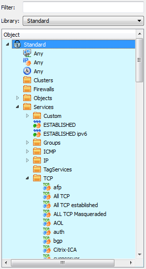

   Standard Objects

In addition, you can create custom libraries by selecting New Library from the New Object menu. You can populate the new library by copying and pasting objects other views or by creating them from scratch within the new library. See :doc:`05 - Working with Objects` for instructions on creating and distributing user-defined libraries.

Functionally, there is no difference between having an object in the Standard tree, the User tree, or a user-defined tree; it is just a convenient way to sort objects in the tree. You can think of each as a kind of "view". The choice of tree affect only the display of the data in the GUI; objects are all equal in all other senses and you can use an object from any library in your policy.

The object that is currently selected in the tree is highlighted in color and is shown in the dialog area on the right.

Firewall Builder understands and uses the object and service types described in the table below. See :doc:`05 - Working with Objects` for more detailed information.

.. list-table:: Object Types
   :header-rows: 1
   :widths: 30 70

   * - Object Type
     - Explanation
   * - Library
     - A library of objects. Firewall Builder comes with the User, Standard, and Deleted Objects libraries. In addition, you can create your own.
   * - Cluster
     - A high-availability pair of firewall devices. The firewall objects themselves must be created as firewall objects, then added to the cluster. The cluster's platform and OS settings must match those of the component firewalls.
   * - Firewall
     - A physical firewall device, its interfaces and addresses, and the policy rule sets associated with the device. Use Firewall Builder to model your actual device's firewall software, OS, interfaces and addresses. Then, use Firewall Builder to construct the policy rule sets to assign to the device.
   * - Host
     - A computer on your network. Hosts can have interfaces associated with them.
   * - Interface
     - A physical interface on a firewall or host. Interfaces can have IP and physical (MAC) addresses associated with them. An IP address can be created from the New Object for the selected interface, but physical addresses can only be created by right-clicking on an interface object.
   * - Network
     - An IPv4 subnet.
   * - Network IPv6
     - An IPv6 subnet.
   * - Address
     - An IPv4 address.
   * - Address IPv6
     - An IPv6 address.
   * - DNS Name
     - A DNS "A" or "AAAA" record. This name is resolved into an IP address at compile or run time.
   * - Address Table
     - An IP address. Objects of this type can be configured with the name of an external file that is expected to contain a list of IP addresses. Mixing IPv4 and IPv6 addresses is supported. Addresses can be loaded during policy compile or during the execution of a generated firewall script.
   * - Address Range
     - A range of IPv4 or IPv6 IP addresses. This range does not have to be a specific subnet, but address must be contiguous.
   * - Object Group
     - A collection of addressable objects (objects that have or contain IP addresses) such as network, interface, and hosts objects. A group is useful for creating a less cluttered-looking firewall policy and for making sure you have the same objects in every related rule.
   * - Dynamic Group
     - Dynamic Groups include filters based on the object type and keywords in order to build a dynamic list of objects that will be included in the group. Dynamic Groups are used in rules in the same way that standard Object Groups are. When a firewall is compiled the Dynamic Group is expanded to include all the object matching the filter rules when the compile is run.
   * - Custom Service
     - An object that can be used to inject arbitrary code into the generated firewall script.
   * - ESTABLISHED and ESTABLISHED IPv6 Services
     - An object matching all packets that are part of network connections established through the firewall, or connections 'related' to those established through the firewall. (The term "established" here refers to the state tracking mechanism used by iptables and other stateful firewalls; it does not imply any particular combination of packet header options.)
   * - IP Service
     - An IP service such as GRE, ESP, or VRRP. This category is meant to include IP services that do not fall into ICMP, ICMP6, TCP, or UDP service categories.
   * - ICMP Service
     - An ICMP service such as a ping request or reply.
   * - ICMP6 Service
     - An ICMP6 service such as "ipv6 packet too big", "ipv6 ping request", or "ipv6 ping reply".
   * - TCP Service
     - A TCP service such as HTTP, SMTP, or FTP.
   * - UDP Service
     - A UDP service such as DNS or NTP.
   * - TagService
     - A service object that lets you examine the tag in an IP header. You can then construct your rule to take appropriate action on a match.
   * - User Service
     - A service object that matches the owner of the process on the firewall that sends the packet. This object correlates to the "owner" match in iptables and the "user" parameter for PF.
   * - Service Group
     - A collection of services. For example, Firewall Builder comes with the Useful_ICMP service group containing the "time exceeded", "time exceeded in transit", "ping reply", and "all ICMP unreachable" ICMP services. It also comes with a "DNS" service group containing both the UDP and TCP version of DNS. Grouping services is useful for creating a less cluttered-looking firewall policy and for making sure you have the same objects in every related rule.
   * - Time Interval
     - A time period such as "weekends" or a range of dates, or a range of times on certain days of the week. Can be used as part of rule matching in Access Policy rule sets to provide or deny access to something based on time. Note that these time intervals are relative to the time on the firewall device itself.

Using Subfolders to Organize Object Tree
~~~~~~~~~~~~~~~~~~~~~~~~~~~~~~~~~~~~~~~~~

Firewall Builder comes with a set of predefined system folders. You can also create your own subfolders in the Object Tree to help organize your objects.

The following figure shows the object tree of a retailer with multiple stores in several cities. As you can see the objects are not grouped together which can make it hard to quickly find the object you are looking for. Subfolders provide an easy way to organize your objects.

.. figure:: img/gui-object-tree-without-subfolders.png
   :alt: Object Tree without Subfolders

   Object Tree without Subfolders

To add a subfolder right-click on one of the system folders, in this case we are going to start with the Firewalls folder, and select the New Subfolder menu item.

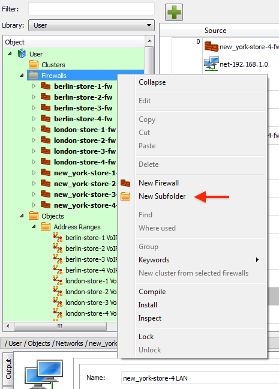

   Add Firewalls Subfolder

A dialog window will appear. Enter the name of your subfolder an click OK. In this case we will create a new subfolder called "Berlin" to hold all the Firewall objects located in Berlin.

To add the firewalls to the Berlin subfolder, select the firewall objects in the tree, and drag-and-drop the firewalls onto the Berlin subfolder.

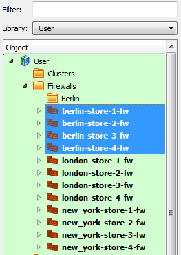

   Moving Objects to Subfolder

The following figure shows the Object Tree after folders have been created for both London and New York and the firewalls at each of these locations have been moved to the subfolder. As you can see this makes it much easier to find things quickly in your tree.

.. figure:: img/gui-subfolders-for-firewalls.png
   :alt: Subfolders for Firewalls

   Subfolders for Firewalls

While this example showed using subfolders in the Firewalls system folder, you can create subfolders in any of the predefined system folders.

.. note::

   To *delete* a subfolder simply right-click on the subfolder and select Delete. If there are objects in the subfolder Firewall Builder will pop-up a warning showing the locations where the objects that are going to be deleted are used.

   If you don't want to delete the objects in the subfolder then you first need to move them to the system folder by selecting all the objects in the subfolder and dragging-and-dropping them onto the system folder that is the parent of the subfolder you want to delete.

Filtering the Object Tree
~~~~~~~~~~~~~~~~~~~~~~~~~

The object tree can hold a great many objects, nested in their respective categories. You can filter the tree to show only certain objects and categories appear based on a string. For example, typing "eth" in the Filter field causes all the objects with "eth" in the object name to appear.

As your configuration grows you will find that it becomes harder to quickly find the objects you are looking for. This example shows how filtering helps.

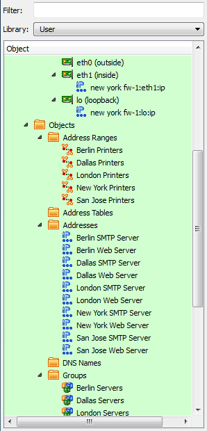

   Empty Filter Field

In the example, the word "new york" is typed into Filter field, with the goal of retrieving all address-related objects. As the screen shot below shows, filtering takes effect immediately. In the example, only "new" has been typed but the tree is already filtered by those characters, showing the Address Range, Addresses, Groups, and Networks objects that include "new" in their name. Filters are not case sensitive.

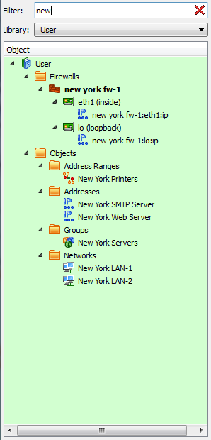

   Populated Filter Field

Click the X in the filter box to clear the active filter.

Object Attributes in the Tree
~~~~~~~~~~~~~~~~~~~~~~~~~~~~~

If you check the Show object attributes in the tree checkbox in the Preferences > Object tab, the object tree displays a second column of information, as shown below.

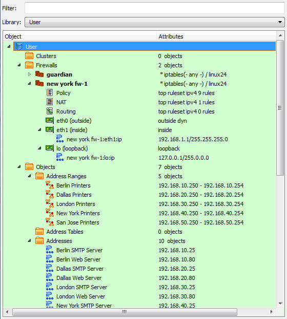

   Object Attributes Column

The information shown depends on the type of object.

If you check the checkbox but don't see the second column, make the panel wider until you see the column separator, then drag the column separator until the columns are in the correct position. Column sizing is saved with the object file, so the next time you open the object, the column display preservers your changes.

Creating Objects
~~~~~~~~~~~~~~~~

New objects can be created using the New Object menu, accessed by clicking this icon above the object tree:

   Create Objects button

.. figure:: img/gui-creating-objects-using-object-menu.png
   :alt: Creating Objects Using The Object Menu

   Creating Objects Using The Object Menu

You can create all objects except physical address objects through the New Object menu. (Physical address objects can only be created by right-clicking an existing interface object.) You can also create objects by right-clicking a folder in a tree (though not in the read-only Standard tree). If you right-click a folder, you can only create objects appropriate to that folder. For example, an interface object can only be placed under a host or firewall object, so the Add Interface option is available only if you right-click a host or firewall.

.. figure:: img/gui-creating-objects-by-right-clicking.png
   :alt: Creating Objects by Right-Clicking

   Creating Objects by Right-Clicking

Another way to create objects is to use the Duplicate option when you right-click an object. This allows you to create a copy of the object. For example, you may want to create a firewall policy for one platform, duplicate it, then just change the target platform on the copy. Note that copies are not linked in any way. A change to the original has no affect on the copy, and vice versa.

Undo and Redo
-------------

Firewall Builder supports undo and redo functions from the GUI and from the keyboard. In the GUI, both functions are located in the Edit menu. The keyboard commands are Ctrl-Z for Undo, and Ctrl-Y for Redo.

Undo Stack
~~~~~~~~~~

The undo stack shows you a list of your changes, and lets you roll back changes you don't want. You can roll back just one change, all changes after a certain point, or all changes.

Press Ctrl-Z to undo an action. The undo stack is essentially unlimited, so you can press Ctrl-Z repeatedly to roll back a series of changes. You can also you can view the Undo stack directly by selecting Edit > Undo Stack. From that view, you can roll back several changes with a single mouse click.

Note that a change enters the undo stack as soon as you "commit" the change. For dragging and dropping, a change is committed as soon as you drag an object into a new position, at which time that change appears in the undo stack. For field edits, the change appears as soon as you move the GUI focus out of a field by pressing Enter or Tab, or by clicking outside the field.

Rolling back a change does not immediately remove that change from the stack. You can "redo" a change by clicking it. Changes after the current change stay in the stack until you perform a new edit. At that point, the new change appears as current, and all the undone changes after that point are removed from the stack.

The following figure shows a portion of an object tree, an access policy, and the undo stack. The stack has been "floated," so it can be moved as its own window. (To make an object float, click the button next to the close button.)

In the example stack, a new, blank rule has just been added to the policy.

.. figure:: img/gui-policy-and-undo-stack.png
   :alt: Policy and the Undo Stack

   Policy and the Undo Stack

The "inside range" IP object is now added to the Source of the new rule, and the "outside range 2" IP object is added to the Destination of the rule. However, in this example, we have made a mistake: Instead of adding "outside range 2" to the Destination, we accidentally added the "outside range" object to the Source field.

You can see the object in the policy and the undo history in the following screenshot.

.. figure:: img/gui-added-inside-range-and-outside-range.png
   :alt: Added Inside Range and Outside Range

   Added Inside Range and Outside Range

To fix the error, we do two things. First, we click on "insert inside range" in the Undo Stack. This rolls back the stack to before the point at which we inserted "outside range 2."

.. figure:: img/gui-removed-outside-range-from-source.png
   :alt: Removed Outside Range from Source

   Removed Outside Range from Source

Next, we drag "outside range 2" into the Destination field. You can see that the "insert outside range" entry has been removed from the stack, and the "insert outside range 2" edit now appears as the most recent change.

.. figure:: img/gui-added-outside-range-2-to-destination.png
   :alt: Added Outside Range 2 to Destination

   Added Outside Range 2 to Destination

Preferences Dialog
------------------

To open the Preferences dialog, select Edit/Preferences.... The dialog has several tabs, described here.

.. figure:: img/gui-preferences-dialog.png
   :alt: The GUI Preferences Dialog

   The GUI Preferences Dialog

.. list-table:: Preferences > General Tab
   :header-rows: 1
   :widths: 30 70

   * - General Preferences
     - Explanation
   * - Working Directory
     - This option tells the program where it should store the data file. Policy compilers also store firewall configuration files and scripts they produce in this directory. If this parameter is left blank, the policy compiler stores the firewall configurations it generates in the same directory as the original data file.
   * - Do not show tips on startup
     - If checked, the program does not show tips on start up.
   * - Check for updates automatically
     - If checked, the program checks for program updates every time it starts. If unchecked, the program will not check for updates unless specifically enabled by clicking the Check Now button.
   * - Check Now
     - Click if you want the program to check for updates at that moment.
   * - Use http proxy while checking for updates (host:port)
     - Whether you use the automatic or manual method to check for updates, if you are behind a proxy, enter the host IP and port of the proxy in this field. Separate the host IP and port number with a colon (:).

.. figure:: img/gui-preferences-objects-tab.png
   :alt: GUI Preferences Objects Tab

   GUI Preferences Objects Tab

.. list-table:: Preferences > Objects Tab
   :header-rows: 1
   :widths: 30 70

   * - Objects Preferences
     - Explanation
   * - Enable object tooltips
     - Firewall Builder can show a summary of an object's properties in a quick pop-up window (a "tooltip") when you hover the mouse cursor over an object icon. If this feature is not enabled, then you must click on an object to get the same information. The Tooltip delay control sets the delay, in seconds, between the time you hover the cursor and the time the tooltip appears.
   * - Show deleted objects
     - Selecting this checkbox turns on a third object tree: Deleted Objects. Once enabled, the Deleted Objects tree acts like trash can (or recycle bin) for deleted objects. If you delete something by mistake, you can retrieve it.
   * - Show object attributes in the tree
     - Creates a second column in the object tree. The second column contains information about the object, such as how many objects a folder contains, whether a rule set is the top rule set, IP addresses, and so on. See the `Object Attributes in the Tree`_ section for a description.
   * - Clip comments in rules
     - Comments in a rule can sometimes make the rule line taller, reducing the number of rules visible on a screen. Select this if you want comments to be truncated in the view if they take up more than one line.
   * - DNS Name - Create new objects in "Compile Time" or "Run Time" mode by default
     - These radio buttons set the default behavior for reading DNS Name object addresses from a file: when the firewall script is generated by Firewall Builder or when the firewall runs the script. Note that the default value set here can be overridden for individual objects. See :doc:`05 - Working with Objects` for more information on DNS Name object creation.
   * - DNS Name - Use object name for the DNS record in all objects of this type
     - If checked, Firewall Builder uses the DNS Name object's name for DNS lookups. If not checked, Firewall Builder uses the DNS Record field in the object for lookups. (If this checkbox is checked, the DNS Record field will be grayed out in all DNS Name objects.)
   * - Address Table - Create new objects in "Compile Time" mode or "Run Time" mode by default
     - These radio buttons set the default behavior for reading Address Table object addresses are read from a file: when the firewall script is generated by Firewall Builder or when the firewall runs the script. Note that the default value set here can be overridden for individual objects. See :doc:`05 - Working with Objects` for more information on Address Table object creation.

.. figure:: img/gui-preferences-data-file-tab.png
   :alt: GUI Preferences Data File tab

   GUI Preferences Data File tab

.. list-table:: Preferences > Data File Tab
   :header-rows: 1
   :widths: 30 70

   * - Data File Preferences
     - Explanation
   * - Periodically save data to file every ... minute
     - If checked, data is automatically saved at the specified interval.
   * - Do not ask for the log record when checking in the new file version
     - Affects only RCS. If selected, the system does not prompt you for a "comment" when you check your file back into RCS. See :doc:`07 - Firewall Policies` for a detailed explanation on using revision control with Firewall Builder.
   * - Enable compression of the data file
     - If selected, the data file is compressed to save disk space.

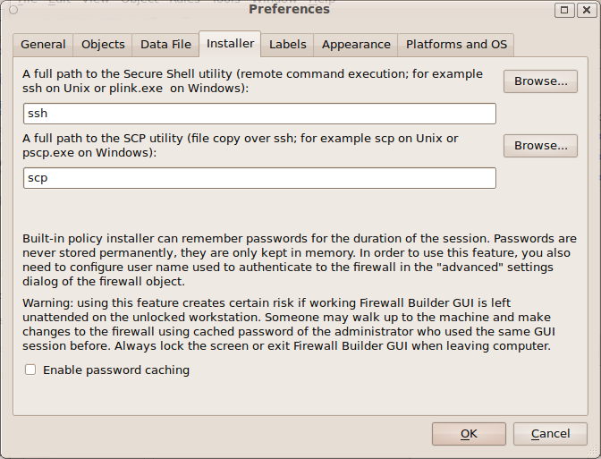

   GUI Preferences Installer Tab

.. list-table:: Preferences > Installer Tab
   :header-rows: 1
   :widths: 30 70

   * - Installer Preferences
     - Explanation
   * - SSH and SCP paths
     - These fields specify the paths to your SSH and SCP programs, or their equivalents. If these paths are already recorded in your PATH system variable, you need not specify paths here. On Windows, however, you must install putty. See :doc:`10 - Compiling and Installing a Policy` for instructions.
   * - Enable password caching
     - If checked, the program can remember firewall passwords for the duration of the Firewall Builder GUI session. Passwords are never stored permanently in any form; they are only kept in memory for the working Firewall Builder GUI instance. You need to enter each password once when you activate a generated policy. If you keep the program open and need to modify and activate policy again, the password fields in the installer dialog can be filled automatically. Cached passwords are associated with the firewall object and account name used to activate the policy. To use this feature, you must also configure a user name in the Installer tab in the Firewall Settings dialog of the firewall object. Caution: using this feature creates a risk if a working Firewall Builder GUI is left unattended on an unlocked workstation.

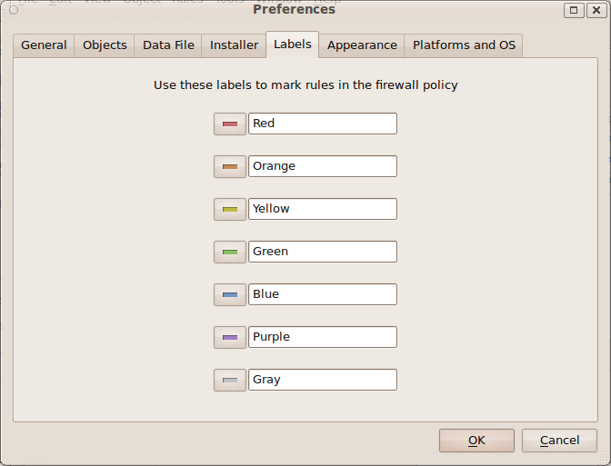

   GUI Preferences Labels Tab

.. list-table:: Preferences > Labels Tab
   :header-rows: 1
   :widths: 30 70

   * - Labels Preferences
     - Explanation
   * - Labels
     - You can assign colors to particular rows in your policies to make them stand out visually. You can also change the text label associated with each color using this tab. While the color shows up in the rule set, the text label only appears in the label list.

.. figure:: img/gui-preferences-appearance-tab.png
   :alt: GUI Preferences Appearance Tab

   GUI Preferences Appearance Tab

.. list-table:: Preferences > Appearance Tab
   :header-rows: 1
   :widths: 30 70

   * - Appearance Preferences
     - Explanation
   * - Rules, Tree, and Compiler Output Panel Fonts
     - Use these controls to set the font used for rules, the object tree, and the compiler output panel.
   * - Show icons in rules
     - If deselected, suppresses icon display for an object, showing only text. By default, objects such as interfaces, hosts, and networks are displayed as both an icon and text.
   * - Show text descriptions in columns "Direction", "Action"
     - If selected, displays text descriptions in addition to icons in the Direction and Action columns. By default, only icons are shown.
   * - Icon size
     - By default, icons are 25x25 pixels. Select 16x16 to make them somewhat smaller. (The larger icons are easier to see, but the smaller ones are useful for smaller displays, such as laptop screens.)

.. figure:: img/gui-preferences-platforms-and-os-tab.png
   :alt: GUI Preferences Platforms and OS Tab

   GUI Preferences Platforms and OS Tab

.. list-table:: Preferences > Platforms and OS Tab
   :header-rows: 1
   :widths: 30 70

   * - Platforms and OS Preferences
     - Explanation
   * - Lists of Platforms and OSs
     - Checked platforms and OSs appear in drop-down menus of platforms and OSs in the program. You can uncheck unneeded platforms and OSs to reduce clutter in GUI menus. Remember to recheck entries when you want them to reappear in the GUI, such as when you acquire a new type of firewall. Also, not all platforms and OSs supported by Firewall Builder are checked by default. If the firewall you have doesn't appear in your drop-down menus, make sure it is checked in this tab.

Working with Multiple Data Files
---------------------------------

This section presents an example of how to work with two data files at the same time.

The example begins with one data file. The file name, "policy_rules.fwb", displays in the main window title bar.

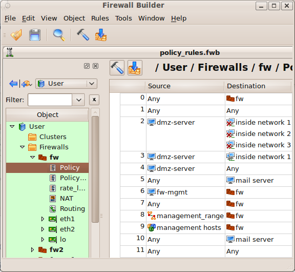

   Data File

Use File > Open to open the second data file.

.. figure:: img/gui-data-file-menu.png
   :alt: Data File

   Data File

The file "clusters.fwb" is now open in the GUI; its name displays in the title bar of the window.

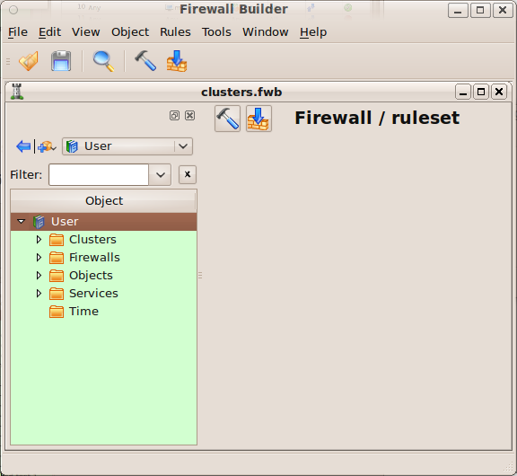

   clusters.fwb

The Window menu supports standard window operations: you can maximize and minimize windows, as well as cascade or tile them and switch from one to another.

.. figure:: img/gui-window-menu.png
   :alt: Window Menu

   Window Menu

Now both windows show. The size of the main windows is small to reduce the size of the screen shots; as a result the two windows do not fit well. Even so, objects can be easily moved between windows using copy and paste operations. In this example the firewall object "fw" will be copied from the top window and pasted into "Firewalls" in the tree of the bottom window.

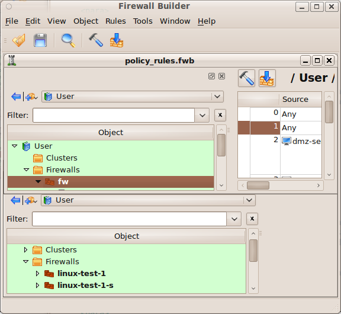

   Copy and Pasting between Windows

The following figure shows the window with the "clusters.fwb" data file maximized; note that firewall object "fw" is part of the tree.

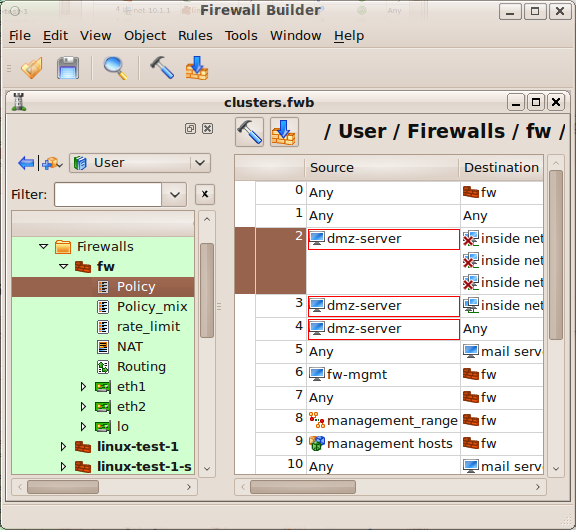

   Object in Top Window

The firewall in the example, "fw", used a host object called "dmz-server" in the data file "policy_rules.fwb". The system automatically copies "dmz-server" along with the "fw" object, as well as any other object the "fw" object depends on. The following figure shows that host "dmz-server" is now part of the "clusters.fwb" data file.

.. figure:: img/gui-dmz-server.png
   :alt: dmz-server

   dmz-server
