.. sectnum::
   :start: 5

Working with Objects
====================

.. contents::
   :local:
   :depth: 3

Types of Objects
----------------

Firewall Builder supports a variety of object types, both simple and complex. Simple object types include Address, Network, Host, and IP, TCP, UDP and ICMP service objects. More complex object types are Firewall, Address Table, DNS Name, and User Service.

There are the following types of objects in Firewall Builder:

* Addressable objects: Section 5.2 describes objects that have, either directly or indirectly, an address of some kind. This category includes the physical objects (firewalls, hosts, interfaces) as well as some logical objects (networks, address ranges, individual addresses). Addressable objects can be grouped together into Object groups.
* Service objects: Section 5.3 describes objects that represent services. They include IP, TCP, UDP, and ICMP services, as well as user services. Service objects can be grouped together into Service groups.
* Time Interval objects: Described in Section 5.4, these represent a discreet or recurring period of time. They can be used as part of a rule in the firewall. For example, you could have a rule that matches on weekends, but not during the week.
* Rule set objects: Described in Section 5.2.4, these represent the various rule sets in a firewall. By default, a firewall starts with one access policy, one NAT, and one routing rule set, but you can add more of each. Rule set objects only exist as child objects of a firewall.

All objects in Firewall Builder have some characteristics in common.

All objects have a Name field and a Comment field. The Name field can contain white spaces and can be arbitrarily long (though shorter names work better in the GUI). The Comment field can contain any text of any length.

Addressable Objects
-------------------

This section describes object types that represent addresses or groups of addresses.

Common Properties of Addressable Objects
~~~~~~~~~~~~~~~~~~~~~~~~~~~~~~~~~~~~~~~~~

Objects that contain IP address fields provide validity checking for the address when the object is saved. If the IP address is invalid, the system notifies you with an error.

The Firewall Object
~~~~~~~~~~~~~~~~~~~~

A firewall object represents a real firewall device in your network. This firewall object will have interface and IP address objects that mirror the real interfaces and IP addresses of the actual device. In addition, the firewall object is where you create the access policy rule sets, NAT rule sets, and routing rule sets that you assign to your firewall device.

By default, a firewall has one Policy rule set, one NAT rule set, and one routing rule set. However, you can create more than one rule set of each type for a firewall. On the other hand, you don't have to populate all the default rule sets. You can, for example, create a Policy rule set and leave the NAT and Routing rule sets empty. Section 7.1 explains more about policies and rule sets.

To speed up the creation of a firewall object, Firewall Builder has a wizard that walks you through creating the object. The wizard has three options for creating a firewall object:

* From a template: Firewall Builder comes with several pre-defined templates. You can use these to create a firewall that is close to your configuration, then modify it to fit your needs.
* Manually: You can provide interface IP address, subnet mask, gateway, and other parameters manually. You can add this information when you create the firewall, or you can add it later. Section 5.2.2.1 describes this process.
* Using SNMP: Firewall Builder uses SNMP queries to learn about the network. Section 5.2.2.3 describes this process.

Creating a Firewall Object Manually
^^^^^^^^^^^^^^^^^^^^^^^^^^^^^^^^^^^^

To start the firewall object creation wizard, right-click the Firewalls folder in the User tree and select New Firewall.

The first page of the wizard displays.

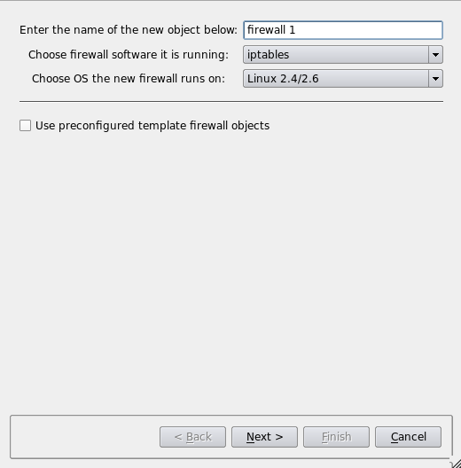

Give the firewall object a name. Usually, this name is the same name you assigned to the device, but it need not be if you're assigning interfaces manually. (If you are use SNMP or DNS to populate the interfaces, then the name must be the same as the device name.) Then specify the firewall software and device OS.

Leave the Use pre-configured template firewall objects checkbox unchecked.

Click Next.

.. figure:: img/obj-configure-interfaces-manually.png
   :alt: Choosing to configure interfaces manually

Select Configure interfaces manually and click Next.

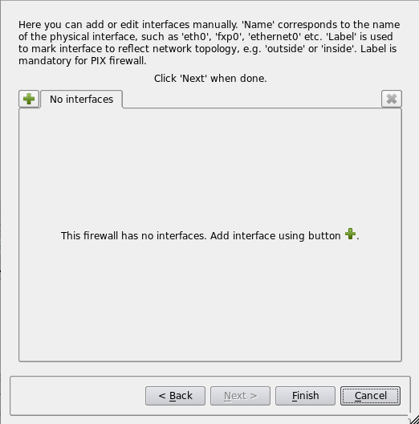

This is the page where you can add interfaces to the firewall. In this page of the dialog, each interface is represented by a tab in the tabbed widget. Use the "+" button in the upper left corner to add a new interface. The "x" button in the upper right corner deletes an interface. Click the "+" button to create first interface and give it the name "eth0":

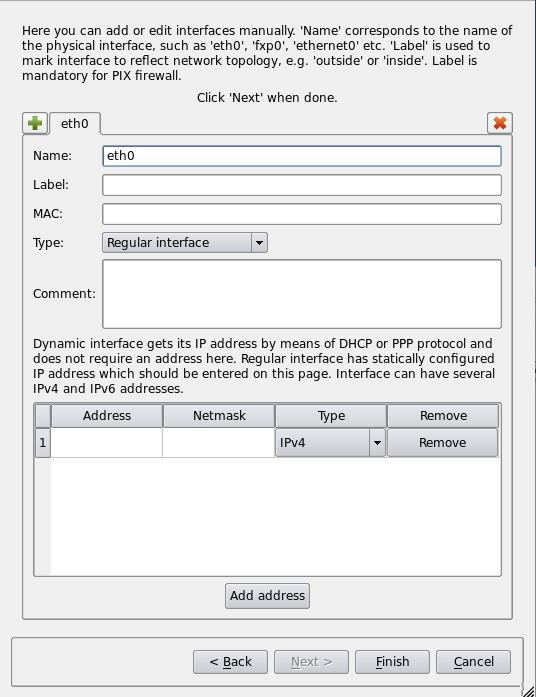

To add an IP address to the interface, click in the table cell in the "Address" column and begin typing the address. The cell becomes an editable field that lets you enter the address. Add the network mask using the table cell in the "Netmask" column. The "Type" drop-down list lets you choose between IPv4 and IPv6 addresses. The network mask field accepts both full numeric notation and bit length for IPv4 netmasks. For IPv6, only bit length is allowed. The "Remove" button removes the address. You can add several addresses to the same interface.

The following elements are available on this page of the wizard:

* Name: The name of the interface object in Firewall Builder must match exactly the name of the interface of the firewall machine it represents. This will be something like "eth0", "eth1", "en0", "br0", and so on.
* Label: On most OSs this field is not used and serves the purpose of a descriptive label. On the Cisco PIX, however, the label is mandatory, and must reflect the network topology. Firewall Builder GUI uses the label, if it is not blank, to label interfaces in the tree. One of the suggested uses for this field is to mark interfaces to reflect the network topology ("outside" or "inside", for example) or interface purpose ("web frontend" or "backup subnet", for example).
* MAC: If you like, you can also specify the interface physical address. The MAC address is not necessary, but it can be used to prevent spoofing. If the feature is turned on and available, the firewall only accepts packets from the given IP address if the MAC address matches the one specified. Section 5.2.9.1 has more information.
* Interface type: Indicates the type of interface. Section 5.2.5 explains the interface types in more detail. Briefly, though, a Regular interface has a static IP addresses, a Dynamic address interface has a dynamic address provided by something like DHCP, an Unnumbered interface never has an IP address (a PPPoE connection, for example), and a Bridge port is an interface that is bridged in the firewall.
* Comment: free-form text field used for the comment.
* Address: If the interface has a static IP address, specify it here.
* Netmask: Use either a traditional netmask (255.255.255.0) or bit length (24, without slash) to specify the interface netmask. For IPv6 addresses, only bit length notation is accepted.

Once all the interfaces are configured, click Finish to create the new firewall object.

.. note::

   You can always add, modify, and delete interfaces later using controls provided in the main window.

Creating a Firewall Object Using a Preconfigured Template
^^^^^^^^^^^^^^^^^^^^^^^^^^^^^^^^^^^^^^^^^^^^^^^^^^^^^^^^^^

Another method you can use to create new firewall object is based on the use of preconfigured template objects that come with the program. To do this, select the "Use preconfigured template firewall objects" checkbox on the first page of the wizard, then click Next.

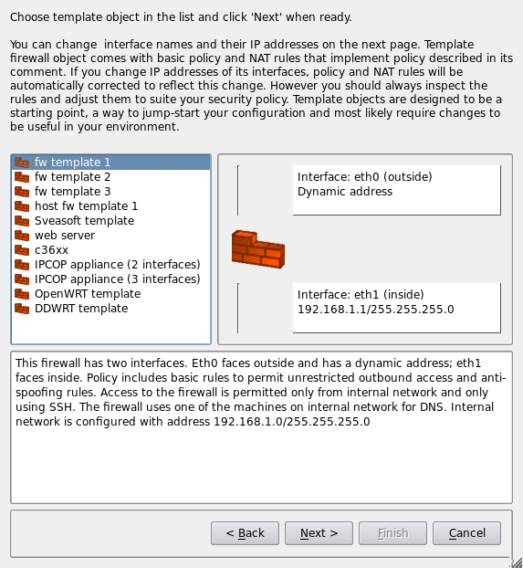

The program comes with several template objects. These include firewalls with two or three interfaces, a couple of firewall configurations intended for a server with one interface, templates for OpenWRT, DD-WRT, and IPCOP firewalls, and a Cisco router. Each template is configured with IP addresses and basic rules. Some templates assume all interfaces have static IP addresses, while other assume some interfaces have dynamic addresses. These template objects are intended to be a start, something you can and should edit and modify to match your network configuration and security policy.

Choose the template that is closest to your configuration and click Next.

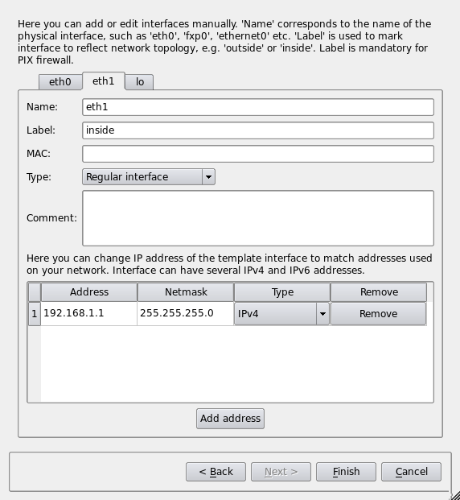

This page of the wizard allows you to change IP addresses used in the template. This is a new feature in Release 4.0 relative to Release 3.0. You can add and remove addresses using the Add address and Remove buttons. Since configuration of the template object depends on its interfaces, the dialog does not let you add or remove interfaces for objects created from a template. Each interface is represented by a tab in the tabbed widget; you can switch between them clicking the tabs with the interface names. Section 5.2.2.1 lists all elements of this page of the dialog and explains their purpose.

Each template firewall object comes preconfigured with some basic rules that use the firewall object, its interfaces, and network objects that represent subnets attached to interfaces. If you change addresses of interfaces in this page of the wizard, the program automatically finds all network objects used in the template rules matching old addresses and replaces them with new network objects representing subnets with addresses you entered in the wizard. This feature saves you from having to find and replace these objects manually.

Once all interfaces and addresses are entered or modified, click Finish to create the firewall object.

Creating a Firewall Object Using SNMP Discovery
^^^^^^^^^^^^^^^^^^^^^^^^^^^^^^^^^^^^^^^^^^^^^^^^

If your firewall runs an SNMP daemon, you can save yourself some time by using SNMP discovery to automatically create the interfaces of the new firewall object.

.. figure:: img/obj-snmp-community-string.png
   :alt: SNMP read community string entry

Start by checking the Use SNMP to discover interfaces of the firewall checkbox on the second page of the wizard and enter your SNMP "read" community. Then click Discover interfaces using SNMP.

.. figure:: img/obj-snmp-discovery-output.png
   :alt: Discovering interfaces via SNMP

The program runs a series of SNMP queries to the firewall to read the list of interfaces and their addresses. Both IPv4 and IPv6 address can be imported. For IPv6, the firewall must support IP-MIB RFC 4293. Once the discovery process finishes, click Next.

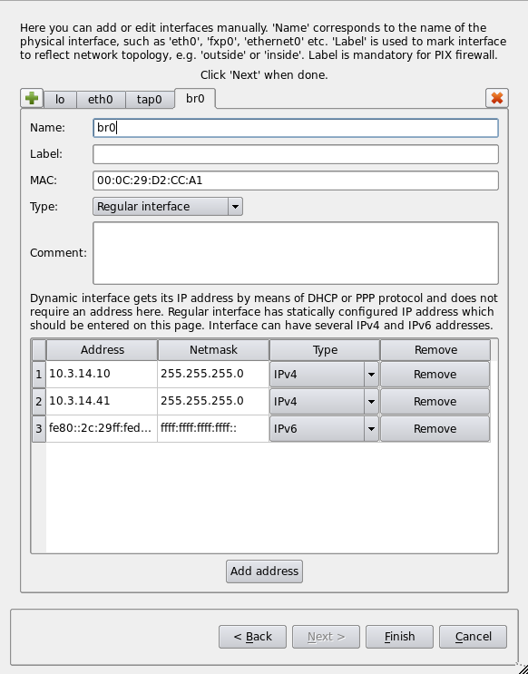

The next page of the wizard offers an opportunity to review the discovered interfaces and make adjustments, if necessary. This is the same page described previously in Section 5.2.2.1. You can add and remove interfaces and add, remove, or change their IP addresses. Section 5.2.2.1 lists all elements of this page of the dialog and explains the purpose of each.

When configuration of all interfaces is correct, click Finish to create the new firewall object.

Editing a Firewall Object
^^^^^^^^^^^^^^^^^^^^^^^^^^

The firewall object represents the firewall machine and is the most complex object in Firewall Builder. It has three sets of controls that you can modify, not including the policy rule sets. All these controls become available when you double-click the firewall object in the tree.

.. figure:: img/obj-firewall-controls.png
   :alt: Firewall controls

Basic Firewall Controls
''''''''''''''''''''''''

These controls let you specify the basic settings of the firewall, such as the name and firewall platform.

* Name: Specify or change the name of the firewall object.
* Platform: Specify or change the firewall software.
* Version: Specify or change the version number of the firewall software. In most cases, you can leave this set to any. In general, setting the version to "any" means the compiler only supports options available in all supported versions of the software. If you need a feature that is supported only by a particular version, then specify that version.
* Host OS: Specify or change the host operating system of the firewall device.
* Firewall Settings: Opens the Advanced Settings dialog for the platform or firewall software. Click Help in the dialog for assistance with dialog options. See Section 5.2.2.4.3 for a screen shot.
* Host OS Settings: Opens the Advanced Settings dialog for the indicated Host OS. Click Help in the dialog for assistance with dialog options. See Section 5.2.2.4.2 for a screen shot.
* Inactive firewall: Check this box to make the firewall object inactive. The firewall name changes from bold to a regular font to indicate that it is inactive, and the firewall is not available for compiling or installation. Essentially, this is a way to "comment out" the firewall object without deleting it.

Host OS Settings Dialog
''''''''''''''''''''''''

For explanations of the various controls, click the Help button in the dialog.

.. figure:: img/obj-host-os-settings-dialog.png
   :alt: Firewall Host OS Settings dialog (Linux)

Firewall Settings Dialog
'''''''''''''''''''''''''

For explanations of the various controls, click the Help button in the dialog.

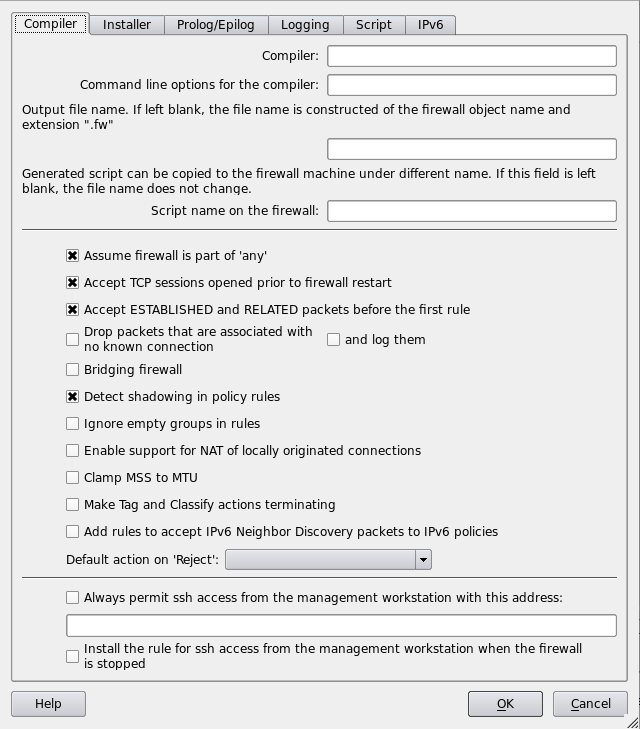

The Cluster Object
~~~~~~~~~~~~~~~~~~~

The cluster object represents an abstraction of a high availability (HA) setup that consists of two or more member firewalls, each represented by its own firewall object.

The object type "cluster" (located under Clusters in the tree) represents the HA pair. You configure policy and NAT rules in the rule sets of this object, rather than in those of the actual firewalls.

The procedure for setting up HA configuration is as follows:

* Create your firewall objects. Assign platform and host OS and name interfaces as usual. Do not add any policy or NAT rules. These are your real (member) firewalls. Interfaces should have their real IP addresses (not CARP or VRRP addresses).
* Create a cluster object. Configure the cluster object with the proper platform and host OS. Use the usual New Object menu or toolbar button to create this object. Note that in order for the firewall object to become a member of a cluster, their platform and host OS settings must match.

There are two ways to create new cluster object: you can use main menu "Object / New Object" option (or a toolbar button that calls the same function):

.. figure:: img/obj-new-cluster-menu.png
   :alt: Create a new cluster using the Object / New Object option

Using this menu option or toolbar button opens a wizard that guides you through the steps of creating new cluster object. The first page of the wizard shows all the available firewall objects. In this page, you choose which ones become cluster members:

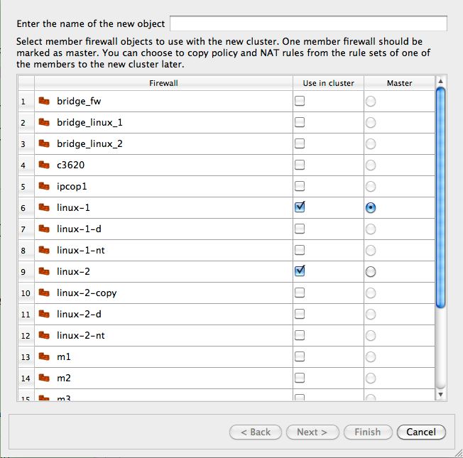

Another method is to select two or more firewall objects that are to become cluster members, then right-click and select the "New cluster from selected firewalls" menu item. You can select two or more objects in the tree by clicking the object while holding the "Ctrl" key ("Cmd" on the Macintosh).

.. figure:: img/obj-cluster-right-click-menu.png
   :alt: Using the right-click menu to choose firewall cluster members

Using the right-click options launches the same wizard, but the list on its first page is already populated with the selected firewall objects, as shown below.

.. figure:: img/obj-cluster-wizard-populated.png
   :alt: Wizard populated with selected firewall objects

Reducing the number of firewall objects displayed in the wizard can be helpful when you have many of firewall objects defined in the object tree.

* The program guides you through the process of creating new cluster objects using a wizard-like dialog. You start with the list of firewall objects where you choose which firewalls should become members of the cluster. Next, the program finds interfaces of the member firewalls that have the same name and can be part of the cluster and creates cluster interfaces with the same name. Not all interfaces are eligible: for example, bridge ports, bonding interface slaves, and parents of VLAN interfaces cannot be used for the cluster. Cluster interfaces define failover groups. You can add, remove, or rename cluster interfaces, as well as change which interfaces of the member firewalls are used with each one. On the next page of the wizard you can change failover protocols and add, remove, or change IP addresses of cluster interfaces. Not all failover protocols require IP addresses: for example, VRRP or CARP do but heartbeat or OpenAIS do not. Finally, you can choose to use policy and NAT rules of one of the member firewalls to populate policy and NAT rule sets of the new cluster. If you do this, all references to the original member firewall and its interfaces in rules are replaced with references to the cluster and its interfaces. The program also creates backup copies of the member firewall objects with the name with suffix "-bak" and clears policy and NAT rule sets of the member firewall objects used with the cluster before the new cluster is created.
* OpenBSD or FreeBSD clusters are assigned with CARP interfaces. Name them "carp0", "carp1", and so on (or whatever indexes the addresses are assigned on your machines). You can add the CARP password and ID at the same time or you can add them later.
* If you use heartbeat or OpenAIS (on Linux) for failover, cluster interfaces should have the same names as the corresponding member firewall interfaces. In this case, cluster interfaces are virtual entities that represent interfaces of the corresponding member firewalls. The program makes the necessary substitutions when it compiles the rules. This is also how PIX failover configuration works.
* Each cluster interface has a child "Failover group" object with the name "firewall:carp0:members", or similar. This is the object where you configure associated member firewall interfaces. Double-click this object in the tree and then click "Manage Members" button in the dialog. Select interfaces of the member firewalls in the panel on the left-and side and click the Arrow button to add them to the list on the right. Use the checkbox to select the master. Click OK when done. The platform and host OS of the cluster object and members must match, otherwise firewall objects do not appear in the "members" dialog panel.
* Besides interfaces, the Cluster object has a new child object "State Sync Group". This group represents state synchronization protocol. Currently *pfsync* is supported for OpenBSD and *conntrackd* for Linux. To configure, double-click this object in the tree to open it in the dialog and click "Manage Members". Select the interfaces of the member firewalls in the panel on the left hand side and click the Arrow button to add them to the list on the right. Use the checkbox to select the master. Click OK when done. The new objects should appear in the "members" table in the State Sync Group dialog. The platform and host OS of the cluster object and members must match, otherwise firewall objects do not appear in the "members" dialog panel.
* The "Edit protocol parameters" button allows you to edit some parameters for the chosen failover protocol. This is how you configure an address and port for heartbeat and OpenAIS.
* There are few additional checkboxes in the "Script" tab of the firewall object dialog. These allow you to control whether the program add shells commands for creating and configuring bonding, bridge, and VLAN interfaces.
* Compile by right-clicking the cluster object and selecting "Compile". This compiles each member firewall separately, resulting in .fw and .conf files for both of them.
* Again, you configure all the rules in the policy and NAT rule sets that belong to the cluster object. If you put cluster's interfaces in rules, the program replaces them with interfaces of the member firewall when it compiles rules. If you put cluster object in a rule, it is like if you put member firewall object there instead, except the program automatically picks the member firewall it compiles the policy for.
* First, the program looks at Policy and NAT rule set objects of the cluster and member firewalls and compares their names. If there is rule set object with the same name in both the cluster and member firewall and both have non-zero number of rules, the rule set object from the member is used and the one from the cluster is ignored. The program prints a warning message when this is done. If rule set objects with the same name exist but the one in the member firewall has zero rules, it is ignored and the one from the cluster is used (no warning is issued). Likewise, if there are rule sets with the same name but the one in the cluster has zero rules, it is ignored.
* Here is what you need to do if you want to have most rules defined in the cluster so they will translate into rules for all member firewalls, but have some rules defined in the members so you can make configurations of the members slightly different:

  * Create separate rule set object in the cluster and in each member. Use name different from "Policy" or "NAT". Lets use name "member_override".
  * Create a rule with action "Branch" in the main Policy or NAT rule set of the cluster, drag rule set object "member_override" that belongs to the cluster to the well in the Branch action parameters dialog.
  * Leave "member_override" rule set that is a child of the cluster object empty (no rules)
  * Add rules to the rule set "member_override" in each member firewall
  * Make sure rule set "member_override" is not marked as "Top ruleset" in the cluster and each member. This rule set translates into user-defined chain (iptables) or anchor (PF) and should not be the "top ruleset".

  This method works for both policy and NAT rules for all platforms.

Editing Rule Set Objects
~~~~~~~~~~~~~~~~~~~~~~~~~

Firewalls and clusters can have one or more of the following types of rule sets: access policy, NAT, and routing. A firewall has, by default, one access policy rule set, one NAT rule set, and one routing rule set. However, you can add additional rule sets if you like.

Rule sets are child objects of a firewall object. They cannot stand alone.

As objects, rule sets have parameters. In Firewall Builder, rule sets have the following parameters:

* Name: The name of the rule set. If you only have one of each type of rule set, you can leave this at its default.
* Rule set family: This pull-down menu lets you specify whether policy compiler should treat the rule set as an IPv4 rule set, an IPv6 rule set, or a combined rule set. If set to IPv4, then only IPv4 rules are processed and IPv6 rules are ignored. The opposite is true if you specify an IPv6 rule set. If you select This is combined IPv4 and IPv6 rule set, then the compiler processes both types of rules and places them into the appropriate places in the install script.
* filter+mangle table or mangle table: These radio buttons let you specify whether the rules apply to the iptables filter table *and* mangle table, or just to the mangle table. (These radio buttons only appear for access policy rule sets, and only for iptables.) Under most circumstances, the compiler places each rule into the correct table (filter or mangle) automatically. However, some combinations of service objects and actions are ambiguous and can be used in both filter and mangle tables. In cases like these, you can clarify things for the compiler by creating a separate policy rule set to be translated only into the mangle table.
* Top ruleset: One of your rule sets must be the "top" rule set. The top rule set is the one used by the firewall. Other rule sets of that type are used only if you branch to them using branching logic in the top rule set. (If you don't use branching, then only the rule set tagged as "top" is used.)
* Comment: A free-form comment field.

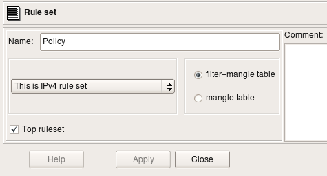
Interface Object
~~~~~~~~~~~~~~~~

.. figure:: img/obj-interface-object-tree.png
   :alt: Interface Object in the object tree

   Figure 5.18. Interface Object

Interface objects belong to firewall or host objects. Interface objects cannot exist alone.

The dialog for the interface object that belongs to the firewall or host provides controls for the parameters described here. Controls that are only valid for the firewall, and not host objects, are marked as such.

.. figure:: img/obj-interface-object-dialog.png
   :alt: Interface Object dialog

   Figure 5.19. Interface Object

* **Name:** The name of the interface object in Firewall Builder must match exactly the name of the interface of the firewall machine it represents. This will be something like "eth0", "eth1", "en0", "br0", and so on.

* **Label:** On most OSs this field is not used and serves the purpose of a descriptive label. Firewall Builder GUI uses a label, if it is not blank, to show interfaces in the tree. One of the suggested uses for this field is to mark interfaces to reflect the network topology (for example, "outside," "inside") or the purpose ("web frontend" or "backup subnet"). The label is mandatory for Cisco PIX though, where it must reflect the network topology.

* **Management interface:** When a firewall has several network interfaces, one of them can be marked as the "management interface". The management interface is used for all communication between Firewall Builder and the firewall. For example, the built-in policy installer uses the address of the management interface to connect to the firewall via SSH when it copies a generated script or configuration file. (This object applies to firewall objects only.)

* **External interface (insecure):** Marks an interface that connects to the Internet, or to an area that is outside the network protected by the firewall. (This obect applies to firewall objects only.)

* **Unprotected interface:** Marks interface to which Firewall Builder should not assign any access lists or firewall rules. Unprotected interfaces are recognized by policy compilers for Cisco IOS access lists and PF. Compiler for IOS ACL just skips unprotected interfaces and does not assign any ACL. The compiler for PF generates a "set skip on" clause for unprotected interfaces. (This obect applies to firewall objects only.)

* **Regular Interface:** Use this option if the interface has an IP address assigned to it manually (static IP address).

* **Address is assigned dynamically:** Use this option if the interface has a dynamic address (obtained by means of DHCP or PPP or another protocol). In this case, an address is unknown at the moment when Firewall Builder generates the firewall policy. Some firewalls allow for using the interface name in the policy instead of its IP address; the firewall engine then picks an address either when the policy is activated or even at run-time. Some other firewalls support special syntax for rules that are supposed to match packets headed to or from the firewall machine. Examples of these two cases are OpenBSD PF and Netfilter. PF rules can be constructed using interface names; PF automatically uses the current interface address when it loads rules into the memory. Netfilter supports special "chains" called "INPUT" and "OUPUT" that are guaranteed to inspect only packets destined for the firewall machine ("INPUT") or originated on it ("OUTPUT"). Both methods allow Firewall Builder to build correct firewall policy rules that affect the interface with a dynamic IP address; however, the interface must be marked as such for the policy compiler to use proper technique depending on the target firewall platform. In cases where the rule has to use actual IP address of the interface (for example, anti-spoofing rules), the compiler emulates this feature by adding a shell script fragment to determine the address at the time when firewall script is executed and then uses the address in rules. Such emulation is only possible on platforms where firewall configuration is in the form of the shell script; most notably, an iptables script on Linux.

* **Unnumbered interface:** Use this option if the interface can never have an IP address, such as the Ethernet interface used to run PPPoE communication on some ADSL connections, or a tunnel endpoint interface. Although an unnumbered interface does not have an address, firewall policy rules or access lists can be associated with it.

* **Bridge port:** This option is used for a port of a bridged firewall. The compilers skip bridge ports when they pick interfaces to attach policy and NAT rules to. For target firewall platforms that support bridging and require special configuration parameters to match bridged packets, compilers use this attribute to generate a proper configuration. For example, in case of iptables, the compiler uses *-m physdev --physdev-in* or *-m physdev --physdev-out* for bridge port interfaces. (This obect applies to firewall objects only.)

* **Security level:** Depending on the firewall platform, the security level is either *External/Internal* or a numeric value between 0 and 100, with 0 being least secure and 100 being most secure. This field in the GUI dialog automatically shows controls appropriate to the current firewall. Not all firewall support the concept of a security zone. (This obect applies to firewall objects only.)

* **Network zone:** Used only with Cisco PIX (ASA). The Network zone drop-down list shows all network objects and groups of addresses and networks present in the tree. Choose one of them to tell the compiler which networks and blocks of addresses can be reached through this interface. Usually the external interface (the one that connects your firewall to the Internet) has the Network Zone set to *Any*. It is also recommended that you create a group of objects to represent Network Zones for all other interfaces on the firewall. The compiler uses this information to decide which interface each ACL rule should be associated with based on the addresses used in the destination of the rule. (This obect applies to firewall objects only.)

More about Security Levels and Network Zones
^^^^^^^^^^^^^^^^^^^^^^^^^^^^^^^^^^^^^^^^^^^^^

Consider the network layout as in Figure 5.20.

.. figure:: img/obj-network-zones-diagram.png
   :alt: Choosing Network Zones

   Figure 5.20. Choosing Network Zones

In this example, the firewall has three interfaces: "outside," "dmz," and "inside." Behind the firewall, there is a router which in turn is connected to three subnets: "subnet A," "subnet B," and "subnet C." Subnet A is shared between the router and the firewall (each device has an interface on this subnet). Let's suppose we have created Network objects for each subnet and called them "subnet DMZ," "subnet A," "subnet B" and "subnet C." (Recall that spaces are allowed in object names.) For this set-up, network zones should be configured as follows:

===========  ==============================
Interface    Network Zone
===========  ==============================
outside      *ANY*
dmz          *subnet DMZ*
inside       *subnet A, subnet B, subnet C*
===========  ==============================

Since the network zone for the *"inside"* interface consists of multiple objects, you must create a group so that you can use this group as a Network Zone object.

Table 5.1 explains the differences in the way firewall platforms interpret values in the Security Level and Network Zone parameters of the firewall interfaces.

.. table:: Table 5.1. Platform-Specific Interface Parameters

   +--------------------+-------------------------------------+-----------------------------------+
   | Firewall Platform  | Security Level Values               | Network Zone                      |
   +====================+=====================================+===================================+
   | iptables           | two values: "External" or "Internal"| N/A                               |
   +--------------------+-------------------------------------+-----------------------------------+
   | ipfilter           | two values: "External" or "Internal"| N/A                               |
   +--------------------+-------------------------------------+-----------------------------------+
   | pf                 | two values: "External" or "Internal"| N/A                               |
   +--------------------+-------------------------------------+-----------------------------------+
   | Cisco PIX          | numeric, 0 - 100                    | a reference to a group or network |
   |                    |                                     | object                            |
   +--------------------+-------------------------------------+-----------------------------------+

Note that the "external" interface option may be deprecated in the future versions of the program.

In PIX, access lists must always be attached to interfaces. The policy compiler for PIX uses information about the network zones of interfaces to decide which interface a rule should be associated with if its "Interface" column does not specify one (is left set to "All"). Instead of placing this rule in access lists attached to all interfaces, it compares addresses in the Source and Destination of the rule with network zones of interfaces and only uses interfaces that match. This helps generate a PIX configuration that is more compact.

Using Interface Objects in Rules
^^^^^^^^^^^^^^^^^^^^^^^^^^^^^^^^

Policy rules in Firewall Builder have a rule element called Interface. You can drag-and-drop, or copy/paste interface object into this column of a rule to make the firewall match not only the source and destination address and service, but also the interface of the firewall through which packets enter or exit. The direction of the packet is defined in column Direction. Consider the following example:

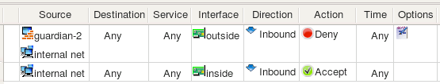

   Figure 5.21. Rule Using an Interface Object

Rule #0 is "anti-spoofing" rule which relies on the ability to define interface and direction. It matches packets with source addresses equal to the addresses of the firewall's interfaces or internal network, but that are coming in from outside, which is determined by comparing the interface through which packets enter the firewall. Packets with "internal" addresses cannot normally come from outside, and if they do, they must be spoofed and should be dropped. This is what this rule does: it drops and logs these packets. Rule #1 permits connections originating from the internal network going out, but it makes sure these packets enter the firewall through its internal interface.

These two rules generate the following iptables script:

.. code-block:: bash

   #
   # Rule 0 (eth0)
   #
   $IPTABLES -N In_RULE_0
   $IPTABLES -A FORWARD  -i eth0  -s 192.0.2.1  -j In_RULE_0
   $IPTABLES -A FORWARD  -i eth0  -s 172.16.22.1  -j In_RULE_0
   $IPTABLES -A FORWARD  -i eth0  -s 192.168.2.1  -j In_RULE_0
   $IPTABLES -A FORWARD  -i eth0  -s 172.16.22.0/24  -j In_RULE_0
   $IPTABLES -A In_RULE_0  -j LOG  --log-level info --log-prefix "RULE 0 -- DENY "
   $IPTABLES -A In_RULE_0  -j DROP
   #
   # Rule 1 (eth1)
   #
   $IPTABLES -A FORWARD  -i eth1  -s 172.16.22.0/24  -m state --state NEW  -j ACCEPT

Here all iptables commands have an "-i eth0" or "-i eth1" clause, which makes iptables compare the interface and direction.

Here is what we get if we compile the same rules for PF:

.. code-block:: text

   # Tables: (1)
   table <tbl.r9999.d> { 192.0.2.1 , 172.16.22.1 , 192.168.2.1 }

   #
   # Rule  0 (eth0)
   #
   block in    log  quick on en0 inet  from <tbl.r9999.d>  to any
   block in    log  quick on en0 inet  from 172.16.22.0/24  to any
   #
   # Rule  1 (eth1)
   #
   pass in    quick on en1 inet  from 172.16.22.0/24  to any keep state
   #

For PF, the compiler generated a "block in log quick on eth0" clause to make the rule match interface and direction.

In the case of Cisco IOS access lists, defining an interface in the rule makes the compiler place code generated for this rule into the ACL attached to the given interface. The compiler for IOS ACL always generates both inbound and outbound access lists for each interface, but if the rule specifies both interface and direction ("Inbound" or "Outbound"), the generated configuration goes only into the corresponding access list. Here is the output produced for the rules shown above for Cisco IOS ACL:

.. code-block:: text

   ip access-list extended inside_in
   ! Rule  1 (eth1)
   !
     permit ip 172.16.22.0 0.0.0.255 any
   exit

   ip access-list extended outside_in
   ! Rule  0 (eth0)
   !
     deny   ip host 192.0.2.1 any   log
     deny   ip host 192.168.2.1 any  log
     deny   ip 172.16.22.0 0.0.0.255 any  log
   exit

   interface FastEthernet1
     ip access-group inside_in in
   exit
   interface FastEthernet0
     ip access-group outside_in in
   exit

So far, the examples in this section have demonstrated how to use Interface objects to associate policy rules with interfaces so as to match packets crossing certain interface. An interface object can be used in the "source" and "destination" of rules just like any other addressable object. In this case, Firewall Builder replaces the interface object with the set of its addresses, picking only those addresses that match the address family (IPv4 or IPv6 or both) assigned to the rule set.

For example, we start with a firewall configuration where interface eth1 has two IP addresses, one IPv4 and another is IPv6. Note that this could be a host object as well because interfaces can belong either to a Firewall or a Host object.

.. figure:: img/obj-interface-both-address-families.png
   :alt: Interface Object with Both Address Families

   Figure 5.22. Interface Object with Both Address Families

Interface eth1 has IPv4 address 172.16.22.1 and IPv6 address fe80::21d:9ff:fe8b:8e94. It is used in a simple policy rule as follows:

.. figure:: img/obj-interface-object-in-rule.png
   :alt: Interface Object in a Rule

   Figure 5.23. Interface Object in a Rule

This policy rule set is configured as a mixed IPv4+IPv6 rule set. For iptables, the compiler generates the following code:

.. code-block:: bash

   # --------------- IPv4
   # Rule 0 (global)
   #
   $IPTABLES -A INPUT -p tcp -m tcp  -d 172.16.22.1  --dport 22  -m state \
    --state NEW  -j ACCEPT

   # --------------- IPv6

   # Rule 1 (global)
   #
   $IP6TABLES -A INPUT -p tcp -m tcp  -d fe80::21d:9ff:fe8b:8e94  --dport 22 \
    -m state --state NEW  -j ACCEPT

For PF we get the following:

.. code-block:: text

   # Rule  0 (global)
   #
   #
   pass in    quick inet proto tcp  from any  to 172.16.22.1 port 22 keep state
   pass out   quick inet proto tcp  from any  to 172.16.22.1 port 22 keep state

   # Rule  0 (global)
   #
   pass in    quick inet6 proto tcp  from any  to fe80::21d:9ff:fe8b:8e94 port 22 \
   keep state
   pass out   quick inet6 proto tcp  from any  to fe80::21d:9ff:fe8b:8e94 port 22 \
   keep state

Since the interface has two addresses, one IPv4 and another IPv6, the compiler generates commands in both the IPv4 and IPv6 sections of the script, but it uses only the appropriate address in each. Other than that, the interface object behaves just like a set of addresses when used in the source or destination element of a rule. It can also be used in NAT rules. Here is an example:

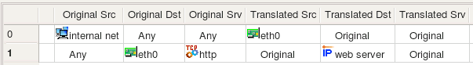

   Figure 5.24. IPv4 Address Object Assigned to an Interface

This generates the following code for iptables:

.. code-block:: bash

   # Rule 0 (NAT)
   #
   $IPTABLES -t nat -A POSTROUTING -o eth0  -s 172.16.22.0/24 -j SNAT \
   --to-source 192.0.2.1
   #
   # Rule 1 (NAT)
   #
   $IPTABLES -t nat -A PREROUTING  -p tcp -m tcp  -d 192.0.2.1 --dport 80 \
   -j DNAT --to-destination 172.16.22.100

And for PF:

.. code-block:: text

   # Rule  0 (NAT)
   #
   nat on eth0 proto {tcp udp icmp} from 172.16.22.0/24 to any -> 192.0.2.1
   #
   # Rule  1 (NAT)
   #
   rdr on eth0 proto tcp from any to 192.0.2.1 port 80 -> 172.16.22.100 port 80

Using Interface Object with Dynamic Address in Rules
^^^^^^^^^^^^^^^^^^^^^^^^^^^^^^^^^^^^^^^^^^^^^^^^^^^^^

The examples above demonstrated what happens when an interface with one or several IP addresses is used in policy and NAT rules. Let's look at the case when an interface has an address assigned dynamically. This means the address is unknown to the Firewall Builder policy compiler when it generates the configuration script. The compiler uses features of the target firewall to work around this. Here is the configuration of the interface object eth0. The radio-button Address is assigned dynamically is selected.

.. figure:: img/obj-interface-dynamic-address.png
   :alt: Interface with Dynamic Address

   Figure 5.25. Interface with Dynamic Address

The following policy rule uses interface eth0 in destination:

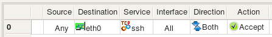

   Figure 5.26. Interface with Dynamic Address in a Rule

Here is the result for iptables:

.. code-block:: bash

   getaddr eth0  i_eth0
   getaddr6 eth0  i_eth0_v6

   # --------------- IPv4

   # Rule 0 (global)
   #
   test -n "$i_eth0" && $IPTABLES -A INPUT -p tcp -m tcp  -d $i_eth0  --dport 22 \
    -m state --state NEW  -j ACCEPT

   # --------------- IPv6

   # Rule 0 (global)
   #
   test -n "$i_eth0_v6" && $IP6TABLES -A INPUT -p tcp -m tcp -d $i_eth0_v6  \
    --dport 22  -m state --state NEW  -j ACCEPT

The shell functions "getaddr" and "getaddr6" are defined earlier in the script. The generated script determines IPv4 and IPv6 addresses of interface eth0 at the time of execution and then uses the values in iptables commands. If the interface does not have an address, the corresponding variable gets an empty string for its value and the iptables command using it is skipped.

PF allows for using interface name in rules and gets its current IP address automatically. This is the result generated for PF:

.. code-block:: text

   # Rule  0 (global)
   #
   pass in    quick inet proto tcp  from any  to (en0) port 22 keep state
   pass out   quick inet proto tcp  from any  to (en0) port 22 keep state

   # Rule  0 (global)
   #
   pass in    quick inet6 proto tcp  from any  to (en0) port 22 keep state
   pass out   quick inet6 proto tcp  from any  to (en0) port 22 keep state

We still get two separate parts for IPv4 and IPv6 because the rule set is configured as IPv4+IPv6 mix, but in both cases compiler just used the interface name because its actual IP address is dynamic and was unknown at the time the configuration was generated.

Using Interface Object in Rules of Bridging iptables Firewall
^^^^^^^^^^^^^^^^^^^^^^^^^^^^^^^^^^^^^^^^^^^^^^^^^^^^^^^^^^^^^

In case of the "normal" iptables firewall, Firewall Builder adds an "-i eth0" or "-o eth0" parameter to the generated iptables command to make it match interface and direction. If radio button "Bridge port" is turned on in the interface object, the compiler uses a different option to make iptables match packets crossing bridge ports. Here is the interface "eth1" which is configured as a bridge port:

.. figure:: img/obj-bridge-interface.png
   :alt: Bridge Interface

   Figure 5.27. Bridge Interface

Consider the following rule in the policy of the firewall this interface belongs to:

.. figure:: img/obj-bridge-interface-in-rule.png
   :alt: Bridge Interface in Rule

   Figure 5.28. Bridge Interface in Rule

This rule matches interface "eth1" and generates the following iptables command:

.. code-block:: bash

   $IPTABLES -A FORWARD  -m physdev --physdev-in eth1  -s 172.16.22.0/24 \
    -d 172.16.22.255  -m state --state NEW  -j ACCEPT

Since the interface is now a bridge port, the compiler uses "-m physdev --physdev-in eth1" to match it.

IPv4 Address Object
~~~~~~~~~~~~~~~~~~~~

The regular address object describes single a IPv4 address. It can be a child of an interface object, in which case it represents an IP address and netmask of the interface, or it can be used as a standalone object. In the latter case it does not have a netmask and is located in the Objects/Addresses branch of the objects tree.

When Used as Address of Interface
^^^^^^^^^^^^^^^^^^^^^^^^^^^^^^^^^

In this case the object is a "child" or "leaf" under the an interface object, either on a host or a firewall object. To create this kind of an address, right-click the interface object to bring up the context menu.

.. figure:: img/obj-ipv4-address-on-interface.png
   :alt: IPv4 Address Object Assigned to an Interface

   Figure 5.29. IPv4 Address Object Assigned to an Interface

Its dialog provides the following entry fields:

* **Name**

  This is the name of the object. Use a descriptive name because when the address object is used in the firewall policy, it is labeled with this name. It may be hard to tell one address from another if their names are similar.

* **Address**

  This is an IP address. The GUI widget provides syntax control for the values entered in the field. (This syntax control activates when you save the object.)

  .. note::

     A typical error is to interpret this object as an address of the subnet to which the interface of the host or firewall belongs. This object represents an address of the interface, not a network address. (So, 192.168.1.1, not 192.168.1.0)

* **Netmask**

  This is a netmask assigned to the interface. You can enter the netmask using the traditional method (255.255.255.0) or using network bit length notation ("24"). Bit length notation is converted to a traditional netmask by Firewall Builder.

* **DNS Lookup**

  If the host object has the same name as the actual machine, then clicking this button generates a DNS query that populates the interface IP address and subnet. Only the parent host or firewall object's name is used for the DNS query; the name of the interface is ignored and can be anything.

* **Comment**

  This is free-form text field for a comment.

Here we use our IPv4 address in a rule (remember, it belongs to the interface):

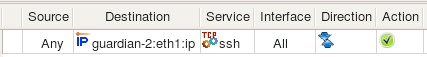

   Figure 5.30. IPv4 Address Object Assigned to an Interface and Used in a Rule

Firewall Builder's iptables compiler, for example, generates the following command from this rule:

.. code-block:: bash

   $IPTABLES -A INPUT -p tcp -m tcp  -d 172.16.22.1  --dport 22  -m state \
    --state NEW  -j ACCEPT

Note how even though the address object has a netmask, the generated command matches the address as a host address, not as a subnet. This is because the netmask is used only to describe the subnet for the interface, not to describe the subnet. When this address object is used in a rule, it is understood that the intention is to match the address of the interface it belongs to rather than any address on the subnet. Use the network object if you need to match a whole subnet.

This iptables rule was placed in the INPUT chain because the object in the "Destination" was an address of an interface of the firewall. While processing the policy for the iptables target firewall platform, Firewall Builder compares addresses in the source and destination of a rule to the addresses of all interfaces of the firewall to find rules that control access to and from the firewall. Firewall Builder places these rules into INPUT or OUTPUT chains. This is only necessary for iptables.

When Used as Stand-Alone Object
^^^^^^^^^^^^^^^^^^^^^^^^^^^^^^^

In this case the object is located in the Objects / Addresses part of the objects tree and does not have a netmask entry field. To create this kind of an address, use the New Object menu to select New Address or use the right-click menu associated with the addresses folder in the tree.

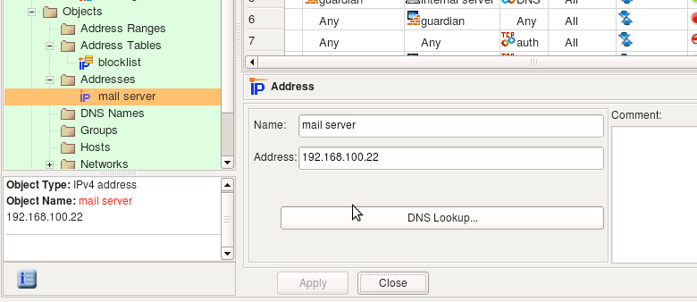

   Figure 5.31. Stand-Alone IPv4 Address Object

Dialog fields Name, Address and Comment have the same purpose and properties as an address object assigned to an interface object.

The DNS Lookup button can be used to automatically populate the address field using a DNS query. The program runs DNS query for the "A" record with the name of the address object. The object name does not have to match any DNS record if you never plan to use this feature. DNS query function is just a convenience, but to use it, the name of the object must match a DNS record.

IPv6 Address Object
~~~~~~~~~~~~~~~~~~~~

The IPv6 address object is similar to the IPv4 address object. Like IPv4 address objects, it can be used both as a child of an interface object or as a stand-alone object.

When Used as Address of Interface
^^^^^^^^^^^^^^^^^^^^^^^^^^^^^^^^^

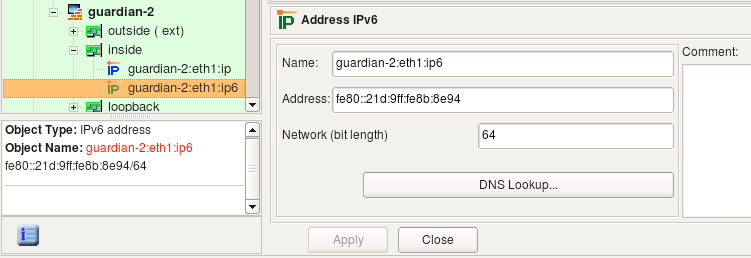

   Figure 5.32. IPv6 Address Object Assigned to an Interface Object

If it is used to describe an IPv6 address of an interface, it has a netmask represented as bit length. Unlike with IPv4 address object, an IPv6 netmask is never represented as a colon-separated string of octets.

When Used as Stand-Alone Object
^^^^^^^^^^^^^^^^^^^^^^^^^^^^^^^

.. figure:: img/obj-standalone-ipv6-address.png
   :alt: Stand-Alone IPv6 Address Object

   Figure 5.33. Stand-Alone IPv6 Address Object

In this case this object is located in the Objects / Addresses part of the objects tree (the same place where stand-alone IPv4 addresses are located) and does not have a netmask entry field. To create this kind of an address, use the New Object menu item New Address IPv6 or the right-click menu associated with the addresses folder in the tree.

Policy compilers treat IPv6 addresses in policy rules according to the same algorithms as those for IPv4 rules. For example, just like with IPv4, the compiler for iptables checks whether an address matches an address of any interface of the firewall to determine if the rule should be placed in the INPUT or OUTPUT chain.

Consider the rule shown in the screenshot below where we use two IPv6 address objects. One object belongs to the interface inside of the firewall while another is the IPv6 address of the project's web site.

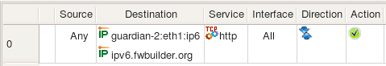

   Figure 5.34. IPv6 Address Objects in a Rule

For iptables, Firewall Builder generates the following commands from this rule:

.. code-block:: bash

   $IP6TABLES -A INPUT -p tcp -m tcp  -d fe80::21d:9ff:fe8b:8e94  --dport 80  \
   -m state --state NEW  -j ACCEPT
   $IP6TABLES -A FORWARD -p tcp -m tcp  -d 2001:470:1f0e:162::2  --dport 80  \
   -m state --state NEW  -j ACCEPT

The rule that matches the address described by *object guardian-2:eth1:ipv6* went to the INPUT chain because compiler detected that this rule matches packets that are headed for the firewall itself, which iptables inspects in the INPUT chain. The rule that matches the address described by the object *ipv6.fwbuilder.org* went to the FORWARD chain because these packets go through the firewall.

Attached Network Objects
~~~~~~~~~~~~~~~~~~~~~~~~~

There is a special type of interface child object, called the Attached Network object, that represents the networks that are directly attached to the interface. Figure 5.35 shows an example firewall configuration for a firewall with two network interfaces.

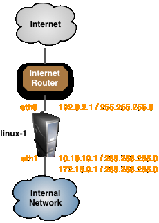

   Figure 5.35. Example Firewall Configuration

In the example configuration one of the interfaces, *eth0*, has one IP address and the other interface, *eth1*, has two IP addresses as shown in Table 5.2.

.. table:: Table 5.2. Attached Networks

   ===========  ===============
   Interface    Attached Network
   ===========  ===============
   eth0         192.0.2.0/24
   eth1         10.10.10.0/24
   eth1         172.16.0.0/24
   ===========  ===============

To create an object that matches the attached networks, select an interface, right-click on the interface and select New Attached Network from the context menu as shown in Figure 5.36.

.. figure:: img/obj-attached-network-context-menu.png
   :alt: Adding Attached Network Object to Interface eth1

   Figure 5.36. Adding Attached Network Object to Interface eth1

This will create a new child object under the eth1 interface object called *linux-1:eth1:attached*.

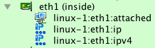

   Figure 5.37. Adding Attached Network Object to Interface eth1

If you open the object for editing as shown in Figure 5.38 you will see the list of all networks that are currently attached to the eth1 interface. If you add or delete IP addresses from the interface the Attached Network object will be automatically updated.

.. figure:: img/obj-attached-network-editing.png
   :alt: Adding Attached Network Object to Interface eth1

   Figure 5.38. Adding Attached Network Object to Interface eth1

The Attached Network object can than be used in rules just like any other Network object. Figure 5.39 shows an example of using the Attached Network object from the eth1 interface in a NAT policy rule.

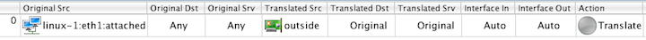

   Figure 5.39. Adding Attached Network Object to Interface eth1

Compiling this rule for an iptables firewall results in the output shown below.

.. code-block:: bash

   echo "Rule 0 (NAT)"
   #
   $IPTABLES -t nat -A POSTROUTING -o eth0 -s 10.10.10.0/24 -j SNAT --to-source 192.0.2.1
   $IPTABLES -t nat -A POSTROUTING -o eth0 -s 172.16.0.0/24 -j SNAT --to-source 192.0.2.1

.. note::

   You can also use the Attached Network object with interfaces that are configured as "Address is assigned dynamically". In this case the script generated by Firewall Builder will determine the attached network based on the IP address that is assigned to the interface at the time that the script is run.

Attached Networks - Cisco ASA/PIX
^^^^^^^^^^^^^^^^^^^^^^^^^^^^^^^^^^

The Attached Network object on Cisco ASA/PIX firewalls works the same way as it does for iptables firewalls where the Attached Network object will be expanded to include all networks that are associated with the IP address(es) assigned to the interface.

Attached Networks - PF
^^^^^^^^^^^^^^^^^^^^^^

On PF firewalls the Attached Networks object translates into the "<interface>:network" configuration parameter. For example, if you create an Attached Network object on interface *em0*, and use that Attached Network object in a rule, the generated configuration will use the *em0:network* parameter in the generated configuration.

Physical Address Objects
~~~~~~~~~~~~~~~~~~~~~~~~~

.. figure:: img/obj-physical-address-object.png
   :alt: The Physical Address Object

   Figure 5.40. The Physical Address Object

The physical address object describes the hardware, or media, address of an interface. Currently only Ethernet MAC addresses are supported, but support for other kinds of physical addresses may be added in the future.

The physical address object can only be a child of an interface; it cannot exist as a stand-alone object. To create this kind of address object, right-click an interface object in the tree, then select Add MAC Address. Only one physical address object is allowed per interface; the program enforces this restriction. If you create a firewall or host object using SNMP discovery, all interfaces are automatically populated with their MAC addresses.

* **Name**

  This is the name of the object. The field is populated automatically with a host:interface:addressType descriptive name when the object is created, but you can change it immediately or later. If you change the name, use something descriptive because when the address object is used in the firewall policy, it is labeled with this name. It may be hard to tell one address from another if their names are similar.

* **Address**

  This is a string representation of the physical or media address. For many types of media, this will be in a binary representation. For example, an Ethernet address would be represented as a string of six octets.

* **Comment**

  This is free-form text field for a comment.

Using in Policy Rules
^^^^^^^^^^^^^^^^^^^^^

Only a few firewall platforms really support physical address filtering. Currently, Netfilter/iptables is the only firewall platform supported by Firewall Builder that can do physical address filtering.

As described in Section 5.2.10.4, if an interface object that has multiple child address objects is used in a rule element (either *Source* or *Destination*), then the policy compiler tries to generate a rule using all of them. Section 5.2.10.4 explains that the compiler actually does this by generating multiple rules using each address in turn. This roughly corresponds to using the logical operation "OR" on the IP addresses: if our interface has two addresses, *Address1* and *Address2*, then the generated rule matches if the address in the packet is either *Address1* OR *Address2*. The case of a physical address is different, though. If the interface has a physical address, then the compiler builds a rule that has to match an IP address *and* the MAC address. The reason is to combat IP spoofing.

Suppose we have a very important host on the network. We create a host object, then add an interface to it. The interface should have both address and physical address objects as shown in Figure 5.41. The two child objects are visible in the tree under the Interface "eth0".

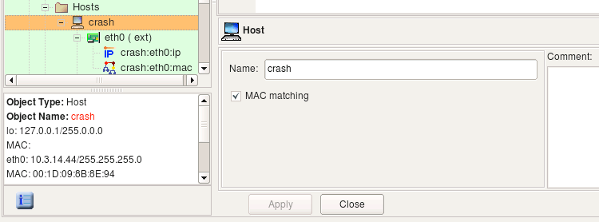

   Figure 5.41. The Host Object with Address and Physical Address

.. note::

   Note how MAC matching is checked in the host object dialog. This makes the compiler use the MAC addresses of the interfaces of this host.

Because this is a very important host, we would like to be sure that packets whose source IP is that of this host are really coming from it and are not spoofed. The best way to achieve this goal is to use strong authentication, for example, using the IPSec protocol. The use of IPSec is outside the scope of this document, since our goal here is to show that inspecting the MAC address of the packet can improve security.

Both a real packet originated from this host and a spoofed packet have a source IP address of the interface of this host, but the source MAC address is going to be different if spoofing is occurring. We can use this fact to catch and drop spoofed packets. Here are three possible ways to build security policy for this situation:

* Using only address object in the rule element. This means the firewall inspects only IP address and ignores the MAC address of the packets.

  .. figure:: img/obj-rule-using-address-only.png
     :alt: Policy Rule Using Only Address Object

     Figure 5.42. Policy Rule Using Only Address Object

  Firewall Builder generates the following simple iptables command for this rule:

  .. code-block:: bash

     $IPTABLES -A FORWARD  -s 10.3.14.44  -m state --state NEW  -j ACCEPT

* Using only a physical Address object. A rule built this way permits all kinds of traffic coming from the trusted host even if its IP address changes.

  .. figure:: img/obj-rule-using-physical-address.png
     :alt: Policy Rule Using Only a Physical Address Object

     Figure 5.43. Policy Rule Using Only a Physical Address Object

  For this rule, the following iptables command is generated:

  .. code-block:: bash

     $IPTABLES -A FORWARD  -m mac --mac-source 00:1D:09:8B:8E:94 -m state --state NEW \
     -j ACCEPT

* Using a host or interface object. This way we end up with a rule that matches on a *combination* of the IP address and MAC address. This may be used as a sophisticated anti-spoofing rule.

  .. figure:: img/obj-rule-using-host-object.png
     :alt: Policy Rule Using a Host Object

     Figure 5.44. Policy Rule Using a Host Object

  .. figure:: img/obj-rule-using-interface-object.png
     :alt: Policy Rule Using an Interface Object

     Figure 5.45. Policy Rule Using an Interface Object

  For this rule, the following iptables command is generated:

  .. code-block:: bash

     $IPTABLES -A FORWARD  -m mac --mac-source 00:1D:09:8B:8E:94 -s 10.3.14.44  -m state \
      --state NEW  -j ACCEPT

Using address and physical address objects in a rule is not the same as using the host or interface object to which these address and physical address belong. Here is what happens if we put objects representing IP address and MAC address in the rule:

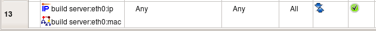

   Figure 5.46. Policy Rule Using Address and Physical Address Objects

For this rule, the following iptables commands are generated:

.. code-block:: bash

   $IPTABLES -A FORWARD  -s 10.3.14.44  -m state --state NEW  -j ACCEPT
   $IPTABLES -A FORWARD  -m mac --mac-source 00:1D:09:8B:8E:94 -m state --state NEW \
   -j ACCEPT

As described in Section 5.2.10.4, using an multiple objects in the rule element is like bundling them together using logical operation *OR*. If we were to put address and physical address in the rule as in Figure 5.46, we would end up with a policy matching packets that have the source address 10.3.14.44 or MAC address 00:1D:09:8B:8E:94, but not necessarily both at the same time. Any host that manages to pretend to have the IP address 10.3.14.44 would be able to send packets through our firewall even if its MAC address is different. To achieve our goal and make sure packets with the source 10.3.14.44 really belong to our important host, we should be checking its IP address and MAC address at the same time and let a packet through only if its IP address *AND* MAC address are what we expect them to be. That is why Firewall Builder treats physical addresses differently and generates firewall code that inspects both IP address and physical address.

Firewall Builder generates firewall code to inspect MAC address only for host objects with the option MAC address filtering turned on. If this option is off, the physical address object is ignored even if it is present in the host object's interface. This is because host objects created using the Network Discovery Druid (Section 6.2) are often populated with both IP address and MAC address information (available through SNMP query), but inspection of MAC addresses is rarely needed. Use the MAC address filtering option in the host object to specify that you want the MAC address to be verified for the host.

.. note::

   The target firewall imposes certain restrictions on rules matching the MAC address. For example, only source MAC addresses can be matched. Firewall Builder is aware of these restrictions, and the policy compiler issues an error if a physical address object is used in a rule that would lead to an impossible iptables command.

Host Object
~~~~~~~~~~~~

The host object in Firewall Builder is designed to represent real hosts in the network: workstations, servers, and any other network node with an address. Just like real hosts, host objects have interfaces that represent different physical connections to the network.

Most hosts have just a single (visible) interface with a single IP address. In that case the actual interface and its name do not matter. For most foreign hosts, Firewall Builder assigns an arbitrary name, like "interface1", to the host's interface. However, by using the tree-like hierarchy of hosts -> interfaces -> addresses, it is possible to specify the exact address and/or interface of a host in cases where it does matter.

As in the Firewall object, interfaces and addresses are represented by objects that are organized in a tree. An interface can have multiple addresses. An example of a host with one interface and multiple addresses is shown in Figure 5.47. Host "test server" is located on the LAN and has three virtual IP addresses that all belong to the same interface, "eth0".

.. figure:: img/obj-host-object-multiple-addresses.png
   :alt: A Host Object with One Interface and Multiple Virtual Addresses

   Figure 5.47. A Host Object with One Interface and Multiple Virtual Addresses

Note that in Firewall Builder, the host object is an abstraction. It does not have to conform to an individual host. This host object may in fact represent a web farm that accepts connections on three IP addresses, each on a different computer.

.. note::

   The host object cannot have any access, NAT, or routing policy associated with it; only firewall objects can have policies.

Creating
^^^^^^^^

To speed up the process and make it simpler, creating a new host object is aided by a wizard that is similar to the one for creating a new Firewall Objects.

To launch the wizard, select New Host from the New Object menu or right-click Hosts and select it from there.

Section 5.2.2 shows how to use the firewall object wizard. The host object wizard is the same, with the following exceptions:

* All methods

  You do not specify the operating system or platform for host objects.

* From template

  The Host object templates are different than those for Firewall objects. Browse through the list in Firewall Builder to see what's available.

* Manually

  This method works the same as for the Firewall object, though the Add Interfaces page is slightly different. You cannot tag an interface as a "bridge port" interface. You can, however, indicate it is unnumbered or dynamic by selecting the appropriate checkbox. If neither checkbox is selected, then the interface is assumed to have a static IP address. As with the firewall object wizard, you can only add IPv4 addresses in this way. If you need to use IPv6 addresses, create the host object without IP addresses and add them later.

* Via SNMP

  This method works the same as for a Firewall object. The host object must have the same name as the actual device and the host must respond to SNMP.

.. note::

   You can always add, modify, and remove interfaces of the new host object later using controls provided in the main window and object tree view.

Editing
^^^^^^^

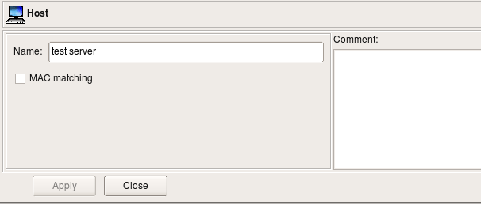

   Figure 5.48. Editing the Host Object

The Host object dialog allows you to edit the following parameters:

* **Name:**

  The host object name.

* **MAC matching:**

  If this option is activated, the policy compiler uses the MAC addresses of all interfaces of this host in the firewall rules. Not all firewall platforms support MAC address filtering, so this option may have no effect on the generated firewall script. This is treated as a non-critical situation, and the policy compiler will only generate a warning while processing a firewall policy where such a host is used. You cannot enter the physical (MAC) address in this dialog, however. See Section 5.2.9.1.

* **Comment:**

  This is a free-form text field which can be used to add comments.

Using in Rules
^^^^^^^^^^^^^^

When a host object is used in a rule, it acts as a group of all of the addresses that belong to all of its interfaces. The only exception is the loopback interface; the compiler skips that address when replacing the host object with its addresses.

Consider the following Host object. It has interface eth0 with two IP addresses and a MAC address, interface he-ipv6 with an IPv6 address and a MAC address, interface lo (loopback) with its own IP address and interface sit0 (tunnel) with no address.

.. figure:: img/obj-host-multiple-interfaces.png
   :alt: Host with multiple interfaces, Some with Multiple Addresses

   Figure 5.49. Host with multiple interfaces, Some with Multiple Addresses

Let's put this host object in a rule as follows:

.. figure:: img/obj-host-in-rule.png
   :alt: Host in a Rule

   Figure 5.50. Host in a Rule

The rule set is configured as "IPv4 only", so even though interface he-ipv6 has IPv6 address, Firewall Builder will ignore it while generating iptables commands for this rule. Interface eth0 has two IPv4 addresses and both will be used. Here are iptables commands generated for this rule:

.. code-block:: bash

   $IPTABLES -A FORWARD -p tcp -m tcp  --dport 22  -m state --state NEW \
   -j Cid6066X5981.1
   $IPTABLES -A Cid6066X5981.1  -d 10.3.14.44  -j ACCEPT
   $IPTABLES -A Cid6066X5981.1  -d 10.3.14.55  -j ACCEPT
   $IPTABLES -A Cid6066X5981.1  -d   -j ACCEPT

Let's see what we get for the same rule if we configure rule set object as "IPv4+IPv6":

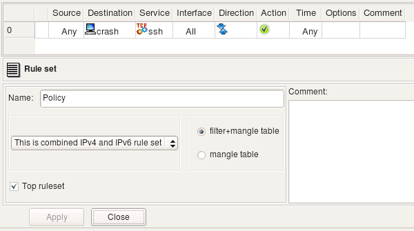

   Figure 5.51. Host in a Rule with both IPv4 and IPv6

Since the rule is now configured to compile for both address families, Firewall Builder processes it twice, once for each address family. Here is what we get (these are relevant fragments of the generated script):

.. code-block:: bash

   # --------------- IPv4

   $IPTABLES -A FORWARD -p tcp -m tcp  --dport 22  -m state --state NEW \
   -j Cid6066X5981.1
   $IPTABLES -A Cid6066X5981.1  -d 10.3.14.44  -j ACCEPT
   $IPTABLES -A Cid6066X5981.1  -d 10.3.14.55  -j ACCEPT
   $IPTABLES -A Cid6066X5981.1  -d   -j ACCEPT

   # --------------- IPv6

   $IP6TABLES -A FORWARD -p tcp -m tcp  --dport 22  -m state --state NEW \
   -j Cid6066X5981.1
   $IP6TABLES -A Cid6066X5981.1  -d fe80::a3:e2c  -j ACCEPT

Using Objects With Multiple Addresses
^^^^^^^^^^^^^^^^^^^^^^^^^^^^^^^^^^^^^^

Host and firewall objects have child interface objects, which in turn have child address and physical address objects. In fact, an interface object can have more than one associated address object. Let's see how this works:

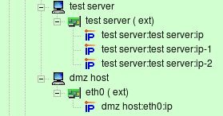

   Figure 5.52. Host Object with an Interface with Multiple Addresses

.. figure:: img/obj-host-multiple-addresses-rule.png
   :alt: Using Objects with Multiple Addresses in Policy Rules

   Figure 5.53. Using Objects with Multiple Addresses in Policy Rules

Consider example Figure 5.52, Figure 5.53. Here interface *eth0* of "test server" has three IP addresses (named "test server:eth0:0" through "test server:eth0:2") and interface *eth0* of "dmz host" has only one IP address: "dmz host:eth0". Policy rule #9 says that "dmz host" can talk to "test server" using any protocol. Since "test server" has three different addresses, we need to generate policy a rule that will match any of them. (Obviously we cannot match all three at once, so the compiler uses a logical "OR", not a logical "AND" here.) Basically, rule #9 is equivalent to three separate rules, each of them using one address of "test server" in turn. These three rules are represented in Figure 5.54 (original rule #9 also shown there, but it is disabled.)

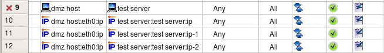

   Figure 5.54. Equivalent Rules

Firewall Builder takes care of this situation automatically and generates the firewall policy described in Figure 5.53 as if a user had built a policy in the GUI using the three rules as shown in Figure 5.54.

In fact, the algorithm used is even more general. In the example Figure 5.53, host "test server" has a single interface with multiple addresses that the compiler used to generate the target firewall code. The policy compiler works in a similar way even if the host or firewall object used in the rule has multiple interfaces and each interface, in turn, has multiple addresses. If a host (or firewall) object is used in the rule, then the compiler scans all its interfaces, finds all corresponding addresses, and uses them to generate the firewall configuration. If an interface object is used in the rule, then the compiler uses all its addresses. And finally, if an address or physical address object is used in the rule, then the compiler uses only this parameter to generate the firewall configuration. In other words, the compiler always traverses the tree, starting from the object found in the policy rule, and uses the parameters of all address and physical address objects it finds.
IPv4 Network Object
~~~~~~~~~~~~~~~~~~~~

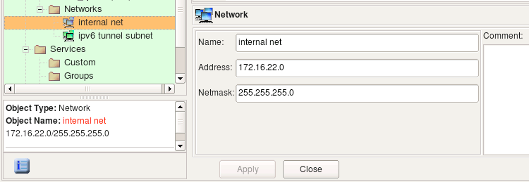

   The Network Object

The network object describes an IP network or subnet. Use main menu Net Object / New Network item to create objects of this type. The Network object dialog object provides the following entry fields:

* Name:

  Network Object Name

* Address:

  The IPv4 address of the network.

* Netmask:

  The netmask, in combination with an address, defines the subnet. You can enter either a string octet representation of the mask or its bit length here; however the program always converts it to the octet representation. The netmask in the network object is always entered in the "natural" way, such as "255.255.255.0", even if the object is going to be used to build Cisco IOS access lists which require reversed "bit mask" presentation instead (e.g., "0.0.0.255" for the netmask above). The Firewall Builder policy compiler automatically makes the required conversion.

* Comment:

  This is a free-form text field used for comments.

Let's use the network object shown above in a policy rule compiled for different target platforms.

.. figure:: img/obj-ipv4-network-in-rule.png
   :alt: IPv4 Network Object Used in a Rule

   IPv4 Network Object Used in a Rule

Here is what we get for iptables:

.. code-block:: bash

   $IPTABLES -A FORWARD -p tcp -m tcp  -s 172.16.22.0/24  --dport 80  -m state \
   --state NEW  -j ACCEPT

Here is the output produced for PF:

.. code-block:: none

   pass in   quick inet proto tcp  from 172.16.22.0/24  to any port 80 keep state
   pass out  quick inet proto tcp  from 172.16.22.0/24  to any port 80 keep state

Here is how the output looks like when the rule is compiled into Cisco IOS access lists. (This is one of the generated access lists.)

.. code-block:: none

   ip access-list extended outside_out
     permit tcp 172.16.22.0 0.0.0.255 any  eq 80
   exit

Here is what we get when the rule is compiled into Cisco ASA (PIX) configuration. Note how the compiler uses netmask 255.255.255.0 for PIX, while for IOS it was converted to 0.0.0.255. Also, the interface "inside" was configured with network zone 172.16.0.0/12, which matched network object used in the source element of the rule. Because of that, the compiler put the rule only into the access list attached to interface "inside."

.. code-block:: none

   access-list inside_acl_in permit tcp 172.16.22.0 255.255.255.0 any eq 80
   access-group inside_acl_in in interface inside

IPv6 Network Object
~~~~~~~~~~~~~~~~~~~~

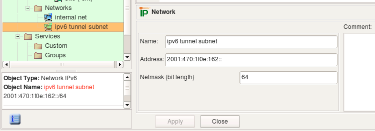

   IPv6 Network Object

The network object describes an IPv6 network or subnet. This object is very similar to the IPv4 network object, except you can only enter netmask as a bit length. Use main menu "Net Object / New Network IPv6" item to create objects of this type.

Let's see what we get if we use an IPv6 network object in a policy rule as shown:

.. figure:: img/obj-ipv6-network-in-rule.png
   :alt: IPv6 Network Object Used in a Rule

   IPv6 Network Object Used in a Rule

Here is the command generated for iptables:

.. code-block:: bash

   $IP6TABLES -A FORWARD -p tcp -m tcp  -s 2001:470:1f0e:162::/64  --dport 80  \
   -m state --state NEW  -j ACCEPT

Here is what we get for PF:

.. code-block:: none

   pass in   quick inet6 proto tcp  from 2001:470:1f0e:162::/64  to any port 80 keep state
   pass out  quick inet6 proto tcp  from 2001:470:1f0e:162::/64  to any port 80 keep state

Here is the output for Cisco IOS access lists (only one ACL is shown):

.. code-block:: none

   ipv6 access-list ipv6_outside_out
     permit tcp 2001:470:1f0e:162::/64 any  eq 80
   exit

   interface eth0
     ipv6 traffic-filter ipv6_outside_out out
   exit

There is no IPv6 support for Cisco ASA (PIX) in Firewall Builder at this time.

Address Range Object
~~~~~~~~~~~~~~~~~~~~

.. figure:: img/obj-address-range-object.png
   :alt: The Address Range Object

   The Address Range Object

The address range object describes a continuous range of IPv4 addresses. (Arbitrary address ranges for IPv6 is not supported.) To create a new address range object, use the main menu New Object / New Address Range option. Its dialog provides the following entry fields:

* Name:

  The name of the address range object

* Range start:

  The address of the start of the range.

* Range end:

  The address of the end of the range.

* Comment:

  A free-form text field used for comments.

The address range is inclusive; that is, both the start and the end addresses are included in the range.

When the address range object is used in a rule, Firewall Builder replaces it with a list of addresses equivalent to the specified range. The program tries to generate the most economical representation of the range using a combination of subnets of different lengths. Consider the address range object shown above. This address range object represents IP addresses between 192.168.1.100 and 192.168.1.160 (inclusively). It would be wasteful to generate 61 iptables commands to represent this range. Instead, the compiler uses a combination of several subnets of different lengths and ends up with the following:

.. code-block:: bash

   $IPTABLES -A FORWARD  -s 192.168.1.100/30  -m state --state NEW  -j ACCEPT
   $IPTABLES -A FORWARD  -s 192.168.1.104/29  -m state --state NEW  -j ACCEPT
   $IPTABLES -A FORWARD  -s 192.168.1.112/28  -m state --state NEW  -j ACCEPT
   $IPTABLES -A FORWARD  -s 192.168.1.128/27  -m state --state NEW  -j ACCEPT
   $IPTABLES -A FORWARD  -s 192.168.1.160  -m state --state NEW -j ACCEPT

Here is how the generated configuration looks for PF (this is essentially the same, except it uses tables for brevity):

.. code-block:: none

   table <tbl.r0.s> { 192.168.1.100/30 , 192.168.1.104/29 , 192.168.1.112/28 , \
   192.168.1.128/27 , 192.168.1.160 }

   pass in   quick inet  from <tbl.r0.s>  to any keep state

Just for completeness, let's look at the configuration generated for the same rule for Cisco IOS access lists. This is really just a fragment of the generate router access list configuration because generated ACLs are attached to interfaces and, since the rule in the example was not associated with any interfaces, it is attached to all of them. Here we show only one generated ACL:

.. code-block:: none

   ip access-list extended inside_in
   !
   ! Rule  0 (global)
   !
   !
     permit ip 192.168.1.100 0.0.0.3 any
     permit ip 192.168.1.104 0.0.0.7 any
     permit ip 192.168.1.112 0.0.0.15 any
     permit ip 192.168.1.128 0.0.0.31 any
     permit ip host 192.168.1.160 any
   exit

Address Tables Object
~~~~~~~~~~~~~~~~~~~~~

Sometimes you need to apply a rule to a set of addresses, but you don't know what those addresses will be when you're writing the policy. The address table object object can help in these situations.

.. figure:: img/obj-address-table-object.png
   :alt: The Address Table Object

   The Address Table Object

The address table object has the following fields:

* Name:

  The name of the address table object.

* Compile Time / Run Time:

  Indicates whether you want the file to be loaded with the firewall compiler runs (Compile Time) or when the firewall runs the firewall script (Run Time).

* File name:

  The name of the text file you want to load. (The file contains IP addresses or IP address ranges.) The filename can have any extension. If you want the file to load at run time, you must specify the path and name where the file will be on the firewall machine, not on the client machine.

* Choose File button:

  Used to populate the file name and path if the file is on the local machine. You can also type in a path to a filename that you want to create.

* Edit File button:

  Once the File name field is populated, use this button to view and update the file. If the file does not already exist, Firewall Builder will generate a warning message.

* Comment:

  A free-form text field used for comments

The Compile Time and Run Time radio buttons define when the addresses will be read from the file: when the firewall script is generated by Firewall Builder or when the firewall runs the script.

If object is configured as Compile Time, the Firewall Builder policy compiler opens the file during compilation and replaces the address table object in policy rules with the set of addresses from the file. This means the file with addresses must be accessible on the machine where the Firewall Builder GUI and policy compilers run.

If the object is configured as Run Time, policy compiler does not try to find and open the file but instead generates a firewall script that will do this when it is activated. This means the file with addresses must be located where it is accessible by the firewall, and the object must be configured with the full path to it on the firewall.

Here is an example of the file contents (this is what you see if you click the Edit File button in the object dialog):

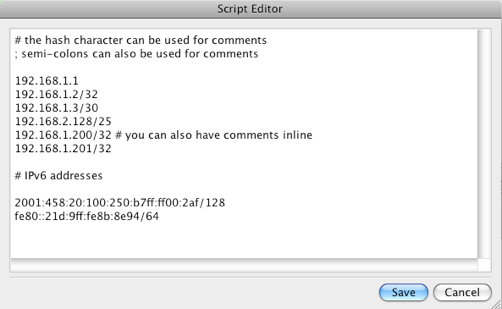

   Address Table Text File

Note that comments in the file can start with "#" or ";", that a comment can follow an address on the same line or take the whole line, and that lines can start with white space for formatting. This example file contains both IPv4 and IPv6 addresses for illustration purposes.

Compile-time address table objects are supported on all target firewall platforms because addresses are read by the compiler. The compiler then generates normal configuration lines or script commands. Run-time address table objects require special support from the target firewall and are therefore supported only on some of them. Currently run-time address table objects can be used in rules for iptables and PF firewalls.

Let's look at the firewall script generated by Firewall Builder for the iptables and PF when the Address Table object used in the policy rule is configured first as "Compile Time" and then as "Run Time". The rule is very simple and looks like (Figure 5.62):

.. figure:: img/obj-address-table-rule.png
   :alt: Rule Using an Address Object

   Rule Using an Address Object

This rule, with the object set to Compile Time, generates the following output:

.. code-block:: bash

   # Rule 0 (global)
   #
   $IPTABLES -A INPUT  -d 192.168.1.1  -j DROP
   $IPTABLES -A FORWARD  -d 192.168.1.2   -j DROP
   $IPTABLES -A FORWARD  -d 192.168.1.3/30  -j DROP
   $IPTABLES -A FORWARD  -d 192.168.2.128/25  -j DROP
   $IPTABLES -A FORWARD  -d 192.168.1.200  -j DROP
   $IPTABLES -A FORWARD  -d 192.168.1.201  -j DROP

The compiler replaced the object address_table_1 in the Destination with addresses it took from the file. Option assume firewall is part of any was turned off in the firewall object settings, which is why compiler did not generate rules in the OUTPUT chain. However, one of the addresses in the file matched the address of one of the interfaces of the firewall (192.168.1.1) and the corresponding rule went into the INPUT chain. Other addresses were copied from the file verbatim, including netmask specifications. The policy object of this firewall was configured as "IPv4 rule set", because of this the compiler dropped the IPv6 addresses it found in the file. If the rule set was configured as a mix of IPv4 and IPv6, compiler would use IPv4 addresses in IPv4 rules and IPv6 addresses in IPv6 rules.

.. code-block:: none

   # Tables: (1)
   table  { 192.168.1.1 , 192.168.1.2 , 192.168.1.3/30 , 192.168.2.128/25 , \
   192.168.1.200 , 192.168.1.201 }

   # Rule  0 (global)
   #
   block in   quick inet  from any  to <tbl.r0.d>
   block out  quick inet  from any  to <tbl.r0.d>

The output for PF is simple because Firewall Builder can use the built-in table facility. All addresses are copied from the file verbatim into the table tbl.r0.d.

.. code-block:: bash

   # Using 1 address table files
   check_file "address_table_1" "/home/vadim/addr-table-1.tbl"

   # Rule 0 (global)
   #
   grep -Ev '^#|^;|^\s*$' /home/vadim/addr-table-1.tbl | while read L ; do
     set $L; at_address_table_1=$1; $IPTABLES -A FORWARD  -d $at_address_table_1  -j DROP
   done

First, the generated script checks if the file specified in the address table object exists on the firewall machine. If the file is not found, the script aborts execution to avoid loading incomplete iptables rules. However, the script cannot verify that the file is the one you intended it to be; it just assumes that if the file with this name exists it is the right one and tries to interpret it as a list of IP addresses, with one address per line. Then the script reads the file line by line, skipping comments, and assigns IP addresses to the shell variable at_address_table_1, which it then uses in the iptables command.

Since the compiler did not see the addresses from the file, it could not detect that one of them matched an address of the firewall and all iptables commands went to the FORWARD chain. The file /home/vadim/addr-table-1.tbl should be located on the firewall where the generated iptables script will be executed so the script can find it.

Here is what you get if the option "Assume firewall is part of any" is turned on in the firewall object settings:

.. code-block:: bash

   # Rule 0 (global)
   #
   grep -Ev '^#|^;|^\s*$' /home/vadim/addr-table-1.tbl | while read L ; do
     set $L; at_address_table_1=$1; $IPTABLES -A OUTPUT  -d $at_address_table_1  -j DROP
   done
   grep -Ev '^#|^;|^\s*$' /home/vadim/addr-table-1.tbl | while read L ; do
     set $L; at_address_table_1=$1; $IPTABLES -A FORWARD  -d $at_address_table_1  -j DROP
   done

The difference is that compiler generated two sets of commands, one in chain OUTPUT and another in chain FORWARD. The original rule has "any" in source, and if the option Assume firewall is part of any is turned on, the compiler assumes the source of the rule can have either an unknown address or the firewall. The former makes it generate iptables command in the FORWARD chain and the latter makes it generate iptables command in the OUTPUT chain. This logic is not specific to the address table object type; the compiler does this regardless of the type of the object used in destination if source is "any" and option Assume firewall is part of any is turned on.

.. code-block:: none

   # Tables: (1)
   table  persist file "/home/vadim/addr-table-1.tbl"
   # Rule  0 (global)
   #
   #
   block in   quick inet  from any  to <address_table_1>
   block out  quick inet  from any  to <address_table_1>

PF is even easier in the case of run time address tables. The compiler just uses *table* facility with *persist* and *file* options to direct pfctl to open the file and read its contents. In this case, the file should follow the formatting requirements of PF.

Policy compiler for PF treats address table objects with empty file name in a special way. It just generates the line "table <table_name>" at the beginning of the .conf file with no file specification. This table will not be populated when .conf file is loaded and therefore will remain empty, but it can be used in the rules.

Addresses can be added to the table later using external scripts that call pfctl like this:

.. code-block:: none

   pfctl -t bad_hosts -T add 192.0.2.1

Another interesting possibility is to automatically populate the table if option "overload" is used in combination with other rate limiting options on a rule. Taking an example from the man page for pf.conf, here is how it looks:

.. code-block:: none

   block quick from <bad_hosts>
   pass in on $ext_if proto tcp to $webserver port www keep state \
                   (max-src-conn-rate 100/10, overload <bad_hosts> flush global)

The idea behind these rules is that if some host tries to connect to the web server too often -- more often than is allowed by max-src-conn-rate 100/10 -- its address will be added to the table <bad_hosts> by PF. The next time this host tries to connect, the packet coming from it will be denied by the blocking rule right away.

To implement these rules in Firewall Builder, you would create an Address Table object with the name "bad_hosts" but a blank file name, configured to resolve at run time:

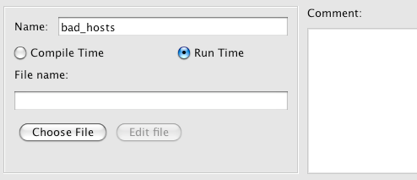

   Address Table Object bad_hosts

Then, use this address table object in the source field of a policy rule with action "Deny". This is rule #0 in the screenshot below. Another rule, rule #1 in the screenshot, has action "Accept" and matches destination against address of the web server, protocol http, and has limiting options set up to restrict the number of connections and to turn overload table on, with the name of the overload table "bad_hosts" that matches the name of the address table object.

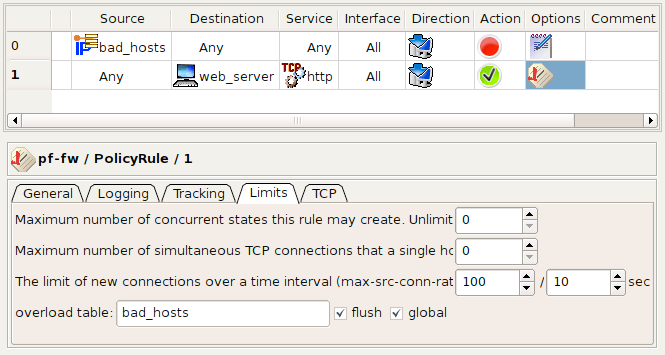

   Address Table Object bad_hosts Rules

These two rules, as shown on the screen shots, yield the following PF configuration that matches the one given in the man page:

.. code-block:: none

   # Tables: (1)
   table <bad_hosts> persist

   # Rule  0 (global)
   #
   block in   log  quick inet  from <bad_hosts>  to any
   #
   # Rule  1 (global)
   #
   pass in   quick inet proto tcp  from any  to 192.168.1.1 port 80 \
     keep state  ( max-src-conn-rate 100/10, overload <bad_hosts> flush global )

Using Address Tables with iptables IP Sets
^^^^^^^^^^^^^^^^^^^^^^^^^^^^^^^^^^^^^^^^^^^

Beginning with Firewall Builder version 4.1, there is support for iptables firewalls to use the netfilter *ipset* module. The ipset module provides a method for storing a list of IP addresses or IP subnets in memory. This allows firewall administrators to define a single iptables rule that matches multiple IP addresses or IP subnets as the source and/or destination. In Firewall Builder an "ipset" is associated with an address table object where the list of addresses and subnets are defined in a file.

Using the IP sets feature requires an iptables version of at least 1.4.1.1 and requires that the target firewall have the ipset module installed. There are instructions for installing the ipset module for some distributions described in the Appendix Section 16.1.1. If you have installation instructions for installing the ipset module on a distribution not listed in the Appendix please e-mail info@fwbuilder.org.

You can find more information about the netfilter ipset module at the `netfilter IP sets page <http://ipset.netfilter.org/features.html>`_.

.. note::

   **Testing if your iptables firewall supports IP set**

   To test if your firewall has the ipset module and ipset tools installed run the following commands from a shell. Note you must be root or have sudo rights to run the command.

   *Test to check if ipset tools are installed*

   .. code-block:: bash

      fwadmin@guardian:~$ sudo ipset --version
      ipset v2.5.0 Protocol version 2.
      fwadmin@guardian:~$

   *Test to check if ipset module is installed*

   .. code-block:: bash

      fwadmin@guardian:~$ sudo ipset -N test iphash
      FATAL: Module ip_set not found.
      ipset v4.1: Couldn't verify kernel module version!
      fwadmin@guardian:~$

To enable the iptables "IP sets" functionality in Firewall Builder, you must explicitly set the version of the iptables firewall that you want to use with the ipset module. Navigate to the firewall and double-click to open the object in the editor window. Set the iptables version number to a version that is at least 1.4.1.1.

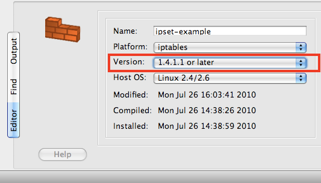

   Set the firewall iptables version number

After you have set the iptables version number, click Firewall Settings for this firewall. Near the bottom of the Firewall Settings dialog window you there is a checkbox that says:

*Use module "set" for run-time address table objects. (This module is only available in iptables v 1.4.1.1 and later.)*

Select this checkbox to enable using the iptables ipset module.

.. figure:: img/obj-ipset-firewall-settings.png
   :alt: Set the Firewall Settings to Use the IP set Module

   Set the Firewall Settings to Use the IP set Module

If the checkbox and text are shown as greyed out, then go back and check that you set the iptables version number for this firewall.

You can only use address tables that are set to Run Time with the ipset module. Compile Time address table objects will behave as before with the objects in the specified file being expanded when the firewall is compiled.

.. note::

   **Mixed IP addresses and IP Subnets in IP Sets**

   Normally the ipset module requires you to create separate "sets" for IP addresses and IP subnets. Firewall Builder, through its abstraction layer, enables you to create mixed IP addresses and IP subnets in the same file. This creates what is known as a "set list" that contains two "sets", one "set" that includes only IP addresses and another "set" that includes only IP subnets.

The following example shows the Firewall Builder configuration steps for setting up an Address Table called "bad_hosts", using that address table in a rule, and confirming the ipset configuration.

.. figure:: img/obj-ipset-address-table.png
   :alt: Address Table Object

   Address Table Object

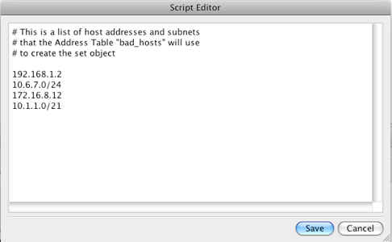

   Editing the Address Table File

.. figure:: img/obj-ipset-rule.png
   :alt: Rule Using Address Table Object

   Rule Using Address Table Object

You can use the ipset tools to view the configuration of your "sets" once they have been created by Firewall Builder on your firewall. For example, the command **ipset --list** will list all the configured "sets" on your firewall.

If you install a firewall that is using address tables with ipset enabled you can update the list of addresses that are stored in memory for that "set" by updating the file associated with the address table object and then running the **firewallscript.fw reload_address_table** command. For the examples shown above you would enter:

.. code-block:: bash

   guardian.fw reload_address_table bad_hosts /etc/fw/bad_hosts

where "guardian.fw" matches the name of your Firewall Builder script file and "bad_hosts" is your address table object. This dynamically updates the list of addresses stored in memory for the bad_hosts set while iptables is running.

.. note::

   **Naming Convention for Address Table Objects and Sets**

   When Firewall Builder creates the "set" it substitutes an underscore ("_") for any spaces. For example, the address table named "My Address List" would have a "set" name of "My_Address_List". Also, note that the name of the address table object cannot start with colon (":") due to restrictions in the ipset module.

There are two primary benefits of using the ipset module. First, the performance for matching a single rule that is using a set to hold a large number of addresses is better than having individual rules for each of these addresses. Second, the ipset module and tools provide a way to dynamically update the addresses in a list while the firewall is still running.

Special-Case Addresses
~~~~~~~~~~~~~~~~~~~~~~

Policy compilers treat some addresses in policy rules in special ways, depending on the requirements of the target firewall platform. For example, the compiler for iptables checks if the address found in "Destination" or "Source" of a rule matches the address of any interface of the firewall to determine if the rule should be placed in INPUT or OUTPUT chain. The compiler for PIX uses the command ssh <address> <netmask>> inside when it detects such an address in the destination of a rule where the service is TCP Service object "SSH". There are other special cases as well.

Broadcast and Multicast Addresses, iptables Firewall
^^^^^^^^^^^^^^^^^^^^^^^^^^^^^^^^^^^^^^^^^^^^^^^^^^^^^

Two important special cases are broadcast and multicast addresses. It is important to place rules in the correct chain in generated iptables script, because even though these addresses are not equal to those of the firewall's interfaces, iptables processes packets with broadcast or multicast destination in the INPUT chain. Firewall Builder is aware of this and generates the correct iptables commands.

In order to match broadcast or multicast addresses in the rules, we need to create objects to describe them. The choice of object type to describe broadcast or multicast address depends on whether this is just a single address, a range or a block. An address object is good for defining a single address, address range is good for sets of consecutive addresses and network object is good for describing a block. For example, you can use an address object with address "255.255.255.255" to describe a broadcast. address range with addresses "224.0.0.5 - 224.0.0.6" would work well to describe two multicast groups used by OSPF. A network object with address "224.0.0.0" and netmask "240.0.0.0" can be used to describe a whole multicast address block.

Here are few examples:

.. figure:: img/obj-multicast-object.png
   :alt: Multicast Object

   Multicast Object

Object "all multicasts" is part of the Standard Objects library that comes with the program. It describes an entire address block allocated for multicasts. Consider a simple policy rule that permits all multicasts:

.. figure:: img/obj-multicast-rule.png
   :alt: Multicast Rule

   Multicast Rule

For iptables, this rule translates into the following script:

.. code-block:: bash

   $IPTABLES -A INPUT  -d 224.0.0.0/4  -m state --state NEW  -j ACCEPT

The rule went into the INPUT chain because iptables processes multicast there.

Here is another example, this time it involves broadcast addresses. The interface "inside" of the test firewall has address 172.16.22.1 with netmask 255.255.255.0. This defines subnet 172.16.22.0/255.255.255.0 with broadcast address 172.16.22.255. We create an address object with the name "net-172.16.22 broadcast" and address "172.16.22.255" and use it in the destination field of a policy rule. Another rule in the same example will match broadcast address "255.255.255.255"; an address range object that defines this address is present in the standard objects library under the name "broadcast". Here are the rules:

.. figure:: img/obj-broadcast-rules.png
   :alt: Broadcast Rules

   Broadcast Rules

These two rules translate into the following script for iptables:

.. code-block:: bash

   # Rule 0 (global)
   #
   $IPTABLES -A INPUT  -d 255.255.255.255  -m state --state NEW  -j ACCEPT
   #
   # Rule 1 (global)
   #
   $IPTABLES -A INPUT  -d 172.16.22.255  -m state --state NEW  -j ACCEPT

Both rules went into INPUT chain as expected.

Broadcast and Multicast Addresses, Bridging iptables Firewall
^^^^^^^^^^^^^^^^^^^^^^^^^^^^^^^^^^^^^^^^^^^^^^^^^^^^^^^^^^^^^

Compilers treat broadcast and multicast addresses differently if the firewall object is set to be a bridging firewall. In this case the checkbox "Bridging firewall" should be turned on in the firewall settings dialog and one or more interface objects should be marked as "Bridge port":

.. figure:: img/obj-bridge-interface-broadcast.png
   :alt: Broadcast and Multicast Address in a Bridging Firewall

   Broadcast and Multicast Address in a Bridging Firewall

Now the rule that matches the broadcast destination address will be treated differently:

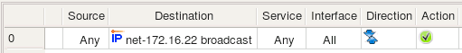

   Broadcast and Multicast Address in a Rule

This produces the following iptables commands:

.. code-block:: bash

   $IPTABLES -A FORWARD  -d 172.16.22.255  -m state --state NEW  -j ACCEPT
   $IPTABLES -A INPUT  -d 172.16.22.255  -m state --state NEW  -j ACCEPT

Rules went into both INPUT and FORWARD chains because the bridging firewall passes broadcasts through, but at the same time accepts them as packets headed for itself. Since the rule did not specify which interface it should look at, Firewall Builder assumed that the generated rule should inspect packets crossing all interfaces, both bridge ports and "normal" ones, and therefore placed the rule in both INPUT and FORWARD chains.

DNS Name Objects
~~~~~~~~~~~~~~~~

A DNS Name object represents a DNS "A" or "AAAA" record. The object resolves into IP address at compile or run time. The address (IPv4 or IPv6) the object resolves to depends the address family or families of the rule set it is used in. That is, if the object is used in a rule that is part of IPv4 rule set, the compiler will try to resolve the object using DNS query for the "A" record, but if the object is used in a rule that is part of an IPv6 rule set, the compiler will run a "AAAA" query. If the rule set where the object is used is a mixed type (IPv4+IPv6), the compiler will resolve the same object twice using different queries.

The DNS Name object dialog looks like this:

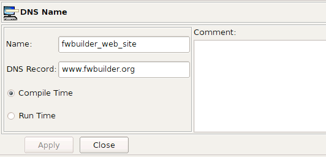

   DNS Name Object

* Name:

  The name of the DNS Name object

* DNS Record:

  The DNS record you want to resolve.

* Compile Time / Run Time:

  Indicate whether you want to resolve the IP address when you create the firewall script (compile time) or when you run the script on the firewall (run time).

* Comment:

  A free-form text field used for comments

The DNS Record parameter is the name of the A or AAAA record we want to resolve. In this example, it is the host name of the Firewall Builder project web site "www.fwbuilder.org". Note that IPv6 web server for the project is accessible as "ipv6.fwbuilder.org" so we are going to need second DNS name object for IPv6 examples. Compile Time and Run Time options have the same meaning as those in the address table object, that is, a compile-time DNS name object is converted to the IP address by the policy compiler, while a run-time DNS name object is not. In the latter case, the compiler puts the DNS record name into the generated script or configuration file and leaves it up to the firewall to resolve it when the script is activated.

Both compile-time and run-time DNS name objects are supported on all target firewall platforms.

Let's look at how the simple rule shown in Figure 5.89 compiles for iptables and PF, both for compile-time and run-time DNS name objects.

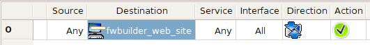

   Rule Using DNS Name Object

.. code-block:: bash

   # Rule 0 (global)
   #
   $IPTABLES -A FORWARD  -d 70.85.175.170  -m state --state NEW  -j ACCEPT

In this trivial case, the compiler simply resolved "www.fwbuilder.org" to an IP address and used it in the iptables command. However, if the policy rule was in a rule set configured as an IPv6-only rule set, the rule would not produce any iptables command at all because there is no AAAA DNS record with name "www.fwbuilder.org". If the rule set was both IPv4+IPv6, then the rule would generate iptables command only in the IPv4 part. The opposite is also true: the DNS name object with record "ipv6.fwbuilder.org" will only produce iptables commands when used in IPv6 rule set because there is only an AAAA record with this name.

.. code-block:: none

   # Rule  0 (global)
   #
   pass in   quick inet  from any  to 70.85.175.170 keep state

The same is true in the case of PF: the compiler simply resolved the name "www.fwbuilder.org" and put the address in the generated pf.conf file. Since this name does not resolve into any IPv6 address, IPv6 PF policy would not have any line for this rule. The DNS record "ipv6.fwbuilder.org" resolves only into an IPv6 address, and therefore DNS name object with this record would only produce pf.conf configuration for IPv6 and not for IPv4.

.. code-block:: bash

   # Rule 0 (global)
   #
   $IPTABLES -A FORWARD  -d www.fwbuilder.org -m state --state NEW  -j ACCEPT

Here the compiler used the line entered in the DNS record parameter literally, leaving it up to iptables on the firewall machine to resolve this name into an IP address. Using a run time DNS name object in IPv6 policy generates the following iptables command:

.. code-block:: bash

   # Rule 0 (global)
   #
   $IP6TABLES -A FORWARD  -d ipv6.fwbuilder.org -m state --state NEW  -j ACCEPT

$IP6TABLES is the shell variable defined at the beginning of the generated script; the value of this variable is the full path to the **ip6tables** command line utility. **ip6tables** will try to resolve given name to an IPv6 address since it processes IPv6 iptables policy.

.. code-block:: none

   # Rule  0 (global)
   #
   pass in   quick inet  from any  to www.fwbuilder.org keep state
   pass out  quick inet  from any  to www.fwbuilder.org keep state

Run-time DNS name object translates into PF configuration lines that also use the name of the DNS record and leave it up to PF to actually resolve it to an IP address when the configuration is loaded.

Object Groups
~~~~~~~~~~~~~

.. figure:: img/obj-object-group.png
   :alt: Group of Objects

   Group of Objects

The group of objects holds references to hosts, networks, address ranges, firewalls and other groups of addressable objects (Figure 5.89). Use the New Object / New Object Group option to create a new group. Objects can be added to the group using the following methods:

* Using drag and drop:

  Objects can be dragged from the tree into the group dialog. Click, hold down the mouse button, and drag the object to add it to the group.

* Using the popup menu:

  You can use copy and paste operations between the tree and group dialog. Right-clicking the object in the tree opens a pop-up menu. Choose Copy in this menu, then move the mouse to the group dialog and right-click in the icon field. This also opens a pop-up menu, where you choose Paste. This inserts a reference to the object in the group.

* Using the Edit main menu:

  Select the object in the tree, select Edit/Copy Object from the menu bar, click the group dialog, and then select Edit/Paste Object from the menu bar.

Dynamic Object Groups
~~~~~~~~~~~~~~~~~~~~~

Dynamic Groups allow you to define filter criteria to match objects based on their *Object Type* and *Keywords*. When a Dynamic Group is used in a rule the compiler automatically expands the group to include all the objects that match the filter criteria at the time the compiler is run.

To create a Dynamic Group right-click on the Groups system folder in the object tree and select "New Dynamic Group". Figure 5.90 shows the new group in the Editor Panel with the default values set.

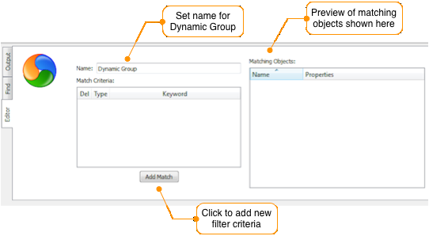

   Creating a Dynamic Group

Click Add Match to create filter rules that will be used to determine which objects will be included in the Dynamic Group. Multiple filter rules can be created in a single group. The logic used between rules is "OR" where an object that matches *any* of the rules will be included in the group.

Within a filter rule, the logic between the Object Type and Keyword fields is "AND" logic where both elements need to match in order for an object to be included in the group. For example, a filter rule with the Object Type set to Network and the Keyword set to "New York" will only match Network objects that have the keyword set to New York.

Dynamic Group Example
^^^^^^^^^^^^^^^^^^^^^

In this example the Firewall Builder data file includes a number of objects that have already been defined. Some of these objects have been configured with keywords like "New York" and "London" to identify the city where the element the object represents is located.

To create a rule that matches all the network objects that are associated with New York, we create a new Dynamic Group called New York Networks as shown in Figure 5.91.

.. figure:: img/obj-dynamic-group-example.png
   :alt: Example of Dynamic Group

   Example of Dynamic Group

From the preview window you can see that there are four networks that have Keywords that include New York (remember that an object can have more than one Keyword defined).

Figure 5.92 shows a rule that includes the Dynamic Group object in the Source column of the rule.

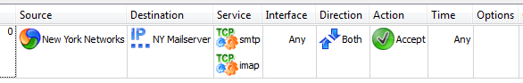

   Dynamic Group Used in a Rule

Running a single rule compile, shown in Section 10.2, for this rule will result in all the objects that match the current filter rules in the "New York Networks" Dynamic Group getting expanded to match the four network elements that have Keywords that include New York. The single rule compile output is shown in Figure 5.93.

.. figure:: img/obj-dynamic-group-compile-output.png
   :alt: Compile Output of a Rule That Uses Dynamic Group

   Compile Output of a Rule That Uses Dynamic Group

Adding a new filter rule to the "New York Networks" Dynamic Group to include any Address Ranges that include the Keyword of New York will result in the group shown in Figure 5.94.

.. figure:: img/obj-dynamic-group-updated.png
   :alt: Updated Dynamic Group

   Updated Dynamic Group

Recompiling a rule that uses the "New York Networks" Dynamic Group object will automatically detect the additional Address Ranges that include the Keyword of New York. Figure 5.95 shows the updated compiler output.

.. figure:: img/obj-dynamic-group-updated-compile.png
   :alt: Updated Dynamic Group Compile Output

   Updated Dynamic Group Compile Output
Service Objects
---------------

In Firewall Builder, service objects represent IP, ICMP, TCP, and UDP services such as "host unreachable" in ICMP, HTTP in TCP, GRE in IP, and DNS in UDP. Firewall Builder provides service objects for hundreds of well-known and frequently-used services in ICMP (IP protocol number 1), TCP (IP protocol number 6), and UDP (IP protocol number 17).

IP Service
~~~~~~~~~~

The IP service object describes protocols that are not ICMP, TCP, or UDP. (ICMP, TCP, and UDP have their own service objects.) An IP protocol is defined by the 8-bit field in the IP packet header. The screenshot below represents the ESP object (Encapsulating Security Payload, part of the IPSEC protocol family) which uses the IP protocol number 50.

.. figure:: img/obj-ip-service-object.png
   :alt: IP Service Object

   Figure 5.96. IP Service Object

.. note::

   Protocol numbers are assigned by IANA; you can look up the number for a particular protocol at the following URL: http://www.iana.org/assignments/protocol-numbers/

Besides the protocol number, the header of the IP packet also has a field called "Options" which is a variable-length list of optional information for the packet. Not all firewalls can examine options, and those that can usually have certain limitations as to what options they can match against. Firewall Builder tries to provide controls for many popular options supported by the most sophisticated firewalls. Not all options supported by Firewall Builder are supported by all target firewall platforms (Table 5.3).

.. table:: Table 5.3. Support for IP options and fragmentation on various firewall platforms

   ==========  ======  ======  ====  ===========  ==============  ================
   Firewall    lsrr    ssrr    rr    timestamp    all fragments   'short' packets
   ==========  ======  ======  ====  ===========  ==============  ================
   iptables    \+      \+      \+    \+           \+              \-
   ipfilter    \-      \+      \+    \+           \+              \+
   pf          \-      \-      \-    \-           \+              \-
   Cisco PIX   \-      \-      \-    \-           \-              \-
   ==========  ======  ======  ====  ===========  ==============  ================

**Source route options: LSRR, SSRR**
   Normally IP routing is dynamic, with each router making decisions about which next hop router to send the packet to. However, another option exists where the sender can choose the route. In the case of the Loose Source Route, the sender (host) can specify a list of routers the packet must traverse, but it may also pass through other routers between any two addresses in the list. The Strict Source Route works very much the same way, except the packet must traverse only through the specified addresses. Source routing can potentially be used to reach hosts behind the firewall even if these hosts use private IP addresses, which normally are not reachable over the Internet.

**Record route option: RR**
   This option causes every router that handles the packet on the way to add its IP address to a list in the options field. This option is used by the ping utility when it is called with the "-R" command line switch; it can potentially be exploited to discover the internal network addressing and layout behind the firewall. Although the risk is low, some firewall administrators prefer to block packets with this option set.

**Timestamp option:**
   This option tells routers that handle the packet to record their timestamps and sometimes addresses (like in the case of the record route option). This option is seldom used, but can potentially be exploited to gather information about the protected network, so some firewall administrators prefer to block packets with this option set.

**Fragment options:**
   IP packets may sometimes become fragmented. This happens if the original datagram is larger than what a physical network layer can transmit. The IP packet header has special fields (called "Flags" and "Fragmentation Offset") that detect fragmented packets and help reassemble them. Many firewalls can check these bits as well. Certain combinations of flags and fragmentation offsets can never happen during normal operation but were seen to be used by attackers. Firewall Builder provides two options for handling the most commonly used cases: the "all fragments" option matches the second and further fragments, while the "short" option is used to match packets that are too short to contain even a complete IP header.

Standard IP service objects that come with Firewall Builder appear in the Standard tree, in the Services/IP branch.

You can create your own IP Service objects in the User library.

.. figure:: img/obj-ip-service-editing.png
   :alt: Creating/Editing an IP Service Object

   Figure 5.97. Creating/Editing an IP Service Object

Service objects in the Standard are not editable. However, you can copy and paste a copy of a service object into the User tree and edit it there, or you can right-click the IP folder in the User tree and select New IP Service to create a service object from scratch.

In either case, the controls are the same.

The IP Service dialog provides the following controls:

* **Name:** This is the name of the object

* **Protocol:** This is the protocol number.

* **DiffServ:** You can specify DSCP or TOS using the radio buttons. In either case, specify a code (or class) in the field. If you do not specify a code or class, Firewall Builder ignores the DiffServ type (DSCP or TOS).

* **Options:** These flags represent "Options" flags in the IP header:

  * lsrr (loose source route)
  * ssrr (strict source route)
  * rr (record route)
  * timestamp
  * all fragments
  * short fragments

* **Comments:** This is a free-style text field used for comments.

Using IP service objects in policy rules
^^^^^^^^^^^^^^^^^^^^^^^^^^^^^^^^^^^^^^^^

Consider the following IP Service objects:

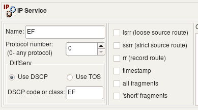

   Table 5.4. IP Service object examples: EF, tos 0x10, all_fragments, lsrr

Object *EF* has DSCP matching turned on, matching traffic class *EF*. Object *TOS 0x10* matches packets with TOS bits set to 0x10 (low delay). Object *all_fragments* has flag "all fragments" turned on, and finally object *lsrr* matches "loose source routing" option. Here is what we get for iptables when we use these objects in policy rules:

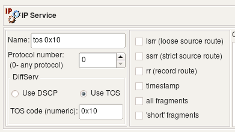

   Figure 5.98. IP Service objects in policy rules

.. code-block:: bash

   # Rule 0 (global)
   #
   $IPTABLES -N RULE_0
   $IPTABLES -A FORWARD -p all  -f    -j RULE_0
   $IPTABLES -A FORWARD -p all  -m ipv4options  --lsrr  -j RULE_0
   $IPTABLES -A RULE_0  -j LOG  --log-level info --log-prefix "RULE 0 -- DENY "
   $IPTABLES -A RULE_0  -j DROP
   #
   # Rule 1 (global)
   #
   $IPTABLES -A FORWARD  -o + -p all  -m dscp --dscp-class EF  -m state \
   --state NEW  -j ACCEPT
   $IPTABLES -A FORWARD  -o + -p all  -m tos --tos 0x10  -m state --state NEW \
   -j ACCEPT

The compiler for iptables uses the *ipv4options* module to match *lsrr*, the *-f* command line option to match all fragments, the *tos* module to match TOS and the *dscp* module to match DSCP class.

When compiled for IPv6, these rules yield the following iptables commands:

.. code-block:: bash

   # Rule 0 (global)
   #
   $IP6TABLES -N RULE_0
   $IP6TABLES -A FORWARD  -m frag --fragmore  -j RULE_0
   $IP6TABLES -A RULE_0  -j LOG  --log-level info --log-prefix "RULE 0 -- DENY "
   $IP6TABLES -A RULE_0  -j DROP
   #
   # Rule 1 (global)
   #
   $IP6TABLES -A FORWARD  -o +  -m dscp --dscp-class EF  -m state --state NEW  -j ACCEPT
   $IP6TABLES -A FORWARD  -o +  -m tos --tos 0x10  -m state --state NEW  -j ACCEPT

*ip6tables* does not have the *-f* command line flag; instead, it uses the *frag* module to match fragments. Firewall Builder currently does not support the ip6tables *ipv6header* module, and source routing options do not exist in IPv6, so object "lsrr" cannot be used in rules.

PF cannot match DSCP bits and source routing options, but it can match TOS. Trying the same IP Service object "tos 0x10" in policy rules for PF:

.. figure:: img/obj-ip-service-pf-rule.png
   :alt: IP Service PF rule

   Figure 5.99. IP Service object "tos 0x10" in PF rule

.. code-block:: none

   pass out  quick inet  from any  to (eth0)  tos 0x10 keep state

Cisco IOS access lists cannot match source route options but can match fragments and TOS and DSCP bits. Here is what we get if we try to compile the same rules using the same IP service objects for Cisco IOS:

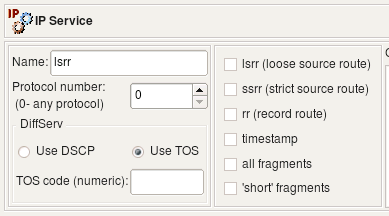

   Figure 5.100. IP Service objects in Cisco IOS rules

.. code-block:: none

   ip access-list extended e1_0_out
   !
   ! Rule  0 (global)
   !
     deny   ip any  any  log fragments
   !
   ! Rule  1 (global)
   !
     permit ip any  any  tos 0x10
     permit ip any  any  dscp EF
   exit

ICMP and ICMP6 Service Objects
~~~~~~~~~~~~~~~~~~~~~~~~~~~~~~

The ICMP service object is a generalized representation of the ICMP protocol. ICMP packets are often used to communicate error messages that are acted upon by either the IP layer or higher-layer protocols (TCP or UDP). ICMP can also be used as a simple query protocol.

Firewall Builder has service objects for both IPv4 and IPv6. ICMP service objects for IPv6 are called ICMP6 service. The standard ICMP service objects that come with Firewall Builder appear in the *Standard Objects* library, in the *Services/ICMP* branch. User-defined ICMP and ICMP6 service objects appear in the library *User* in the same *Services/ICMP* branch.

Standard service objects are not editable. However, you can copy and paste a copy of a service object into the User tree and edit it there, or you can right-click the ICMP folder in the User tree and select New ICMP Service to create a service object from scratch.

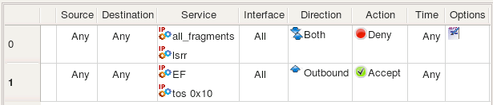

   Figure 5.101. ICMP and ICMP6 Service Objects in the Standard Library

As a firewall administrator, you need to understand the nature and purpose of ICMP in order to properly configure the firewall to block unwanted ICMP messages while permitting useful ones.

ICMP packets have two header fields that distinguish particular ICMP messages: the type and code fields. There are many different types and classes of ICMP messages. See http://www.iana.org/assignments/icmp-parameters for IPv4 types and classes and http://www.iana.org/assignments/icmpv6-parameters for IPv6 types and classes.

Any combination of the *type* and *code* values is allowed in the ICMP or ICMP6 object. For example, the following two screen shots illustrate definitions of ICMP and ICMP6 objects for the request packet of the well-known ping protocol. The type codes are different for IPv4 and IPv6 variants, although the code is equal to 0 in both:

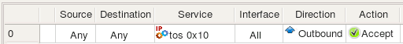

   Figure 5.102. ICMP Service: ping request (type 8, code 0)

.. figure:: img/obj-icmp6-ping-request.png
   :alt: ICMP6 ping request

   Figure 5.103. ICMP6 Service: ipv6 ping request (type 128, code 0)

Both ICMP and ICMP6 allow value "any" in type or code fields. For example, this can be used to build an object to match a family of ICMP messages with the same type but any code:

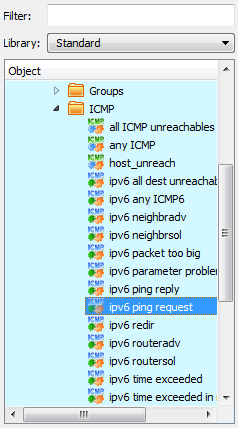

   Figure 5.104. ICMP Service: all ICMP unreachables (type 3, code any)

Both IPv4 and IPv6 ICMP service dialogs provide the following controls:

* **Name:** This is the name of the object.

* **ICMP Type and Code:**

  * **Type:** The ICMP message type. This control consists of a numeric selector that lets you specify the message type. To specify "any" type, set the control to any.

  * **Code:** The ICMP message code. This control consists of a numeric selector that lets you specify the message code. To specify "any" code, set the control to any.

* **Comment:** This is a free-style text field used for comments.

Using ICMP and ICMP6 Service Objects in Rules
^^^^^^^^^^^^^^^^^^^^^^^^^^^^^^^^^^^^^^^^^^^^^^

Consider the following rule where we use two ICMP objects, one for IPv4 and another for IPv6:

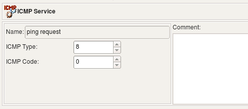

   Figure 5.105. ICMP and ICMP6 objects used in a rule

If the rule set this rule belongs to is configured as combined IPv4 and IPv6, then policy compiler will pick the ICMP service that matches address family on each separate pass, one for IPv4 and then for IPv6. Here is what we get for iptables:

.. code-block:: bash

   # --------------- IPv4

   # Rule 0 (global)
   #
   $IPTABLES -A FORWARD  -i + -p icmp  -m icmp  --icmp-type 8/0 \
       -m state --state NEW  -j ACCEPT

   # --------------- IPv6

   # Rule 0 (global)
   #
   $IP6TABLES -A FORWARD  -i + -p ipv6-icmp  -m icmp6 --icmpv6-type 128/0 \
       -m state --state NEW  -j ACCEPT

Here is generated PF 4.x configuration:

.. code-block:: none

   # Rule  0 (global)
   #
   pass in   quick inet proto icmp  from any  to any icmp-type 8 code 0

   # Rule  0 (global)
   #
   pass in   quick inet6 proto icmp6  from any  to any

TCP Service
~~~~~~~~~~~

The TCP service object is a generalization of the TCP protocol, which provides a connection-oriented reliable byte-stream service. Many well-known, frequently-used application protocols use the TCP protocol: FTP (File Transfer Protocol), SMTP (Simple Mail Transfer Protocol), HTTP (Hyper Text Transfer Protocol), and so on. The TCP header contains special fields indicating source and destination port numbers that are used to identify the sending and receiving application. These two values, along with the source and destination IP addresses in the IP header, uniquely identify each connection.

Since port numbers are used to distinguish applications using the data stream provided by the TCP protocol, each application should use a unique port number. To ensure interoperability, these numbers must be assigned by a central authority in a coordinated manner. Internet Assigned Numbers Authority (IANA) does just that. Assigned TCP and UDP port numbers can be looked up at http://www.iana.org/assignments/port-numbers. Most Unix systems also come with a /etc/services file that contains a list of assigned port numbers.

Firewall Builder comes with a collection of predefined TCP Service objects with port numbers already configured. You can simply use these objects in your policy rules, so you do not have to look up port numbers every time you need them. These objects are part of the *Standard Objects* library and are located in the *Services / TCP* branch.

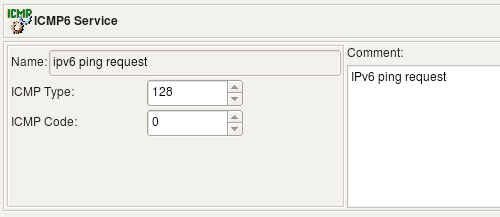

   Figure 5.106. TCP Service objects in the Standard Library

The typical TCP Service object is represented in the following screenshot:

.. figure:: img/obj-tcp-service-http.png
   :alt: TCP Service smtp

   Figure 5.107. TCP Service object: smtp (destination port 25)

In Firewall Builder, the TCP service object is a generalization of TCP protocol. The TCP header of a packet carries only one fixed value for the source port and one fixed value for the destination port. The TCP Service object allows a range of values to be used for the source and destination ports. This allows a single TCP Service object to describe either a family of protocols using consecutive port numbers, or a protocol that may use variable port numbers or simply many protocols that use port numbers from a certain range. For example, on Unix systems, TCP sessions opened by a privileged process always have their source port number assigned from a range below 1024, while unprivileged processes use source port numbers from a range starting from 1024 and above. The TCP Service object with a source port range defined as shown in the following screenshot describes all privileged TCP sessions.

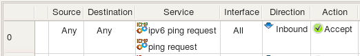

   Figure 5.108. TCP Service: privileged TCP (source port 0-1023)

Using "0" as both start and end values for a range means "any value" for that range. The source port range of the "privileged TCP" object starts from 0 and ends at 1023 (port ranges are inclusive in Firewall Builder), while its destination port range's start and end are both set to zero, which means "any destination port". This object describes any TCP protocol with a source port in range 0-1023 and any destination port.

If all you need is to create an object to describe the TCP protocol with a particular destination port, just use the same port number for both the start and end of a destination port range (which effectively creates a range that consists of a single value).

The TCP header also contains a collection of one-bit fields, or flags, that carry a variety of control information. For example, the SYN and ACK flags are used for connection establishment and the FIN flag is used for connection termination. Certain combinations of flags are not allowed during the normal protocol operation and may cause unpredicted reactions in some systems; because of this, the firewall administrator may want to block TCP packets with an unwanted combination of flags.

There are six flags in the TCP header. We just briefly mention them here; more information can be found in TCP/IP Illustrated, vol 1 by W. Richard Stevens, chapter 17.

.. table:: TCP Flags

   ==========  ================================================================
   Flag        Description
   ==========  ================================================================
   U (URG)     The "urgent" pointer is valid
   A (ACK)     The acknowledgment number is valid
   P (PSH)     The receiver should pass this data to the application as soon as possible
   R (RST)     Reset the connection
   S (SYN)     Synchronize sequence numbers to initiate a connection.
   F (FIN)     The sender is finished sending data.
   ==========  ================================================================

"Established" is not a TCP flag. Instead, checking this box causes the firewall to match any packet in an established session. Checking this checkbox disables the other TCP flag controls.

Firewall Builder supports all six flags, although not all target firewall platforms can match all combinations of TCP flags or any flags at all. For example, iptables, pf, ipfilter and ipfw can match flags and their combinations, but Cisco PIX cannot.

Usually the firewall cannot only match a combination of flags, but can also examine only a given subset of TCP flags. Firewall Builder provides two sets of checkboxes for TCP flags and flag masks (see screenshot below). Checkboxes in the first row control TCP flags that we want the firewall to examine and checkboxes in the second row tell it whether they should be set or cleared. Only flags whose checkboxes in the first row are set will be looked at by the firewall. (If you check a box in the bottom row while leaving the checkbox above it unchecked, the flag will be ignored.)

The object in the screenshot matches a TCP packet with any combination of port numbers, the TCP flag SYN set, and all other flags cleared. The firewall will examine all TCP flags.

   Figure 5.109. TCP Service: tcp-syn (SYN flag set, all others examined)

A combination of flags and a mask can be used in a rule that looks for some flags to be set or unset and ignores other ones, regardless of their state. For example, we can create a rule that detects a so-called "null scan" which is done using TCP packets with all flags cleared. For this rule, we create a TCP service object "tcp null scan" where all flag masks are set but all TCP flags are cleared. This means we examine all flags but only match them if they are all cleared. This object is represented in the following screenshot:

   Figure 5.110. TCP Service: tcp null scan (all masks set, all flags cleared)

TCP Service dialog provides the following controls:

* **Name:** This is the name of the object

* **Source port range:** These two controls define the start and end of the source port range. They accept values 0 through 65535.

* **Destination port range:** These two controls define the start and end of the destination port range. They accept values 0 through 65535.

* **TCP Flags:** TCP flags and masks, see above. The Established checkbox causes the firewall to match packets in established sessions. Selecting this checkbox disables the other TCP flag controls.

* **Comments:** This is a free-style text field used for comments.

Using TCP Service in rules
^^^^^^^^^^^^^^^^^^^^^^^^^^

Single destination TCP port
'''''''''''''''''''''''''''

Let's start with an example using simple TCP service that describes the HTTP protocol. Both the beginning and the end of the source port range in this service object are set to "0," which means the program will leave these out when it generates target firewall configuration. The destination port range is defined as "80-80" which means the object describes just single destination tcp port "80". All flag checkboxes are unchecked, which means no flag-matching configuration will be generated.

.. figure:: img/obj-tcp-service-http.png
   :alt: TCP Service http

   Figure 5.111. TCP Service: http (destination port 80)

Now we put this object in the "Service" element of a rule as shown on the next screenshot. To make this trivial example just a little bit more interesting, we configured the policy rule set as "Combined IPv4 and IPv6" and put two address objects in destination, one is IPv4 address and another is IPv6 address.

   Figure 5.112. Rule using TCP Service object "http"

This rule compiles into the following for iptables:

.. code-block:: bash

   # --------------- IPv4

   # Rule 0 (global)
   #
   $IPTABLES -A FORWARD -p tcp -m tcp  -d 70.85.175.170 \
        --dport 80  -m state --state NEW  -j ACCEPT

   # --------------- IPv4

   # Rule 0 (global)
   #
   $IP6TABLES -A FORWARD -p tcp -m tcp  -d 2001:470:1f0e:162::2 \
        --dport 80  -m state --state NEW  -j ACCEPT

And for PF we get the following. Note that PF version was set to "any" or "3.x", this is why "keep state" was added. "Keep state" is default for PF 4.x and if version was configured as "4.x" in this firewall object, policy compiler would have dropped "keep state" from the generated configuration.

.. code-block:: none

   # Rule  0 (global)
   #
   pass in   quick inet proto tcp  from any  to 70.85.175.170 port 80 keep state
   pass out  quick inet proto tcp  from any  to 70.85.175.170 port 80 keep state

   # Rule  0 (global)
   #
   pass in   quick inet6 proto tcp  from any  to 2001:470:1f0e:162::2 port 80 keep state
   pass out  quick inet6 proto tcp  from any  to 2001:470:1f0e:162::2 port 80 keep state

Source port range
'''''''''''''''''

In the next example, we look at the TCP service object that defines a specific source port range to match source ports greater than or equal to 1024:

   Figure 5.113. TCP Service: src ports >= 1024

Using this object in a rule as follows:

   Figure 5.114. Rule using TCP Service with source port range

To make the rule slightly more realistic, we made it stateless using its options dialog (double-click in the column "Options" of this rule and check checkbox "Stateless" in the first tab of the dialog). Let's see what the program generates when this rule is compiled for iptables:

.. code-block:: bash

   # Rule 0 (global)
   #
   $IPTABLES -A FORWARD  -i + -p tcp -m tcp  --sport 1024:65535  -j ACCEPT

Here is what is generated for PF 3.x:

.. code-block:: none

   # Rule  0 (global)
   #
   pass in   quick inet proto tcp  from any port >= 1024  to any

And for PF 4.x we get "no state" because the rule is stateless and state matching is the default in PF 4.x:

.. code-block:: none

   pass in   quick inet proto tcp  from any port >= 1024  to any no state

Cisco IOS access list statement looks like this:

.. code-block:: none

   ip access-list extended e1_1_in
   !
   ! Rule  0 (global)
   !
     permit tcp any  gt 1024 any
   exit

Established
'''''''''''

Some of the supported firewalls understand special flag "established" intended to match reply packets of the TCP session. Stateless systems, such as Cisco IOS extended access lists, match combination of tcp flags where flag "ACK" is set but flag "SYN" is cleared when this keyword is used in the acl rule. Stateful firewalls such as iptables or PF offer much better way to track and match reply packets because they can follow the states a tcp session goes through when it is opened, data transferred and finally session is closed. Firewall Builder provides an option of using flag "established" but supports it only for those firewall platforms where there is no better alternative. An attempt to use a TCP service object with this flag set in rules for a firewall that supports stateful inspection causes an error.

Here is an example of the TCP service object with flag "Established" set and source port range "80-80", that is, this object describes TCP packets coming from the web server operating on the standard port 80 back to the client.

.. figure:: img/obj-tcp-service-established.png
   :alt: TCP Service http established

   Figure 5.115. TCP Service: http established (source port 80, Established flag)

Using this object in a rule:

.. figure:: img/obj-tcp-service-established.png
   :alt: TCP established rule

   Figure 5.116. Rule using TCP Service with Established flag

Here is the access list generated for Cisco IOS:

.. code-block:: none

   ip access-list extended e1_0_in
   !
   ! Rule  0 (global)
   !
     permit tcp any  eq 80 any  established
   !

Here we have source port specification "eq 80" and keyword "established".

Attempt to compile this rule for iptables or PF causes an error:

.. code-block:: none

   Error (pf): TCPService object with option "established" is not supported
      by firewall platform "pf". Use stateful rule instead.

UDP Service
~~~~~~~~~~~

The UDP service object is a generalization of the UDP protocol, which is a connectionless transport layer protocol. Many well-known applications use UDP as their transport, such as DNS (Domain Name System), DHCP (Dynamic Host Configuration Protocol), NTP (Network Time Protocol), and SNMP (Simple Network Management Protocol).

As in TCP, UDP uses port numbers to distinguish applications from one another. The UDP packet header carries two port numbers: the source port and the destination port. The UDP service object in Firewall Builder allows for a definition of ranges for both the source and the destination ports. The meaning of values assigned to the start and end of the range is the same as in the TCP service object: ranges are inclusive, that is, both start and end ports of the range are included. Using "0" for both the start and end of the range means "any port". These rules work for both the source and destination ranges. The following screenshot shows the "dns" UDP Service object that represents the Domain Name System protocol, which uses destination port 53.

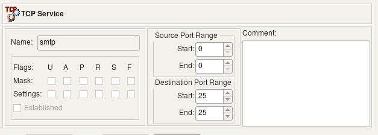

   Figure 5.117. UDP Service: domain (destination port 53)

Objects in the Standard set of service objects are not editable. However, you can copy and paste a copy of a service object into the User tree and edit it there, or you can right-click the ICMP folder in the User tree and select New ICMP Service to create a service object from scratch.

The UDP Service dialog provides the following controls:

* **Name:** This is the name of the object

* **The Source port range:** These two controls define the start and the end of the source port range. They accept values 0 through 65535.

* **The Destination port range:** These two controls define the start and the end of the destination port range. They accept values 0 through 65535.

* **Comments:** This is a free-style text field used for comments.

Using UDP Service in Rules
^^^^^^^^^^^^^^^^^^^^^^^^^^

Single Destination UDP port
'''''''''''''''''''''''''''

In this example we'll use the UDP service object "domain" shown on screenshot above. The rule looks like this:

.. figure:: img/obj-udp-service-in-rule.png
   :alt: UDP in rule

   Figure 5.118. Rule using UDP Service object "domain"

Here is iptables command generated for this rule:

.. code-block:: bash

   # Rule 0 (global)
   #
   $IPTABLES -A FORWARD  -i + -p udp -m udp  --dport 53  -m state --state NEW  -j ACCEPT

This rule got a *"-i +"* clause because direction was set to *Inbound* but *"Interface"* column was left empty. To enforce inbound direction compiler uses "-i" option but since interface was not specified, the rule got attached to all interfaces which is defined by the +.

Here is the generated PF 4.x configuration:

.. code-block:: none

   # Rule  0 (global)
   #
   pass in   quick inet proto udp  from any  to any port 53

In the pf configuration, direction is defined by the *"in"* keyword, and since no interface was requested, there is no *"on <interface>"*.

The generated Cisco access list statement is quite trivial:

.. code-block:: none

   ip access-list extended fe0_0_in
   !
   ! Rule  0 (global)
   !
     permit udp any  any  eq 53
   !
   exit

Source Port Range
'''''''''''''''''

The following UDP service object defines source port range of the ports with values greater than or equal to 1024:

.. figure:: img/obj-udp-source-port-dialog.png
   :alt: UDP source port dialog

   Figure 5.119. UDP Service: src ports >= 1024

Using this object in policy rule yields the following code for iptables:

.. code-block:: bash

   # Rule 0 (global)
   #
   $IPTABLES -A FORWARD  -i + -p udp -m udp  --sport 1024:65535  -m state \
   --state NEW  -j ACCEPT

And for PF:

.. code-block:: none

   # Rule  0 (global)
   #
   #
   pass in   quick inet proto udp  from any port >= 1024  to any

The Cisco access list statement:

.. code-block:: none

   ip access-list extended e1_0_in
   !
   ! Rule  0 (global)
   !
     permit udp any  gt 1024 any
   !
   exit

User Service
~~~~~~~~~~~~

User service object matches the owner of the process on the firewall that send the packet. It translates to the "owner" match in iptables and "user" parameter for PF.

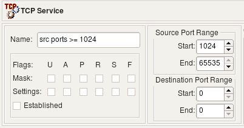

   Figure 5.120. User Service Dialog

* **Name:** This is the name of the object

* **User id:** The user ID of the user account on the firewall device that the firewall should use to match packets.

* **Comments:** This is a free-style text field used for comments.

The user service object has only one parameter besides the name and comment: it is the user ID that the firewall should use to match packets.

The user service object is only supported for iptables and PF.

Let's look at how the simple rule shown in Figure 5.121 compiles for iptables and PF.

.. figure:: img/obj-user-service-rule.png
   :alt: User Service Rule Example

   Figure 5.121. User Service Rule Example

The firewall can associate a packet with a user only if the packet originated on the firewall. Packets that transit the firewall have no information about the user who owned the process that created these packets and sent them out because this process ran on an entirely different computer. For this reason, the object in the Source column must be the firewall.

**Figure 5.122. User Service, iptables Compile Output**

.. code-block:: bash

   # Rule 0 (global)
   #
   $IPTABLES -A OUTPUT -m owner --uid-owner 500  -j DROP

The user service translated into the *owner* match for iptables. See the iptables man page for a more detailed explanation of this match.

**Figure 5.123. User Service, PF Compile Output**

.. code-block:: none

   # Tables: (1)
   table  { en0 , 192.168.1.1 }

   # Rule  0 (global)
   #
   #
   block out  quick inet  from   to any user 500

Here the table *tbl.r0.s* was created to hold IP addresses that belong to the firewall. The rule matches source addresses and also the user ID of the owner using the "user" clause.

The user service object is actually one of the simplest service object types in Firewall Builder, but it provides the facility for a basic per-user control on Linux and BSD machines. This service object can be used in rules with actions that reroute packets ("Route" action) or in the NAT rules; for example, to redirect web access via proxy.

Custom Service
~~~~~~~~~~~~~~

The custom service object can be used to inject arbitrary code into the generated firewall script. Any combination of options allowed in the target firewall command line language that does not fit into a strict model of standard service object types can be expressed using the custom service object. For example, iptables comes with a collection of modules that adds an ability to match complex combinations of packet parameters or header fields that are not supported by a standard code. One of the modules adds the ability to match any string in the packet's payload which can be quite useful to quickly build firewall rule to block some new protocol that uses non-specific combination of ports and other parameters. This ability is sometimes used to write rules to block network trojans or viruses with known signatures.

The following screenshot represents a custom service object that uses the capabilities of the *string* module. Command-line options specific for this module are in the "Code String" field.

.. note::

   The code specified in the custom service object is used literally; no validation is done either by the Firewall Builder GUI or the policy compilers.

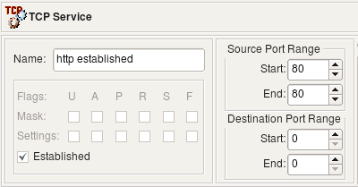

   Figure 5.124. Custom Service: string module

The Custom Service dialog provides the following controls:

* **Name:** This is the name of the object.

* **Platform:** This is a pull-down menu that shows a list of all firewall platform targets available in Firewall Builder.

* **Code String:** This is a line of code in the target firewall language. (This is the heart of the custom service object.)

* **Protocol Name:** Use this option if you want to restrict the custom service object to a particular protocol: TCP, UDP, or ICMP. Default is "any". For example, if this field is set to "tcp", then policy compiler for iptables generates command with parameter "-p tcp" and then inserts code defined in the "Code String" field of the custom service object.

* **Address Family:** Specify IPv4 or IPv6. Policy compilers use information about address family to properly use the object while compiling IPv4 or IPv6 rule sets.

* **Comments:** This is a free-style text field used for comments.

Using Custom Service Object in Rules
^^^^^^^^^^^^^^^^^^^^^^^^^^^^^^^^^^^^^

The following example uses iptables module "recent". Quoting from the iptables manual, this module "allows you to dynamically create a list of IP addresses and then match against that list in a few different ways". We can use this module to throttle brute-force ssh scanning attacks where an attacker repeatedly connects to the ssh daemon trying to guess login name and password. The full explanation of how to use the custom service object in combination with *swatch* script on Linux to stop these attacks can be found in the Firewall Builder Cookbook (Chapter 14). Here we focus only on the Custom Service object and iptables rules that can be obtained with it.

.. figure:: img/obj-custom-service-ssh-throttling.png
   :alt: Custom Service ssh with throttling

   Figure 5.125. Custom Service: ssh with throttling

The code string defined in this object is "--dport 22 -m recent --set". This matches port 22 (ssh), activates the module and adds source address of the packet to the default list maintained by the module.

The second custom service object also matches port 22 and checks if the address is already on the list and was seen during the past one minute twice:

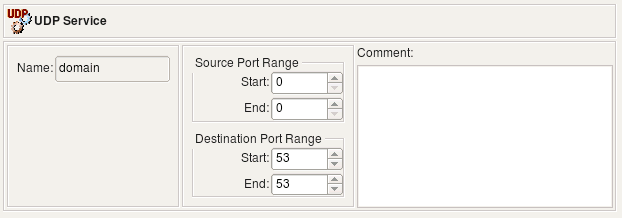

   Figure 5.126. Custom Service: ssh throttled to 2 per min

Note that our goal is to match protocol SSH (tcp port 22) and at the same time activate iptables module "recent" and add some parameters for it. Both are done by means of a service object in Firewall Builder; however placing two service objects in the "Service" field of a rule joins them by a logical OR operation. That is, if we were to put TCP service object "ssh" and custom service object that defines parameter for module "recent" in the "Service" field of the same rule, we would end up with two iptables commands, one matching tcp port 22 and another trying to use module "recent". Since we need to match both in the same rule, we have to add "--dport 22" to the code defined in the custom service object.

Now, the rules using these objects:

   Figure 5.127. Rules using Custom Service objects for SSH throttling

Here are the iptables commands generated for these two rules:

.. code-block:: bash

   # Rule 0 (global)
   #
   $IPTABLES -N In_RULE_0
   $IPTABLES -A INPUT  -i + -p tcp -m tcp   --dport 22 \
       -m recent --rcheck --seconds 60 --hitcount 2  -j In_RULE_0
   $IPTABLES -A In_RULE_0   -j LOG  --log-level info --log-prefix "RULE 0 -- DENY "
   $IPTABLES -A In_RULE_0   -j DROP
   #
   # Rule 1 (global)
   #
   $IPTABLES -A INPUT  -i + -p tcp -m tcp  --dport 22 -m recent --set \
        -m state --state NEW  -j ACCEPT
   #

First, we match port 22 and check if we have seen this source address during the past minute at least 2 times. If yes, module "recent" returns a match and the packet matches the first iptables rule. Iptables passes control to the rules in chain "In_RULE_0" where the packet is logged and dropped. If the packet does not match the conditions set for the module "recent", it does not match the first iptables rule and will be inspected by the next one (generated for the original rule #1). If this is the opening packet of a new session, it matches state "NEW" and will be permitted. Since module "recent" was also called in this rule, the source address of the packet was added to the internal table of the module "recent" so it can be used in the previous iptables rule.

The custom service object allows you to inject arbitrary strings into the generated firewall configuration in the place where port matching normally occurs. Another feature in Firewall Builder that also allows for insertion of a code in the generated code is the custom action feature. The combination of custom service with custom action provides for a very flexible system where you can compose pretty much any required configuration line if it is not otherwise supported by the standard means. Suppose instead of just dropping SSH scan connections coming to our system, we want to slow them down, thus tying up the attacker's resources. Iptables has a target just for that called TARPIT. This target is specific for iptables and does not exist on the other firewalls supported by Firewall Builder and there is no standard action for it. You can use the custom action mechanism to generate an iptables command with this target. In the rule, the action in it is set to "Custom Action". Double-clicking the action in the rule opens a dialog with its parameters (if any). The custom action object has one parameter: a free-form string where you enter the code you want to appear in the generated command:

.. figure:: img/obj-custom-service-tarpit.png
   :alt: Custom Service TARPIT action

   Figure 5.128. Using Custom Action with TARPIT target

Here is what we now get when we compile this policy for iptables:

.. code-block:: bash

   #
   # Rule 0 (global)
   #
   $IPTABLES -N In_RULE_0
   $IPTABLES -A INPUT  -i + -p tcp -m tcp   --dport 22 \
       -m recent --rcheck --seconds 60 --hitcount 2  -j In_RULE_0
   $IPTABLES -A In_RULE_0   -j LOG  --log-level info --log-prefix "RULE 0 -- CUSTOM "
   $IPTABLES -A In_RULE_0 -j TARPIT
   #
   # Rule 1 (global)
   #
   $IPTABLES -A INPUT  -i + -p tcp -m tcp  --dport 22 -m recent --set \
        -m state --state NEW  -j ACCEPT
   #

Now the first rule ends up sending the packet to the "TARPIT" target rather than to "DROP", which is what we wanted.

Time Interval Objects
---------------------

Time interval objects allow you to create a rule that only matches during certain periods of time, such as on weekend days, during work hours, or other periods. Time intervals operate based on the time as known *by the firewall device*.

   Figure 5.129. Time Interval Dialog

Time intervals can be certain days of the week (only on Mondays, for example), only certain times, and/or only during a certain range of dates. You can combine these options to create an object that represents, for example, Tuesday afternoons from 1 to 3 PM during March of 2011.

* **Name:** This is the name of the object.

* **Start date checkbox:** Indicates that the time interval has a starting date. If this is not checked, the Start date field is inaccessible and is not included in the object.

* **Start date:** Indicates the day the time interval will start.

* **Start time:** Indicates the beginning of the daily interval. Only applies to days after Start date (if specified) and before End date (if specified) and on indicated days of the week. For example, if Sunday is not checked, then the time interval does not apply on Sundays.

* **End date checkbox:** Indicates that the time interval has an ending date. If this is not checked, the End date field is inaccessible and is not included in the object.

* **End date:** Indicates the day the time interval will end.

* **End time:** Indicates the end of the daily interval. Only applies to days after Start date (if specified) and before End date (if specified) and on indicated days of the week. For example, if Sunday is not checked, then the time interval does not apply on Sundays.

* **Mon, Tue, Wed, Thu, Fri, Sat, Sun:** Indicates on which days of the week the time interval should be applicable. For example, if Mon is checked and Tue is not, then the time interval object will apply to Mondays, but not Tuesdays.

* **Comments:** This is a free-style text field used for comments.

In Figure 5.129, the object would be valid from the beginning of Dec. 19, 2009 and end the beginning of Jan. 4, 2010. This might correspond, for example, to a "winter break" at some institution when access to some networks could be restricted.

Another possibility is to limit recreational activities to non-work hours.

.. figure:: img/obj-time-interval-rule.png
   :alt: Time Interval Rule Example

   Figure 5.130. Time Interval Rule Example

In this rule, the "quake" protocol is allowed from the internal network after hours and during weekends. Otherwise, the final "deny all" rule in the rule set would prevent it during other times (during work hours).

Object Keywords
---------------

Keywords can be added to all object types and help you quickly find and organize the objects in your object tree. To set the keywords for an individual object open the object for editing and then click on the Keywords button in the lower right corner of the Editor panel.

For an example of how you could use Keywords, let's assume that you have two datacenters, one in New York (NY) and one in London (LON). For objects that represent items in the datacenter you could add a keyword, called "datacenter", to each of the objects. You could also add another keyword, for example "trusted" or "DMZ", to identify the security zone of the object.

Figure 5.131 shows the editor panel for an object called NY Datacenter-Net-1.

   Figure 5.131. Datacenter Network Object

Click the Keywords button to set the keywords for the active object. This will bring up the dialog window shown in Figure 5.132.

.. figure:: img/obj-keywords-dialog-empty.png
   :alt: Keywords Dialog

   Figure 5.132. Keywords Dialog

As you can see no Keywords have been configured yet, so there are no existing keywords that can be assigned to the object. To create a new keyword type the name of the keyword in the text box labeled "New Keyword:".

In this example we want to add the "datacenter" and "trusted" keywords to the network object. Figure 5.133 shows the dialog after the keywords have been entered. Click OK to apply the keywords to the object.

   Figure 5.133. Keywords Dialog After Creating Some Keywords

.. note::

   After you apply keywords to an object the keywords will be displayed in the Editor panel next to the Keywords button.

What if you have a lot of objects that need to have the same keywords applied? To apply a keyword to multiple objects at the same time select the objects in the tree, remember to use the CTRL or Shift keys to select more than one object, right-click on the selected objects and select Keywords, then Add and then select the keyword you want to apply. Figure 5.134 shows applying the "datacenter" keyword to multiple Network objects.

   Figure 5.134. Applying Keywords to Multiple Objects at Once

You can also remove keywords from multiple objects by selecting multiple objects, right-clicking and selecting Keywords -> Remove and then selecting the keyword that you want to remove.

After you have configured keywords for your objects you can type the keyword into the filter box at the top of the object tree and only the objects that match that keyword, or have an object name that matches the keyword, will be displayed.

Figure 5.135 shows the filtered view after the "datacenter" keyword has been typed into the filter box.

.. figure:: img/obj-keywords-filter-datacenter.png
   :alt: Filtering Based on Keyword - datacenter

   Figure 5.135. Filtering Based on Keyword - datacenter

Another example is shown in Figure 5.136 where all the objects are being filtered for the "trusted" keyword. Only objects that have had the "trusted" keyword applied will be displayed. In this example only one of the two networks at each datacenter is considered trusted.

   Figure 5.136. Filtering Based on Keyword - trusted

Creating and Using a User-Defined Library of Objects
-----------------------------------------------------

The User library that comes with Firewall Builder is all you need if you are the only person administering firewalls in your enterprise. If you have several administrators, however, each with a different workstation, then you may want to create a user library that you can distribute. That way, user-defined objects can be created once, by one person.

Let's create and distribute a simple user-defined library. Start by selecting the New Object/New Library option from the Object menu.

The library pull-down menu switches to New Library. This library is empty by default except for the standard folders.

.. figure:: img/obj-new-user-library.png
   :alt: A New, Empty User-Defined Library

   Figure 5.137. A New, Empty User-Defined Library

Click the New Library icon to bring up the library dialog.

   Figure 5.138. Library Dialog

The Library dialog has three controls: Name, Color, and Comments. Enter a new name for the library in the Name field. (Here we are calling it ACME Library.) If you want, you can also specify a color for the library. This helps you easily distinguish one library from another when you are working. In this case, we have set the color to a shade of blue.

   Figure 5.139. ACME Library with Blue Background

Use the normal object creation procedures to create objects in the library. Here we have created two Address objects that represent web servers, a host object with two interfaces that matches an email server and a network object to match the local LAN.

   Figure 5.140. Library with User-Created Objects

Click File/Save to save the object file.

To export the library to a file, select File/Export Library. The following dialog appears:

   Figure 5.141. Export Your Library

If you want to make the library read-only, leave the Make exported libraries read-only checked. Otherwise, uncheck it.

Click OK.

A file system Save dialog appears. Here you can specify a name and location for the file. Be sure the file has a *.fwl* file extension.

.. figure:: img/obj-save-dialog-box.png
   :alt: Save Dialog Box

   Figure 5.142. Save Dialog Box

You can now move or e-mail the library to someone else.

To load a library, copy the file to the directory where you have Firewall Builder store your object files. Then, select Import Library from the Firewall Builder File menu. (You may have to restart Firewall Builder to get it to locate the file. Until then, the "Import Library" option may be grayed out.)

You can now use this library like any other library. Keep in mind that changes to one copy of the user-defined library has no effect on other copies. To propagate changes, you have to redistribute the library.

Finding and Replacing Objects
-----------------------------

Imagine you have an access policy that looks something like this:

   Figure 5.143. Policy Before the Find/Replace

Further, imagine that you are reassigning all the IP addresses in 192.168.2.0/24 to be in the 192.168.3.0/24 subnet and that you need to modify the firewall rules to match.

One way to handle this is to manually browse through every rule in your firewall, removing the .2.0 addresses where you find them and replacing them with the equivalent .3.0 addresses. Or, you could do a Find and Replace operation.

Select Find Object from the Object menu to open the Find and Replace dialog, shown here:

   Figure 5.144. Find/Replace Dialog

To replace every net-192.168.2.0 object with the net-192.168.3.0 object, first create the new network object. Then, drag (or Copy/Paste) a net-192.168.2.0 object into the Find object field and the net-192.168.3.0 object into the Replace object field. Then, set the Scope for search and replace pull-down menu to policy of the opened firewall, as shown here:

.. figure:: img/obj-find-replace-objects.png
   :alt: Objects to Find and Replace

   Figure 5.145. Objects to Find and Replace

Click Replace All to replace all instances.

   Figure 5.146. Policy with Objects Replaced

The Find object dialog has a number of controls you can use to constrain your searches:

* **Object parameter pull-down menu**

  Allows you to specify how you search for objects. You can search by name (usable on all objects), address (usable on all addressable objects), TCP/UDP port (usable on TCP and UDP objects), Protocol Number (usable on IP service objects) and ICMP type (usable on ICMP service objects).

* **Text field**

  The text field is populated automatically if you drag an object into the Find object field. Otherwise, you can type the text in manually.

* **Use regular expressions**

  Checking the Use regular expressions checkbox causes the text field to be interpreted as a Perl regular expression. You can only do searches based on a regular expression. You cannot do replaces based on a regular expression.

* **Search field**

  Drag an object into the field to find instances of that object.

* **Replace field**

  Drag an object into the field to use it as the replacement object in a search and replace.

* **Scope of search and replace**

  Allows you to specify whether a search or search and replace will cover just the object tree, the tree and the policies of all firewalls in the object file, just the policies in the object file, or just the current open policy.

* **Buttons**

  The Next button finds the next instance of the object. It does not do a replace. Replace All replaces all instances of the object in the given scope. Replace replaces the current instance. Replace & Find replaces the current instance and jumps to the next one.
