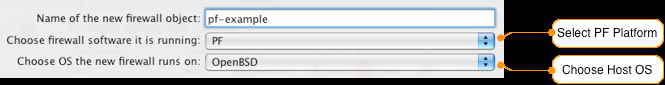
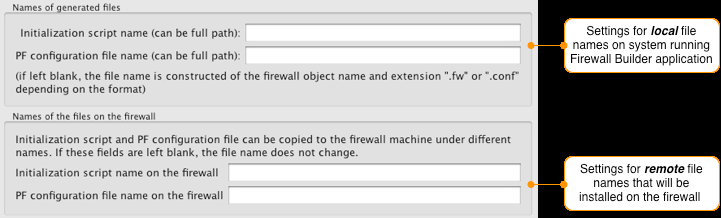
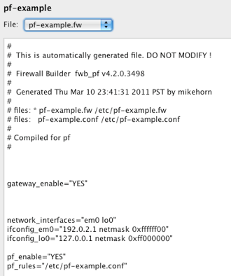

Integration with OS Running on the Firewall Machine
====================================================

.. sectnum::
   :start: 12

.. contents::
   :local:
   :depth: 3

Firewall Builder can generate a firewall script in the format tailored for a specific OS or for distributions running on the firewall. This helps integrate generated firewall configuration with startup scripts and other parts of the system-wide configuration of the OS running on the firewall. As of v4.0, Firewall Builder comes with this support for OpenWRT, DD-WRT, and Sveasoft firmwares for small firewall appliances (Linksys, DLink, and others), it also has experimental integration with IPCOP and derivatives. Integration with Secunet Wall firewall is provided and supported by Security Networks AG, Germany.

A script generated by Firewall Builder can have different format or even add or skip certain parts, depending on the chosen target firewall OS. You can switch from one OS to another using "Host OS" setting in the firewall object dialog.

Generic Linux OS
-----------------

A script generated by Firewall Builder for a generic Linux firewall has a standard structure per LSB ("Linux Standard Base Core Specification 3.1"). The script supports command-line arguments ``start``, ``stop``, ``status``, ``reload``. In addition to these, it also understands arguments ``interfaces`` and ``test_interfaces``. The script can be placed in the ``/etc/init.d/`` directory among other initialization scripts; however, at this time this is not the default. The script does not have standard "INIT INFO" header for the chkconfig (or similar) utility. Mostly, this is because different Linux distributions use slightly different format of this header and different utilities to manage start-up scripts and Firewall Builder does not yet allow the user to specify which Linux distribution is running on the firewall machine. This support may improve in the future.

See `How to make your firewall load your firewall policy on reboot`_ for the recommended methods of making the firewall script installed by Firewall Builder run at the system start-up.

The generated script is assembled from parts defined in configlets located in ``/usr/share/fwbuilder-4.0.0/configlets/linux24/script_skeleton``. You can modify it following instructions in :doc:`13 - Configlets`.

OpenWRT
--------

To use Firewall Builder with OpenWRT you need to install the following packages on the firewall, using the ``ipkg install package.ipk`` command:

- ``ip``
- ``ip6tables`` (if you need IPv6)
- ``iptables-mod-extra``
- ``iptables-utils``
- ``kmod-ipt-extra``

.. note::

   The firewall script generated by Firewall Builder for OpenWRT has a format that allows it to be placed directly in the ``/etc/init.d/`` directory among other OpenWRT startup scripts. Its default name, however, is different from the name of the OpenWRT standard firewall script (which is ``firewall``). The script generated by Firewall Builder has name ``firewall.fw`` by default so it does not overwrite the standard script ``firewall``. This is done as a precaution, since support for OpenWRT was only added in Firewall Builder v4.0 and we haven't accumulated enough experience with it. If you feel it works well and can be used as a replacement for the standard firewall script, just change the name of the script to ``firewall`` in the "Compiler" tab of the firewall settings dialog. Instructions in this section explain how to activate the script generated by Firewall Builder, assuming it has the default name ``firewall.fw``. This way, the standard script is still going to be present on the firewall and you can always switch back to it.

Firewall Builder uses name ``fwbuilder.fw`` for the generated script for OpenWRT and places it in directory ``/etc/init.d/`` on the firewall. To make the firewall run it during boot sequence, install the script using the built-in policy installer or copy it to this directory manually, then run the command:

.. code-block:: bash

   /etc/init.d/fwbuilder.fw enable

and disable the standard firewall script:

.. code-block:: bash

   /etc/init.d/firewall disable

To activate the firewall and load policy generated by Firewall Builder, use command:

.. code-block:: bash

   /etc/init.d/fwbuilder.fw start

To stop the firewall and block all traffic use the command:

.. code-block:: bash

   /etc/init.d/fwbuilder.fw stop

An option in the "Compiler" tab of the firewall object in Firewall Builder GUI allows you to make the firewall block all traffic when stopped but still permit ssh connections from preconfigured address of the management machine. This method works both on stable Kamikaze (v7.06) and the latest OpenWRT (v8.09 at the time of Firewall Builder v4.0 release).

In test mode Firewall Builder copies generated firewall script to directory ``/tmp`` on the firewall.

DD-WRT
-------

To use Firewall Builder with DD-WRT, configure the firewall object with host OS "DD-WRT (nvram)" or "DD-WRT (jffs)". These two settings define the activation method used by the built-in policy installer, it can either store generated script in nvram or in jffs (journaling flash file system).

DD-WRT (nvram)
~~~~~~~~~~~~~~~

In this mode generated script is shorter and does not support command-line arguments ``start``, ``stop``, ``status``. The script does not try to load iptables modules on the firewall but configures interface addresses, vlans, bridge ports and bonding interfaces. When you set host OS of the firewall object to "DD-WRT (nvram)", built-in policy installer saves the script in nvram variable ``fwb`` and configures nvram variable ``rc_firewall`` to run this script.

Generated script is assembled from parts defined in configlets located in directory ``/usr/share/fwbuilder-4.0.0/configlets/dd-wrt-nvram/``. You can modify it following instructions in :doc:`13 - Configlets`.

DD-WRT (jffs)
~~~~~~~~~~~~~~

First of all, activate JFFS/JFFS2 (Journaling Flash File System) on the firewall. Instructions are provided in the DD-WRT wiki. Once jffs is mounted read-write, create directory ``/jffs/firewall`` where fwbuilder will store generated script.

When the firewall is configured with host OS "DD-WRT (jffs)", built-in policy installer copies generated script to the file ``/jffs/firewall/firewall.fs`` on the firewall and configures nvram variable ``rc_firewall`` to call this script. In the older versions of Firewall Builder you had to configure the program manually to do these steps. Firewall Builder 4.0 implements this configuration out of the box.

The generated script is assembled from parts defined in configlets located in directory ``/usr/share/fwbuilder-4.0.0/configlets/dd-wrt-jffs/``. You can modify it following instructions in :doc:`13 - Configlets`.

.. note::

   Recent builds of DD-WRT (tested with v24 and v24SP1) seem to disable JFFS for some reason. If you plan to use the jffs method of installing firewall script, check if the version you run supports it.

Sveasoft
---------

Another firmware for the firewall appliances such as Linksys, DLink, and others supported by Firewall Builder is Sveasoft.

The difference here is both in the generated script format and in commands that built-in policy installer executes on the firewall. The reason for these differences is that Sveasoft stores firewall configuration in NVRAM, which has limited capacity.

Script generated for the Sveasoft firmware is more compact and is missing certain sections. For example, since the kernel has all modules compiled in, the script is not trying to load modules. The script also activates the policy when called without command line parameters. Script structure is defined in the configlet ``/usr/share/fwbuilder-4.0.0/configlets/sveasoft/script_skeleton``. You can modify it following instructions in :doc:`13 - Configlets`.

Activation process on Sveasoft is more complex because installer can compress firewall script before storing it in NVRAM. Installation commands are in the configlet ``/usr/share/fwbuilder-4.0.0/configlets/sveasoft/installer_commands_root``.

IPCOP
------

Firewall Builder v4.0 comes with experimental integration with IPCOP firewalls. To turn this support on, choose "iptables" as the platform and "IPCOP firewall appliance" as the host OS. The generated script is supposed to be installed on the firewall as ``/etc/rc.d/rc.firewall.local`` and restarted by issuing the ``/etc/rc.d/rc.firewall restart`` command. Firewall Builder's built-in policy installer installs it using this name and runs the restart command to activate it. To avoid conflicts with IPCOP itself, Firewall Builder does not manage the interfaces of the IPCOP firewall. Instead, use Firewall Builder only to generate the iptables rules. Firewall Builder comes with some template objects for IPCOP firewalls; you can use these objects when you create a new firewall object if you choose to create it from a template.

The iptables script for IPCOP is built using configlets in the ``/usr/share/fwbuilder-4.0.0/configlets/ipcop`` directory. Commands used by the built-in policy installer come from configlets in the same directory.

.. _openbsd-and-freebsd:

OpenBSD and FreeBSD
-------------------

Firewall Builder supports configuring pf, ipfilter, and ipfw rules for OpenBSD and FreeBSD systems.

.. _pf:

PF
~~

To create a new pf firewall, select the PF platform option on the first page of the New Firewall wizard. You must also choose whether the firewall will be running on OpenBSD (the default) or FreeBSD.

   New Firewall Wizard - PF Firewall

.. _pf-freebsd:

FreeBSD
^^^^^^^

Starting in Firewall Builder V4.2 there are two supported modes for generating pf firewall configurations on FreeBSD systems.

1. **Standard Mode** - in this case, Firewall Builder generates both a pf.conf-style configuration file and a .fw activation script.
2. **rc.conf Mode** - in this case, Firewall Builder generates both a pf.conf-style configuration file and an rc.conf.local style configuration file.

.. note::

   By default, file names use the name of the firewall object as the base of the filename. For example, a firewall named "guardian" would generate files called guardian.conf (pf.conf-style commands) and guardian.fw (bash shell activation script OR rc.conf.local-style settings). You can override the default file names by changing the settings in the Firewall Settings on the Compiler tab.

   Firewall Settings - Changing File Names

Standard Mode
'''''''''''''

In this mode, Firewall Builder generates a firewall.conf file that uses the same style as pf.conf. By default, Firewall Builder will install this file in ``/etc``. You can update the installation location by clicking the Installer tab in the Firewall Settings. The first entry is directory location on the firewall.

Firewall Builder also generates a firewall.fw file when it is configured in Standard mode. This is a bash shell script file that sets interface IP addresses, creates static routes, etc., if these options have been selected in Firewall Settings.

This is the default mode and you don't need to change any settings to use Firewall Builder in this mode with your PF firewall running on FreeBSD.

rc.conf Mode
''''''''''''

To switch from Standard Mode to rc.conf mode open the Firewall Settings window. Click on the tab labeled Script. If your host OS is set to FreeBSD you will see two radio buttons at the top of the window to set the initialization mode. Select the radio button next to the "file in rc.conf format" option.

.. figure:: img/os-firewall-settings-rcconf-mode.png
   :alt: Firewall Settings Script tab showing rc.conf mode selection

   Firewall Settings - Changing Mode

In this mode, the generated firewall.conf file is the same as the firewall.conf file that is generated in the Standard Mode.

Instead of a bash shell script in this mode the initialization file, firewall.fw, will be in rc.conf settings format as shown below.

   Example Generated firewall.fw in rc.conf Format

.. _pf-openbsd:

OpenBSD
^^^^^^^

Firewall Builder only supports Standard Mode, which is where a bash script file is generated to configure system parameters such as interface IP addresses, for OpenBSD systems. The rc.conf option format is disabled for OpenBSD systems as shown below.

.. figure:: img/os-rcconf-disabled-openbsd.png
   :alt: rc.conf format option disabled for OpenBSD

   rc.conf Format Option Disabled for OpenBSD

.. _ipfilter:

ipfilter
~~~~~~~~

For ipfilter, Firewall Builder generates three files: the firewall-ipf.conf file with filter rules, firewall-nat.conf file with NAT rules, and firewall.fw with a policy activation script.

.. _ipfw:

ipfw
~~~~

For ipfw, a single script, firewall.fw, is generated. This script does all the preparatory work and then loads ipfw rules.

By default, generated scripts are installed in the ``/etc/fw/`` directory on the firewall and the work of making sure they are executed on system start-up is left for the administrator. See `How to make your firewall load your firewall policy on reboot`_ for some recommended ways to do this.

.. _how-to-make-your-firewall-load-your-firewall-policy-on-reboot:

How to make your firewall load your firewall policy on reboot
-------------------------------------------------------------

.. _making-firewall-load-policy-iptables:

Making the Firewall Load the Firewall Policy After Reboot: iptables
~~~~~~~~~~~~~~~~~~~~~~~~~~~~~~~~~~~~~~~~~~~~~~~~~~~~~~~~~~~~~~~~~~~

The procedure for ensuring that the firewall loads the policy after reboot depends on what Linux distribution your firewall is based on. Firewall Builder generates the policy in a form of a shell script for the firewall based on Linux and iptables. To activate the policy at boot time, you must execute this script at boot time one way or another.

The standard method is to locate the generated script in the ``/etc`` or ``/etc/firewall`` directory and add a line at the bottom of the ``/etc/rc.d/rc.local`` script (for Mandrake and RedHat systems), the ``/etc/rc.local`` script (for Debian, Ubuntu, and derivative systems) or the ``/etc/init.d/boot.local`` script (for SuSE systems) as shown below:

.. code-block:: bash

   /etc/firewall/firewall.fw

When this is done, the firewall script runs when the machine executes boot-time scripts. The name of the file is the same as the name of the firewall object in Firewall Builder GUI, with extension ``.fw``. So, if the firewall object name is "guardian", then fwbuilder puts generated policy in the file guardian.fw.

Since the firewall policy generated by Firewall Builder is installed by running this script at boot time, any other firewall startup script that might be supplied by the vendor of your Linux distribution should be disabled. On Mandrake and RedHat systems, this can be done using the following command:

.. code-block:: bash

   chkconfig --level 2345 iptables off

On SuSE use command:

.. code-block:: bash

   chkconfig -e

and change the state of services as follows:

.. code-block:: text

   SuSEfirewall2_final   off
   SuSEfirewall2_init    off
   SuSEfirewall2_setup   off

Another method to get firewall policy automatically installed at boot time uses scripts supplied by Mandrake or RedHat. You still need to copy the generated script to the firewall machine and execute it there. (This can be done using installer scripts fwb_install or fwbinstaller.) Once the policy has been tested and works as expected, you just execute **service iptables save** to save the policy. Now the policy will be activated at boot time if the *iptables* service is active. You can make it active on Mandrake and RedHat using the following command:

.. code-block:: bash

   chkconfig --level 2345 iptables on

.. note::

   The script generated by Firewall Builder does more than just set iptables rules; it also adds virtual IP addresses to the interfaces of the firewall and configures kernel parameters. It can get real IP addresses of interfaces with dynamic addresses and checks if interfaces are present and "up" at the time when firewall policy is applied. The standard scripts *iptables-save* and *iptables-restore* only manage iptables rules; other tasks performed by the script generated by Firewall Builder will not be done upon reboot if you use this method.

.. _restarting-firewall-script-when-interface-address-changes:

Restarting the Firewall Script when an Interface Address Changes
^^^^^^^^^^^^^^^^^^^^^^^^^^^^^^^^^^^^^^^^^^^^^^^^^^^^^^^^^^^^^^^^

The firewall policy script generated by Firewall Builder for iptables firewalls needs to be restarted every time the IP address of a dynamic interface changes. This section explains why this is so and how it can be done.

The iptables firewall policy script generated by Firewall Builder determines the IP addresses of all dynamic interfaces and assigns them to variables, which it then uses in the policy rules. This helps to build rules that require knowing the address of the interface correctly, such as anti-spoofing rules. On the other hand, if an interface's address changes after the policy has been loaded and activated, the firewall script needs to be restarted.

The firewall can be restarted from one of the scripts that get called by PPP or DHCP daemons whenever the connection is established or a new address lease is obtained. For example, the DHCP daemon distributed with all major Linux distributions calls a script named dhclient-exit-hooks when a new DHCP lease is obtained. To restart the Firewall Builder-generated firewall script after a new DHCP lease is obtained, add the following lines to the dhclient-exit-hooks:

.. code-block:: bash

   #!/bin/sh
   /etc/firewall/firewall.fw

.. note::

   The location of the dhclient-exit-hooks can vary, but it is usually found in either ``/etc`` or ``/etc/dhcp3``, depending on your system. You may have to create the file if it does not exist already. Check for the proper file location by running the ``man dhclient-script`` command.

See man page dhclient-script(8) for a detailed explanation.

.. note::

   On SUSE systems, you should use YAST to configure this. Start the YAST control center, go to "System", then "Editor for /etc/sysconfig files" in the right panel, and when the editor appears, choose "Network/DHCP/DHCP client" in the tree and edit "DHCLIENT_SCRIPT_EXE".

The PPP daemon calls the ``/etc/ppp/ip-up`` script when the connection is established and the IP address obtained. This script can be used to restart the firewall as well. Just as with dhclient-exit-hooks, just add a call to the ``/etc/firewall/firewall.fw`` script at the bottom of the ``/etc/ppp/ip-up`` file.

.. note::

   The ``/etc/firewall/firewall.fw`` file should be replaced everywhere with the real name of the firewall script. Firewall Builder stores firewall commands in the file with the name the same as the name of the firewall object, with an extension ``.fw``.

.. note::

   Currently, Firewall Builder requires restart of the firewall script only on iptables firewalls. Firewalls based on OpenBSD pf do not require a restart, because pf can dynamically load the IP address of the interface when it changes. Currently, on ipfilter and ipfw firewalls the address of the dynamic interface has to be entered in the GUI, or it cannot be used in the rule. This limitation will be removed in future versions of the product.

.. _making-firewall-load-policy-pf:

Making the Firewall Load the Firewall Policy After Reboot: pf
~~~~~~~~~~~~~~~~~~~~~~~~~~~~~~~~~~~~~~~~~~~~~~~~~~~~~~~~~~~~~

For OpenBSD pf, Firewall Builder puts the firewall policy in the file firewall.conf and the activation script in firewall.fw.

To activate the policy, copy both files to the directory ``/etc`` on the firewall machine using fwbinstaller. Fwbinstaller executes the activation script to install the policy immediately. The activation script not only loads PF rules, it also configures aliased IP addresses on the firewall's interfaces, which is important if you use multiple addresses for NAT and want Firewall Builder to configure them for you. It also sets kernel parameters defined in the "Network" tab of the firewall dialog (such as IP forwarding etc.) In order to make the firewall activate it at boot time, call the firewall script from the file ``/etc/rc.local``, as follows:

.. code-block:: bash

   /etc/firewall.fw

If you do not want to use the activation script provided by Firewall Builder, you can use standard mechanisms supplied by OpenBSD. Edit the file ``/etc/rc.conf`` as follows:

.. code-block:: text

   pf=YES                           # Packet filter / NAT
   pf_rules=/etc/firewall.conf      # Packet filter rules file
   pflogd_flags=                    # add more flags, i.e. "-s 256"

.. _making-firewall-load-policy-ipfw:

Making the Firewall Load the Firewall Policy After Reboot: ipfw
~~~~~~~~~~~~~~~~~~~~~~~~~~~~~~~~~~~~~~~~~~~~~~~~~~~~~~~~~~~~~~~

For ipfw, Firewall Builder generates a policy in the form of a shell script (as for iptables).

To install the policy, copy the generated script to the ``/usr/local/etc/`` directory using ssh and then execute it. To make the firewall run this script at boot time make the following modifications to the ``/etc/rc.conf`` file:

.. code-block:: text

   firewall_enable="YES"
   # Set to YES to enable firewall functionality
   firewall_script="/usr/local/etc/firewall.fw"
   # Which script to run to set up the firewall

.. _making-firewall-load-policy-ipfilter:

Making the Firewall Load the Firewall Policy After Reboot: ipfilter
~~~~~~~~~~~~~~~~~~~~~~~~~~~~~~~~~~~~~~~~~~~~~~~~~~~~~~~~~~~~~~~~~~~

On FreeBSD, Firewall Builder generates the firewall policy in three files. Assuming the firewall object's name is firewall, these files are firewall-ipf.conf, firewall-nat.conf, firewall.fw. The first two files contain the configuration for ipfilter, while the last one is a shell script that activates it. This script can also configure aliased IP addresses on the firewall's interfaces, which is important if you use multiple addresses for NAT and want Firewall Builder to configure them for you.

The simplest way to activate the generated policy and to make sure it is activated at boot time is to put all three files in ``/usr/local/etc/`` directory and modify script ``/etc/rc.conf`` by adding the following lines:

.. code-block:: text

   firewall_enable="YES"
   # Set to YES to enable firewall functionality
   firewall_script="/usr/local/etc/firewall.fw"
   # Which script to run to set up the firewall

You can use the script fwbinstaller to copy all three generated files from the firewall management workstation to the firewall machine.

Another option is to copy generated files firewall-ipf.conf and firewall-nat.conf to the directory ``/etc/`` on the firewall machine using the names ipf.rules and ipnat.rules and then use the standard way of loading an ipfilter policy. In order to activate it, edit file ``/etc/rc.conf`` by adding the following lines to it:

.. code-block:: text

   ipfilter_enable="YES"            # Set to YES to enable ipfilter functionality
   ipfilter_program="/sbin/ipf"     # where the ipfilter program lives
   ipfilter_rules="/etc/ipf.rules"  # rules definition file for ipfilter, see
   # /usr/src/contrib/ipfilter/rules for examples
   ipnat_enable="YES"               # Set to YES to enable ipnat functionality
   ipnat_program="/sbin/ipnat"      # where the ipnat program lives
   ipnat_rules="/etc/ipnat.rules"   # rules definition file for ipnat
