FirewallFabrik GUI
====================

.. sectnum::
   :start: 4

.. contents::
   :local:
   :depth: 2

The FirewallFabrik GUI is your workspace for creating and compiling a firewall policy. In the workspace, you create *objects*, which are logical representations of your servers, network services, subnetworks, and other aspects of your network. You then use these objects in your policy.

You use FirewallFabrik to compile your policy for your target firewall platform, and, if you like, to deploy the policy to the actual firewall.

This chapter provides a high-level overview of the FirewallFabrik GUI and how it works. Later chapters describe using the GUI to accomplish specific tasks.

The FirewallFabrik GUI consists of a main window and some dialog boxes. In the next section, we describe the main window.

The Main Window
---------------

This figure shows the FirewallFabrik GUI with an object file open.

.. figure:: img/gui-main-window.png
   :alt: The Main Window

   The Main Window

The sections of the main window are as follows:

**Menus and Tool Bar**

FirewallFabrik comes with menus and a tool bar at the top of the window.

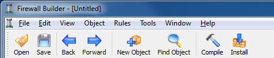

   Menu and Tool Bars

**The Object Tree**

Displayed on the left side of the window, the object tree displays firewalls, hosts, interfaces, services, and other "objects" that you will use when creating policies for your firewall. See the `Object Tree`_ section for details on the objects in the tree and how to filter the object tree.

.. figure:: img/gui-object-tree.png
   :alt: The Object Tree

   The Object Tree

**The Policy Rule Set Workspace**

Displayed to the right of the object tree, this area holds the rule sets you are currently working on. This space is blank when you first load an object file. It only appears when you double-click a policy, NAT, or routing rule set link in a firewall object. (This means that you have to create a firewall object before you can work on a policy.)

Each rule set opens in its own sub-window within a Multiple Document Interface (MDI) area. Multiple rule sets can be open simultaneously and arranged side by side.

See :doc:`05 - Working with Objects` for instructions on creating a firewall object. See :doc:`07 - Firewall Policies` for instructions on working with policies.

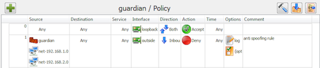

   The Policy Area

**The Object Editor Panel**

The editor panel, across the bottom of the main window, is where you make changes to object parameters, perform find and replace operations, view where objects are used, and view the output from single-rule compiles. The editor panel is not visible until you double-click an object.

The panel has four tabs:

Editor
   Edit an object's parameters, including its comment and tags. Changes made to a field are saved whenever you click out of the field, or when you press the Tab or Enter key. (Note that this does not change the data in the file until you save the file itself.) If you wish to cancel a change, select Edit > Undo. For more information on objects and their parameters, see :doc:`05 - Working with Objects`.

Find
   Search for objects and rule sets across your object file, plus do replacements of objects. You can search by name, address, port range, protocol, or ICMP type. You can also search by dragging an object into the search area. See :doc:`05 - Working with Objects` for details.

Where Used
   Find all places where a specific object is referenced -- in groups, rule sets, and as child objects. Results are clickable and navigate directly to the usage location.

Output
   Displays the compiler output for single-rule compiles.

Close the editor panel by clicking the X or by unchecking View > Editor Panel.

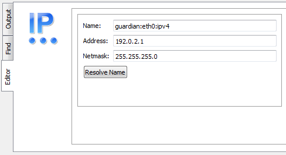

   Object Editor, Partial View

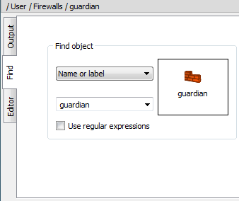

   Find-and-Replace Object Panel, Partial View

.. figure:: img/gui-output-view.png
   :alt: Output View, Partial View

   Output View, Partial View

**Undo Stack**

Displayed on the right side of the window, the Undo Stack is not displayed by default. To activate it, select View > Undo Stack.

As you make changes to your object file, those changes show up in the Undo Stack panel. You can "undo" an action by clicking the action above it (in other words, prior to it) in the panel. Clicking any action rolls back all changes after that action. However, the "future" changes stay in the Undo Stack until you make another edit. At that point, all changes after the current point in the stack are removed.

The Undo Stack can "float" as its own window by clicking the button at the top of the panel next to the close button.

See the `Undo Stack`_ section for a more detailed explanation of the Undo Stack.

.. figure:: img/gui-undo-stack-panel.png
   :alt: Undo Stack

   Undo Stack

GUI Menu and Tool Bars
----------------------

This section describes the commands available in the GUI menus and tool bar.

File Menu
~~~~~~~~~

The File menu provides standard file management options.

.. list-table:: File Menu
   :header-rows: 1
   :widths: 30 70

   * - File Menu Entry
     - Explanation
   * - New Object File
     - Opens a "file" dialog that lets you name your new object file. Object file names end with ".fwf".
   * - Open...
     - Opens a standard "file" dialog that lets you select an existing file. The file dialog shows FirewallFabrik files (.fwf), Firewall Builder files (.fwb), or all files.
   * - Open Recent
     - Contains a submenu listing up to 20 recently opened object files. The most recent nine files can be opened with Ctrl+1 through Ctrl+9. Use "Clear Menu" at the bottom to clear the list.
   * - Save
     - Saves the current file. Files are always saved in the FirewallFabrik YAML format (.fwf), even if the original file was a Firewall Builder XML file (.fwb).
   * - Save As...
     - Opens a "file" dialog that lets you save the object file under a new name.
   * - Close
     - Closes the current file. If there are unsaved changes, you are prompted to save, discard, or cancel. All panels are hidden and the workspace returns to its initial empty state.
   * - Exit
     - Closes FirewallFabrik.

Edit Menu
~~~~~~~~~

The Edit menu provides standard editing operations. The clipboard operations (Cut, Copy, Paste, Delete) are context-sensitive -- they dispatch to either the object tree or the active policy view, depending on which area has focus.

.. list-table:: Edit Menu
   :header-rows: 1
   :widths: 30 70

   * - Edit Menu Entry
     - Explanation
   * - Undo
     - Undoes the last change.
   * - Redo
     - Redoes the last undone change.
   * - Cut
     - Copies the selected item to the clipboard and removes it.
   * - Copy
     - Copies the selected item to the clipboard.
   * - Paste
     - Pastes the item from the clipboard.
   * - Delete
     - Deletes the selected item.
   * - Preferences...
     - Opens the Preferences dialog. See the `Preferences Dialog`_ section.

View Menu
~~~~~~~~~

The View menu lets you turn on or off various display panels.

.. list-table:: View Menu
   :header-rows: 1
   :widths: 30 70

   * - View Menu Entry
     - Explanation
   * - Object Tree
     - If checked, the object tree is displayed on the left side of the window.
   * - Editor Panel
     - If checked, the editor panel is displayed at the bottom of the window. You can also display this panel by double-clicking an object.
   * - Undo Stack
     - If checked, the undo history is displayed on the right side of the window. You can undo several changes by clicking on the last change you want to keep. With the next change, all changes after the current one are removed from the undo history.

Object Menu
~~~~~~~~~~~

The Object menu lets you create new objects and search for them.

.. list-table:: Object Menu
   :header-rows: 1
   :widths: 30 70

   * - Object Menu Entry
     - Explanation
   * - New Object
     - Opens a menu of all possible object types. Select one to create a new object of that type. The `Creating Objects`_ section describes how to create objects.
   * - Find Object
     - Opens the Find panel, which also provides search and replace functions. See :doc:`05 - Working with Objects` for details on how to use this panel.

Rules Menu
~~~~~~~~~~

The Rules menu lets you compile the firewall policy.

.. list-table:: Rules Menu
   :header-rows: 1
   :widths: 30 70

   * - Rules Menu Entry
     - Explanation
   * - Compile
     - Opens the compile dialog for all firewalls in the current object file. See :doc:`10 - Compiling and Installing a Policy` for more detail.

Help Menu
~~~~~~~~~

The Help menu provides access to help resources and information about the program.

.. list-table:: Help Menu
   :header-rows: 1
   :widths: 30 70

   * - Help Menu Entry
     - Explanation
   * - User Guide
     - Opens the user guide documentation.
   * - Changelog
     - Displays the project changelog.
   * - About
     - Shows version information about FirewallFabrik.
   * - Debugging Info
     - Shows technical information including the executable path, resource paths, locale, and version numbers for FirewallFabrik, Python, PySide6, and Qt.

Object Context Menu
~~~~~~~~~~~~~~~~~~~

The context menu for a particular object provides a shortcut to commands for that object. Right-click an object's label to bring up a menu with the following functions:

.. list-table:: Object Right-Click Menu
   :header-rows: 1
   :widths: 30 70

   * - Right-Click Menu Entry
     - Explanation
   * - Expand / Collapse
     - Expands or collapses the selected item's children (only visible for items that have children).
   * - Edit
     - Opens the Editor panel for that object. (You can achieve the same result by double-clicking the object.)
   * - Inspect
     - Inspects the object.
   * - Duplicate
     - Creates a copy of the object. The new object has the same name as the original object, unless that name is already in use, in which case a numeric suffix is appended.
   * - Move
     - Moves the object to a different location in the tree.
   * - Copy
     - Copies an object onto the clipboard.
   * - Cut
     - Copies an object onto the clipboard and removes it from the tree.
   * - Paste
     - Puts a copy of the object on the clipboard into a tree or into the policy, depending on where the mouse is when you click.
   * - Delete
     - Deletes an object.
   * - New [Type]
     - Context-sensitive option to create a new child object. For example, right-clicking a firewall shows options for Interface, Policy, and NAT. Right-clicking a folder shows options appropriate to that folder type.
   * - New Subfolder
     - Creates a new subfolder within a folder to help organize objects (only available on folders).
   * - Where Used
     - Scans the whole tree, including all groups and policies of all firewalls, looking for references to the object.
   * - Tags
     - Add or remove tags from the selected object(s). To add a tag that doesn't exist yet, create a new one in the Tags dialog.

The context menu is context-sensitive: certain operations are not available for certain object types. For example, you cannot duplicate or delete a Library.

In addition, the right-click context menu on policy rules has a selection for Compile Rule. Selecting this option compiles the rule and displays the output in the Output tab of the Editor panel.

Tool Bar
~~~~~~~~

The Tool Bar has buttons for commonly used functions:

.. figure:: img/gui-toolbar-buttons.png
   :alt: Buttons

   Buttons

.. list-table:: Tool Bar
   :header-rows: 1
   :widths: 30 70

   * - Button
     - Explanation
   * - Open
     - Opens a standard "file" dialog that lets you select an existing file.
   * - Save
     - Saves the current file.
   * - New Object
     - Activates dropdown menu that allows you to create a new object of any object type, including creating a new Library object.
   * - Find Object
     - Opens the Find panel, which also provides search-and-replace functions. See :doc:`05 - Working with Objects` for details on how to use this panel.
   * - Compile
     - Opens the compile dialog for all firewalls in the current object file. See :doc:`10 - Compiling and Installing a Policy` for more detail.

Object Tree
-----------

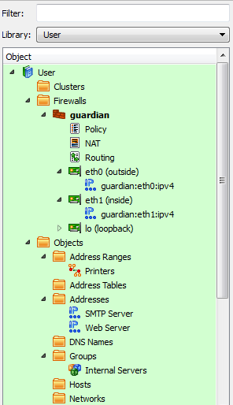

   Object Tree Structure

The object tree stores all objects in a predefined hierarchy:

* Types that correspond to network objects (hosts, address ranges, networks, and groups of these) are located in the Objects branch.
* Types that correspond to services are located in the Services branch.
* Time intervals are located in the Time branch.
* All firewalls are located in the Firewalls branch.

Newly created objects are automatically placed in the appropriate position in the tree. Each branch of the tree is automatically sorted by the object name.

The program has two default libraries: User and Standard.

* The User library holds objects that you define, including objects for your firewall, hosts, and networks.
* The Standard library holds a collection of predefined standard objects that come with FirewallFabrik. Note that you need not (and cannot) insert objects into the Standard library.

Optionally, a Deleted Objects library can be enabled using Edit > Preferences > Objects > "Show deleted objects". When enabled, it acts like a trash can for user objects you delete.

.. figure:: img/gui-standard-objects.png
   :alt: Standard Objects

   Standard Objects

In addition, you can create custom libraries by selecting New Library from the New Object menu. You can populate the new library by copying and pasting objects from other libraries or by creating them from scratch within the new library. See :doc:`05 - Working with Objects` for instructions on creating user-defined libraries.

Functionally, there is no difference between having an object in the Standard library, the User library, or a user-defined library; it is just a convenient way to organize objects. You can think of each as a kind of "view". The choice of library affects only the display of the data in the GUI; objects are all equal in all other senses and you can use an object from any library in your policy.

The object that is currently selected in the tree is highlighted in color and is shown in the editor panel at the bottom.

FirewallFabrik understands and uses the object and service types described in the table below. See :doc:`05 - Working with Objects` for more detailed information.

.. list-table:: Object Types
   :header-rows: 1
   :widths: 30 70

   * - Object Type
     - Explanation
   * - Address
     - An IPv4 address.
   * - Address IPv6
     - An IPv6 address.
   * - Address Range
     - A range of IPv4 or IPv6 IP addresses. This range does not have to be a specific subnet, but addresses must be contiguous.
   * - Address Table
     - An object configured with the name of an external file containing a list of IP addresses. Mixing IPv4 and IPv6 addresses is supported. Addresses can be loaded during policy compile or during the execution of a generated firewall script.
   * - Cluster
     - A high-availability group of firewall devices. The firewall objects themselves must be created as firewall objects, then added to the cluster. The cluster's platform and OS settings must match those of the component firewalls.
   * - Custom Service
     - An object that can be used to inject arbitrary code into the generated firewall script.
   * - DNS Name
     - A DNS "A" or "AAAA" record. This name is resolved into an IP address at compile or run time.
   * - Dynamic Group
     - A group whose membership is determined dynamically based on filters using object type and tags. When a firewall is compiled, the Dynamic Group is expanded to include all objects matching the filter rules.
   * - Firewall
     - A physical firewall device, its interfaces and addresses, and the policy rule sets associated with the device. Use FirewallFabrik to model your actual device's firewall software, OS, interfaces and addresses. Then, use FirewallFabrik to construct the policy rule sets to assign to the device.
   * - Host
     - A computer on your network. Hosts can have interfaces associated with them.
   * - ICMP Service
     - An ICMP service such as a ping request or reply.
   * - ICMPv6 Service
     - An ICMPv6 service such as "IPv6 packet too big", "IPv6 ping request", or "IPv6 ping reply".
   * - Interface
     - A physical interface on a firewall or host. Interfaces can have IP and physical (MAC) addresses associated with them. Interfaces support sub-interfaces for VLANs, bonding slaves, and bridge ports.
   * - IP Service
     - An IP service such as GRE, ESP, or VRRP. This category includes IP services that do not fall into ICMP, ICMPv6, TCP, or UDP service categories.
   * - Library
     - A library of objects. FirewallFabrik comes with the User and Standard libraries. In addition, you can create your own and optionally enable the Deleted Objects library.
   * - Network
     - An IPv4 subnet.
   * - Network IPv6
     - An IPv6 subnet.
   * - Object Group
     - A collection of addressable objects (objects that have or contain IP addresses) such as network, interface, and host objects. A group is useful for creating a less cluttered-looking firewall policy and for making sure you have the same objects in every related rule.
   * - Service Group
     - A collection of services. Grouping services is useful for creating a less cluttered-looking firewall policy and for making sure you have the same objects in every related rule.
   * - Tag Service
     - A service object that lets you examine the tag in an IP header. You can then construct your rule to take appropriate action on a match.
   * - TCP Service
     - A TCP service such as HTTP, SMTP, or FTP.
   * - Time Interval
     - A time period such as "weekends" or a range of dates, or a range of times on certain days of the week. Can be used as part of rule matching in Policy rule sets to provide or deny access based on time. Note that these time intervals are relative to the time on the firewall device itself.
   * - UDP Service
     - A UDP service such as DNS or NTP.

Using Subfolders to Organize the Object Tree
~~~~~~~~~~~~~~~~~~~~~~~~~~~~~~~~~~~~~~~~~~~~~

FirewallFabrik comes with a set of predefined system folders. You can also create your own subfolders in the Object Tree to help organize your objects.

The following figure shows the object tree of a retailer with multiple stores in several cities. As you can see the objects are not grouped together which can make it hard to quickly find the object you are looking for. Subfolders provide an easy way to organize your objects.

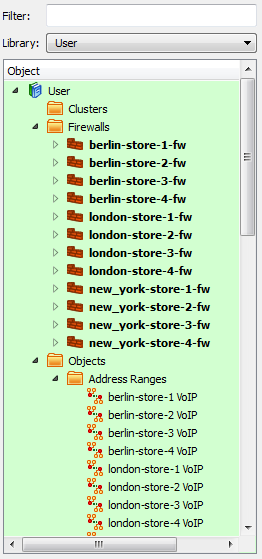

   Object Tree without Subfolders

To add a subfolder right-click on one of the system folders, in this case we are going to start with the Firewalls folder, and select the New Subfolder menu item.

.. figure:: img/gui-add-firewalls-subfolder.png
   :alt: Add Firewalls Subfolder

   Add Firewalls Subfolder

A dialog window will appear. Enter the name of your subfolder and click OK. In this case we will create a new subfolder called "Berlin" to hold all the Firewall objects located in Berlin.

To add the firewalls to the Berlin subfolder, select the firewall objects in the tree, and drag-and-drop the firewalls onto the Berlin subfolder.

.. figure:: img/gui-moving-objects-to-subfolder.png
   :alt: Moving Objects to Subfolder

   Moving Objects to Subfolder

The following figure shows the Object Tree after folders have been created for both London and New York and the firewalls at each of these locations have been moved to the subfolder. As you can see this makes it much easier to find things quickly in your tree.

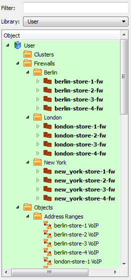

   Subfolders for Firewalls

While this example showed using subfolders in the Firewalls system folder, you can create subfolders in any of the predefined system folders.

.. note::

   To *delete* a subfolder simply right-click on the subfolder and select Delete. If there are objects in the subfolder FirewallFabrik will show a warning about the locations where the objects that are going to be deleted are used.

   If you don't want to delete the objects in the subfolder then you first need to move them to the system folder by selecting all the objects in the subfolder and dragging-and-dropping them onto the system folder that is the parent of the subfolder you want to delete.

Filtering the Object Tree
~~~~~~~~~~~~~~~~~~~~~~~~~~

The object tree can hold a great many objects, nested in their respective categories. You can filter the tree to show only certain objects based on a string. For example, typing "eth" in the Filter field causes all the objects with "eth" in the object name to appear. The filter also searches object tags and attributes. Filters are not case sensitive.

Use Ctrl+F to focus the filter field. Click the X in the filter box to clear the active filter.

As your configuration grows you will find that it becomes harder to quickly find the objects you are looking for. This example shows how filtering helps.

.. figure:: img/gui-empty-filter-field.png
   :alt: Empty Filter Field

   Empty Filter Field

In the example, the word "new york" is typed into Filter field, with the goal of retrieving all address-related objects. As the screen shot below shows, filtering takes effect immediately. In the example, only "new" has been typed but the tree is already filtered by those characters, showing the Address Range, Addresses, Groups, and Networks objects that include "new" in their name.

.. figure:: img/gui-populated-filter-field.png
   :alt: Populated Filter Field

   Populated Filter Field

Object Attributes in the Tree
~~~~~~~~~~~~~~~~~~~~~~~~~~~~~~

If you check the "Show attributes in tree" checkbox in the Preferences > Objects tab, the object tree displays a second column of information, as shown below.

.. figure:: img/gui-object-attributes-column.png
   :alt: Object Attributes Column

   Object Attributes Column

The information shown depends on the type of object.

If you check the checkbox but don't see the second column, make the panel wider until you see the column separator, then drag the column separator until the columns are in the correct position.

Creating Objects
~~~~~~~~~~~~~~~~

New objects can be created using the New Object menu, accessed by clicking this icon above the object tree:

.. figure:: img/gui-create-objects-button.png
   :alt: Create Objects button

   Create Objects button

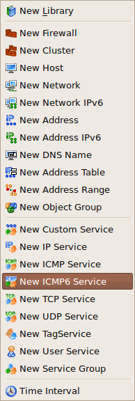

   Creating Objects Using The Object Menu

You can also create objects by right-clicking a folder in a library (though not in the read-only Standard library). If you right-click a folder, you can only create objects appropriate to that folder. For example, an interface object can only be placed under a host or firewall object, so the Add Interface option is available only if you right-click a host or firewall.

.. figure:: img/gui-creating-objects-by-right-clicking.png
   :alt: Creating Objects by Right-Clicking

   Creating Objects by Right-Clicking

Another way to create objects is to use the Duplicate option when you right-click an object. This allows you to create a copy of the object. For example, you may want to create a firewall policy for one platform, duplicate it, then just change the target platform on the copy. Note that copies are not linked in any way. A change to the original has no effect on the copy, and vice versa.

Undo and Redo
-------------

FirewallFabrik supports undo and redo functions from the GUI and from the keyboard. In the GUI, both functions are located in the Edit menu. The keyboard commands are Ctrl+Z for Undo, and Ctrl+Y for Redo.

Undo Stack
~~~~~~~~~~

The undo stack shows you a list of your changes, and lets you roll back changes you don't want. You can roll back just one change, all changes after a certain point, or all changes.

Press Ctrl+Z to undo an action. The undo stack is essentially unlimited, so you can press Ctrl+Z repeatedly to roll back a series of changes. You can also view the Undo Stack directly by selecting View > Undo Stack. From that view, you can roll back several changes with a single mouse click.

Note that a change enters the undo stack as soon as you "commit" the change. For dragging and dropping, a change is committed as soon as you drag an object into a new position, at which time that change appears in the undo stack. For field edits, the change appears as soon as you move the GUI focus out of a field by pressing Enter or Tab, or by clicking outside the field.

Rolling back a change does not immediately remove that change from the stack. You can "redo" a change by clicking it. Changes after the current change stay in the stack until you perform a new edit. At that point, the new change appears as current, and all the undone changes after that point are removed from the stack.

Each undo entry includes a description of the change and the name of the firewall it belongs to, making it easy to identify changes in multi-firewall configurations.

The following figure shows a portion of an object tree, an access policy, and the undo stack. The stack has been "floated," so it can be moved as its own window. (To make a panel float, click the button next to the close button.)

In the example stack, a new, blank rule has just been added to the policy.

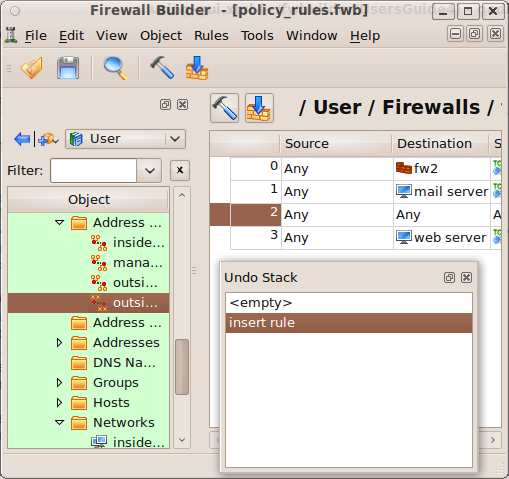

   Policy and the Undo Stack

The "inside range" IP object is now added to the Source of the new rule, and the "outside range 2" IP object is added to the Destination of the rule. However, in this example, we have made a mistake: Instead of adding "outside range 2" to the Destination, we accidentally added the "outside range" object to the Source field.

You can see the object in the policy and the undo history in the following screenshot.

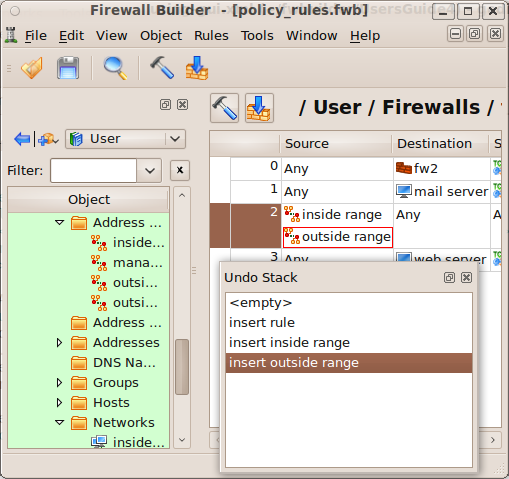

   Added Inside Range and Outside Range

To fix the error, we do two things. First, we click on "insert inside range" in the Undo Stack. This rolls back the stack to before the point at which we inserted "outside range 2."

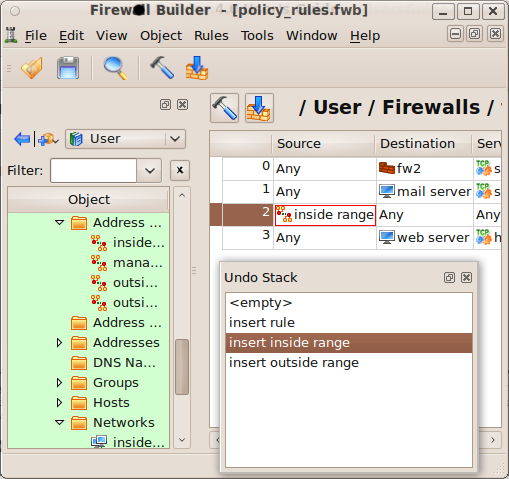

   Removed Outside Range from Source

Next, we drag "outside range 2" into the Destination field. You can see that the "insert outside range" entry has been removed from the stack, and the "insert outside range 2" edit now appears as the most recent change.

.. figure:: img/gui-added-outside-range-2-to-destination.png
   :alt: Added Outside Range 2 to Destination

   Added Outside Range 2 to Destination

Preferences Dialog
------------------

To open the Preferences dialog, select Edit > Preferences (Ctrl+,). The dialog has several tabs, described here.

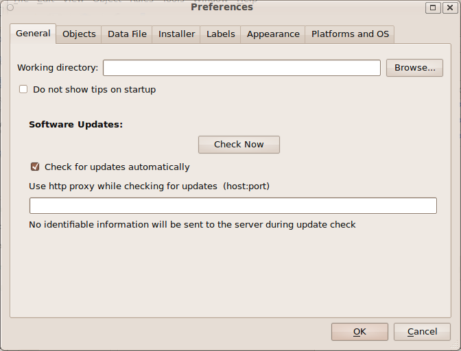

   The GUI Preferences Dialog

.. list-table:: Preferences > Objects Tab
   :header-rows: 1
   :widths: 30 70

   * - Objects Preferences
     - Explanation
   * - Enable object tooltips
     - FirewallFabrik can show a summary of an object's properties in a quick pop-up window (a "tooltip") when you hover the mouse cursor over an object icon. If this feature is not enabled, then you must click on an object to get the same information.
   * - Advanced User Mode
     - When enabled, tooltips are shown in a shorter, more compact format intended for experienced users.
   * - Show deleted objects
     - Selecting this checkbox enables the Deleted Objects library. Once enabled, the Deleted Objects library acts like trash can (or recycle bin) for deleted objects. If you delete something by mistake, you can retrieve it.
   * - Show attributes in tree
     - Creates a second column in the object tree. The second column contains information about the object, such as how many objects a folder contains, whether a rule set is the top rule set, IP addresses, and so on. See the `Object Attributes in the Tree`_ section for a description.
   * - Enable custom templates
     - When enabled, allows the use of custom template firewall objects when creating new firewalls.
   * - DNS Name settings
     - Set the default behavior for new DNS Name objects: whether they resolve at compile time or at run time. You can also choose whether to use the object name for the DNS record by default. These defaults can be overridden for individual objects. See :doc:`05 - Working with Objects` for more information.
   * - Address Table settings
     - Set the default behavior for new Address Table objects: whether addresses are loaded from the file at compile time or at run time. This default can be overridden for individual objects. See :doc:`05 - Working with Objects` for more information.

.. list-table:: Preferences > Data File Tab
   :header-rows: 1
   :widths: 30 70

   * - Data File Preferences
     - Explanation
   * - Periodically save data to file every ... minute
     - If checked, data is automatically saved at the specified interval.
   * - Enable compression of the data file
     - If selected, the data file is compressed to save disk space.

.. list-table:: Preferences > Installer Tab
   :header-rows: 1
   :widths: 30 70

   * - Installer Preferences
     - Explanation
   * - SSH and SCP paths
     - These fields specify the paths to your SSH and SCP programs, or their equivalents. If these paths are already recorded in your PATH system variable, you need not specify paths here.
   * - SSH timeout
     - The maximum time (in seconds) to wait for an SSH connection before timing out.
   * - Enable password caching
     - If checked, the program can remember firewall passwords for the duration of the FirewallFabrik GUI session. Passwords are never stored permanently in any form; they are only kept in memory. You need to enter each password once when you activate a generated policy. If you keep the program open and need to modify and activate policy again, the password fields in the installer dialog can be filled automatically. To use this feature, you must also configure a user name in the Installer tab in the Firewall Settings dialog of the firewall object. Caution: using this feature creates a risk if a working FirewallFabrik GUI is left unattended on an unlocked workstation.

.. list-table:: Preferences > Labels Tab
   :header-rows: 1
   :widths: 30 70

   * - Labels Preferences
     - Explanation
   * - Labels
     - You can assign colors to particular rows in your policies to make them stand out visually. You can also change the text label associated with each color using this tab. FirewallFabrik provides seven label slots with default labels such as "Outbound", "Inbound", "Block", "DNAT/Forward", "SNAT/Forward", and others. While the color shows up in the rule set, the text label only appears in the label list.

.. list-table:: Preferences > Appearance Tab
   :header-rows: 1
   :widths: 30 70

   * - Appearance Preferences
     - Explanation
   * - Rules, Tree, and Compiler Output Fonts
     - Use these controls to set the font used for rules, the object tree, and the compiler output panel.
   * - Show icons in rules
     - If deselected, suppresses icon display for objects in rules, showing only text. By default, objects such as interfaces, hosts, and networks are displayed as both an icon and text.
   * - Show text descriptions in columns "Direction", "Action"
     - If selected, displays text descriptions in addition to icons in the Direction and Action columns. By default, only icons are shown.
   * - Show toolbar text
     - If selected, displays text labels below toolbar buttons.
   * - Clip comments in rules
     - Comments in a rule can sometimes make the rule line taller, reducing the number of rules visible on a screen. Select this if you want comments to be truncated in the view if they take up more than one line.
   * - Icon size
     - By default, icons are 25x25 pixels. Select 16x16 to make them smaller. (The larger icons are easier to see, but the smaller ones are useful for smaller displays, such as laptop screens.)

.. list-table:: Preferences > Diff Tab
   :header-rows: 1
   :widths: 30 70

   * - Diff Preferences
     - Explanation
   * - Rule Set Diff Viewer colors
     - Configure the colors used to highlight added, edited, moved, and removed rules in the diff viewer.
   * - Display unmodified rules
     - If checked, shows unmodified rules alongside changed rules for context.
   * - Generated Output Diff Viewer
     - Settings for the generated output diff viewer, including an option to auto-compile when viewing diffs.
   * - Diff utility path
     - Path to an external diff utility to use for comparisons.

.. list-table:: Preferences > Platforms and OS Tab
   :header-rows: 1
   :widths: 30 70

   * - Platforms and OS Preferences
     - Explanation
   * - Lists of Platforms and OSs
     - Checked platforms and operating systems appear in drop-down menus when configuring firewall objects. You can uncheck unneeded platforms and OSs to reduce clutter in GUI menus.

Keyboard Shortcuts
------------------

.. list-table::
    :header-rows: 1
    :widths: 20 20 60

    * - Shortcut
      -
      - Action
    * - ``Ctrl+1`` .. ``Ctrl+9``
      - Menu "File"
      - Open most recent file
    * - ``Ctrl+O``
      - Menu "File"
      - Open file
    * - ``Ctrl+S``
      - Menu "File"
      - Save file
    * - ``Ctrl+Shift+S``
      - Menu "File"
      - Save file as
    * - ``Ctrl+F4``
      - Menu "File"
      - Close file
    * - ``Ctrl+,``
      - Menu "Edit"
      - Preferences
    * - ``Ctrl+Z``
      - Menu "Edit"
      - Undo
    * - ``Ctrl+Y``
      - Menu "Edit"
      - Redo
    * - ``Ctrl+X``
      - Menu "Edit"
      - Cut
    * - ``Ctrl+C``
      - Menu "Edit"
      - Copy
    * - ``Ctrl+V``
      - Menu "Edit"
      - Paste
    * - ``Delete``
      - Menu "Edit"
      - Delete
    * - ``Ctrl+N``
      - Menu "Object"
      - New object
    * - ``Ctrl+Shift+F``
      - Menu "Object"
      - Find object
    * - ``Ctrl+T``
      - Menu "View"
      - Toggle object tree
    * - ``F1``
      - Menu "Help"
      - User Guide
    * - ``Ctrl+F``
      - Object tree
      - Focus the filter field
    * - ``Insert``
      - Policy Editor
      - Insert new rule
    * - ``X``
      - Policy Editor
      - Compile rule
    * - ``Ctrl+PageUp``
      - Policy Editor
      - Move rule up
    * - ``Ctrl+PageDown``
      - Policy Editor
      - Move rule down
