Compiling and Installing a Policy
==================================

.. sectnum::
   :start: 10

.. contents::
   :local:
   :depth: 2

Different ways to compile
-------------------------

There are several ways to compile and install a policy, summarized here. The actual results are described in more detail in later sections of this chapter.

.. figure:: img/compile-main-toolbar-icons.png
   :alt: Icons in the main toolbar

   Icons in the main toolbar.

The hammer icon in the topmost toolbar (on the left) lets you compile, but not install, one or more of the firewalls or clusters in the object file. The arrow-and-wall icon lets you both compile and install firewalls.

* The main menu items Rules > Compile and Rules > Install menu selections also let you compile, or compile and install, one or more firewalls or clusters.

.. figure:: img/compile-policy-toolbar-icons.png
   :alt: Icons in the toolbar specific to the currently opened firewall

   Icons in the toolbar specific to the currently opened firewall.

The hammer icon in the policy (on the right) toolbar lets you compile, but not install, the firewall of the current policy. The arrow-and-wall icon in the policy toolbar lets you both compile and install it. *Note that this compiles the firewall of the shown policy. Double-clicking a different firewall to bring up that firewall's object editor does not change the policy shown, and does not change which firewall will be compiled.*

* The Compile and Install menu selections in the right-click context menu let you do a compile or compile-and-install on the firewall that you selected. You can ctrl-click or shift-click to select more than one firewall or cluster.

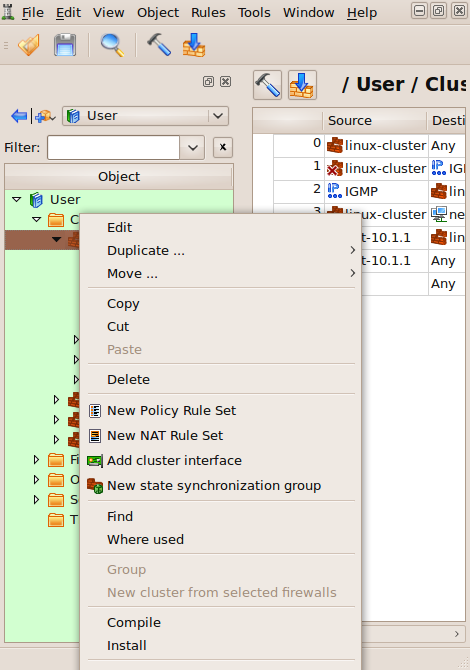

   Compile and install options in the context menu that appears when you right-click on a firewall or cluster object in the tree.

* To compile a single rule, select it in the rule set, right-click it and select Compile. Or, select a rule, then press X on the keyboard. This only compiles the single rule and shows the result. This function does not produce a firewall script.

Compiling single rule in the GUI
--------------------------------

While you're developing your firewall policy, you can compile individual rules to confirm that they do what you intend. To compile an individual rule, right-click anywhere in the rule to open context menu, then select Compile. Or, highlight the rule and press "X".

.. figure:: img/compile-single-rule.png
   :alt: Compiling a single rule via right-click context menu

   Compiling a single rule.

.. figure:: img/compile-generated-iptables-gui.png
   :alt: Generated iptables script for rule #0 shown in the GUI

   Generated iptables script for the rule #0 is shown in the GUI.

Compiling firewall policies
---------------------------

Once you have a policy created, you need to compile it into a script that can run on your target device. You then need to install it on that device.

Let's walk through compiling an iptables firewall. Below is the access policy of the firewall.

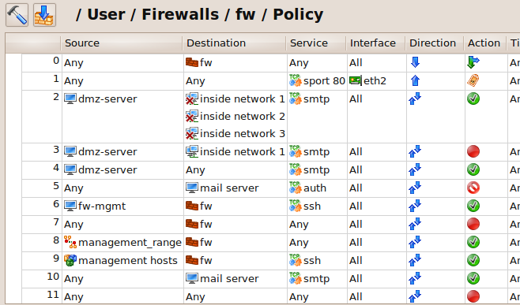

   A policy to compile.

To compile it use main menu item Rules > Compile.

Alternatively, open the Policy, NAT or routing rules of the firewall you want to compile by double-clicking in the tree, then click the "Compile" icon (the hammer) in the policy window.

To compile several firewalls, use Shift-left click or Ctrl-left click to select more than one firewall. Then, right-click on one of them to bring up the context menu and select Compile.

Different ways to compile one or several firewall objects were described earlier in `Different ways to compile`_.

.. figure:: img/compile-select-firewalls.png
   :alt: Select your firewall to compile

   Select your firewall.

Check the Compile checkbox next to the firewall you want to compile, and uncheck all the others.

FirewallFabrik keeps track of the last time the firewall was compiled and also keeps track of any changes since then. If the firewall has not changed since the last compile, that firewall is unchecked by default because no compile is needed. Any direct change done to the rules of the firewall, or a change to any object used in rules, triggers the recompile. You can always force compile by checking the Compile next to the object in the list or skip it by unchecking it.

In addition, you can see which firewalls and clusters have been modified since their last compile by looking at the object tree. If a firewall has been compiled since it was last modified, it appears in normal font. If it has not been compiled since its last modification, it appears in bold.

As you can see in this image, firewalls that need compilation are in bold and are checked by default in the Compile dialog. Firewalls that have been compiled since their last change are in regular font and are unchecked by default.

.. figure:: img/compile-uncompiled-firewalls-bold.png
   :alt: Uncompiled firewalls are in bold

   Uncompiled firewalls are in bold.

To see the last time a firewall or cluster was compiled, double-click it to bring up its object editor.

.. figure:: img/compile-object-editor-timestamps.png
   :alt: Object Editor Dialog with last modify and compile times

   Object Editor Dialog with last modify and compile times.

Since we are just doing a compile, the only checkbox is the Compile checkbox. If we were doing a compile and install in the same run, you would also see an Install checkbox.

Click Next.

A dialog appears that tracks the status of the compile. In this case, we have an error:

.. figure:: img/compile-status-messages-error.png
   :alt: Compile status messages showing an error

   Compile status messages.

Errors appear in red, and warnings appear in blue. In this case, it turns out that one of our rules shadows one of our other rules. For other types of problems, see :doc:`15 - Troubleshooting`.

Errors and warnings are clickable. Clicking an error takes you to the portion of the policy where the error occurs.

We fix the problem, then compile again.

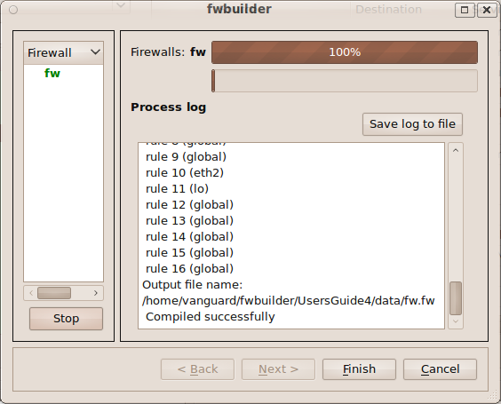

   Successful compile.

To see the created script, look in the same directory as your object file (``.fwf`` or ``.fwb``). The file will be called ``<firewallName>.fw``. (If you changed your default directory in the Preferences, then the generated script will be there instead.)

.. _compiling-cluster-configuration:

Compiling Cluster Configuration with FirewallFabrik
----------------------------------------------------

Cluster compilation works very much like it does for individual firewalls. However, there are a few things to keep in mind.

Clusters are represented by objects of type "Cluster" located in the object group "Clusters". To generate configuration for all cluster member firewalls and install it on each, you need to compile it just like you would compile a regular standalone firewall object.

.. _compile-a-cluster-install-a-firewall:

Compile a Cluster, Install a Firewall
~~~~~~~~~~~~~~~~~~~~~~~~~~~~~~~~~~~~~~

In the compile dialog list there are two columns of checkboxes: "Compile" and "Install". When you compile a cluster, the "Compile" checkboxes appear next to the cluster objects only while "Install" checkboxes appear next to the member firewall objects only. This is because to compile, the policy compiler needs to read the cluster object to get all the information about the cluster configuration, including the list of member firewalls. However, when generated configuration is ready and needs to be installed on member firewalls, the program needs to communicate with each member firewall separately. So the "Install" checkboxes are next to the member firewalls in the list, letting you turn installation on and off on each member separately.

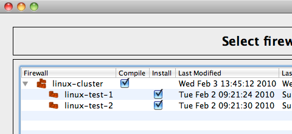

   Compiling cluster object with two members.

.. _mixed-object-files:

Mixed Object Files
~~~~~~~~~~~~~~~~~~

The data file used for this example has a mix of cluster objects with corresponding member firewalls and standalone firewall objects that do not belong to any cluster. The latter get both "Compile" and "Install" checkboxes as visible in the figure below.

.. figure:: img/compile-all-cluster-firewall-objects.png
   :alt: Compiling all cluster and firewall objects

   Compiling all cluster and firewall objects.

.. _compile-single-firewall-within-cluster:

Compile a Single Firewall within a Cluster
~~~~~~~~~~~~~~~~~~~~~~~~~~~~~~~~~~~~~~~~~~~

You can try to compile a firewall object that is a member of a cluster by selecting it in the tree and using the context menu. When you do this, the program treats the object as standalone firewall rather than a cluster member and does not generate any cluster-related part of the configuration, such as policy rules for the failover protocols, the configuration script for failover interfaces, and so on. This is because a firewall object can actually be a member of several clusters, which is useful to test different cluster configurations or for transitions. In some cases a firewall object by itself may be so generic that it can describe member firewalls in different locations (if potential address collisions are not an issue or all addresses are dynamic). For these reasons, the program does not try to guess whether given a firewall object might be a cluster member and which cluster it is a member of and falls back to treating it as a simple standalone firewall object. However, the program shows a warning to indicate this as shown below. Here we selected firewall object "linux-test-1" in the tree and then used context menu to initiate compilation, forgetting that it is a member of two different cluster configurations:

.. figure:: img/compile-member-as-standalone-warning.png
   :alt: Compiling a member firewall as standalone firewall objects

   Compiling a member firewall as standalone firewall objects.

.. _installing-policy-onto-firewall:

Installing a Policy onto a Firewall
-------------------------------------

After a firewall configuration has been generated by one of the policy compilers and saved in a file on disk in the format required by the target firewall, it needs to be transferred to the firewall machine and activated. This function is performed by the component we call "Policy Installer", which is part of the FirewallFabrik GUI.

.. note::

   The Install function is not yet fully implemented in the FirewallFabrik GUI. The compile dialog works as described. Installation via SSH/SCP is planned for a future release. Currently, you can compile policies and manually copy and install them on your firewalls.

In the process of doing the installation, you will have to provide the password to your firewall. If you end up doing the installation several times, such as while troubleshooting, you will have to enter your password several times. Alternatively, you can select Enable password caching in the Installer tab of the Preferences dialog. Then, your password will be cached for the duration of the FirewallFabrik session. However, the password will not be written to disk at any time.

The installer needs to be able to copy the generated firewall script to the firewall and then run it there. In order to do so, it uses secure shell (ssh). The program does not include ssh code; it uses an external ssh client. It uses the standard ssh client *ssh* and secure shell file copy program *scp* that come with the system. The full directory path to the ssh client program can be configured in the Preferences dialog (accessible via Edit/Preferences menu). However if you use the standard ssh client available via your PATH environment variable, you do not need to change the default value there.

Installer works with Linux-based firewalls by using *scp* to copy the generated configuration files to the firewall machine and then uses *ssh* to log in and run the script.

The built-in policy installer has been designed to work with a dedicated firewall machine. In other words, the computer where you run FirewallFabrik and the actual firewall are different machines. Nevertheless, it can be used when they are the same machine as well. The only difference is that in all commands below you would use the name or address of the machine where you run FirewallFabrik instead of the name or address of the dedicated firewall. The SSH client will then connect back to the same machine where it runs and everything will work exactly the same as if it was different computer.

.. _installation-overview:

Installation Overview
~~~~~~~~~~~~~~~~~~~~~

Create directory */etc/fw/* on your firewall.

Now let's install the script using FirewallFabrik's "install" functionality. Open your object file, if it isn't open already, then select Rules > Install.

.. figure:: img/install-rules-install-menu.png
   :alt: Select Rules/Install from the menu

   Select Rules/Install.

The following dialog appears:

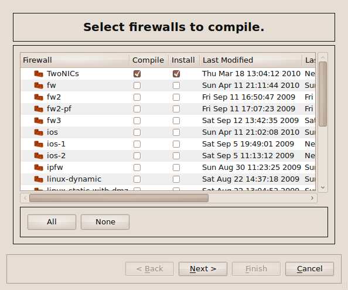

   Select Compile and Install.

As you can see, a list of all firewalls in the object file appear. Not all Compile checkboxes are checked by default. This is because FirewallFabrik keeps track of the last time the firewall was compiled and also keeps track of any changes since then. If the firewall has not changed since the last compile, that firewall is unchecked by default because no compile is needed.

You can see which firewalls have been modified since their last compile by looking at the object tree. If a firewall has been compiled since it was last modified, it appears in normal font. If it has not been compiled since its last modification, it appears in bold.

Make sure the Install checkbox is checked next to the firewall you want to install (and the Compile checkbox if you've made changes since the last compile), then click Next. The following dialog appears:

.. figure:: img/install-ssh-parameters.png
   :alt: Firewall SSH and install parameters

   Firewall SSH and install parameters.

Enter the root username and password for the device, and specify the IP address of the management interface of the device.

Then click OK.

If everything goes well, the following dialog appears and reports success. (If not, it will report failure. The log will tell you what went wrong. If the error is unclear, see :doc:`15 - Troubleshooting`.)

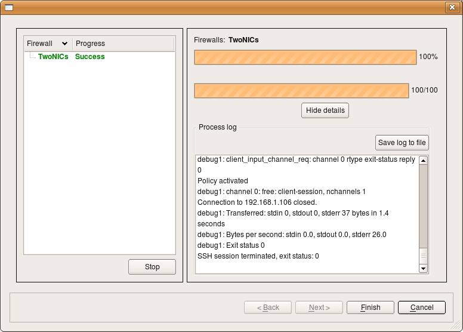

   Installation status.

Log into the firewall to see the policy in place. For iptables, run ``sudo iptables -L``.

.. _installer-address-selection:

How Does Installer Decide What Address to Use to Connect to the Firewall
~~~~~~~~~~~~~~~~~~~~~~~~~~~~~~~~~~~~~~~~~~~~~~~~~~~~~~~~~~~~~~~~~~~~~~~~

Installer does not use the name of the firewall when it connects; it always uses the firewall's IP address. Installer starts by scanning interfaces of the firewall object looking for one that is marked as "Management interface" in the interface object dialog. Installer uses the address of this interface to connect. The Management interface checkbox looks this:

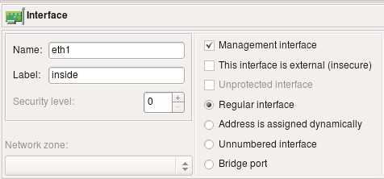

   Management interface checkbox in the interface editor.

If your firewall has multiple addresses and you want to use the one that is not assigned to its interface in the FirewallFabrik object, then you can overwrite the address using the entry field in the *"Installer"* tab of the "Advanced" firewall object settings dialog, like this:

.. figure:: img/install-advanced-settings-address.png
   :alt: Advanced settings dialog Installer tab with alternative address

   Advanced settings dialog with alternative address for the installer.

More about other input fields in this dialog below.

Finally, you can overwrite the address on a one-time basis just for a particular install session using the entry field in the installer options dialog. This is the same dialog where you enter your password:

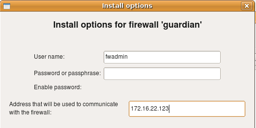

   Install options dialog with alternative address field.

.. _configuring-installer-regular-user:

Configuring Installer to Use Regular User Account to Manage the Firewall
~~~~~~~~~~~~~~~~~~~~~~~~~~~~~~~~~~~~~~~~~~~~~~~~~~~~~~~~~~~~~~~~~~~~~~~~~

The built-in installer can recognize sudo password prompts and enter the password when needed.

* Create an account on the firewall (say, "fwadmin"), create a group "fwadmin" and make this user a member of this group. Most modern Linux systems automatically create group with the name the same as the user account.

.. code-block:: bash

   adduser fwadmin

* Create directory /etc/fw/ on the firewall, make it belong to group fwadmin, make it group writable.

.. code-block:: bash

   mkdir /etc/fw
   chgrp fwadmin /etc/fw
   chmod g+w /etc/fw

* Configure sudo to permit user fwadmin to execute the firewall script and a couple of other commands used by the FirewallFabrik policy installer. Run *visudo* on the firewall to edit file */etc/sudoers* as follows:

.. code-block:: text

   Defaults:%fwadmin   !lecture , passwd_timeout=1 , timestamp_timeout=1
   # User alias specification
   %fwadmin  ALL = PASSWD: /etc/fw/<FWNAME>.fw , /usr/bin/pkill , /sbin/shutdown

Here <FWNAME> is the name of the firewall. Installer will log in to the firewall as user fwadmin, copy the firewall script to file /etc/fw/<FWNAME>.fw and then use the following command to execute it:

.. code-block:: bash

   ssh fwadmin@firewall sudo -S /etc/fw/<FWNAME>.fw

* Set up ssh access to the firewall. Make sure you can log in as user fwadmin using ssh from your management workstation:

.. code-block:: bash

   ssh -l fwadmin <FWNAME>

You may use either password or public key authentication; the installer will work either way.

* In the installer tab of the firewall settings dialog of the firewall object, put in your user name (here it is *"fwadmin"*):

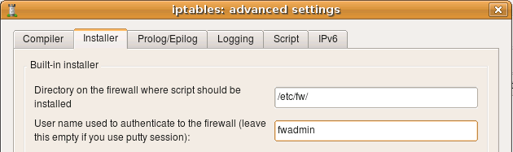

   Installer tab of the firewall settings dialog with user name configured.

* If you need to use an alternative name or IP address to communicate with the firewall, put it in the corresponding field in the same dialog page.

* Make sure the entry field directory on the firewall where script should be installed is set to */etc/fw*. FirewallFabrik is not going to create this directory, so you need to create it manually before you install the firewall policy (see above).

* Leave "Policy install script" and "Command line options" fields blank.

.. _configuring-installer-root-account:

Configuring Installer if You Use Root Account to Manage the Firewall
~~~~~~~~~~~~~~~~~~~~~~~~~~~~~~~~~~~~~~~~~~~~~~~~~~~~~~~~~~~~~~~~~~~~~

* Create directory /etc/fw/ on the firewall, make it belong to root, make it writable.

* Set up ssh access to the firewall. Make sure you can log in as root using ssh from your management workstation:

.. code-block:: bash

   ssh -l root <firewall_name>

You may use either password or public key authentication; the installer will work either way.

* In the installer tab of the firewall settings dialog of the firewall object put "root" as the user name you use to log in to the firewall.

* Make sure entry field directory on the firewall where script should be installed is set to */etc/fw*.

* Leave Policy install script and Command line options fields blank.

.. _always-permit-ssh-access:

Always Permit SSH Access from the Management Workstation to the Firewall
~~~~~~~~~~~~~~~~~~~~~~~~~~~~~~~~~~~~~~~~~~~~~~~~~~~~~~~~~~~~~~~~~~~~~~~~~

One of the typical errors that even experienced administrators make sometimes is to deploy a firewall that blocks ssh access to the firewall from the management workstation. You need your workstation to be able to communicate with the firewall in order to be able to make changes to the policy, so you always need to add a rule to permit ssh from the management workstation. FirewallFabrik can simplify this and generate this rule automatically if you put an IP address of your workstation in the entry field on the first page of firewall settings dialog. Here is the screenshot that illustrates this setting for an iptables firewall. The management workstation has an IP address 192.168.1.100

.. figure:: img/install-advanced-settings-ssh-access.png
   :alt: Advanced settings dialog with "Always permit ssh access from management workstation" option

   Advanced settings with automatic SSH access rule from management workstation.

.. _how-to-configure-alternate-ssh-port:

How to configure the installer to use an alternate ssh port number
~~~~~~~~~~~~~~~~~~~~~~~~~~~~~~~~~~~~~~~~~~~~~~~~~~~~~~~~~~~~~~~~~~

If the ssh daemon on your firewall is listening on an alternate port, then you need to configure the built-in installer so that it will run *scp* and *ssh* clients with command line parameters that would make them connect to this port. This is done in the installer tab of the firewall object advanced settings dialog as shown on the following screenshot (here we set the port to "2222"):

.. figure:: img/install-advanced-settings-alternate-port.png
   :alt: Advanced settings dialog Installer tab with additional command line parameters for alternate SSH port

   Installer tab with additional command line parameters for ssh and scp to use alternate port 2222.

.. note::

   The command line option that specifies the port number is different for *ssh* and *scp*. It is lowercase *-p* for *ssh* and uppercase *-P* for *scp*.

You can use the same input fields in this dialog to add any other command line parameters for *ssh* and *scp*. For example, this is where you can configure parameters to make it use an alternate identity file (private keys). This information is saved with a firewall object rather than globally because you may need to use different parameters for different firewall machines, such as different key files or ports.

.. _how-to-configure-ssh-private-keys:

How to configure the installer to use ssh private keys from a special file
~~~~~~~~~~~~~~~~~~~~~~~~~~~~~~~~~~~~~~~~~~~~~~~~~~~~~~~~~~~~~~~~~~~~~~~~~~

You can use the same entry fields in this dialog to provide other additional command line parameters for *ssh* and *scp*, for example to use keys from a different identity file. Here is how it looks:

.. figure:: img/install-ssh-identity-parameters.png
   :alt: Additional command line parameters fields for ssh and scp with alternate identity file

   Configuring ssh and scp to use alternate port and alternate identity file.

Here we configure *ssh* and *scp* to use an alternate port and an alternate identity file ``~/.ssh/fwadmin_identity``. The command line parameter for the port is different for *ssh* and *scp*, but the parameter for the identity file is the same (*-i*) for both utilities.

.. _troubleshooting-ssh-access:

Troubleshooting ssh access to the firewall
~~~~~~~~~~~~~~~~~~~~~~~~~~~~~~~~~~~~~~~~~~

The built-in policy installer will not work if ssh access to the firewall is not working. Test it using this command on Linux (assuming you user "fwadmin" to manage the firewall):

.. code-block:: bash

   ssh -l fwadmin firewall

If you use the root account to manage the firewall, the command becomes

.. code-block:: bash

   ssh -l root firewall

If you cannot log in using ssh at this point, verify that the ssh daemon is working on the firewall, that the existing firewall policy does not block ssh access and that ssh daemon configuration in ``/etc/ssh/sshd_config`` permits login for root (if you plan to use the root account to manage the policy).

You may get the following error in the installer output (the same error appears if you try to test using *scp* from the command line):

.. code-block:: text

   SCP: warning: Executing SCP1 compatibility.
   SCP: FATAL: Executing ssh1 in compatibility mode failed (Check that SCP1 is in your PATH).
   Lost connection
   SSH session terminated, exit status: 1

This error may happen when you run FirewallFabrik on any platform.

This error means *scp* was able to connect to the firewall but encountered ssh protocol version mismatch. ssh tried to switch back to ssh1 compatibility mode, but failed. This really has nothing to do with FirewallFabrik or even scp on the client side. This happens if you have two versions of ssh package installed on the firewall. ssh daemon accepts connection from scp with ssh protocol v2, starts scp utility (still on the firewall) but the scp utility it gets is from the other package and is probably an older version that does not support ssh2 protocol. To resolve this, try switching to sftp. Here is how to test this from the command line. First, reproduce the error:

.. code-block:: text

   scp test.txt root@firewall:

If this command works, then it should work from inside FirewallFabrik too. However if you get an error saying *SCP: FATAL: Executing ssh1 in compatibility mode failed*, try to use sftp.

.. note::

   For this to work, sftp should be enabled on the server side. There are many resources on the web that explain how to do this. See also the man page for *sshd_config* and search for "Subsystem" in it.

.. code-block:: text

   sftp root@firewall

If this works, then you need to add appropriate flags to the list of additional command line parameters for scp in the "Installer" tab of the firewall object dialog as explained above.

Another common source of problems with *scp* is described in SSH FAQs. When you use scp to transfer a file, it actually launches a login shell on the server side. So if your shell initialization script (*.profile*, *.bashrc*, *.cshrc*, etc) produces any kind of output, scp gets confused and fails.

.. _running-built-in-installer:

Running built-in installer to copy generated firewall policy to the firewall machine and activate it there
~~~~~~~~~~~~~~~~~~~~~~~~~~~~~~~~~~~~~~~~~~~~~~~~~~~~~~~~~~~~~~~~~~~~~~~~~~~~~~~~~~~~~~~~~~~~~~~~~~~~~~~~~~

Now that all preparations are complete, we can move on and actually try to install a newly generated firewall policy. Select the firewall object in the object tree in FirewallFabrik, right-click and use menu item Install.

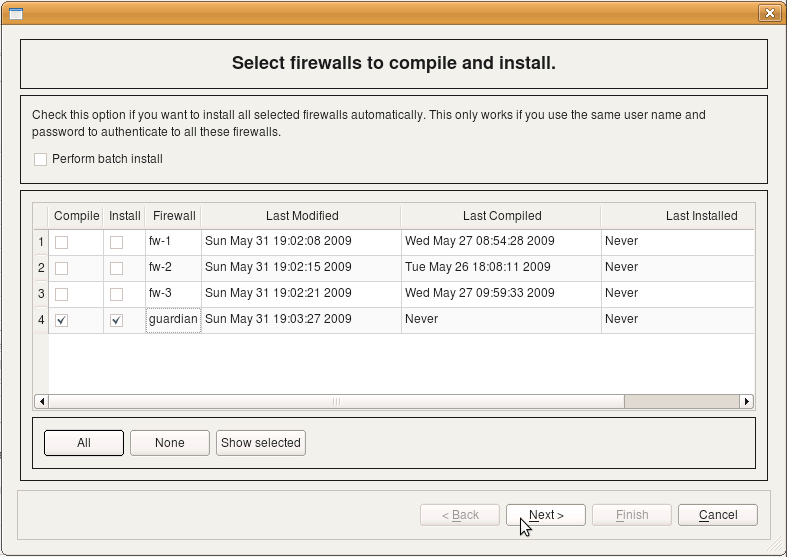

   Select firewalls to compile and install.

On this page of the wizard the program shows the list of all firewall objects with checkboxes that let you choose which ones should be recompiled and installed. Time stamps in the three columns show the time when each firewall object was modified, compiled and installed the last time. You can turn checkboxes on and off to make the program recompile and then install any number of firewall objects. It will first run the compiler for all of those marked for compile, then it will run the installer for all those marked for installation. Installer will ask for the user name and password, as well as other parameters, before running the install process for each of the firewalls. We will return to this page of the wizard later when we discuss batch install. After you click Next on this page, the program re-compiles the policy and opens the installer dialog for the first firewall marked for installation.

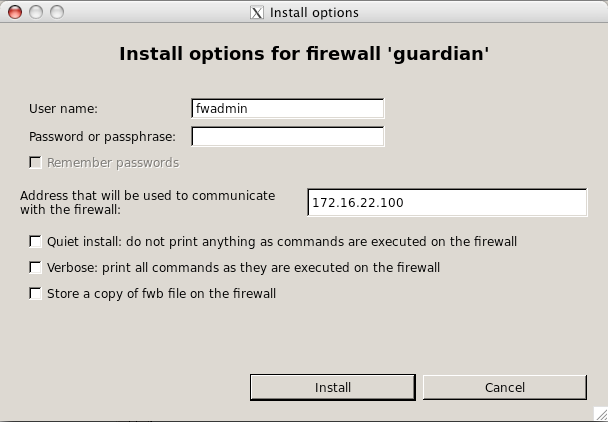

   Install options for firewall.

This screenshot shows how the installer options dialog looks for iptables firewalls.

Here the program already entered the user name *fwadmin* in the "User Name" field, but you can change it for one installation session if you wish. Next you need to enter the password for this user. *This is the password of user fwadmin on the firewall machine*. The address that will be used to communicate with the firewall is also entered by the program automatically; it is taken from the firewall settings. You can change it for one installation session as well.

Other installer parameters do the following:

* *Quiet install*: as the name implies, this checkbox suppresses all progress output of the installer.

* *Verbose*: this checkbox has the opposite action: it makes the installer print a lot of debugging information, including ssh client debug output.

* *Store a copy of object file on the firewall*: if this checkbox is on, the installer will copy not only generated firewall configuration files to the directory on the firewall machine that is configured in the "installer" tab of the firewall object dialog, but also the original object file (.fwf or .fwb) as well. *Use of this option is discouraged if you manage many firewalls from the same object file because distributing the file that contains the security policy of multiple firewalls to all of them is a bad idea.*

After all parameters are set and the password entered, click OK to start installation.

If this is the first time your management machine is logging in to the firewall via ssh, it will find out that ssh host key of the firewall is unknown to it and will present you with a dialog:

.. figure:: img/install-new-rsa-key-dialog.png
   :alt: New RSA key verification dialog

   New RSA key verification dialog.

Here it says that it does not know host key of the firewall "crash". This is nothing more than a copy of the warning message presented by the ssh client. You should verify the host key manually and if it matches, click Yes. If you click No in the dialog, the installation process will be interrupted.

.. note::

   Installer only recognizes the ssh client warning message about unknown public host keys. If you rebuild your firewall machine, which means its host key changes, ssh will print a different warning message that FirewallFabrik installer does not recognise. In this case, you will see this message in the installer progress window, but installation process will get stuck. You need to use ssh client (*ssh*) to update the host key before you can use FirewallFabrik policy installer with this firewall again.

After this, installer copies files to the firewall and runs policy script there. You can monitor its progress in the dialog as shown on the screenshot:

.. figure:: img/install-successful-session.png
   :alt: Successful installation session log

   Successful installation session.

This is an example of a successful installation session. Installer records the status in the left side panel of the dialog. If you use the installer to update several firewall machines in one session, their names and corresponding status of the installation session for each will be shown in the panel on the left. You can save the installer log to a file using Save log to file button. This can be useful for documentation or troubleshooting.

If you marked multiple firewall objects for installation on the first page of the installer wizard (the one with the list of firewalls), then the program will repeat the installation process for the next object from the list when you click Next. The Next button will be enabled if there are more firewalls to install to.

.. _batch-install:

Batch install
~~~~~~~~~~~~~

FirewallFabrik can help you manage the configuration of multiple firewalls if they all use the same user name and password for authentication. To update the policy on multiple firewalls in one operation, use the batch mode of the built-in installer. When you start the installer by clicking "Install" button in the toolbar or using main menu *"Rules/Install"*, the program opens the first page of the built-in installer where it lists all firewall objects.

.. figure:: img/install-batch-select-firewalls.png
   :alt: Batch install - select firewalls to compile and install

   Select firewalls for batch install.

Select the firewalls you want to compile and install using batch install. Click the Next button and the firewalls will be compiled. At the bottom of the compiler dialog there is a checkbox for enabling batch installation. By default this option is disabled.

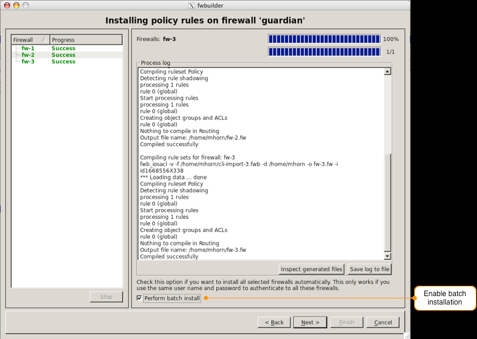

   Batch install - compilation progress with batch install checkbox.

When you click "Next", the program opens simplified version of the installation parameters dialog:

.. figure:: img/install-batch-options.png
   :alt: Batch install options dialog

   Batch install options.

This is the same dialog as when we tried to install to a single firewall, except the batch mode dialog does not offer an input fields for the alternative address and some other parameters. You cannot enter alternative addresses in the install dialog while running it in batch mode because it will talk to multiple firewalls and one alternative address is not going to be useful. When you run installer in the batch mode, it asks to enter parameters only once before the installation process begins. After that, it uses this data to connect to each firewall that was marked for installation in the first page of the installer wizard in turn, log in, upload new configuration and activate it there.
