Firewall Builder Cookbook
========================

.. sectnum::
   :start: 1

.. contents::
   :local:
   :depth: 2

The solutions to many security and firewall issues aren't always obvious. This chapter provides cookbook-like examples.

Changing IP Addresses in Firewall Configuration Created from a Template
-----------------------------------------------------------------------

When a firewall object is created from a template, its IP addresses might not match the addresses used in your network. This section demonstrates how these addresses can be changed.

We start with a firewall object created in with a three-interface template and the IP address used for the internal network is 192.168.1.0/255.255.255.0. Suppose we need to change it to 172.16.22.0/255.255.255.0. We need to change the IP address of the internal interface of the firewall, as well as the address used in the policy and NAT rules.

To begin, find the IP address of the internal interface of the firewall in the tree and double-click it to open it in the editor.

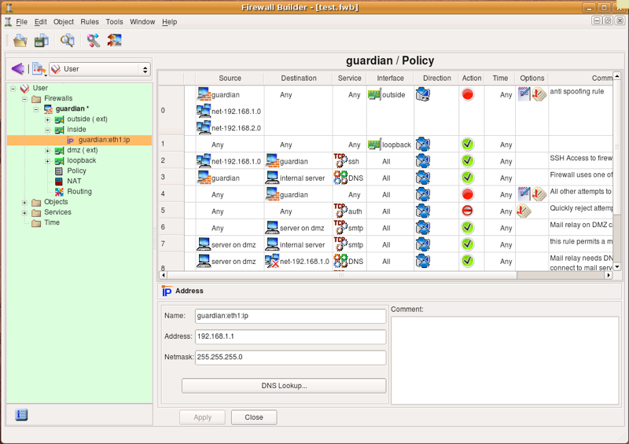

   New Firewall.

Edit the IP address (and possibly the netmask if needed), then click "Apply". This changes the IP address of the interface of the firewall.

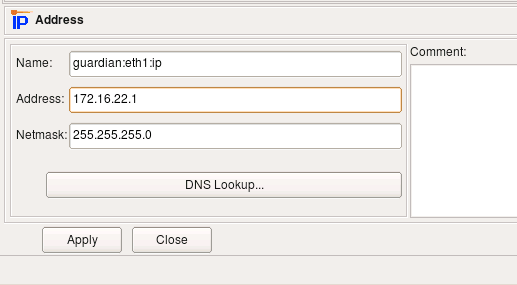

   Edit the Network Address.

Now we need to change the IP address used in the rules. To do this, we create a new network object with the correct address and replace the object net-192.168.1.0 in all rules with this new network object.

Use New Object menu to create the network object.

.. figure:: img/cookbook-003.png
   :alt: New Object menu expanded showing the option to create a New Network object

   Creating a New Network Object.

A new network object is created with default name "New Network" and IP address 0.0.0.0.

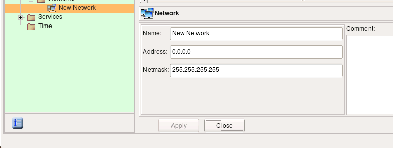

   New Object.

Edit the object name and address, then click Apply.

.. figure:: img/cookbook-005.png
   :alt: Network object editor showing the edited name "internal net" and address 172.16.22.0

   Edit Name and Address.

Select Object/Find to activate the search and replace dialog.

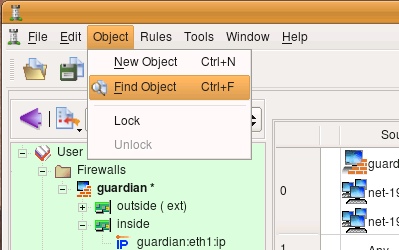

   Activate Find Dialog.

Drag and drop the object "net-192.168.1.0" from a policy rule or from its location in the "Standard" library to the left object field in the search and replace dialog.

.. figure:: img/cookbook-007.png
   :alt: Search and replace dialog with the original object net-192.168.1.0 dragged to the Find field

   Drag the Original Object to the Find Field.

Locate the new network object you just created and drag and drop it to the right object field in the search and replace dialog.

.. figure:: img/cookbook-008.png
   :alt: Search and replace dialog with the new object "internal net" dragged to the Replace field

   Drag the New Object to the Replace Field.

Change the scope to Policy of all firewalls and click Replace all. If you have many firewalls in the tree and you only want to replace in this one, use the scope policy of the opened firewall instead. A pop-up dialog appears telling you how many replacements have been done.

.. figure:: img/cookbook-009.png
   :alt: Confirmation dialog showing that 7 objects have been replaced

   Replacement Confirmation Dialog.

Note how the search and replace function replaced the object "net-192.168.1.0" with "internal net" in the NAT rules as well.

If the IP address used for the DMZ network in this template does not match your configuration, you can change it using the same procedure.

.. figure:: img/cookbook-010.png
   :alt: NAT rules view showing the new "internal net" object used in all rule sets

   New object used in all rule sets.

Examples of Access Policy Rules
-------------------------------

Firewall Object used in Examples
~~~~~~~~~~~~~~~~~~~~~~~~~~~~~~~~~

We start with the firewall object that looks like the one shown on the figure below. This firewall has three interfaces: eth0 (outside), eth1 (inside) and loopback. All addresses are assigned statically. The address of the inside interface "eth1" is 192.168.1.1/24; we also have a network object with name "net-192.168.1.0" that defines the internal network 192.168.1.0/24.

To illustrate generated configurations for platforms other than iptables/Linux in this chapter, I am using similarly configured firewall objects with different platform and host OS settings.

.. figure:: img/cookbook-011.png
   :alt: Firewall object tree showing interfaces eth0, eth1, and loopback with the IP address editor open

   Firewall and Its Interfaces Used in the Examples in this Chapter.

Permit Internal LAN to Connect to the Internet
~~~~~~~~~~~~~~~~~~~~~~~~~~~~~~~~~~~~~~~~~~~~~~~

In this example, we create a rule to permit our internal LAN to connect to the Internet using any protocol. The network object "net-192.168.1.0" should be configured with the IP address and netmask corresponding to those used on the internal network behind the firewall. Since the internal LAN in this example uses a private address block, the rules described here are insufficient and should be accompanied with corresponding NAT (Network Address Translation) rules. We discuss NAT rules in the next chapter.

.. figure:: img/cookbook-012.png
   :alt: Policy rule set showing rule 0 permitting net-192.168.1.0 to Any and rule 1 denying Any to Any

   Permit the Internal Network to Connect to the Internet.

Here are the iptables commands generated for this example:

.. code-block:: text

   $IPTABLES -A INPUT   -m state --state ESTABLISHED,RELATED -j ACCEPT
   $IPTABLES -A OUTPUT  -m state --state ESTABLISHED,RELATED -j ACCEPT
   $IPTABLES -A FORWARD -m state --state ESTABLISHED,RELATED -j ACCEPT
   # Rule 0 (global)
   #
   $IPTABLES -A INPUT   -s 192.168.1.0/24  -m state --state NEW -j ACCEPT
   $IPTABLES -A OUTPUT  -s 192.168.1.0/24  -m state --state NEW -j ACCEPT
   $IPTABLES -A FORWARD -s 192.168.1.0/24  -m state --state NEW -j ACCEPT
   #
   # Rule 1 (global)
   #
   $IPTABLES -N RULE_1
   $IPTABLES -A OUTPUT  -j RULE_1
   $IPTABLES -A INPUT   -j RULE_1
   $IPTABLES -A FORWARD -j RULE_1
   $IPTABLES -A RULE_1  -j LOG --log-level info --log-prefix "RULE 1 -- DENY "
   $IPTABLES -A RULE_1  -j DROP

Rules that utilize the module *state* and match states *ESTABLISHED,RELATED* permit reply packets, such as TCP ACKs, UDP reply packets, and ICMP messages associated with known sessions. These rules are automatically added at the beginning of the generated iptables script if the option "Accept ESTABLISHED and RELATED packets before the first rule" is turned on in the firewall object "Advanced" settings dialog. If you turn this option off, the rule will not be added automatically and you'll have to add it yourself. You can use the Custom Service object *ESTABLISHED*, which you can find in the *Standard* objects library, to do this.

The first rule was placed in all three chains: *INPUT*, *OUTPUT* and *FORWARD* because option "Assume firewall is part of any" was turned on in the "Advanced" settings dialog of this firewall object. This option directs the policy compiler to assume that the object *"Any"* matches the firewall itself as well. In other words, using "Any" in the Destination of the rule is equivalent to using a combination of any address and the firewall. To match packets headed for the firewall, the rule should be placed in the *INPUT* chain. Also, the network object within address 192.168.1.0/24 matches one of the interfaces of the firewall that has an address on this network. This means that this rule should also match packets sent by the firewall itself, provided the source address is that of the interface on the internal net. This requires the iptables command in the *OUTPUT* chain. And finally, the iptables command in the *FORWARD* chain matches packets sent by machines on the internal network.

Rule #1 catches all other packets going to, from, and across the firewall, and logs and drops them.

Let's see what gets generated for iptables if the option "Assume firewall is part of any" is turned off:

.. code-block:: text

   $IPTABLES -A INPUT   -m state --state ESTABLISHED,RELATED -j ACCEPT
   $IPTABLES -A OUTPUT  -m state --state ESTABLISHED,RELATED -j ACCEPT
   $IPTABLES -A FORWARD -m state --state ESTABLISHED,RELATED -j ACCEPT
   # Rule 0 (global)
   #
   $IPTABLES -A FORWARD -s 192.168.1.0/24  -m state --state NEW -j ACCEPT
   #
   # Rule 1 (global)
   #
   $IPTABLES -N RULE_1
   $IPTABLES -A FORWARD -j RULE_1
   $IPTABLES -A RULE_1  -j LOG --log-level info --log-prefix "RULE 1 -- DENY "
   $IPTABLES -A RULE_1  -j DROP

Automatically-added rules that match packets in states ESTABLISHED,RELATED are not affected by the "Assume firewall is part of any" option and always match in the chains INPUT, OUTPUT and FORWARD. Since the compiler does not assume the firewall matches "any" anymore, the rule with "any" is destination yields an iptables command only in the FORWARD chain. This applies both to the rule that permits outgoing connections from internal LAN and to the "Catch all" rule #1. The choice of the setting for this option is up to the policy designer. Some people find it more intuitive to leave it off and add rules to control access to and from the firewall explicitly. Note that default policy for all chains is set to DROP with the following commands at the very top of the generated iptables script:

.. code-block:: text

   $IPTABLES -P OUTPUT  DROP
   $IPTABLES -P INPUT   DROP
   $IPTABLES -P FORWARD DROP

This means that if you do not add rules to permit access to the firewall and turn option "Assume firewall is part of any" off, then all generated iptables rules will be in the FORWARD chain and all access to the firewall itself will be blocked by the default policy in the INPUT chain. On the other hand, if the option "Assume firewall is part of any" is on, then the rule permitting access from internal network to "any" has a side-effect of permitting access to the firewall as well. It is up to you to decide whether this is the desired behavior. You can always restrict access to the firewall and control it with a few rules somewhere close to the beginning of the policy, regardless of the setting of this option. We look at the examples of rules controlling access to the firewall in `Controlling Access to the Firewall`_.

Even if you choose to turn option "Assume firewall is part of any" off and do not add any rules to permit access to the firewall in your policy rule set, you can use another option in the firewall object "advanced" settings dialog for this. The option is called "Always permit ssh access to the firewall from management station" and allows you to enter a single IP address or subnet; it then automatically adds a rule to the generated script to permit SSH access to the firewall from this address. We demonstrate this feature in one of the examples below.

.. note::

   The examples below have been compiled with the option "Assume firewall is part of any" turned on.

Here is the PF configuration created for the same rules:

.. code-block:: text

   # Rule  0 (global)
   #
   pass quick inet from 192.168.1.0/24 to any keep state
   #
   # Rule  1 (global)
   #
   block log quick inet from any to any

Firewall Builder always generates PF configuration using its *"quick"* clause to switch to the first-match mode. In this PF configuration example, the first rule permits packets with source address on the 192.168.1.0/24 network and stops processing. The second rule will only inspect packets not matched by the first rule.

Here is the fragment of the PIX config generated for the same combination of rules:

.. code-block:: text

   ! Rule  0 (global)
   !
   access-list inside_acl_in remark 0 (global)
   access-list inside_acl_in permit ip 192.168.1.0 255.255.255.0 any
   !
   ! Rule  1 (global)
   !
   access-list outside_acl_in remark 1 (global)
   access-list outside_acl_in deny   ip any any log 4 interval 300
   access-list dmz50_acl_in remark 1 (global)
   access-list dmz50_acl_in deny     ip any any log 4 interval 300
   access-list inside_acl_in remark 1 (global)
   access-list inside_acl_in deny    ip any any log 4 interval 300

   access-group dmz50_acl_in in interface dmz50
   access-group inside_acl_in in interface inside
   access-group outside_acl_in in interface outside

Since the source address in the rule #0 is limited to the internal network, the policy compiler was able to determine which interface the access list command should be associated with and added it only to the ACL *"inside_acl_in"*.

The *"access-group"* commands are actually located at the very bottom of the generated script, after all other access-list commands. It is shown right next to the ACL rules here for presentation.

Allowing Specific Protocols Through, while Blocking Everything Else
~~~~~~~~~~~~~~~~~~~~~~~~~~~~~~~~~~~~~~~~~~~~~~~~~~~~~~~~~~~~~~~~~~~

This is one of the simplest, most basic tasks you may want your firewall to do: block all the traffic while letting certain protocols through. Let's assume that we have a network consisting of just the firewall "firewall1" and a few hosts behind it. We want to let SMTP through to the mail server from the Internet and block everything else. All we need to do is put the following rules in the Global Policy:

.. figure:: img/cookbook-013.png
   :alt: Policy rule set showing rule 0 permitting Any to mail server on SMTP and rule 1 denying and logging everything else

   Example of a Rule Permitting Only Certain Protocols to the Server and Blocking Everything Else.

Rule #0 allows SMTP through to the server, while rule #1 blocks and logs everything else. It is worth mentioning that this policy also blocks all the access to firewall itself, including access to it from internal hosts.

We do not need any additional rules to take care of "reply" packets coming back from the server to clients because our underlying firewall software supports stateful inspection and "understands" that such packets should be let through.

Here is the iptables script generated for these two simple rules:

.. code-block:: text

   $IPTABLES -A INPUT   -m state --state ESTABLISHED,RELATED -j ACCEPT
   $IPTABLES -A OUTPUT  -m state --state ESTABLISHED,RELATED -j ACCEPT
   $IPTABLES -A FORWARD -m state --state ESTABLISHED,RELATED -j ACCEPT
   # Rule 0 (global)
   #
   $IPTABLES -A OUTPUT  -p tcp -m tcp -d 192.168.1.100 \
       --dport 25 -m state --state NEW -j ACCEPT
   $IPTABLES -A FORWARD -p tcp -m tcp -d 192.168.1.100 \
       --dport 25 -m state --state NEW -j ACCEPT
   #
   # Rule 1 (global)
   #
   $IPTABLES -N RULE_1
   $IPTABLES -A OUTPUT  -m state --state NEW -j RULE_1
   $IPTABLES -A INPUT   -m state --state NEW -j RULE_1
   $IPTABLES -A FORWARD -m state --state NEW -j RULE_1
   $IPTABLES -A RULE_1  -j LOG --log-level info --log-prefix "RULE 1 -- DENY "
   $IPTABLES -A RULE_1  -j DROP

The generated iptables rules were placed in both *OUTPUT* and *FORWARD* chains because the option "Assume firewall is part of any" was turned on in the "Advanced" settings dialog of this firewall object. This option directs the policy compiler to assume that the object *"Any"* matches the firewall itself as well. In other words, using "Any" in Source of the rule was equivalent to using a combination of any address and the firewall. The resultant iptables commands should be placed in the OUTPUT chain to match packets generated by the firewall and FORWARD to match packets crossing the firewall. If you turn this option off, the program will only generate iptables rules in the FORWARD chain for this rule.

Here is the code generated for PF for the same rule:

.. code-block:: text

   # Rule  0 (global)
   #
   pass quick inet proto tcp from any to 192.168.1.100 port 25 keep state
   #
   # Rule  1 (global)
   #
   block log quick inet from any to any

In PF, we do not have to worry about chains and there is no option "Assume firewall is part of any" because there is no difference.

Here is the code generated for PIX for the same rule:

.. code-block:: text

   ! Rule  0 (global)
   !
   access-list outside_acl_in remark 0 (global)
   access-list outside_acl_in permit tcp any host 192.168.1.100 eq 25
   access-list dmz50_acl_in remark 0 (global)
   access-list dmz50_acl_in permit tcp any host 192.168.1.100 eq 25
   access-list inside_acl_in remark 0 (global)
   access-list inside_acl_in permit tcp any host 192.168.1.100 eq 25
   !
   ! Rule  1 (global)
   !
   access-list outside_acl_in remark 1 (global)
   access-list outside_acl_in deny   ip any any log 0 interval 300
   access-list dmz50_acl_in remark 1 (global)
   access-list dmz50_acl_in deny     ip any any log 0 interval 300
   access-list inside_acl_in remark 1 (global)
   access-list inside_acl_in deny    ip any any log 0 interval 300

In PIX, all access lists must be attached to interfaces of the firewall. Since the rule did not specify source address, the program has to generate access lists that would match any source, which means they should be attached to all interfaces of the firewall. Since my PIX test object has three interfaces: *outside*, *inside* and *dmz*, I ended up with ACL lines in three access lists, one for each interface.

Letting Certain Protocols through from a Specific Source
~~~~~~~~~~~~~~~~~~~~~~~~~~~~~~~~~~~~~~~~~~~~~~~~~~~~~~~~

In this example, we look at the rule that is similar to the previous one, but also matches source address. This rule permits access to the mail server inside from mail relay on DMZ and from no other source. Generated rules for iptables and pf are very similar, they just add source address matching. Generated rules for PIX are different because now the program can intelligently pick the right access list and avoid generating redundant rules.

.. figure:: img/cookbook-014.png
   :alt: Policy rule showing dmz-server as source, mail server as destination, SMTP as service, with Accept action

   A Rule Permitting only Certain Protocols from a Limited Set of Sources to the Server.

Here is the code generated for iptables from this rule:

.. code-block:: text

   # Rule 0 (global)
   #
   $IPTABLES -A FORWARD -p tcp -m tcp -s 192.168.2.22 -d 192.168.1.100 \
       --dport 25 -m state --state NEW -j ACCEPT

Since the source rule element was limited to the host on DMZ, the generated iptables rule is placed only in the FORWARD chain and also matches the source using "-s" clause.

Let's look at the configuration generated for PIX from the same rule:

.. code-block:: text

   ! Rule  0 (global)
   !
   access-list dmz50_acl_in remark 0 (global)
   access-list dmz50_acl_in permit tcp host 192.168.2.22 host 192.168.1.100 eq 25

   access-group dmz50_acl_in in interface dmz50
   access-group inside_acl_in in interface inside
   access-group outside_acl_in in interface outside

The rule was placed only in the access list attached to the DMZ interface, because packets with source address of the host on DMZ can only cross this interface of the firewall, assuming that spoofed packets are blocked by special rule, which is discussed below.

Interchangeable and non-interchangeable objects
~~~~~~~~~~~~~~~~~~~~~~~~~~~~~~~~~~~~~~~~~~~~~~~~

In the previous example, we put object "mail server" into the Destination field of the policy rule #0, because our goal was to permit the protocol SMTP to that host and not to any other one. This actually reflects the general principle Firewall Builder is based on: put the object for which you want to control access in the Source or Destination field of the policy rule. Two different objects with the same address may or may not be interchangeable, depending on their type and other parameters. One of the frequent mistakes is to create a host object with the IP address of the firewall, then use it in the policy and expect Firewall Builder to build a policy controlling access to the firewall. Unfortunately, it does not always work that way. If you wish to control access to or from the firewall machine, then put the firewall object into the policy rule.

Another example of two objects which may on the first glance represent the same thing, but in fact are not interchangeable, is an IP service object with the protocol number set to 1 and an ICMP service object with type and code set to "any". Both objects seem to represent the same type of service, namely "Any ICMP message". IP protocol 1 is in fact ICMP, so one would expect the behaviour of the firewall to be the same regardless of what type of service object is used. However, the target firewall software typically uses special syntax for indication of different protocols, so using specific syntax for ICMP protocol turns certain features on; for example, session state tracking and association of the ICMP packets to known sessions these packets might carry error messages for. Using just IP with protocol number 1 will most likely not turn these features on and therefore will lead to unexpected results.

An interface object and its IP address are interchangeable in rules, provided the interface has only one address. If the interface object has several address child objects, then using the interface object in a rule is equivalent to using all of its addresses in the same place. If interface has only one address, then the result will be the same whether you put interface object or its address in the rule. Also, using the firewall object in the rule should yield the same policy script as if you put all its interfaces in the same place instead. This one comes with a caveat though: many firewall platforms offer special syntax for rules that control access to or from the firewall itself and Firewall Builder takes advantage of this syntax, so the result may not look exactly the same, but should be equivalent in function. Some platforms, such as iptables, require using different chain to control access to and from firewall. Firewall Builder compares IP addresses used in the source and destination of rules to addresses of all interfaces of the firewall and uses proper chains, even if the address object in the rule is not the firewall object itself.

Two objects of the same type with different names but the same values of all other parameters are always interchangeable. Using different objects to describe the same object may be confusing, but the final firewall policy will be correct. Firewall Builder leaves design of the objects up to the firewall administrator.

Anti-spoofing rules
~~~~~~~~~~~~~~~~~~~~

Generally speaking, IP spoofing is a technique of generating IP packets with a source address that belongs to someone else. Spoofing creates a danger when hosts on the LAN permit access to their resources and services to trusted hosts by checking the source IP of the packets. Using spoofing, an intruder can fake the source address of his packets and make them look like they originated on the trusted hosts. The basic idea of anti-spoofing protection is to create a firewall rule assigned to the external interface of the firewall that examines source address of all packets crossing that interface coming from outside. If the address belongs to the internal network or the firewall itself, the packet is dropped.

Simple anti-spoofing rule looks like shown on the figure below. Unlike the rule in the previous example, anti-spoofing rule requires matching of the interface and direction. The idea is that packets that come from outside must not have source addresses that match internal network or the firewall itself. The only way to distinguish packets coming from outside from those coming from inside is to check which interface of the firewall they cross and in which direction. Here the rule matches interface eth0, which is external, and direction inbound.

Section 5.2.2 explains how a firewall object and its interfaces can be created. Section 5.2.5 has more details on the firewall's interfaces, their types, and other properties. Section 7.2.4 explains the concept of direction.

.. figure:: img/cookbook-015.png
   :alt: Anti-spoofing rule showing the firewall and internal network as source, Any as destination, on interface eth0 inbound with Deny action

   A Basic Anti-Spoofing Rule.

Here are the iptables commands generated for this rule:

.. code-block:: text

   # Rule 0 (eth0)
   #
   # anti spoofing rule
   #
   $IPTABLES -N In_RULE_0
   $IPTABLES -A INPUT   -i eth0 -s 192.0.2.1      -j In_RULE_0
   $IPTABLES -A INPUT   -i eth0 -s 192.168.1.1     -j In_RULE_0
   $IPTABLES -A INPUT   -i eth0 -s 192.168.1.0/24  -j In_RULE_0
   $IPTABLES -A FORWARD -i eth0 -s 192.0.2.1       -j In_RULE_0
   $IPTABLES -A FORWARD -i eth0 -s 192.168.1.1     -j In_RULE_0
   $IPTABLES -A FORWARD -i eth0 -s 192.168.1.0/24  -j In_RULE_0
   $IPTABLES -A In_RULE_0 -j LOG --log-level info --log-prefix "RULE 0 -- DENY "
   $IPTABLES -A In_RULE_0 -j DROP

The iptables commands were placed in INPUT and FORWARD chains to match both packets that are headed for the firewall and through the firewall to hosts behind it. Rules match source address of the packets and then log and drop them. Firewall Builder generated iptables commands to match all addresses of the firewall (192.168.1.1, 192.0.2.1) and network behind it (192.168.1.0/24).

Let's see what gets generated for the same rule for PF:

.. code-block:: text

   # Tables: (1)
   table <tbl.r0.s> { 192.0.2.1 , 192.168.1.1 }
   # Rule  0 (en0)
   # anti spoofing rule
   #
   block in log quick on en0 inet from <tbl.r0.s> to any
   block in log quick on en0 inet from 192.168.1.0/24 to any
   #

Here, the compiler uses tables to make generated PF code more compact. Table *tbl.r0.s* can be used in other rules wherever we need to operate with all addresses of the firewall.

Here is the same rule, compiled for PIX:

.. code-block:: text

   ! Rule  0 (Ethernet1/0)
   ! anti-spoofing rule
   !
   access-list outside_acl_in remark 0 (Ethernet1/0)
   access-list outside_acl_in remark anti-spoofing rule
   access-list outside_acl_in deny   ip host 192.0.2.1 any
   access-list outside_acl_in deny   ip host 192.168.2.1 any
   access-list outside_acl_in deny   ip host 192.168.1.1 any
   access-list outside_acl_in deny   ip 192.168.1.0 255.255.255.0 any
   access-group outside_acl_in in interface outside

Anti-Spoofing Rules for a Firewall with a Dynamic Address
~~~~~~~~~~~~~~~~~~~~~~~~~~~~~~~~~~~~~~~~~~~~~~~~~~~~~~~~~

An anti-spoofing rule must match all addresses of the firewall to leave no holes. However it is difficult to do if one interface of the firewall gets its IP address dynamically via the DHCP or PPP protocol. This address is unknown at the compile time and proper configuration cannot be generated by just including it. Some firewall platforms have syntax in their configuration language that provides a way to match an address of an interface at run-time, but other platforms do not have anything like this. Let's see how Firewall Builder works around this problem.

In this test, I use a variation of the same firewall object where external interface *"eth0"* is configured as "dynamic". The anti-spoofing rule looks exactly like the rule in the previous example and matches the same external interface "eth0", direction "inbound":

.. figure:: img/cookbook-016.png
   :alt: Anti-spoofing rule for a firewall with dynamic address showing net-192.168.1.0 and linux-dynamic as source on interface eth0 inbound with Deny action

   Basic Anti-Spoofing Rule.

The generated iptables script looks like this:

.. code-block:: text

   getaddr eth0  i_eth0

   # Rule 0 (eth0)
   #
   # anti spoofing rule
   #
   $IPTABLES -N In_RULE_0
   test -n "$i_eth0" && $IPTABLES -A INPUT   -i eth0 -s $i_eth0       -j In_RULE_0
   $IPTABLES -A INPUT   -i eth0 -s 192.168.1.1     -j In_RULE_0
   $IPTABLES -A INPUT   -i eth0 -s 192.168.1.0/24  -j In_RULE_0
   test -n "$i_eth0" && $IPTABLES -A FORWARD -i eth0 -s $i_eth0       -j In_RULE_0
   $IPTABLES -A FORWARD -i eth0 -s 192.168.1.1     -j In_RULE_0
   $IPTABLES -A FORWARD -i eth0 -s 192.168.1.0/24  -j In_RULE_0
   $IPTABLES -A In_RULE_0 -j LOG --log-level info --log-prefix "RULE 0 -- DENY "
   $IPTABLES -A In_RULE_0 -j DROP

The script defines a shell function *"getaddr"* at the beginning. This function uses *"ip addr show"* command to determine the actual address of the interface at the time when script is running and assigns the address to the shell variable *i_eth0*. The iptables commands then use this variable to build rules matching address of this interface. Otherwise, generated rules are the same as in the previous example.

Here is what is generated for PF:

.. code-block:: text

   table <tbl.r0.d> { en0 , 192.168.1.1 }
   # Rule  0 (en0)
   # anti spoofing rule
   #
   block in log quick on en0 inet from <tbl.r0.d> to any
   block in log quick on en0 inet from 192.168.1.0/24 to any

In PF, one can place interface name ("en0") in the table and PF will use its address at the execution time.

Unfortunately there is no workaround for this problem for PIX.
Using Groups
~~~~~~~~~~~~

Sometimes we need to define a lot of very similar rules for multiple hosts or networks. For example, there may be a need to permit the same service to 10 different hosts on the network, while still blocking it to all others. The simplest way to accomplish this is to add 10 rules with the same source and service fields and just different destinations. Another method is to add 10 objects to the Source or Destination rule element of the same rule. Either method can clutter the firewall policy and make it less readable. To avoid this, we can use groups. A group is just a container which includes references to multiple objects of the same or similar type. Firewall Builder supports groups of objects and groups of services. You can put "Address", "Host", "Network" and "Firewall" objects in an object group, but you cannot put service objects in such a group. Similarly, a service group can contain "IP Service", "TCP Service", "UDP Service" and "ICMP Service" objects, but cannot contain hosts or networks. Groups can contain other groups of the same type as well. Figure 14.17 represents an object group used in this example.

Groups make policy rules more readable, but object groups have the additional great advantage of being reusable. You can have many different rules using the same group object. If you ever need to add another host or address to the group, you only need to do it once and all rules will automatically pick the change after recompile.

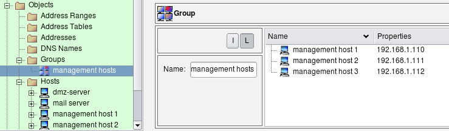

   Object Group Consisting of Three Host Objects

To add objects to a group, simply drag them from the tree on the left into group view on the right, or use Copy/Paste functions available via menus.

Once an appropriate group has been created, it can be used for the policy and NAT rules just like any other object.

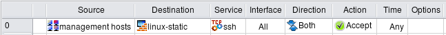

   A Rule Using an Object Group

Here is the iptables commands generated for this example:

.. code-block:: text

   # Rule 0 (global)
   #
   $IPTABLES -N Cid17843X27745.0
   $IPTABLES -A INPUT -p tcp -m tcp --dport 22 -m state --state NEW \
       -j Cid17843X27745.0
   $IPTABLES -A Cid17843X27745.0 -s 192.168.1.110 \
       -j ACCEPT
   $IPTABLES -A Cid17843X27745.0 -s 192.168.1.111 \
       -j ACCEPT
   $IPTABLES -A Cid17843X27745.0 -s 192.168.1.112 \
       -j ACCEPT

The generated iptables command is placed only in the INPUT chain because it controls access to the firewall and not to any addresses across it. The first iptables command matches chain, tcp port and state. If this rule does not match the packet, there is no need to waste CPU cycles checking source IP addresses. However, if the first rule matches, it passes control to the special user-defined chain "Cid17843X27745.0", which checks the source address of the packet. If the compiler were to generate an iptables script not using this temporary chain, it would end up comparing the TCP port and state three times, together with each possible source address. This can be rather wasteful if the rule is to match a lot of addresses. Separation of the matches using a temporary chain can improve performance a lot.

The compiler decides whether to use the temporary chain not because administrator used an object group in source in the original rule in the GUI, but because it determined that in the end it needs to compare source address of the packet against several addresses defined in the policy. If the group contained just one address, the generated iptables script would have consisted of just one iptables command without the temporary chain. If there was no group in "Source" of the rule but instead all these host objects were placed in "source" of the rule directly, the generated iptables script would look exactly like shown above, using a temporary chain for optimization.

Here is the code generated for PF for the same rule:

.. code-block:: text

   table <tbl.r0.d> { 192.0.2.1 , 192.168.1.1 }
   table <tbl.r0.s> { 192.168.1.110 , 192.168.1.111 , 192.168.1.112 }
   # Rule 0 (global)
   #
   pass quick inet proto tcp \
       from <tbl.r0.s> \
       to <tbl.r0.d> port 22 keep state

The policy compiler for PF extensively uses tables to produce compact code. PF tables are reused when needed.

Here is the configuration generated for PIX:

.. code-block:: text

   object-group network inside.id20599X27745.src.net.0
    network-object host 192.168.1.110
    network-object host 192.168.1.111
    network-object host 192.168.1.112
    exit

   ! Rule 0 (global)
   !
   access-list inside_acl_in remark 0 (global)
   access-list inside_acl_in permit tcp object-group inside.id20599X27745.src.net.0 \
       host 192.0.2.1 eq 22
   access-list inside_acl_in permit tcp object-group inside.id20599X27745.src.net.0 \
       host 192.168.1.1 eq 22
   !

As in the case of iptables, it is not that a group object was used in the original rule what triggered using object-group PIX clause. The compiler always checks the number of objects it needs to compare the packet against and uses object-groups statements to optimize generated code as appropriate.

Using an Address Range Instead of a Group
~~~~~~~~~~~~~~~~~~~~~~~~~~~~~~~~~~~~~~~~~~

In the example above, the three hosts used for the group "management hosts" have consecutive addresses 192.168.1.110, 192.168.1.111, 192.168.1.112. Although this example may be artificial, it allows us to illustrate how a different type of object could be used to achieve the same goal - to permit access to the firewall from these three addresses. The difference may be negligible when we deal with just three addresses, but when the list gets into hundreds it may become significant.

Since addresses of the management hosts are consecutive, we can use an address range object to describe them:

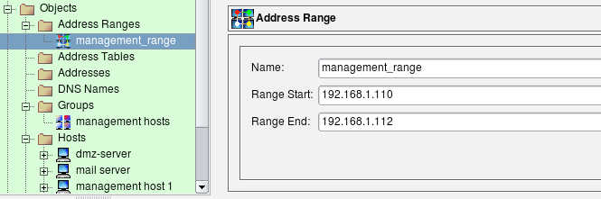

   Address Range Object for Management Hosts

We use this object in the rule just like any other object. Figure 14.20 shows the rule:

.. figure:: img/cookbook-020.png
   :alt: Rule Using an Address Range

   Rule Using an Address Range

The main difference in the generated code for the rule using a address range compared to the rule using collection of individual addresses is that compiler is allowed to optimize it. It tries to squeeze the address range to the minimal set of address and network objects. Here is how it looks like for iptables:

.. code-block:: text

   # Rule 0 (global)
   #
   $IPTABLES -A INPUT -s 192.168.1.110/31 \
       -m state --state NEW -j ACCEPT
   $IPTABLES -A INPUT -s 192.168.1.112 \
       -m state --state NEW -j ACCEPT

Again, the difference may not be very great when we have only three IP addresses, but in the case of a range that spans hundred addresses the performance gain and reduction in the size of generated script are significant.

The generated PF and PIX configurations look similar.

Controlling Access to the Firewall
~~~~~~~~~~~~~~~~~~~~~~~~~~~~~~~~~~~

Suppose we need to permit SSH access to the firewall. In the simplest case we just create a rule with a firewall object (fw) in the destination and a service object SSH in the service. The SSH service object can be found in the Standard objects tree, under Services/TCP. Here is the rule:

.. figure:: img/cookbook-021.png
   :alt: SSH from Anywhere

   SSH from Anywhere

This almost-trivial rule compiles into configurations using entirely different concepts depending on the chosen target firewall platform. The generated iptables rule is rather simple:

.. code-block:: text

   # Rule 0 (global)
   #
   $IPTABLES -A INPUT -p tcp -m tcp --dport 22 \
       -m state --state NEW -j ACCEPT

The generated PF configuration uses tables to list all IP addresses that belong to the firewall:

.. code-block:: text

   table <tbl.r0.d> { 192.0.2.1 , 192.168.1.1 }
   # Rule 0 (global)
   #
   pass in quick inet proto tcp \
       from any \
       to <tbl.r0.d> port 22 keep state

The iptables platform has a concept of chains that separate different packet flow paths inside the netfilter engine and packets headed for the firewall itself are always processed in the INPUT chain. This means the generated iptables script could be optimized. If comparison is done in the INPUT chain, the script does not have to verify the destination address to make sure it belongs to the firewall, since this has already been done by the kernel. PF does not have any mechanism like this, therefore generated PF configuration must compare destination address of the packet with all addresses of the firewall. This can be done in a more elegant way using PF tables, but still, we make the firewall compare destination address of the packet against a list of addresses.

The ipfw platform offers a shortcut for this, called the configuration option "me". Here is how the generated ipfw script looks for the same simple rule controlling SSH access to the firewall:

.. code-block:: text

   # Rule 0 (global)
   #
   "$IPFW" add 10 set 1 permit tcp \
       from any \
       to me 22 in \
       setup keep-state \
       || exit 1

"me" here means any address that belongs to the firewall.

The rule #0 on Figure 14.21 matches the ssh service, which has special meaning in case of PIX. There, control to the firewall for protocols such as SSH and Telnet is configured using special configuration commands "ssh" and "telnet" instead of using generic access lists. Here is what we get when we compile exactly the same rule for PIX:

.. code-block:: text

   ! Rule 0 (global)
   !
   ssh 0.0.0.0 0.0.0.0 outside
   ssh 0.0.0.0 0.0.0.0 dmz50
   ssh 0.0.0.0 0.0.0.0 inside

The rule in this example leaves the source address "any", which is why generated PIX commands match "0.0.0.0 0.0.0.0". Firewall Builder generated the "ssh" command for all interfaces of the PIX for the same reason.

Obviously, this rule makes the firewall too open because it permits SSH connections to it from any host on the Internet. It would be a good idea to restrict it so that it permitted connections only from the internal LAN. This is easy: we just put the object "LAN" in the source of the corresponding rule:

.. figure:: img/cookbook-022.png
   :alt: SSH from LAN

   SSH from LAN

The generated configuration for all supported firewall platforms will follow the same pattern but add matching of the source address of the packet to make sure it comes from local LAN. In case of PIX, there is only one "ssh" command attached to the internal interface because the program determined that network object used in the source of the rule matches only this interface of the firewall:

.. code-block:: text

   ! Rule 0 (global)
   !
   ssh 192.168.1.0 255.255.255.0 inside

This is better, but we should be careful not to permit more protocols to the firewall than we really intend to. Let's look at the simple rule permitting connects from internal LAN to the Internet (rule #0 on the screenshot below):

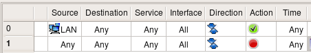

   LAN to Anywhere

Logic says that the destination "any" should match any address, including the ones that belong to the firewall itself. In Firewall Builder, this can actually be changed using a checkbox in the Compiler tab of the Firewall Settings dialog of the firewall object. If the checkbox "Assume firewall is part of any" is checked, then the compiler generates rules assuming that "any" matches the firewall as well. So, if this option is on, then this rule permits any connections from internal LAN to the firewall, regardless of the protocol. Here is how we can modify the rule permitting access to the Internet to exclude the firewall from it using negation:

.. figure:: img/cookbook-024.png
   :alt: Negating the Firewall as a Destination from the LAN

   Negating the Firewall as a Destination from the LAN

We are now using negation in the destination; the meaning of this rule is "permit connections on any protocols from machines on the network 'LAN' to any host except the firewall". We still need a rule described above to permit SSH to the firewall, but the rule permitting access from LAN to anywhere does not open additional access to the firewall anymore. I am going to demonstrate the generated iptables and pf configurations for rules with negation like this later.

Is there any way to make it even more restrictive? It is always a good idea to restrict access to the firewall to just one machine and use that machine to compile the policy and manage the firewall. Let's call this machine a management station "fw-mgmt". Here is more restrictive combination of rules that permits SSH access to the firewall only from fw-mgmt, permits access from LAN to anywhere except the firewall on any protocol and blocks everything else. This combination of rules works the same regardless of the setting of the option "Assume firewall is part of any".

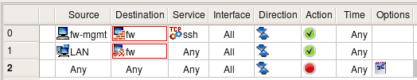

   Firewall Access from Only One Machine

Three rules shown above are very good at restricting access to the firewall from all sources except for the dedicated management workstation. The problem with them is that the firewall policy is never this simple and short. As you add more rules, you can add a rule with a side-effect of permitting access to the firewall sooner or later. This is one of the reason many administrators prefer to keep option "Assume firewall is part of any" turned off. In any case, it may be a good idea to build rules for the access to the firewall explicitly and group them together. It would look like something like this:

.. figure:: img/cookbook-026.png
   :alt: Firewall Access from Only One Machine; All Other Access to the Firewall Explicitly Denied

   Firewall Access from Only One Machine; All Other Access to the Firewall Explicitly Denied

I do not include the generated iptables, pf, pix code because it should be clear by now how should it look. It is more important that rules in Firewall Builder GUI look exactly the same regardless of the chosen target firewall platform.

Policy rules demonstrated in these examples are good at restricting access to the firewall while making it possible to manage it remotely via SSH. The problem with these rules is that administrator has to be careful to not break them in any way. One would think it should be hard to make an error in a policy fragment consisting of two rules, but this happens. These two rules are just a small part of a much larger rule set and may not be located in a prominent place right on top of it. As new rules are added to the policy, at some point some rule located above may block access to the whole network or range of addresses that accidentally includes management address of the firewall. This means even though the rules are there, the access to the firewall gets blocked as soon as updated policy is uploaded and activated. This is really bad news if the firewall machine is located far away in a remote office or data center.

To help avoid this bad (but all-too-familiar) situation, Firewall Builder offers another feature. To access it, select the firewall object in the tree and open it in the editor, then click "Firewall Settings" button. This is described in more details in :doc:`05 - Firewall Builder GUI`. In the dialog that appears, locate controls shown on Figure 14.27.

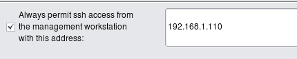

   Option Enabling an Automatic Rule to Permit SSH Access from a Management Workstation

Enter the single IP as shown on the screenshot or subnet definition in the input field and click "OK", then recompile the policy. Here is what gets added on the top of the generated iptables script:

.. code-block:: text

   $IPTABLES -A INPUT -m state --state ESTABLISHED,RELATED -j ACCEPT
   $IPTABLES -A OUTPUT -m state --state ESTABLISHED,RELATED -j ACCEPT
   $IPTABLES -A FORWARD -m state --state ESTABLISHED,RELATED -j ACCEPT
   # backup ssh access
   #
   $IPTABLES -A INPUT -p tcp -m tcp -s 192.168.1.110/255.255.255.255 \
       --dport 22 -m state --state NEW,ESTABLISHED -j ACCEPT
   $IPTABLES -A OUTPUT -p tcp -m tcp -d 192.168.1.110/255.255.255.255 \
       --sport 22 -m state --state ESTABLISHED,RELATED -j ACCEPT

I included rules matching "ESTABLISHED,RELATED" states in the screenshot to demonstrate that automatic rule for SSH access is added right after them. In other words, the SSH access rule is added at the very beginning of the script before any other rule. There are actually two rules. One to Permit inbound packets in chain INPUT; it matches the protocol TCP, destination port 22, and states "NEW,ESTABLISHED". The other rule permits outbound packets in chain OUTPUT, also protocol TCP, source port 22, and states "ESTABLISHED,RELATED". The purpose of this complexity is to make sure not only newly-established SSH sessions are permitted, but also "old" ones, established before the iptables rules are purged and reinstalled during firewall configuration reload. This helps ensure that the SSH session used to activate updated firewall policy does not get blocked and stall in the middle of the policy update process.

The same option is provided in the "Firewall settings" dialog for all supported firewall platforms. Firewall Builder always generates command to permit SSH to the firewall and makes it the very first in the access control rule set.

Now all the administrator needs to do is enter the IP address of the management workstation or address block it belongs to in the "Firewall Settings" dialog, then recompile and update generated policy on the firewall. There is no need to remember to add a special rule to permit SSH to the firewall in the policy rule set since this rule is now generated automatically. The generated rule is always on top of all other rules, so any mistake in the policy rule set will never block SSH access to the firewall. This is a good way to reduce the risk of locking yourself out of your own firewall.

.. tip::

   Using the automatic SSH access rule feature is highly recommended. It ensures that a mistake in the policy rule set will never block SSH access to the firewall, reducing the risk of locking yourself out.

Controlling Access to Different Ports on the Server
~~~~~~~~~~~~~~~~~~~~~~~~~~~~~~~~~~~~~~~~~~~~~~~~~~~~

Firewall Builder can be used to generate a policy for the firewall running on the server. Here is an example that shows how to set up a policy to permit access to different ports on the server. First of all, we need to create a firewall object to represent our server. The only difference between this case and a usual case where firewall protects one or more networks behind it is that for the server-firewall we only need to create one interface besides the loopback. The following screenshot demonstrates a policy that permits access to the web server running on this machine (both HTTP and HTTPS), as well as FTP and management access via SSH. Rule #1 allows the server to use DNS for name resolution. The service object used in the "Service" column in rule #1 is in fact a group that consists of TCP and UDP service objects that represent TCP and UDP variants of the protocol (both use the same destination port 53).

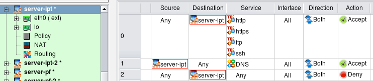

   Policy for Server

In this example, I turned the option "Assume firewall is part of any" off to simplify generated script. Here is the iptables script created for these rules:

.. code-block:: text

   # Rule 0 (global)
   #
   $IPTABLES -A INPUT -p tcp -m tcp -m multiport --dports 80,443,21,22 \
       -m state --state NEW -j ACCEPT
   #
   # Rule 1 (global)
   #
   $IPTABLES -A OUTPUT -p tcp -m tcp --dport 53 -m state --state NEW -j ACCEPT
   $IPTABLES -A OUTPUT -p udp -m udp --dport 53 -m state --state NEW -j ACCEPT
   #
   # Rule 2 (global)
   #
   $IPTABLES -N RULE_2
   $IPTABLES -A INPUT -j RULE_2
   $IPTABLES -A RULE_2 -j LOG --log-level info --log-prefix "RULE 2 -- DENY "
   $IPTABLES -A RULE_2 -j DROP

Firewall Builder optimized the generated rule and used the module multiport to put all four TCP ports used in rule #0 in one iptables command. The program always uses the module multiport to make generated script more compact, even if you use a mix of TCP, UDP, and ICMP services in the same rule. Since iptables does not support using a mix of protocols in the same command, the program generates several iptables commands, one for each protocol, but still can use the module multiport in each command if there are several ports to match.

Rule #1 was split because it matches both TCP and UDP protocols. Because of that, in the generated iptables script we have one command for tcp and another for udp.

Note how iptables commands generated for rule #0 went into chain INPUT, whereas commands generated for rule #1 went into chain OUTPUT. Rule #0 controls access to the server (object "server" is in "Destination" in the rule) but rule #1 controls connections initiated by the server (object "server" is in "Source" of the rule). Firewall Builder picks the right chain automatically.

Generated PF script uses tables to match four tcp ports in the same rule:

.. code-block:: text

   # Rule 0 (global)
   #
   pass in quick inet proto tcp from any to 192.168.1.10 \
       port { 80, 443, 21, 22 } keep state
   #
   # Rule 1 (global)
   #
   pass out quick inet proto tcp from 192.168.1.10 to any port 53 keep state
   pass out quick inet proto udp from 192.168.1.10 to any port 53 keep state
   #
   # Rule 2 (global)
   #
   block in log quick inet from any to 192.168.1.10

Sometimes the web server is bound to several IP addresses on the same machine. One typical situation when this is needed is when the web server supports multiple sites using the HTTPS protocol. The following firewall configuration demonstrates the case when interface eth0 has two IP addresses (192.0.2.1 and 192.0.2.2):

.. figure:: img/cookbook-029.png
   :alt: Server Configuration with Two IP Addresses

   Server Configuration with Two IP Addresses

Suppose the web server should accept HTTPS connections to both IP addresses, while HTTP and FTP are allowed only on address 192.0.2.1. The management access to the server is allowed only via protocol SSH and only from the management workstation "fw-mgmt". The following rules enforce this policy:

.. figure:: img/cookbook-030.png
   :alt: Policy for Server with Multiple IP Addresses

   Policy for Server with Multiple IP Addresses

.. note::

   The same rules could be used to permit or deny access to different ports on a server located on the network behind a dedicated firewall.

Here is how generated iptables script looks like:

.. code-block:: text

   # Rule 0 (global)
   #
   $IPTABLES -A INPUT -p tcp -m tcp -d 192.0.2.1 --dport 443 -m state --state NEW \
       -j ACCEPT
   $IPTABLES -A INPUT -p tcp -m tcp -d 192.0.2.2 --dport 443 -m state --state NEW \
       -j ACCEPT
   #
   # Rule 1 (global)
   #
   $IPTABLES -A INPUT -p tcp -m tcp -m multiport -d 192.0.2.1 --dports 80,21 \
       -m state --state NEW -j ACCEPT
   #
   # Rule 2 (global)
   #
   $IPTABLES -A INPUT -p tcp -m tcp -s 192.0.2.100 -d 192.0.2.1 --dport 22 \
       -m state --state NEW -j ACCEPT
   #

These iptables commands should be quite obvious. PF rules in this example also look very familiar:

.. code-block:: text

   # Tables: (1)
   table <tbl.r0.d> { 192.0.2.1 , 192.0.2.2 }

   # Rule 0 (global)
   #
   pass quick inet proto tcp from any to <tbl.r0.d> port 443 keep state
   #
   # Rule 1 (global)
   #
   pass quick inet proto tcp from any to 192.0.2.1 port { 80, 21 } keep state
   #
   # Rule 2 (global)
   #
   pass quick inet proto tcp from 192.0.2.100 to 192.0.2.1 port 22 keep state

Firewall Talking to Itself
~~~~~~~~~~~~~~~~~~~~~~~~~~

Many services running on the firewall machine need to be able to establish connections to the same machine. X11, RPC, DNS are services like that, to name a few. Blocking these services on the firewall can cause various problems, depending on what protocol is being blocked. If it is DNS, then it may take a lot longer than usual to get to a command-line prompt when logging in to the machine using Telnet or SSH. Once logged in, you won't be able to resolve any host names into addresses. If X11 is blocked, then X server and any graphic environment using it (KDE, Gnome etc.) won't start. In any case though the problem can easily be solved by adding a simple any-any rule and specifying the loopback interface of the firewall to permit all sorts of communications. As shown on Figure 14.31, this rule must specify the loopback interface, have action Accept and direction Both.

.. figure:: img/cookbook-031.png
   :alt: Rule Permitting Everything on the Loopback Interface

   Rule Permitting Everything on the Loopback Interface

.. note::

   Running X11 and other complex services on the dedicated firewall machine should be discouraged. However, you may want to run a firewall to protect a server, workstation, or laptop where X11, RPC, and other services are perfectly normal.

The generated iptables commands are placed in INPUT and OUTPUT chains because packets sent by the firewall to itself never hit FORWARD chain. Options ``-i lo`` and ``-o lo`` nail interface and direction:

.. code-block:: text

   $IPTABLES -A INPUT  -i lo -m state --state NEW -j ACCEPT
   $IPTABLES -A OUTPUT -o lo -m state --state NEW -j ACCEPT

For PF, we can specify interface to match but keep direction open so both "in" and "out" will match:

.. code-block:: text

   pass quick on lo inet from any to any keep state

Blocking Unwanted Types of Packets
~~~~~~~~~~~~~~~~~~~~~~~~~~~~~~~~~~~

Fragmented IP packets, although useful in certain situations, are often used as a tool to probe and penetrate simple packet filters. Particular kinds of fragmented packets, namely those with incorrect length specifications, are especially bad because they can cause some operating systems to crash (for example Windows NT was known to crash before a fix was developed and published by Microsoft). These packets therefore are considered potentially harmful and should be blocked on the perimeter of your network. Many firewall platforms provide ways to deal with such packets.

In Firewall Builder, we provide a way to set flags or options in the IP service object. Two options deal with fragments: one is called "all fragments" and another "short fragments". Figure 14.32 shows how a user-defined object called "fragments" looks with both options turned on. Policy compilers recognize this object and generate correct code for underlying firewall software platform.

.. figure:: img/cookbook-032.png
   :alt: IP Service Object Representing Fragmented Packets

   IP Service Object Representing Fragmented Packets

The "ip_fragments" object, which is included in the section "Services/IP" of the Standard objects tree, is set to block "short" fragments only.

Another potentially harmful type of packets is so called "Christmas tree" packet. This one is just a TCP packet with an impossible combination of TCP flags or even all TCP flags turned on at once (for example SYN, ACK, FIN, RST, PSH). This combination is never used in real communications, so if a packet like that appears at the boundary of your network, it should be considered illegal and blocked. Object "tcp-xmas" is included in the section "Services/TCP" of the standard objects database coming with Firewall Builder.

Some platforms provide a mechanism to turn on and off stateful inspection on individual rules. Turning it off on those rules which do not require it may improve performance of the firewall. Obviously, we do not need stateful inspection while analysing fragmented packets as we do not really want any session to be established, so we can safely use this option on this rule. One example of firewall platform which supports stateful inspection but provides a way to turn it on and off is iptables. In Firewall Builder, this can be done in the rule options dialog (which is platform-sensitive and shows different options for different platforms). Figure 14.33 shows rule logging options dialog for iptables:

.. figure:: img/cookbook-033.png
   :alt: Rule Options Dialog for iptables Firewall

   Rule Options Dialog for iptables Firewall

Here is an example of the policy rule which is intended to block short fragments and TCP "Christmas scan" packets. The icon in the Options column indicates that logging is turned on.

.. figure:: img/cookbook-034.png
   :alt: A Rule Blocking Short Fragmented Packets and TCP Christmas Scan Packets

   A Rule Blocking Short Fragmented Packets and TCP "Christmas Scan" Packets

This rule applies to all packets crossing the firewall regardless of their origin. This means that it will block such packets originating in your network, too. If by some reason you might want to be able to send this kind of packets out, then specify your external interface in the Interface column.

Using Action 'Reject': Blocking Ident Protocol
~~~~~~~~~~~~~~~~~~~~~~~~~~~~~~~~~~~~~~~~~~~~~~~

Suppose we want to block connections to certain ports on the server behind the firewall, but want to do it in a "polite" manner that lets the sender host know right away that the connection attempt was blocked so it appears that our server is not listening on that port at all. One of the practical applications of this setup would be blocking Ident connections to a mail relay or a mail server. Sendmail and many other MTAs (Mail Transport Agents) attempt to connect to Ident port (TCP port 113) on the mail relay every time they accept e-mail from that relay. Many believe that the Ident protocol is practically useless and does not really serve as a protection against SPAM or for any other useful purpose. Unfortunately, silent blocking of Ident connections on the firewall using a rule with action "Deny" adds a delay in the e-mail delivery. This happens because when the sender host tries to establish the Ident connection to the recipient, it sends the TCP SYN packet to it (the first packet in three-way TCP handshake) and then waits for TCP ACK packet in response. However, it never sees it because recipient's firewall blocked its first TCP SYN packet. In situations like this, the sender host assumes the reply packet got lost and tries to send the TCP SYN packet again. It repeats this for a few seconds (usually 30 sec) before it gives up. This adds a 30-second delay to e-mail delivery. Our intent is to show how one can construct a policy rule to block Ident without causing this delay.

The simplest way to block any protocol is to use a "Deny" action in the policy rule. Since "Deny" causes the firewall to silently drop the packet, the sender never knows what happened to it and keeps waiting for response. To avoid this delay we will set rule Action to "Reject". Normally "Reject" makes the firewall to send ICMP "unreachable" message back to sender, thus indicating that access to requested port is denied by the firewall. This may be insufficient in some cases, because the host trying to connect to our Ident port won't understand this type of ICMP message and will keep trying. In fact, most OSs do not recognize an ICMP "administratively prohibited" message and do keep trying. To make the host on the other side stop its attempts right away, we need to send an TCP RST packet back instead of an ICMP message. This can be done by setting the appropriate parameter for the "Reject" action. To set an Action parameter, change the Action to "Reject," then double-click the Reject icon to get the parameters dialog. (see Figure 14.36). It is also safe to turn stateful inspection off on this rule since we do not want connection to be established and therefore do not need to keep track of it.

.. figure:: img/cookbook-035.png
   :alt: Using a Reject Action with the Rule Option

   Using a "Reject" Action with the Rule Option

.. figure:: img/cookbook-036.png
   :alt: Adding a Rule Option to Send an TCP RST Packet

   Adding a Rule Option to Send an TCP RST Packet

Supported firewall platforms use different syntax for rules that should drop packets and send an ICMP or TCP RST packet back. Here is what Firewall Builder generates for the rule shown above for iptables:

.. code-block:: text

   # Rule 0 (global)
   #
   $IPTABLES -A FORWARD -p tcp -m tcp -d 192.168.1.100 --dport 113 \
       -j REJECT --reject-with tcp-reset

For PF it uses "return-rst" option:

.. code-block:: text

   # Rule 0 (global)
   #
   block return-rst quick inet proto tcp \
       from any \
       to 192.168.1.100 port 113

There is no equivalent configuration option for PIX.

Using Negation in Policy Rules
~~~~~~~~~~~~~~~~~~~~~~~~~~~~~~

Suppose we want to set up a rule to permit access from the host on DMZ net "mail_relay_1" to hosts on the Internet, but do not want to open access from it to machines on our internal network represented by the object "internal-network". Since we want it to connect to hosts on the Internet and cannot predict their addresses, we have to use "any" as a destination in the policy rule. Unfortunately "any" includes our internal net as well, which is going to open undesired hole in the firewall.

There are two solutions to this problem. First, we can use two rules: first will deny access from "mail_relay_1" to "internal_net" and the second will permit access from "mail_relay_1" to "any". Since rules are consulted in the order they are specified in the policy, access to the internal net will be blocked by the first rule since the packet would hit it first. These two rules are represented on Figure 14.37.

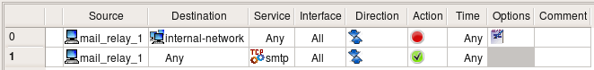

   Using Two Rules to Block Access from the DMZ to the Internal Net and Permit Access to the Internet

Here are the generated iptables rules:

.. code-block:: text

   # Rule 0 (global)
   #
   $IPTABLES -A FORWARD -p tcp -m tcp -s 192.168.2.22 -d 192.168.1.0/24 \
       --dport 25 -j DROP
   #
   # Rule 1 (global)
   #
   $IPTABLES -A FORWARD -p tcp -m tcp -s 192.168.2.22 --dport 25 \
       -m state --state NEW -j ACCEPT

Another solution uses negation. We can specify destination in the rule as "not internal_net", thus permitting access to anything but "internal_net". Negation can be enabled and disabled in the pop-up menu which you call by right-clicking the corresponding rule field. This rule depends on the rules below it to block access from "mail_relay1" to the "internal_net". If the policy was built using a general principle of blocking everything and then enabling only types of connections that must be permitted, then it usually has a "catch-all" rule at the bottom that blocks everything. This last rule is going to deny connections from the "mail_relay1" to "internal_net".

.. figure:: img/cookbook-038.png
   :alt: Using a Rule with Negation to Block Access from the DMZ to the Internal Net and Permit Access to the Internet

   Using a Rule with Negation to Block Access from the DMZ to the Internal Net and Permit Access to the Internet

Firewall Builder can use the "!" option to generate a compact iptables command for this rule:

.. code-block:: text

   # Rule 0 (global)
   #
   $IPTABLES -A FORWARD -p tcp -m tcp -s 192.168.2.22 -d ! 192.168.1.0/24 \
       --dport 25 -m state --state NEW -j ACCEPT

Negation Can Be Used in NAT Rules in a Similar Way

Firewall Builder can use similar "!" option for PF as well, but there is no negation in the PIX ACL syntax.

Things get more complicated if we have several networks inside and want to build a rule to permit connects from a server on DMZ to everywhere except for the three internal networks:

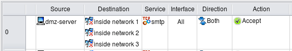

   Using a Rule with Negation to Block Access from DMZ to Internal Net and Permit Access to the Internet

Simple "!" negation in the generated iptables command won't work, so the program generates the following more complicated script:

.. code-block:: text

   # Rule 0 (global)
   #
   $IPTABLES -N Cid168173X9037.0
   $IPTABLES -A FORWARD -p tcp -m tcp -s 192.168.2.22 --dport 25 \
       -m state --state NEW -j Cid168173X9037.0
   $IPTABLES -A Cid168173X9037.0 -d 192.168.1.0/24  -j RETURN
   $IPTABLES -A Cid168173X9037.0 -d 192.168.10.0/24 -j RETURN
   $IPTABLES -A Cid168173X9037.0 -d 192.168.20.0/24 -j RETURN
   $IPTABLES -A Cid168173X9037.0 -j ACCEPT

The first rule checks protocol, port number, and source address and if they match, passes control to the user-defined chain where destination address is compared with addresses of the three networks we want to protect. If either one of them matches, the iptables target "RETURN" terminates analysis in the temporary chain and returns control. Note that in this case, the firewall does not make any decision what to do with the packet. The rule Figure 14.39 in the GUI specifies action for the packets that do *not* head for the internal networks but does not say anything about those that do. Some other rules in the policy should decide what to do with them. This is why the generated iptables script uses target "RETURN" instead of "DROP" or "ACCEPT" to simply return from the temporary chain and continue analysis of the packet further.

For PF, Firewall Builder uses combination of the "!" option and a table:

.. code-block:: text

   table <tbl.r0.d> { 192.168.1.0/24 , 192.168.10.0/24 , 192.168.20.0/24 }
   # Rule 0 (global)
   #
   pass quick inet proto tcp \
       from 192.168.2.22 \
       to ! <tbl.r0.d> port 25 keep state

Tagging Packets
~~~~~~~~~~~~~~~

Tagging packets (or packet marking) can be a very useful option that allows you to match a packet at one point in the rule set but act on it later on. This option can be combined with rule actions or rule branching for even more flexibility. Tagging can also be used to interact with packet processing not intended to enforce security policies, such as traffic shaping or QoS. Packet tags assigned by iptables can later be used for traffic shaping with the Linux utility "tc".

Not every target platform supports packet tagging; see :doc:`07 - Firewall Object` for details on platform support for tagging.

In Firewall Builder, packet tagging is accomplished using a special service object type called TagService. First, you create a TagService object, specifying a tag number or a string. To use this object to match tagged packets, just drop the object into the Service rule element in a policy rule. To mark a packet with the tag, select the Tag option from the Options context menu and drop the TagService object into the well in the Options dialog. Let's use an example given in the "A Practical Guide to Linux Traffic Control" (http://blog.edseek.com/~jasonb/articles/traffic_shaping/index.html) to illustrate this. They show how packets can be tagged using iptables target "MARK" so that they can be placed in the right queue for traffic shaping later on. The iptables rule we will create looks like this:

.. code-block:: text

   iptables -t mangle -A POSTROUTING -o eth2 -p tcp --sport 80 -j MARK --set-mark 1

Note how the rule should be placed in the table "mangle", chain "POSTROUTING". This is how the target MARK works; the administrator is expected to know this if they write iptables rules by hand.

We start with a tag service object configured with tag "1":

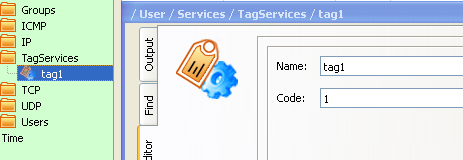

   Simple TagService Object

We also need a TCP service object to match source port 80:

.. figure:: img/cookbook-041.png
   :alt: TCP Service to Match Source Port 80

   TCP Service to Match Source Port 80

And now the rule:

   Rule Matching the Tag Service

In order to replicate the rule from the Guide, I leave Source and Destination "any", put outside interface of the firewall in "Interface" column, set direction to "Outbound", set action to "Tag" and make it stateless. The following screenshots demonstrate how this is done:

.. figure:: img/cookbook-043.png
   :alt: Configuring the Tag Action

   Configuring the Tag Action

.. figure:: img/cookbook-044.png
   :alt: Configuring Rule Options to Make the Rule Stateless

   Configuring Rule Options to Make the Rule Stateless

This configuration makes Firewall Builder generate an iptables command that is exactly the same as the one given in "A Practical Guide to Linux Traffic Control."

The rule, reproduced from the Guide, is stateless and matches and tags every reply HTTP packet crossing the firewall. This is not very efficient in case the firewall has to forward heavy HTTP traffic because it has to work on every single packet. To make things more efficient, iptables can mark whole sessions which means individual packets can be marked automatically as long as they belong to the session that was marked once. To use this feature with Firewall Builder, turn on the checkbox "Mark connections created by packets that match this rule" in the dialog Figure 14.43, where you configure options for the rule action and where the well into which you had to drop the tag service object is located. This checkbox modifies generated iptables script by adding a call to CONNMARK iptables target that marks whole connection and also by adding the following rule on top of the script:

.. code-block:: text

   # ================ Table 'mangle', automatic rules
   $IPTABLES -t mangle -A PREROUTING -j CONNMARK --restore-mark

This rule automatically restores mark on the packets that belong to the marked session.
Adding IPv6 Rules to a Policy
~~~~~~~~~~~~~~~~~~~~~~~~~~~~~

We start with a firewall object that has some basic IPv4 policy. First, we need to add IPv6 addresses to its interfaces. Right-click to open the context menu associated with the interface object in the tree and click the item "Add IPv6 address".

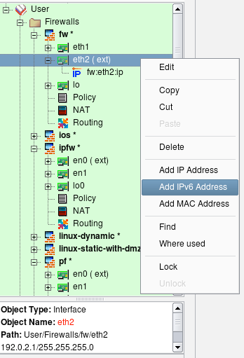

   Adding IPv6 Addresses to an Interface.

Enter the address and netmask length, using the address required by your topology.

.. figure:: img/cookbook-046.png
   :alt: Entering Address and Netmask

   Entering Address and Netmask.

Adding IPv6 to an Internal Interface

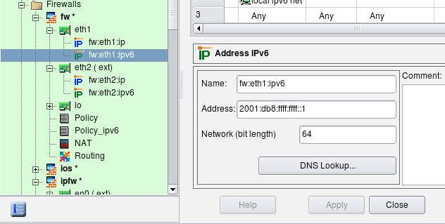

   The Internal Interface.

We also need to create a network object to represent our local IPv6 network. Click New Network IPv6 in the new object menu.

.. figure:: img/cookbook-048.png
   :alt: Creating the IPv6 Network Object

   Creating the IPv6 Network Object.

Enter the name and address of this network. We are using the link-local address for illustration purposes.

.. figure:: img/cookbook-049.png
   :alt: The IPv6 Network Object Name and Address

   The IPv6 Network Object Name and Address.

Inspect the regular policy object. To see its parameters, double-click it in the tree to open it in the editor (see screenshot below). This object has a Name, IPv4/IPv6 setting and a Top ruleset checkbox. For iptables firewalls, there is also a pair of radio buttons that indicates whether the policy should affect filter+mangle tables or just mangle table.

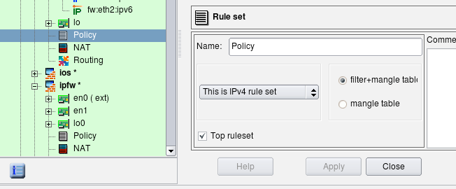

   Policy Parameters.

The *IPv4/IPv6* setting tells the compiler how it should interpret addresses of objects that appear in the rules. Possible configurations are "IPv4 only", "IPv6 only" and "Mixed IPv4 and IPv6":

.. figure:: img/cookbook-051.png
   :alt: IPv4/IPv6 Rule Set Configuration

   IPv4/IPv6 Rule Set Configuration.

* **"IPv4 only rule set"** - Only addressable objects with IPv4 addresses will be used in the rules. If an object with an IPv6 address appears in rules, it is ignored. IPv6-only services such as ICMPv6 are also ignored. TCP and UDP services are used since they apply for both IPv4 and IPv6 rules.

* **"IPv6 only rule set"** - Only objects with IPv6 addresses are used and those with IPv4 addresses are ignored. IPv6-only services such as ICMPv6 are used but IPv4-only services such as ICMP are ignored. TCP and UDP services are used since they apply for both IPv4 and IPv6 rules.

* **"Mixed IPv4 and IPv6 only rule set"** - The compiler makes two passes over the same rules, first to produce IPv4 configuration and then to produce IPv6 configuration. On each pass it uses only address objects with addresses matching address family of the pass. This is the best configuration for transitional configurations when IPv6 rules are gradually added to existing IPv4 configuration. Note that if you add IPv6 address to an interface of a firewall or a host object used in the rules, the compiler will use IPv4 addresses of the interface on IPv4 pass and new IPv6 address of the same interface on the IPv6 pass. This principle also applies to the mixed groups of addresses and services.

Compilers treat the *"top rule set"* parameter differently, depending on the firewall platform:

* **iptables:** rules defined in such rule set will go into built-in chains INPUT, OUTPUT, FORWARD etc. Rules defined in rule sets where this checkbox is not checked go into user-defined chain with the name the same as the name of the rule set.

* **PF:** rules defined in the rule set with "top rule set" checkbox turned off go into an anchor with the name of the rule set.

* **Cisco IOS access lists:** if the top rule set checkbox is turned off, the rules go into access list with the name prefixed with the name of the rule set; this access list will not be assigned to interfaces via "ip access-group" command. Rule sets with checkbox "top rule set" checked generate ACLs with names consisting of the shortened name of interface and direction abbreviation ("in" or "out"). Only these lists are assigned to interfaces.

To add new policy, right-click the firewall object in the tree to open the context menu and use the menu item Add Policy Rule Set.

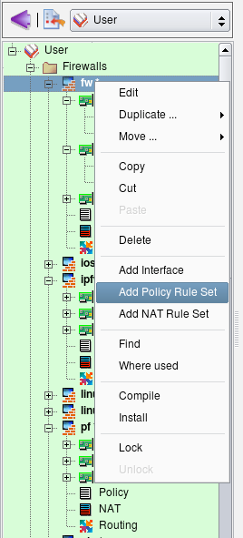

   Adding a Policy Rule Set.

Assign a unique name to the new policy object, make it IPv6, and check the top ruleset checkbox, then click Apply.

.. figure:: img/cookbook-053.png
   :alt: Setting Rule Set Parameters

   Setting Rule Set Parameters.

Now click the new policy object in the tree ("Policy_ipv6") and add some rules as usual. Here we have added a rule to permit all on loopback, a rule to permit incoming HTTP and ICMPv6 to the firewall and a rule to permit outgoing sessions from the internal network (object "local ipv6 net") and the firewall itself.

.. figure:: img/cookbook-054.png
   :alt: Adding Policy Rules

   Adding Policy Rules.

Now compile the policy. Note that in the progress output the compiler shows that it first processes IPv4 policy rule set, then compiles IPv6 policy rule set. I still have bunch of rules in the IPv4 policy from the previous examples in this section but the IPv6 policy is small and only has a few rules as shown on the screenshot above.

.. code-block:: text

   $ fwb_ipt -v -f policy_rules.fwb fw
   *** Loading data ... done
   Compiling rules for 'nat' table
   processing 1 rules
   rule 0 (NAT)
   Compiling ruleset Policy for 'mangle' table
   processing 1 rules
   rule 0 (eth2)
   Compiling ruleset Policy for 'filter' table
   processing 17 rules
   rule 1 (global)
   rule 2 (global)
   rule 3 (global)
   rule 4 (global)
   rule 5 (global)
   rule 6 (global)
   rule 7 (global)
   rule 8 (global)
   rule 9 (global)
   rule 10 (global)
   rule 11 (eth2)
   rule 12 (lo)
   rule 13 (global)
   rule 14 (global)
   rule 15 (global)
   rule 16 (global)
   rule 17 (global)
   Compiling ruleset Policy_ipv6 for 'mangle' table, IPv6
   Compiling ruleset Policy_ipv6 for 'filter' table, IPv6
   processing 4 rules
   rule Policy_ipv6 1 (global)
   rule Policy_ipv6 2 (global)
   rule Policy_ipv6 3 (global)
   Compiled successfully

Here is a fragment of the generated script. The script uses the ip6tables routine to load rules into the kernel. The option "Assume firewall is part of any" was turned off in this firewall object so the rule #1 generated only iptables commands in the INPUT chain.

.. code-block:: text

   # ================ Table 'filter', rule set Policy_ipv6
   # Policy compiler errors and warnings:
   #
   # Rule Policy_ipv6 0 (lo)
   #
   $IP6TABLES -A INPUT  -i lo    -m state --state NEW  -j ACCEPT
   $IP6TABLES -A OUTPUT  -o lo    -m state --state NEW  -j ACCEPT
   #
   # Rule Policy_ipv6 1 (global)
   #
   echo "Rule Policy_ipv6 1 (global)"
   #
   $IP6TABLES -A INPUT  -p tcp -m tcp  --dport 80  -m state --state NEW  -j ACCEPT
   $IP6TABLES -A INPUT  -p ipv6-icmp  -m state --state NEW  -j ACCEPT
   #
   # Rule Policy_ipv6 2 (global)
   #
   echo "Rule Policy_ipv6 2 (global)"
   #
   $IP6TABLES -A OUTPUT  -m state --state NEW  -j ACCEPT
   $IP6TABLES -A FORWARD  -s 2001:db8:ffff:ffff::/64   -m state --state NEW  -j ACCEPT
   #
   # Rule Policy_ipv6 3 (global)
   #
   echo "Rule Policy_ipv6 3 (global)"
   #
   $IP6TABLES -N Policy_ipv6_3
   $IP6TABLES -A FORWARD  -j Policy_ipv6_3
   $IP6TABLES -A Policy_ipv6_3  -j LOG  --log-level info --log-prefix "RULE 3 -- DENY "
   $IP6TABLES -A Policy_ipv6_3  -j DROP

Let's try to compile the policy rule set configured as mixed IPv4+IPv6. To illustrate, I am using two simple rules.

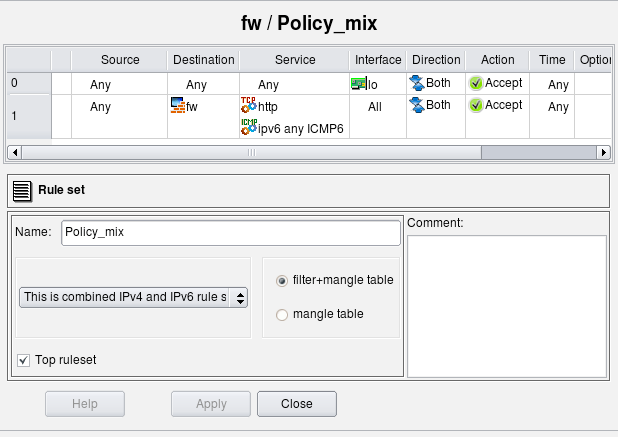

   Mixed IPv4/IPv6 Rule Set Parameters.

Rule #0 permits everything on the loopback. The loopback interface of the firewall has two addresses: 127.0.0.1/8 and ::1/128. Rule #1 permits HTTP and any ICMPv6 to the firewall. Here is the generated iptables script for these two rules:

.. code-block:: text

   # ================ IPv4

   # ================ Table 'filter', rule set Policy_mix
   # Policy compiler errors and warnings:
   #
   # Rule Policy_mix 0 (lo)
   #
   $IPTABLES -A INPUT  -i lo    -m state --state NEW  -j ACCEPT
   $IPTABLES -A OUTPUT  -o lo    -m state --state NEW  -j ACCEPT
   #
   # Rule Policy_mix 1 (global)
   #
   $IPTABLES -A INPUT  -p tcp -m tcp  --dport 80  -m state --state NEW  -j ACCEPT

   # ================ IPv6

   # ================ Table 'filter', rule set Policy_mix
   # Policy compiler errors and warnings:
   #
   # Rule Policy_mix 0 (lo)
   #
   $IP6TABLES -A INPUT  -i lo    -m state --state NEW  -j ACCEPT
   $IP6TABLES -A OUTPUT  -o lo    -m state --state NEW  -j ACCEPT
   #
   # Rule Policy_mix 1 (global)
   #
   $IP6TABLES -A INPUT  -p tcp -m tcp  --dport 80  -m state --state NEW  -j ACCEPT
   $IP6TABLES -A INPUT  -p ipv6-icmp  -m state --state NEW  -j ACCEPT

The script has two parts, one for IPv4 and another for IPv6, generated from the same rule set "Policy_mix". The IPv4 part has only IPv4 addresses and services. The rule that permits ICMPv6 to the firewall is missing in this part of the script because ICMPv6 does not match the address family. The rule that permits HTTP to the firewall is there, though. The second (IPv6) part of the script both permits HTTP and ICMPv6 to the firewall.

Note: the rule that matches on an interface (column "Interface" is not "any") will compile for IPv6 only if this interface has IPv6 address.

If the loopback interface of the firewall did not have an address ::1/128, then the IPv6 part of the generated script would not have rules permitting anything on loopback (those with "-i lo" and "-o lo"). This may not be very obvious and may be confusing at first, but this behavior is very useful during transition from purely IPv4 network to a mix of IPv4 and IPv6 when you enable IPv6 only on some interfaces but not others.

Finally, let's look at the generated PF configuration for the same rules in the same mixed policy rule set:

.. code-block:: text

   table <tbl.r9999.d> { 192.0.2.1 , 192.168.1.1 }
   table <tbl.r1.dx> { 2001:db8:1:1::1 , 2001:db8:ffff:ffff::1 }
   # Rule  Policy_mix 0 (lo)
   #
   pass quick on lo inet  from any  to any keep state
   #
   # Rule  Policy_mix 1 (global)
   #
   pass in quick inet proto tcp  from any  to <tbl.r9999.d> port 80 keep state

   # Rule  Policy_mix 0 (lo)
   #
   pass quick on lo inet6  from any  to any keep state
   #
   # Rule  Policy_mix 1 (global)
   #
   pass in quick inet6 proto tcp  from any  to <tbl.r1.dx> port 80 keep state
   pass in quick inet6 proto icmp6  from any  to <tbl.r1.dx> keep state

Using Mixed IPv4+IPv6 Rule Sets to Simplify Adoption of IPv6
~~~~~~~~~~~~~~~~~~~~~~~~~~~~~~~~~~~~~~~~~~~~~~~~~~~~~~~~~~~~~~

Mixed IPv4/IPv6 rule sets can be especially useful in the configuration of the router's access lists and firewall policies where rules can become rather complicated when IPv6 is added to an existing IPv4 network. Since most firewalls and routers require different syntax for IPv6 ACL and rules, administrator has to implement second rule set for IPv6, carefully trying to copy existing IPv4 rules to preserve general structure and meaning of the security policy. Things get even more complicated after that because every change in the policy should now be reflected in two sets of ACL or firewall rules. Keeping these synchronized can quickly turn into major task that can significantly elevate probability of human error and network outage. Mixed IPv4+IPv6 rule sets in Firewall Builder help solve this problem.

Lets illustrate this using simplified example of a Cisco router access list configuration that we migrate from IPv4 only to mixed IPv4+IPv6. We start with simple two rules that use only IPv4 address and service objects:

.. figure:: img/cookbook-056.png
   :alt: IPv4 only rule set

   IPv4 only rule set.

In this example, the router has just two interfaces, FastEthernet0/0 and FastEthernet0/1, both interfaces have only IPv4 addresses when we start. The generated configuration looks like this:

.. code-block:: text

   ! ================ IPv4
   ! Policy compiler errors and warnings:
   !
   no ip access-list extended fe0_0_in
   no ip access-list extended fe0_1_in
   ip access-list extended fe0_0_in
     permit icmp any  host 192.0.2.1 8
     permit icmp any  host 192.168.1.1 8
   exit
   ip access-list extended fe0_1_in
     permit icmp any  host 192.0.2.1 8
     permit icmp any  host 192.168.1.1 8
     permit tcp any  192.168.1.0 0.0.0.255 eq 80
   exit
   interface FastEthernet0/0
     ip access-group fe0_0_in in
   exit
   interface FastEthernet0/1
     ip access-group fe0_1_in in
   exit

Here rule #0 permits ICMP ping requests to the firewall through all interfaces and rule #1 permits http to internal network through interface FastEthernet0/1 (external), direction inbound. As the result, we get two access lists "fe0_0_in" and "fw0_1_in", one for each interface, that reflect these rules.

Suppose we need to add IPv6 to this network. To do this, I add IPv6 addresses to the interfaces of the router and create a network object to describe IPv6 internal network. I then add a new IPv6 network object to the rule #1 to permit HTTP to internal net both on IPv4 and IPv6. Rule #0 should also permit ICMPv6 neighbor solicitation and advertisement messages, as well as ICMPv6 ping since it is different from IPv4 ICMP ping. Lets permit any ICMPv6 to the internal network as well. I'll just add IPv6 objects to existing rules, mark rule set as "Mixed IPv4 and IPv6" and let the program sort it out. Here is how the updated rules look:

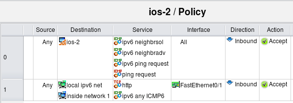

   Mixed IPv4/IPv6 Rule Set.

Now the router has the same two interfaces, FastEthernet0/0 and FastEthernet0/1, but both interfaces have IPv4 and IPv6 addresses. Here is the result:

.. code-block:: text

   ! ================ IPv4
   ! Policy compiler errors and warnings:
   !
   no ip access-list extended fe0_0_in
   no ip access-list extended fe0_1_in
   ip access-list extended fe0_0_in
     permit icmp any  host 192.0.2.1 8
     permit icmp any  host 192.168.1.1 8
   exit
   ip access-list extended fe0_1_in
     permit icmp any  host 192.0.2.1 8
     permit icmp any  host 192.168.1.1 8
     permit tcp any  192.168.1.0 0.0.0.255 eq 80
   exit

   interface FastEthernet0/0
     ip access-group fe0_0_in in
   exit
   interface FastEthernet0/1
     ip access-group fe0_1_in in
   exit
   ! ================ IPv6
   ! Policy compiler errors and warnings:
   !
   no ipv6 access-list ipv6_fe0_0_in
   no ipv6 access-list ipv6_fe0_1_in
   ipv6 access-list ipv6_fe0_0_in
     permit icmp any  host 2001:db8:1:1::1 135
     permit icmp any  host 2001:db8:1:1::1 136
     permit icmp any  host 2001:db8:1:1::1 128
     permit icmp any  host 2001:db8:ffff:ffff::1 135
     permit icmp any  host 2001:db8:ffff:ffff::1 136
     permit icmp any  host 2001:db8:ffff:ffff::1 128
   exit
   ipv6 access-list ipv6_fe0_1_in
     permit icmp any  host 2001:db8:1:1::1 135
     permit icmp any  host 2001:db8:1:1::1 136
     permit icmp any  host 2001:db8:1:1::1 128
     permit icmp any  host 2001:db8:ffff:ffff::1 135
     permit icmp any  host 2001:db8:ffff:ffff::1 136
     permit icmp any  host 2001:db8:ffff:ffff::1 128
     permit tcp any  2001:db8:ffff:ffff::/64 eq 80
     permit icmp any  2001:db8:ffff:ffff::/64
   exit
   interface FastEthernet0/0
     ipv6 traffic-filter ipv6_fe0_0_in in
   exit
   interface FastEthernet0/1
     ipv6 traffic-filter ipv6_fe0_1_in in
   exit

The IPv4 part looks exactly the same as before, but we also have additional IPv6 access lists. For IPv6, rule #1 permits ICMPv6 neighbor solicitation, neighbor advertisement, and IPv6 ping request messages to the firewall through all interfaces, direction inbound, and rule #1 permits HTTP and all ICMPv6 to the internal network through FastEthernet0/1, inbound. Generated IPv6 access lists "ipv6_fe0_0_in" and "ipv6_fe0_1_in" reflect this. ACL ipv6_fe0_0_in permits icmp types 128, 135 and 136 to IPv6 addresses that belong to the firewall and ACL ipv6_fe0_1_in permits the same ICMP messages to the firewall, plus TCP port 80 and any IPv6 ICMP to the internal IPv6 network.

The program automatically separated IPv4 and IPv6 objects and created two sets of access lists to implement policies for both address families. This simplifies adoption of IPv6 into existing network because you don't have to reimplement access lists and firewall rules written for IPv4 again and then maintain two rule sets coordinated as you make changes. Instead, the structure of existing policy rule set is preserved, you just add IPv6 objects to the same rules and the program generates both IPv4 and IPv6 configurations from it.

Running Multiple Services on the Same Machine on Different Virtual Addresses and Different Ports
~~~~~~~~~~~~~~~~~~~~~~~~~~~~~~~~~~~~~~~~~~~~~~~~~~~~~~~~~~~~~~~~~~~~~~~~~~~~~~~~~~~~~~~~~~~~~~~~~~

Here is an example of how Firewall Builder can be used to build a firewall protecting a server. Suppose we run several secure web servers on the same machine and use virtual IP addresses to be able to supply different certificates for each one.

In addition, we run the webmin service on the same machine that we use to manage it. We need to permit access on protocol HTTPS to virtual addresses web servers are using from anywhere, and limited access to the webmin port on a specific address.

Here is the firewall object:

.. figure:: img/cookbook-058.png
   :alt: Firewall Object with Multiple Services

   Firewall Object with Multiple Services.

Here are the policy rules:

.. figure:: img/cookbook-059.png
   :alt: Policy Rules

   Policy Rules.

Access to the webmin service is only permitted from the local network, while access to the secure web servers running on virtual addresses fxp0-ip1, fxp0-ip2 and fxp0-ip3 is permitted from anywhere.

The following screenshot illustrates how the TCP service object webmin is created.

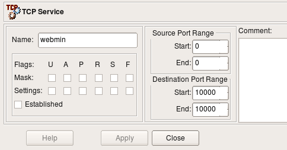

   webmin object.

The webmin service uses port 10000, so we put this port number in both the beginning and end of the destination port range. We do not need to do any inspection of the TCP flags and leave all of them unchecked in this object.

Using a Firewall as the DHCP and DNS Server for the Local Net
~~~~~~~~~~~~~~~~~~~~~~~~~~~~~~~~~~~~~~~~~~~~~~~~~~~~~~~~~~~~~~~

It is often convenient to use a firewall as a DHCP and DNS server for the local net, especially in small installations like that in a home office. It is not really difficult, but building rules properly requires understanding of how DHCP and DNS work.

The following combination of rules permits machines on the local net to use the firewall as DHCP server:

.. figure:: img/cookbook-061.png
   :alt: Rules with DHCP

   Rules with DHCP.

The first rule permits two types of DHCP requests: the initial discovery request that is sent to the broadcast address 255.255.255.255 and the renewal request that is sent to the firewall's address. The address range object "broadcast" can be found in the Standard objects tree, under Objects/Address Ranges; this object defines broadcast address 255.255.255.255. The second rule in the pair permits DHCP replies sent by the firewall. The Service object "DHCP" can be found in the "Standard" objects tree, under Services/Groups.

We could make these rules more narrow if we used the internal interface of the firewall in place of the firewall object. Assuming interface eth0 is connected to the internal net, the rules would look like this:

.. figure:: img/cookbook-062.png
   :alt: Rules with DHCP Using a Firewall Interface

   Rules with DHCP Using a Firewall Interface.

To permit the local network to use the firewall as a DNS server, we need to permit DNS queries directed to the firewall, DNS replies sent by the firewall, DNS queries sent by the firewall to servers on the Internet and replies sent back to it. The following pair of rules does just that:

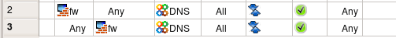

   Rules with DNS.

The service object group object DNS can be found in the "Standard" objects tree, under Services/Groups. This group consists of both the UDP object domain and TCP object domain. Both objects define destination port 53 and ignore source port. Since we do not specify the source port, these objects match both queries sent by the domain name server (source port is 53) and the resolver on the workstations on the local net (source port is >1024). We need to use objects representing both UDP and TCP protocols because DNS falls back to TCP if the answer for the query is too big and won't fit in the standard UDP datagram. DNS zone transfers also use the TCP protocol.

Controlling Outgoing Connections from the Firewall
~~~~~~~~~~~~~~~~~~~~~~~~~~~~~~~~~~~~~~~~~~~~~~~~~~~~

This example shows the rule that permits only certain types of outgoing connections. To permit outgoing web access but nothing else, we put the firewall object in Source and the corresponding service object in Service:

.. figure:: img/cookbook-064.png
   :alt: HTTP-Only

   HTTP-Only.

Rule #1 blocking packets going from any source to any destination also blocks packet originating on the firewall (provided option "Assume firewall is part of any" is on). The combination of these two rules permits only outgoing HTTP connections from the firewall and nothing else.

Although we permit outgoing HTTP connections here, we should probably permit outgoing DNS queries as well. The browser running on this machine would not be able to connect to a web site if it cannot resolve the name via DNS. Here is the corrected policy:

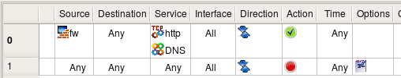

   HTTP and DNS.

The DNS service object, which includes both the UDP and TCP versions, can be found in the "Standard" tree under Services/Groups.

We may also want to permit protocols used for troubleshooting, such as ping. In order to permit it, we just add ICMP Service object "ping request" to the list of services permitted by rule #0:

.. figure:: img/cookbook-066.png
   :alt: HTTP, DNS, and Ping

   HTTP, DNS, and Ping.

.. note::

   In Firewall Builder, a firewall object represents any machine that runs firewall software. This is not necessarily a dedicated firewall protecting a local network, but may actually be a server or a laptop. For example, rules permitting HTTP to the dedicated firewall machine may not be very practical because running the web server on it would be risky, but if the firewall object represents a web server with iptables or ipfilter running on it, such rules make perfect sense. The rule permitting outbound HTTP access from the firewall machine explained in this example can be used as a part of the policy protecting a laptop or a workstation.

Branching Rules
~~~~~~~~~~~~~~~~

Many firewall platforms support mechanisms by which control can be passed from one group of rules to another, much like in programming languages control can be passed to a subroutine. The rule set that gets control in such operation can then make final decision about the packet and accept or deny it, or it can return control back to the rule set that was running before. Firewall Builder provides the same mechanism using a branching action that is called *"Chain"* for iptables firewalls and *"Anchor"* for PF firewalls to reuse the familiar names from iptables and pf, respectively.

.. note::

   Platform-specific action names *"Chain"* and *"Anchor"* will disappear in Firewall Builder v4.0. The name of the action that creates a branch in the rule set processing sequence will be just *"Branch"* regardless of the chosen target firewall platform.

Branching rules can be used to create optimized rule sets or to improve readability or both. Consider the example shown in the following screenshot:

.. figure:: img/cookbook-067.png
   :alt: A Firewall Object with Two Policy Rule Sets

   A Firewall Object with Two Policy Rule Sets.

Firewall fw2 has two rule sets: "Policy" and "rate_limit". I am going to demonstrate how the second rule set can be used to rate limit packets that match different rules in the main rule set "Policy".

.. note::

   Figure 14.52 demonstrated how to add policy rule set object to the firewall.

Let's create a rule to match ssh sessions to the firewall and instead of accepting or dropping them right away, pass control to the rule set "rate_limit" that will accept them only if they are not opened too fast. First, create this rule and choose action "Chain", then double-click the action and drag rule set object "rate_limit" into the well in the action dialog as shown in the screenshot:

.. figure:: img/cookbook-068.png
   :alt: A Rule with Action "Chain"

   A Rule with Action "Chain".

Now we can configure rate limiting rule in the "rate_limit" rule set. I am going to use the iptables module "hashlimit" to configure rather sophisticated rate-limiting. When I recreate the same example for PF below, the options will look different.

.. figure:: img/cookbook-069.png
   :alt: Rate limiting rule

   Rate limiting rule.

Here is the iptables script generated by the program for these rules:

.. code-block:: text

   # Rule 0 (global)
   #
   $IPTABLES -N rate_limit
   $IPTABLES -A INPUT -p tcp -m tcp  --dport 22  -j rate_limit

   # ================ Table 'filter', rule set rate_limit
   #
   # Rule rate_limit 0 (global)
   #
   $IPTABLES -A rate_limit  -m state --state NEW \
       -m hashlimit --hashlimit 5/minute --hashlimit-mode srcip \
       --hashlimit-name htable_rule_0 -j ACCEPT

Those familiar with iptables will notice that Firewall Builder created user-defined chain with the name of the second rule set ("rate_limit") and used "-j" option to pass control to it from the top-level rule.

Branching from a single rule is not very interesting. I could just use the same options with the rule #0 in the top level Policy rule set and get the same result, except instead of the user defined chain "rate_limit" this all would have been done in the same iptables command. However branching to a dedicated rule set becomes more useful if I want to use the same rate limiting to control access to several servers behind the firewall on entirely different protocols. Here is new example:

.. figure:: img/cookbook-070.png
   :alt: Several rules branching to the same rule set "rate_limit"

   Several rules branching to the same rule set "rate_limit".

Here is how generated iptables script looks like:

.. code-block:: text

   # ================ Table 'filter', rule set Policy
   #
   # Rule 0 (global)
   #
   $IPTABLES -N rate_limit
   $IPTABLES -A INPUT -p tcp -m tcp --dport 22 -j rate_limit
   #
   # Rule 1 (global)
   #
   $IPTABLES -A FORWARD -p tcp -m tcp -d 192.168.1.100 --dport 25 -j rate_limit
   #
   # Rule 2 (global)
   #
   $IPTABLES -A FORWARD -p tcp -m tcp -d 192.168.1.200 --dport 80 -j rate_limit
   # ================ Table 'filter', rule set rate_limit
   #
   # Rule rate_limit 0 (global)
   #
   $IPTABLES -A rate_limit  -m state --state NEW \
       -m hashlimit --hashlimit 5/minute --hashlimit-mode srcip \
       --hashlimit-name htable_rule_0 -j ACCEPT

Here are three iptables rules that match different addresses and services but pass control to the same chain "rate_limit". Now if I need to tune my rate-limiting parameters for all destinations, I can do it in one place instead of three.

The rule #0 in the "rate_limit" rule set matches packets only if they come at the rate no more than five per minute per source IP address. Packets that match these criteria will be accepted, but those that don't will not match the rule. Since this rule is the last in the branch rule set, control will return to the top level and firewall will continue examining the packet with rules below the one that passed control to "rate_limit" rule set. Eventually it may hit the "catch all" rule and get dropped, but more complex policies may do something else with these packets such as try different rate-limiting criteria or mark them for traffic shaping.

An action that creates a branch is available in Firewall Builder only if the target firewall platform provides some kind of mechanism to support it. In iptables it is user-defined chains, in PF it is anchors. Unfortunately, branching can not be implemented in Cisco IOS access lists and PIX. Let's try to recompile the same rules for PF. First, we'll need to change rate limiting parameters because its implementation in PF is different from that in iptables.

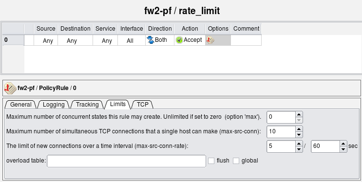

   Rate-Limiting Rule for PF.

I am using the same three rules in the main policy to rate-limit connections to the firewall itself and two servers behind it. The generated PF config is split so that main policy rules are in the file *"fw2-pf.conf"* and rules for the rule set *"rate_limit"* are in the file *"fw2-pf-rate_limit.conf"*. When configuration with multiple rule sets is compiled for PF, each new branch rule set has its own separate file with the name composed from the name of the firewall object and the name of the rule set object.

File *fw2-pf.conf*:

.. code-block:: text

   # Tables: (1)
   table <tbl.r9999.d> { 192.0.2.1 , 192.168.1.1 }
   # Policy compiler errors and warnings:
   #
   # Rule  0 (global)
   #
   anchor rate_limit in  inet proto tcp  from any  to <tbl.r9999.d> port 22
   #
   # Rule  1 (global)
   #
   anchor rate_limit inet proto tcp  from any  to 192.168.1.100 port 25
   #
   # Rule  2 (global)
   #
   anchor rate_limit inet proto tcp  from any  to 192.168.1.200 port 80

File *fw2-pf-rate_limit.conf*:

.. code-block:: text

   # Tables: (0)
   # Policy compiler errors and warnings:
   #
   # Rule  rate_limit 0 (global)
   #
   pass  quick inet  from any  to any keep state ( max-src-conn 10, max-src-conn-rate 5/60 )

Firewall Builder also generates a shell script to load these rules. The script is in the file with the name the same as the name of the firewall, with extension ".fw":

Here is the code that loads rules in the file *fw2-pf.fw*:

.. code-block:: text

   $PFCTL -f ${FWDIR}/fw2-pf.conf || exit 1
   $PFCTL -a rate_limit -f ${FWDIR}/fw2-pf-rate_limit.conf || exit 1

Rules from the file "fw2-pf-rate_limit.conf" are loaded into anchor "rate_limit".

Using Branch Rule Set with External Script that Adds Rules "on the Fly" to Prevent SSH Scanning Attacks
~~~~~~~~~~~~~~~~~~~~~~~~~~~~~~~~~~~~~~~~~~~~~~~~~~~~~~~~~~~~~~~~~~~~~~~~~~~~~~~~~~~~~~~~~~~~~~~~~~~~~~~~~

Branch rule sets created in the Firewall Builder GUI get translated into user-defined chains (iptables) or anchors (pf) in the generated configuration. It is not required however that you put any rules in this branch rule set. If it is left empty, it won't make packet checks and return back to the top level rule that called it right away. Such an empty rule set can be very useful if you populate it with rules using some external script after firewall policy has been loaded. In the following example I use this idea to add firewall policy rules dynamically to block SSH scanners. The goal is to build policy rules to do the following:

1. Always permit SSH from the internal network to the firewall. Our algorithm for identification of SSH scanners is based on the log records of failed login attempts, so it is important to have a rule to permit SSH from inside. Without this rule, if the administrator made a typo entering the password, this could trigger the next rule for the source address they tried to connect from and block them.

2. If the source IP address of the SSH client that tries to connect was identified as an SSH scanner, block connection

3. Permit all other SSH connections from all sources.

This policy is rather permissive but it can easily be modified to suite more strict security requirements.

I start with an existing firewall policy. The rules I am going to add to block SSH scans do not depend on other rules in the policy. First, I create a new policy rule set with name "block_ssh". This rule set is not the "top rule set", so generated iptables rules will be placed in the chain "block_ssh". I do not add any rules here. Rules will be added to this chain by an external script.

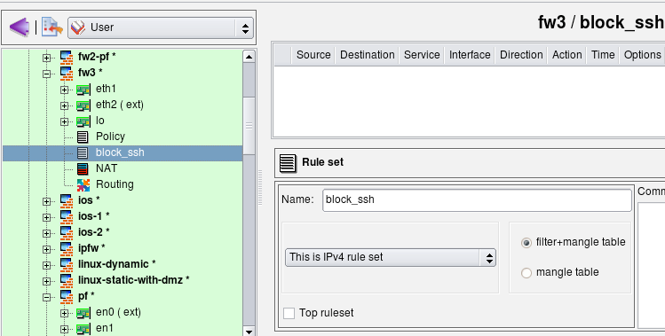

   Creating a "block_ssh" Rule Set.

Create rule #0 in the main policy to permit SSH to the firewall from internal network, then another one where the destination the firewall itself, the service is "ssh", the direction "Inbound" and action is "Branch". Open the action in the editor by double-clicking it, then drag the object representing rule set "block_ssh" into the well in the action editor panel. The idea is to first permit SSH to the firewall from the internal net (rule #0), but for attempts to connect to the firewall on the SSH port from other sources pass control to chain "block_ssh". If that chain does not block the SSH session, the next rule #2 permits it.

.. figure:: img/cookbook-073.png
   :alt: Setting the "Chain" Action

   Setting the "Chain" Action.

Here is what the iptables commands generated for rules 0-2 look like. Note that although the script creates the chain "block_ssh", it does not put any rules in it.

.. code-block:: text

   # ================ Table 'filter', rule set Policy
   # Policy compiler errors and warnings:
   #
   # Rule 0 (global)
   #
   $IPTABLES -A INPUT -p tcp -m tcp  -s 192.168.1.0/24 \
       --dport 22  -m state --state NEW  -j ACCEPT
   #
   # Rule 1 (global)
   #
   $IPTABLES -N block_ssh
   $IPTABLES -A INPUT  -p tcp -m tcp  --dport 22  -j block_ssh
   #
   # Rule 2 (global)
   #
   $IPTABLES -A INPUT  -p tcp -m tcp  --dport 22  -m state --state NEW  -j ACCEPT

I am using *swatch* to watch the log and add iptables rules with addresses of scanners to the chain "block_ssh". The screen shot below shows the contents of the swatch configuration file /root/.swatchrc. This configuration makes swatch detect log lines added by SSH when an attempt is made to log in using an invalid user account or invalid password. Swatch then runs script /root/swatch/block_ssh_scanner.sh.

.. code-block:: text

   # cat /root/.swatchrc

   watchfor /sshd\[\d+\]: Failed password for invalid user (\S+) from (\S+)/
   echo bold
   exec "/root/swatch/block_ssh_scanner.sh $2"

   watchfor /sshd\[\d+\]: Failed password for (\S+) from (\S+)/
   echo bold
   exec "/root/swatch/block_ssh_scanner.sh $2"

   watchfor /sshd\[\d+\]: Did not receive identification string from (\S+)/
   echo bold
   exec "/root/swatch/block_ssh_scanner.sh $1"

   watchfor /sshd\[\d+\]: Invalid user (\S+) from (\S+)/
   echo bold
   exec "/root/swatch/block_ssh_scanner.sh $2"

The following script adds an iptables rule to chain "block_ssh" and also adds the address of the scanner to the file /root/swatch/ssh_scan_addresses to avoid duplications in the future.

.. code-block:: text

   # cat /root/swatch/block_ssh_scanner.sh
   #!/bin/sh

   addr=$1
   test -z "$addr" && exit 1
   grep $addr /root/swatch/ssh_scan_addresses && exit 0

   cmd="iptables -A block_ssh -s $addr -j DROP"
   echo "$cmd" >> /root/swatch/ssh_scan_addresses
   $cmd

Here is the command line you can use to start the swatch daemon. Add this command to the /etc/rc.d/rc.local script to start it when you reboot your machine.

.. code-block:: text

   /usr/bin/swatch --daemon --tail-file=/var/log/secure --use-cpan-file-tail </dev/null &

This method of blocking SSH scan attacks is effective but might be too "sharp". It will block access from legitimate machines outside your network as soon as you mistype your password even once. This can be dangerous because you'll block yourself until you either restart the firewall or remove the blocked address from iptables rules in chain "block_ssh". SSH access to the firewall from the internal network is always permitted because of the rule #0, so this setup will not cut you off the firewall completely. Using SSH keys for authentication instead of the password when you log in from outside is a good way to avoid this problem.

.. note::

   This example was intended to demonstrate how a branch rule set can be used in combination with external script that populates rule set. There are better ways to block SSH scanners, for example using the iptables module "recent" which solves a problem of blocking legitimate client addresses after a user mistypes the password. Module "recent" can block an address for a limited period of time, which should be enough for the SSH scanner to time out and go away, yet the user who mistyped their password will be able to log in again some time later. The shell script that adds iptables commands to the chain "block_ssh" or addresses to the module recent table can also be improved to only add them after they appear in the SSH log a few times to avoid blocking client addresses after single error entering password.

A Different Method for Preventing SSH Scanning Attacks: Using a Custom Service Object with the iptables Module "recent"
~~~~~~~~~~~~~~~~~~~~~~~~~~~~~~~~~~~~~~~~~~~~~~~~~~~~~~~~~~~~~~~~~~~~~~~~~~~~~~~~~~~~~~~~~~~~~~~~~~~~~~~~~~~~~~~~~~~~~~~~~

The method described in the previous section has a problem in that it permanently blocks access from any client when user mistypes their password several times. It is better to block access temporarily instead of permanently. The iptables module "recent" provides a way to do just that.

In this example, I only use the basic features of the "recent" module you can find more information about the available options for this module at the `netfilter How-To page <http://netfilter.org/documentation/HOWTO/netfilter-extensions-HOWTO-3.html#ss3.16>`_.

To use this module, I create the following custom service object (see Section 5.3.6):

.. figure:: img/cookbook-074.png
   :alt: Custom Service Object Used to Define Parameters for the iptables Module "recent"

   Custom Service Object Used to Define Parameters for the iptables Module "recent".

This module matches packets that have source address that is on the list of the module and was seen within the last 600 seconds. Now we can use this module in a rule:

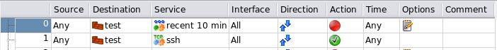

   Policy Rules Using the Custom Service Object "recent 10 min".

These two rules translate into the following iptables script:

.. code-block:: text

   # Rule 0 (global)
   #
   echo "Rule 0 (global)"
   #
   $IPTABLES -N RULE_0
   $IPTABLES -A INPUT  -m recent  --rcheck --seconds 600  -j RULE_0
   $IPTABLES -A RULE_0  -j LOG  --log-level info --log-prefix "RULE 0 -- DENY "
   $IPTABLES -A RULE_0  -j DROP
   #
   # Rule 1 (global)
   #
   echo "Rule 1 (global)"
   #
   $IPTABLES -A INPUT  -p tcp -m tcp  --dport 22  -m state --state NEW  -j ACCEPT
   #

Rule 0 blocks any packets that match module "recent," that is, that have source address that is on the module's list and were seen within last 10 minutes. Rule #1 simply permits SSH to the firewall. If everything goes well, no addresses should be on the module recent list, which means rule #0 does not match any packets and SSH access to the firewall is permitted by rule #1. However if any address is placed on the list of the module recent, rule #0 will block access to the firewall from that address for 10 min.

To place addresses of the attacking bots on the list I am using swatch just like in the previous chapter. The configuration file /root/.swatchrc looks like this:

.. code-block:: text

   # cat /root/.swatchrc

   watchfor /sshd\[\d+\]: Failed password for invalid user (\S+) from (\S+)/
   echo bold
   exec "/root/swatch/block_ssh_scanner.sh $2"

   watchfor /sshd\[\d+\]: Failed password for (\S+) from (\S+)/
   echo bold
   exec "/root/swatch/block_ssh_scanner.sh $2"

   watchfor /sshd\[\d+\]: Did not receive identification string from (\S+)/
   echo bold
   exec "/root/swatch/block_ssh_scanner.sh $1"

   watchfor /sshd\[\d+\]: Invalid user (\S+) from (\S+)/
   echo bold
   exec "/root/swatch/block_ssh_scanner.sh $2"

When swatch finds log entry that signals a potential SSH scan attack, it calls the script /root/swatch/block_ssh_scanner.sh:

.. code-block:: text

   #!/bin/sh

   addr=$1
   ADDRDB="/root/swatch/ssh_scan_addresses"
   test -f $ADDRDB || touch $ADDRDB
   echo $addr >> $ADDRDB

   # take last 10 entries from the list, sort and count them, then
   # use addresses that appear 3 or more times. This means we'll block
   # clients that make 3 mistakes for a short interval of time.
   #
   tail -10 $ADDRDB | sort | uniq -c | awk '$1>3 { print $2;}' | while read a
   do
     echo "+$a" > /proc/net/xt_recent/DEFAULT
   done

This script finds addresses that tried wrong password or non-existent user accounts three or more times and adds them to the list "DEFAULT" of the module recent. If such address tries to connect to the firewall one more time, it will be blocked by the rule #0 in the policy. However if they try 10 minutes later, they will be allowed to connect. This means if I mistype my password three times and get blocked, I can still log in 10 minutes later.

Finally, to start swatch and bring this all in motion, I use the following command:

.. code-block:: text

   nohup /usr/bin/swatch --daemon --pid-file=$PID_FILE --tail-file=/var/log/auth.log \
       --use-cpan-file-tail < /dev/null &

Swatch should monitor log file */var/log/auth.log* on Debian and Ubuntu or */var/log/secure* on RedHat, Fedora and other similar systems.

Using an Address Table Object to Block Access from Large Lists of IP Addresses
~~~~~~~~~~~~~~~~~~~~~~~~~~~~~~~~~~~~~~~~~~~~~~~~~~~~~~~~~~~~~~~~~~~~~~~~~~~~~~~~

This section demonstrates how address blocks registered to whole countries can be blocked by the iptables or pf firewall. Firewall Builder makes generating configuration for this simple. This recipe follows the idea outlined in the HOWTO found on HowtoForge at http://www.howtoforge.com/blocking-ip-addresses-of-any-country-with-iptables and in this blog: http://blogama.org/node/62. The original HOWTO only applies to iptables but this recipe demonstrates how the same objects in Firewall Builder can be used to generate both iptables and PF configurations.

The blocking method described in the original HOWTO and in this recipe becomes possible because of the service provided by http://blogama.org where they make files with lists of IP addresses registered to different countries available for download using URLs such as

.. code-block:: text

   http://blogama.org/country_query.php?country=CCODE1,CCODE2,...

Here CCODE1, CCODE2 and so on are ISO 3166 country codes.

We start with creating Address Table object (See Section 5.2.14) with name "blocklist":

.. figure:: img/cookbook-076.png
   :alt: Address Table Object Using the File "/tmp/iptables-blocklist.txt"

   Address Table Object Using the File "/tmp/iptables-blocklist.txt".

Since the object is configured as "run-time", the Firewall Builder policy compiler generates configuration in a such way that addresses will be read at the time when policy is activated on the firewall machine. This can be achieved in different ways, for example for the iptables compiler generates shell script fragment that reads addresses, or if the firewall supports iptables module "ipset", generated script will use it (Section 5.2.14.1). For PF, the generated configuration uses table which is loaded at run time using "file" option. You do not have to recompile policy if you use "Run time" Address Table object every time the list of IP addresses is updated. If generated script uses the ipset module with iptables or tables with PF, you only need to run the command on the firewall to reload addresses in the tables maintained by ipset or PF in memory. If the generated firewall uses a shell script that reads the file, as is the case with iptables firewall that does not have the module ipset, then the same script needs to be re-run to pick up changes.

Now we can use this object in the policy rules. To follow original HOWTO closely, I am added rules to control packets coming from the addresses in the list to the firewall, as well as packets going from the firewall to addresses in the list. My goal in this recipe was to reproduce rules found in the original HOWTO as close as possible.

.. figure:: img/cookbook-077.png
   :alt: Policy Rules Using an Address Table Object

   Policy Rules Using an Address Table Object.

In the rule #1 address table object is in source, the firewall object is in destination, the direction is "inbound", and the action is "deny". This rule matches and drops packets coming from the addresses in the list to the firewall. The second rule reverses source and destination and makes direction "outbound" to match packets sent by the firewall to addresses in the list.

Here is how the generated commands look like for the iptables firewall without module "ipset":

.. code-block:: text

   # Rule 1 (global)
   #
   echo "Rule 1 (global)"
   #
   grep -Ev '^#|^;|^\s*$' /tmp/iptables-blocklist.txt | while read L ; do
     set $L; at_blocklist=$1; $IPTABLES -A INPUT  -i +  -s $at_blocklist  -j DROP
   done
   #
   # Rule 2 (global)
   #
   echo "Rule 2 (global)"
   #
   grep -Ev '^#|^;|^\s*$' /tmp/iptables-blocklist.txt | while read L ; do
     set $L; at_blocklist=$1; $IPTABLES -A OUTPUT  -o +  -d $at_blocklist  -j DROP
   done

A few comments. The script generated by Firewall Builder assumes comments in the file that holds IP addresses can start with the characters '#', ';' or '*'. It also expects the file to hold one address per line and anything after the address on any line is assumed to be a comment too. This format is slightly expanded compared to the format of files produced by blogama.org which makes script commands slightly more complex. It is also possible that generated script can be somewhat optimized.

If the firewall supports the module ipset (See Section 5.2.14.1 for more details about that), the generated iptables commands look like this:

.. code-block:: text

   # Rule 0 (global)
   #
   echo "Rule 0 (global)"
   #
   $IPTABLES -A INPUT -m set  --set blocklist src  -j DROP
   #
   # Rule 1 (global)
   #
   echo "Rule 1 (global)"
   #
   $IPTABLES -A OUTPUT -m set  --set blocklist dst  -j DROP
   #

Generating Configuration for a PF Firewall Using the Same Firewall Builder Objects
^^^^^^^^^^^^^^^^^^^^^^^^^^^^^^^^^^^^^^^^^^^^^^^^^^^^^^^^^^^^^^^^^^^^^^^^^^^^^^^^^^^^

Here is how exactly the same set of objects can be used to generate configuration for a PF firewall doing the same thing. First, we need to change firewall platform and host OS in the firewall object:

.. figure:: img/cookbook-078.png
   :alt: Switching the Firewall to the PF Platform

   Switching the Firewall to the PF Platform.

Now save the file and recompile configuration. Here is the result for PF (only relevant fragments of the generated .conf file are shown):

.. code-block:: text

   table <blocklist> persist file "/tmp/iptables-blocklist.txt"
   table <tbl.r9999.d> { 192.0.2.1 , 172.16.22.1 , 192.168.2.1 }
   #
   # Rule  1 (global)
   #
   #
   block in   quick inet  from <blocklist>  to <tbl.r9999.d> label "RULE 1 -- DROP "
   #
   # Rule  2 (global)
   #
   #
   block out  quick inet  from <tbl.r9999.d>  to <blocklist> label "RULE 2 -- DROP "
   #

The compiler created the table *<blocklist>* and associated it with the file *"/tmp/iptables-blocklist.txt"*. (Pardon the name of the file, it carried over from the iptables example). The table <tbl.r9999.d> was created because compiler needed to put several ip addresses that belong to the firewall in this configuration in a single rule. In the end, this PF configuration performs the same operation as iptables configuration shown above.

Finally, to make this work and do something useful, we need to download the addresses of the countries we want to block and put them in the file "/tmp/iptables-blocklist.txt". As the author of the original HOWTO suggests in http://blogama.org/node/62 this can be done with wget. A simple script like this does the job:

.. code-block:: text

   COUNTRIES="AK,AR"
   wget -c --output-document=/tmp/iptables-blocklist.txt \
       http://blogama.org/country_query.php?country=$COUNTRIES

This command should probably be put in a script which should run from cron once a month or so. The same script should also reload ip addresses in PF table or ipset list after it updates the address table file to make sure firewall picks up the change. To reload IP addresses from the file on the iptables with ipset module, run the script with command line option "reload_address_table":

.. code-block:: text

   /etc/fw/firewall.sh reload_address_table blocklist /etc/fw/blocklist_file.txt

To reload IP addresses on the PF firewall, use the command:

.. code-block:: text

   pfctl -t blocklist

If the firewall you use runs iptables and does not support module ipset, you just need to re-run the firewall script to update the rules with new ip addresses.
Examples of NAT Rules
---------------------

"1-1" NAT
~~~~~~~~~

The examples above were "hiding" multiple internal addresses behind just one external address. We had a whole network (potentially 254 hosts) use the same external address to access the Internet. Sometimes it is necessary to do translation where each internal host has a dedicated corresponding address on the outside. This is often called "1-1" NAT. Here is how this is done in Firewall Builder when a whole network of the same dimension is available on the outside:

.. figure:: img/cookbook-079.png
   :alt: 1-1 NAT rule mapping internal net to ext net

Network object *ext net* defines network "192.0.2.0/24", which is the same size as the internal network (this is a hypothetical example). Here is iptables command produced for this rule:

.. code-block:: text

   # Rule 0 (NAT)
   #
   $IPTABLES -t nat -A POSTROUTING  -s 172.16.22.0/24 -j NETMAP --to 192.0.2.0/24

NETMAP target maps a whole network of addresses onto another network of addresses.

In PF the following "nat" command is used:

.. code-block:: text

   # Rule  0 (NAT)
   #
   nat proto {tcp udp icmp} from 172.16.22.0/24 to any -> 192.0.2.0/24

For PIX, Firewall Builder generates a "global" address pool the size of the 192.0.2.0/24 network:

.. code-block:: text

   ! Rule  0 (NAT)
   !
   global (outside) 1 192.0.2.0 netmask 255.255.255.0
   access-list id54756X30286.0 permit ip 172.16.22.0 255.255.255.0  any
   nat (inside) 1 access-list id54756X30286.0 tcp 0 0

"No NAT" Rules
~~~~~~~~~~~~~~

Sometimes a firewall that is doing NAT should skip translation for some pairs of source and destination addresses. One example when this is necessary is when you have DMZ segment that uses private addresses, so you need to use NAT to provide access to servers in DMZ from outside, but no NAT is needed for access to the same servers from internal network. Here is how it looks:

.. figure:: img/cookbook-080.png
   :alt: Firewall object fw-1 with 4 interfaces

Firewall object *fw-1* has 4 interfaces:

.. table:: Table 14.1.

   ===========  ====================  ==============
   Interface    Network zone          Address
   ===========  ====================  ==============
   eth0         external interface    192.0.2.1/24
   eth1         internal interface    172.16.22.1/24
   eth2         DMZ                   192.168.2.1/24
   lo           loopback              127.0.0.1
   ===========  ====================  ==============

The internal interface *eth1* also has IPv6 address but it is not used in this example.

Here is a NAT rule to permit access to the DMZ network (192.168.2.10) from internal network directly without NAT.

.. figure:: img/cookbook-081.png
   :alt: No NAT rule for internal network to DMZ access

Here is the script generated for iptables:

.. code-block:: text

   #
   # Rule 0 (NAT)
   #
   $IPTABLES -t nat -A POSTROUTING  -s 172.16.22.0/24 -d 192.168.2.0/24 -j ACCEPT
   $IPTABLES -t nat -A PREROUTING   -s 172.16.22.0/24 -d 192.168.2.0/24 -j ACCEPT

For PF we get this:

.. code-block:: text

   # Rule  0 (NAT)
   #
   no nat proto {tcp udp icmp} from 172.16.22.0/24 to 192.168.2.0/24
   no rdr proto {tcp udp icmp} from 172.16.22.0/24 to 192.168.2.0/24

For PIX, Firewall Builder generates "nat 0" rule:

.. code-block:: text

   ! Rule  0 (NAT)
   !
   access-list nat0.inside permit ip 172.16.22.0 255.255.255.0 192.168.2.0 255.255.255.0
   nat (inside) 0 access-list nat0.inside
   !

Redirection Rules
~~~~~~~~~~~~~~~~~

Another useful class of destination translation rule is the one that does redirection. A rule like this makes the firewall send matching packets to itself, usually on a different port. This rule can be used to set up a transparent proxy. To set up a redirection rule in Firewall Builder, place the firewall object or one of its interfaces in Translated Destination. Here is an example:

.. figure:: img/cookbook-082.png
   :alt: Redirection rule for transparent proxy

And here is what is generated for iptables:

.. code-block:: text

   # Rule 0 (NAT)
   #
   $IPTABLES -t nat -A PREROUTING -p tcp -m tcp  -s 172.16.22.0/24 \
       --dport 80 -j REDIRECT --to-ports 3128

Iptables uses special target REDIRECT for this kind of redirection.

For PF we get this:

.. code-block:: text

   # Rule  0 (NAT)
   #
   rdr proto tcp from 172.16.22.0/24 to any port 80 -> 127.0.0.1 port 3128
   #

Destination NAT Onto the Same Network
~~~~~~~~~~~~~~~~~~~~~~~~~~~~~~~~~~~~~~

This situation is described in the iptables HOWTO http://www.netfilter.org/documentation/HOWTO//NAT-HOWTO.html.

This problem occurs when machines on an internal LAN try to access a server (let's say a web server) that is actually located on the same LAN and NAT'ed through the firewall for external access. If internal users access it by its external NATted address, then they send their TCP packets through the firewall, which translates them and sends them to the server on LAN. The server, however, replies back to the clients directly because they are on the same network. Since the reply has server's real address in the source, clients do not recognize it and the connection cannot be established.

To resolve this problem you need to make a NAT rule to replace the source address of the packet with the address of firewall's internal interface. This should happen in addition to the translation of the destination address described in the previous chapters. If the source address of the packet that hits the server belongs to the firewall, the server replies to it; the firewall then translates again before sending the packet back to the client. The client sees the address it expects and the connection gets established.

Fortunately, Firewall Builder supports this kind of a dual-translation NAT rule. Rule #0 in the figure below does just that: it translates both the source and destination addresses of the packet.

The firewall's eth0 interface is internal and is connected to the same subnet the web server belongs to. For any packet headed for any address of the firewall, TCP port 80, the rule #0 substitutes its source address with the address of interface eth0 and its destination address with the address of the web server. The packet reaches the server because its destination address has been changed. This also makes the server reply back to the firewall, which in turn provides reverse translation before it sends these reply packets back to client hosts.

.. figure:: img/cookbook-083.png
   :alt: DNAT Back to the Same LAN

   DNAT Back to the Same LAN

The rule above replaces source address of all packets regardless of their origin. Because of this, the web server sees all connections as if they were coming from the firewall rather than from the real clients. If having real client addresses in the web server log is necessary, the scope of this rule can be narrowed by placing object representing internal network in the Original Src. Since the source address needs to be translated only in the connections coming from the internal net, dual translation rule should only be needed for these connections. Connections coming from the Internet can be translated as usual. A combination of rules that implement this configuration is shown in the figure below. Rule #0 does dual translation, while rule #1 does a simple destination address translation. The dual translation rule must be the first in the pair because if it weren't, another one would match connections coming from the internal net and translate destination address without changing the source address.

.. figure:: img/cookbook-084.png
   :alt: Using Dual Translation Only for Connections Coming from the Internal Network

   Using Dual Translation Only for Connections Coming from the Internal Network

.. note::

   Not all firewall platforms provide the features Firewall Builder needs to implement dual translation rules. Currently dual translation rules are supported only with iptables and OpenBSD PF.

"Double" NAT (Source and Destination Translation)
~~~~~~~~~~~~~~~~~~~~~~~~~~~~~~~~~~~~~~~~~~~~~~~~~~

There are situations where both the source and destination IP addresses of a packet need to be NATted. The diagram below shows just such a scenario where an internal server needs to be accessed remotely from the outside using the Remote Desktop Protocol (RDP).

.. figure:: img/cookbook-085.png
   :alt: Network Configuration showing RDP connections to ms-server-1

.. figure:: img/cookbook-086.png
   :alt: Detailed network configuration with IP addresses

   Network Configuration

What complicates this scenario is the fact that the default route for the ms-server-1 server directs traffic to rtr-1 instead of fw-2. If a remote user attempts to connect from the Internet to ms-server-1, and there is a destination NAT configured on the fw-2 firewall to forward traffic from a specific port on its outside eth0 interface to port 3389 (RDP) on ms-server-1, the ms-server-1 server will send the RDP response traffic to rtr-1 because of the default route and the remote desktop connection will never be established.

One way to solve this problem is to configure fw-2 with "double" NAT which results in both the original source and original destination IP addresses being modified. By modifying the source IP to be fw-2's internal eth1 address, the return packets from the ms-server-1 server for the RDP traffic will correctly be sent to fw-2 and the remote desktop connection will work.

This recipe assumes that in addition to the fw-2 firewall object the following objects and attributes have already been configured in Firewall Builder.

.. table:: Table 14.2. Firewall Builder Objects

   ===================  =============  =============
   Object Name          Object Type    Object Value
   ===================  =============  =============
   ms-server-1          Address        192.168.1.25
   RDP-OUTSIDE-4080     TCP Service    4080
   ===================  =============  =============

The NAT rule is created using these objects and objects from the Standard Library. After the double NAT rule is configured it should look like the figure below.

.. figure:: img/cookbook-087.png
   :alt: Configured NAT Rule for double NAT

   Configured NAT Rule

.. note::

   The Original Src is set to Any, this will match the IP address of any remote PC on the Internet. To connect the ms-server-1 internal server using RDP, the remote PC will connect to fw-2's outside interface on port 4080.

Here is the Firewall Builder-generated compiler output for configuring this rule on an iptables firewall:

.. code-block:: text

   $IPTABLES -t nat -A PREROUTING -p tcp -m tcp  -d 192.0.2.2 --dport 4080 -j DNAT \
       --to-destination 192.168.1.25:3389
   $IPTABLES -t nat -A POSTROUTING -o eth1 -p tcp -m tcp  -d 192.168.1.25 \
       --dport 3389 -j SNAT --to-source 192.168.1.3

After the NAT rule is installed on the firewall the traffic that is destined to port 4080 on the outside interface of fw-2 will be translated as shown in the diagram below.

.. figure:: img/cookbook-088.png
   :alt: NAT traffic translation diagram showing source and destination address changes

   NAT Traffic Translation

.. note::

   The Source ports in the example above are random and generated by the system originating the TCP connection.
Examples of Cluster Configurations
-----------------------------------

This chapter is dedicated to high availability (HA) or cluster configurations that involve two or more firewalls sharing the same set of virtual addresses. Examples are written assuming that the reader will probably jump straight to the one that is most close to the configuration they have, instead of reading all of them in order, so many procedures and explanations are repeated in each example. Nevertheless, sometimes examples refer to each other and other chapters in this Guide to reduce the amount of redundant material.

Web Server Cluster Running Linux or OpenBSD
~~~~~~~~~~~~~~~~~~~~~~~~~~~~~~~~~~~~~~~~~~~~

This example demonstrates how Firewall Builder can be used to generate firewall configuration for a clustered web server with multiple virtual IP addresses. The firewall is running on each web server in the cluster. This example assumes the cluster is built with heartbeat using "old" style configuration files, but which high availability software is used to build the cluster is not really essential. I start with the setup that consists of two identical servers running Linux but in the end of the chapter I am going to demonstrate how this configuration can be converted to OpenBSD with CARP.

In this example I am working with redundant web server configuration where each machine has its own IP address, plus three additional virtual addresses that can be used for virtual hosts. Firewall Builder generates iptables script for both machines. Configuration of the HA agent should be handled either manually or using specialized configuration system such as pacemaker. When I convert the same setup from Linux to OpenBSD, I am going to show how fwbuilder can generate not only firewall configuration, but also the script that manages CARP and pfsync interfaces.

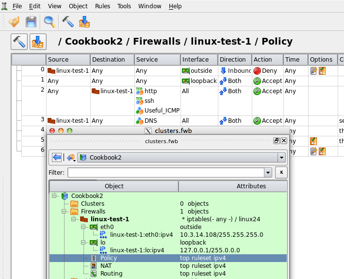

   HA Configuration Using Two Web Servers

.. note::

   IPv6 addresses are not used in this recipe. Some interface objects in the screenshots have ipv6 addresses because firewall objects were "discovered" using snmp which finds IPv6 addresses. You can disregard these addresses while working with examples in this chapter.

Setting Up the Heartbeat
^^^^^^^^^^^^^^^^^^^^^^^^^

.. note::

   I am going to use an "old" heartbeat configuration files in this example just to demonstrate how the configuration looks like. You should probably use modern Cluster Resource Manager software such as `Pacemaker <http://www.clusterlabs.org/wiki/Main_Page>`_.

As shown in Figure 14.88, machines linux-test-1 and linux-test-2 run heartbeat daemon (`Linux-HA home page <http://www.linux-ha.org/>`_) to create virtual IP addresses. Heartbeat adds virtual IP address to the same interface eth0. One of the daemons becomes master and takes ownership of the virtual address by adding it to the interface with the label "eth0:0" or "eth0:1".

.. note::

   Section 8.1 explains that "eth0:0" is not an interface and should not be used as the name of the interface object in Firewall Builder configuration. See Section 8.1 for a more detailed explanation.

In this example I am using heartbeat in multicast mode where it sends UDP datagram to the multicast address 225.0.0.1 every second or so to declare that it is up and running and owns the address.

If you are interested in more detailed explanation of the "old" style heartbeat configuration files used to set up example similar to this one, see :ref:`linux_cluster_using_heartbeat`.

Once heartbeat daemon is configured and started on both servers, their IP address configuration looks like shown in Figure 14.89 and Figure 14.90. Virtual addresses were highlighted to illustrate that the heartbeat is running in active/active configuration, that is, two virtual addresses are active on one machine and the third is active on another. If either machine dies, all three virtual addresses will move over to the one that is left working.

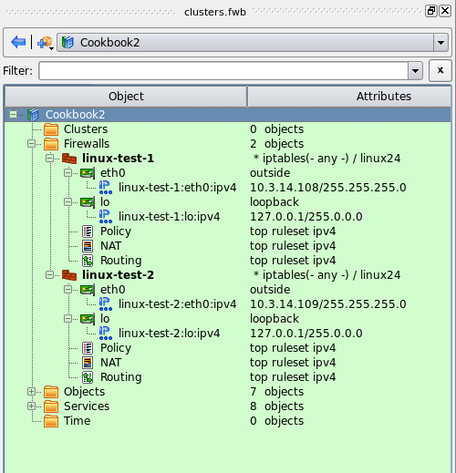

   IP Addresses of the Web Server linux-test-1

.. code-block:: text

   root@linux-test-1:/etc/ha.d# ip addr ls
   1: lo: <LOOPBACK,UP,LOWER_UP> mtu 16436 qdisc noqueue state UNKNOWN
       link/loopback 00:00:00:00:00:00 brd 00:00:00:00:00:00
       inet 127.0.0.1/8 scope host lo
       inet6 ::1/128 scope host
          valid_lft forever preferred_lft forever
   2: eth0: <BROADCAST,MULTICAST,UP,LOWER_UP> mtu 1500 qdisc pfifo_fast state UNKNOWN qlen 1000
       link/ether 00:0c:29:1e:dc:aa brd ff:ff:ff:ff:ff:ff
       inet 10.3.14.108/24 brd 10.3.14.255 scope global eth0
       inet 10.3.14.150/24 brd 10.3.14.255 scope global secondary eth0:0
       inet 10.3.14.151/24 brd 10.3.14.255 scope global secondary eth0:1
       inet6 fe80::20c:29ff:fe1e:dcaa/64 scope link
          valid_lft forever preferred_lft forever

.. figure:: img/cookbook-098.png
   :alt: IP Addresses of the Web Server linux-test-2

   IP Addresses of the Web Server linux-test-2

.. code-block:: text

   root@linux-test-2:/etc/ha.d# ip addr ls
   1: lo: <LOOPBACK,UP,LOWER_UP> mtu 16436 qdisc noqueue state UNKNOWN
       link/loopback 00:00:00:00:00:00 brd 00:00:00:00:00:00
       inet 127.0.0.1/8 scope host lo
       inet6 ::1/128 scope host
          valid_lft forever preferred_lft forever
   2: eth0: <BROADCAST,MULTICAST,UP,LOWER_UP> mtu 1500 qdisc pfifo_fast state UNKNOWN qlen 1000
       link/ether 00:0c:29:fc:67:8c brd ff:ff:ff:ff:ff:ff
       inet 10.3.14.109/24 brd 10.3.14.255 scope global eth0
       inet 10.3.14.152/24 brd 10.3.14.255 scope global secondary eth0:0
       inet6 fe80::20c:29ff:fefc:678c/64 scope link
          valid_lft forever preferred_lft forever

Creating Firewall and Cluster Objects
^^^^^^^^^^^^^^^^^^^^^^^^^^^^^^^^^^^^^^

Here I present an abbreviated explanation of the process of creating firewall and cluster objects. More detailed step-by-step guides are available in Section 5.2.2 and Section 5.2.3.

As usual, to create a firewall object I use main menu "Object/New object" which opens a menu of object types:

.. figure:: img/cookbook-099.png
   :alt: Creating the First Member Firewall Object

   Creating the First Member Firewall Object

After I choose the type "Firewall", a wizard used to create new firewall object opens:

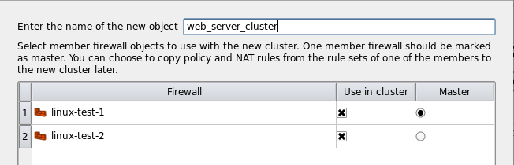

   Choosing the Name, Platform, and Host OS for the Firewall Object

To make things simpler, I am going to use preconfigured template object "web server" that comes with the package. This object represents a machine with one interface "eth0" and comes with some basic firewall policy that can be useful as a starting point for the firewall configuration for a web server.

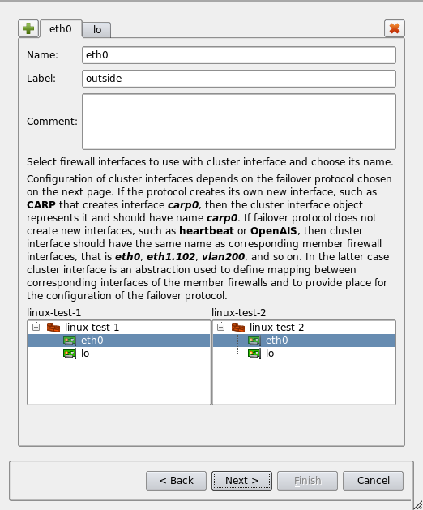

   Choosing a Template Firewall Object

The template firewall object has IP address that does not match the address chosen for this example. The next page of the wizard allows me to change the address and add two more:

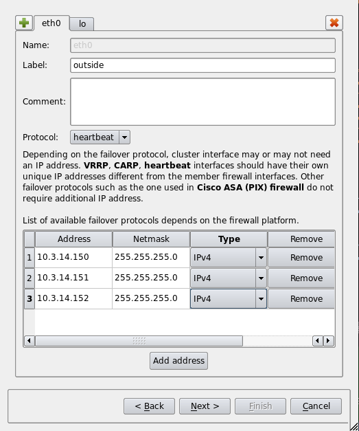

   Changing the IP Address of the Firewall Object

Once I am done changing IP addresses and clicking "Finish", the new firewall object is created and is added to the library of objects that was opened at the moment. In this example this library is called "Cookbook2". I "floated" the object tree panel to make the screenshot more compact. You can see the new firewall object in the tree, its interfaces and IP addresses, as well as preconfigured policy rule set on screenshot Figure 14.95:

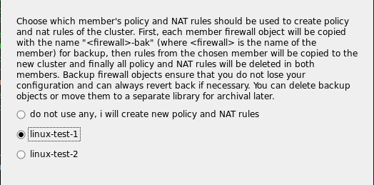

   Firewall Object Created from the Template

The member firewall object's interface "eth0" has only one IP address which is its own, in our example 10.3.14.108. Virtual addresses managed by heartbeat will be added to the cluster object later.

Next, I create the second member firewall linux-test-2 with its own ip address:

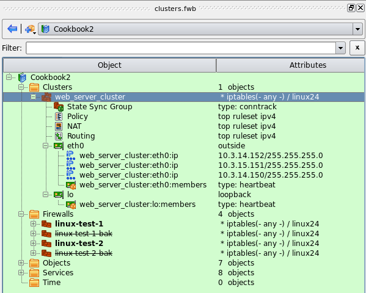

   Two Member Firewall Objects

Because our firewall objects represent web servers which should never have to forward packets, we should turn ip forwarding off. To do this, double-click the firewall object in the tree to open it in the editor, then click "Host OS settings" button and turn IP forwarding off as shown in Figure 14.97. Turning ip forwarding off in this dialog has several consequences: generated firewall script will actually turn it off on the server and Firewall Builder policy compiler will not generate any rules in the FORWARD chain.

.. figure:: img/cookbook-105.png
   :alt: Turn Off IP Forwarding

   Turn Off IP Forwarding

Now that I have both firewall objects, I can create cluster object that will represent my HA pair. To do this, I select both firewall objects in the tree by clicking on them while holding Ctrl key, then right-click to open context menu and choose the item "New cluster from selected firewalls":

.. figure:: img/cookbook-106.png
   :alt: Creating a Cluster Object from Two Member Firewalls

   Creating a Cluster Object from Two Member Firewalls

This opens a wizard that will walk you through the process of creating new cluster object. The wizard was opened using "New cluster from selected firewalls" menu, because of that there are only two firewall objects in the list. If I used main menu "Object/New Object" and then "New Cluster", I would see all firewalls defined in my data file in the list which can be quite long.

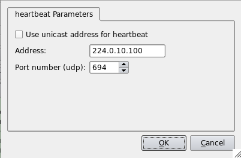

   Choosing the Name for the New Cluster Object

.. note::

   A word about the "Master" column. Not all failover protocols require one of the member firewalls to be designated as "master". Most protocols used on Linux don't, so you can disregard this setting on the first page of the wizard. It is needed for other platforms, such as PIX. In this sense setting "master" on the first page of the wizard is not optimal. We will rectify this in the future versions of Firewall Builder.

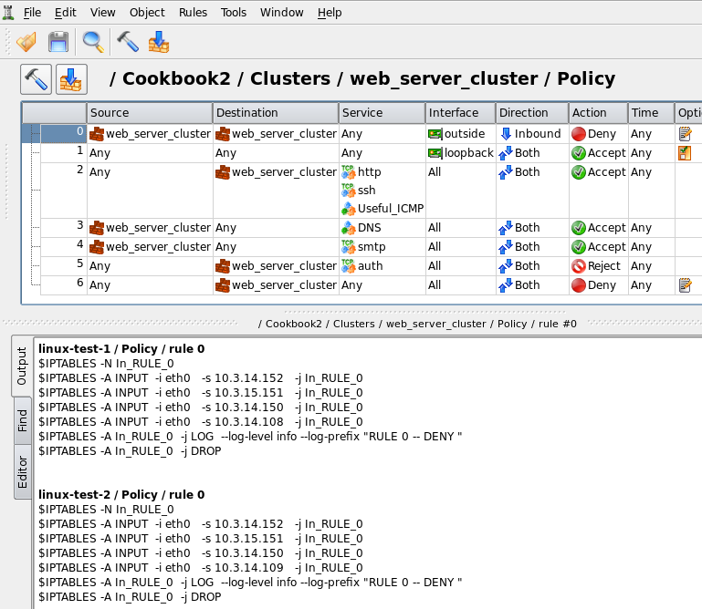

   Choosing Interfaces of the Member Firewalls

This page of the wizard allows me to establish correspondence between interfaces of the member firewalls and create cluster interface objects that will represent them. Cluster interface object should have the same name as corresponding member firewall interfaces. The program tries to guess what interfaces of the member firewalls can be used for the cluster and in a simple configuration like the one I am working with, guesses right.

On the next page of the wizard I can choose failover protocol used by the cluster on each interface (in principle, I can run different protocols on different interfaces) and virtual IP addresses.

.. figure:: img/cookbook-109.png
   :alt: Choosing IP addresses for the interfaces of the cluster

   Choosing IP addresses for the interfaces of the cluster

Next page of the wizard is particularly interesting. Here I can choose which member firewall's policy to use for the cluster. This feature is designed mostly for those who convert from the old manually maintained configuration of redundant firewalls to the new cluster object and want to reuse policy rules that used to belong to one of the member firewalls.

.. figure:: img/cookbook-110.png
   :alt: Cluster will inherit rules of one of the member firewalls

   Cluster will inherit rules of one of the member firewalls

When new cluster object inherits policy and other rule sets of one of the members, the program copies rules from the designated member to the cluster, then it creates copies of all member firewalls, clears their rule sets and sets the cluster up to use these copies as members. It keeps old member firewall objects in the file, but they are marked as inactive and renamed. These objects are kept as a backup in case you may want to check their configuration or copy rules. New cluster object is shown in Figure 14.103:

.. figure:: img/cookbook-111.png
   :alt: New cluster object

   New cluster object

Each cluster interface has child "Failover group" object with the name "firewall:eth0:members" or similar. This is where you configure associated member firewall interfaces. Double click this object in the tree and then click "Manage Members" button in the dialog. Select interfaces of the member firewalls in the panel on the left hand side and click arrow button to add them to the list on the right. When you create cluster object using the wizard, the Failover Group objects are created automatically.

.. figure:: img/cookbook-112.png
   :alt: Failover group object

   Failover group object

Failover Group object not only ties interfaces of the member firewalls together, it is also the place where you configure failover protocol and its parameters. I am using heartbeat in this example and failover group object "web_server_cluster:eth0:members" is configured with this protocol as shown in Figure 14.104. To configure parameters of the protocol, click "Edit protocol parameters" button. This opens dialog Figure 14.105:

.. figure:: img/cookbook-113.png
   :alt: Parameters of heartbeat protocol

   Parameters of heartbeat protocol

These parameters are used to generate policy rules that permit packets of the protocol.

Building Rules for the Cluster
^^^^^^^^^^^^^^^^^^^^^^^^^^^^^^^

Now that all objects are ready and heartbeat is configured on the machines, we can move on and build some firewall rules. Since this is a cluster configuration, all rules go into the rule set objects that belong to the cluster rather than its member firewalls.

Because all policy and NAT rules are entered in the rule set objects of the cluster, all member firewalls end up running firewall configuration that implement the same rules. The difference is that whenever you use cluster object or one of its interfaces in a rule, the program replaces it with actual IP addresses of the member firewall it compiles for and virtual addresses that belong to the cluster. Each member firewall gets slightly different script, the difference is in the part that matches addresses of the member: script on each one matches its own addresses. If you wish to build a rule to match addresses of both members, just put corresponding firewall objects in the rule.

.. note::

   You can override this algorithm and make the program generate different rules for each member if you wish. See Section 8.4.

Rules that we've got from the template object are shown in Figure 14.106:

.. figure:: img/cookbook-114.png
   :alt: Overview of the policy rules and compiled output for rule #0

   Overview of the policy rules and compiled output for rule #0

* **Rule #0**: anti-spoofing rule. This is the only rule in this simple setup that generates different iptables commands for two member firewalls. Fwbuilder optimizes other rules using INPUT and OUTPUT chains as appropriate so they look identical on both firewalls. The bottom panel visible in Figure 14.106 shows generated iptables script for the rule #0. To get that, select the rule in the rule set, click right mouse button and use menu item "Compile", or use keyboard shortcut "X".

* **Rule #1**: permits everything on loopback. This rule is configured as "stateless" to simplify generated iptables code. The output looks like this (commands for linux-test-2 firewall look the same):

.. code-block:: text

   linux-test-1 / Policy / rule 1
   $IPTABLES -A INPUT  -i lo   -j ACCEPT
   $IPTABLES -A OUTPUT -o lo   -j ACCEPT

* **Rule #2**: permits access to the web server on limited set of protocols.

.. code-block:: text

   linux-test-1 / Policy / rule 2
   $IPTABLES -A INPUT -p icmp -m icmp --icmp-type 11/0   -m state --state NEW -j ACCEPT
   $IPTABLES -A INPUT -p icmp -m icmp --icmp-type 11/1   -m state --state NEW -j ACCEPT
   $IPTABLES -A INPUT -p icmp -m icmp --icmp-type 0/0    -m state --state NEW -j ACCEPT
   $IPTABLES -A INPUT -p icmp -m icmp --icmp-type 3 -m state --state NEW -j ACCEPT
   $IPTABLES -A INPUT -p tcp -m tcp -m multiport --dports 80,22 -m state --state NEW -j ACCEPT

* **Rule #3**: this rule makes it possible for the web server to send DNS queries:

.. code-block:: text

   linux-test-1 / Policy / rule 3
   # server needs DNS to back-resolve clients IPs.
   # Even if it does not log host names during its
   # normal operations, statistics scripts such as
   # webalizer need it for reporting.
   $IPTABLES -A OUTPUT -p tcp -m tcp --dport 53 -m state --state NEW -j ACCEPT
   $IPTABLES -A OUTPUT -p udp -m udp --dport 53 -m state --state NEW -j ACCEPT

* **Rule #4**: this rule permits the server to send email:

.. code-block:: text

   linux-test-1 / Policy / rule 4
   # this rule allows the server to send
   # statistics and reports via email. Disable
   # this rule if you do not need it.
   $IPTABLES -A OUTPUT -p tcp -m tcp --dport 25   -m state --state NEW   -j ACCEPT

* **Rule #5**: reject auth (ident) protocol. This is optional and depends on your MTA configuration:

.. code-block:: text

   linux-test-1 / Policy / rule 5
   # this rejects auth (ident) queries that remote
   # mail relays may send to this server when it
   # tries to send email out.
   $IPTABLES -A INPUT -p tcp -m tcp --dport 113 -j REJECT

* **Rule #6**: "Catch all" rule that disables everything that was not explicitly enabled by rules above and logs:

.. code-block:: text

   linux-test-1 / Policy / rule 6
   $IPTABLES -N RULE_6
   $IPTABLES -A INPUT -j RULE_6
   $IPTABLES -A RULE_6 -j LOG --log-level info --log-prefix "RULE 6 -- DENY "
   $IPTABLES -A RULE_6 -j DROP

You should modify the rules to suit your security policy, of course.

Once you are happy with the rules, you can try to compile the whole script and deploy it to both member firewalls. To do this, I am going to use "Compile this" toolbar button located right above the rules as shown in Figure 14.107:

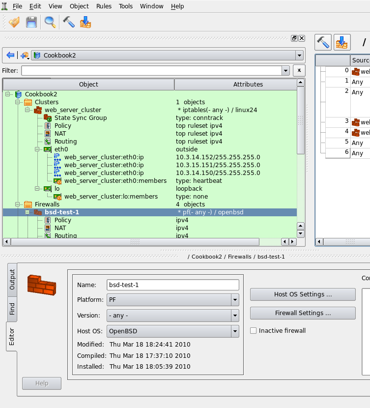

   "Compile this" toolbar button

This opens standard "compile" dialog but it only shows the cluster and its two member firewalls. I actually have many other firewall and cluster objects in my test data file, but since I started compile process using "compile this" button, only those that are relevant to the cluster configuration I am working with at the moment are shown.

.. figure:: img/cookbook-116.png
   :alt: Compiling cluster configuration

   Compiling cluster configuration

Clicking "Next" on the first page of the dialog starts the compiler. It processes both member firewalls, one after another, and prints its progress output in the window on the next page of the dialog. Errors and warnings, if any, appear there as well.

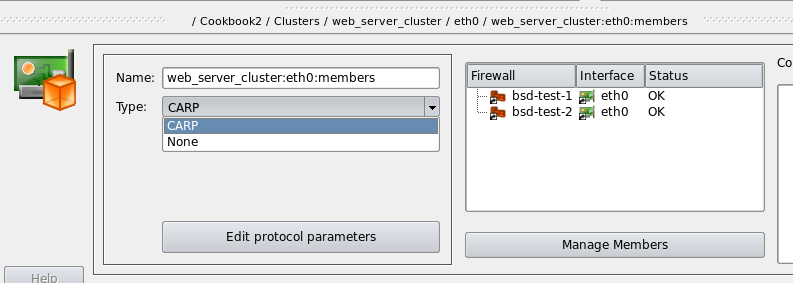

   Compiling process progress window

.. tip::

   If compiler generates any errors or warnings, they are highlighted in the output using different colors. Errors appear red and warnings appear blue. The text lines of errors and warnings are clickable. Clicking on one automatically makes the main window switch to the firewall, rule set and rule that caused the message.

If you inspect the output of the compiler, you'll notice that it processed 11 rules, while the main window shows only 7. To find out what are these additional 4 rules, we are going to look inside the generated script. There are two scripts, actually, one for each member firewall. Their names are the same as names of the member firewall objects, "linux-test-1" and "linux-test-2", with extension .fw. Other chapters of the Users Guide discuss various parts of the generated script, here we are going to look at the automatically added rules. Here is a fragment of the script linux-test-1.fw, specifically the beginning of the part that defines iptables rules:

.. code-block:: text

   # ================ Table 'filter', rule set Policy
   #
   # Rule -4 heartbeat (automatic)
   #
   echo "Rule -4 heartbeat (automatic)"
   #
   $IPTABLES -A OUTPUT -o lo -p udp -m udp -d 224.0.10.100 --dport 694 -j ACCEPT
   #
   # Rule -3 heartbeat (automatic)
   #
   echo "Rule -3 heartbeat (automatic)"
   #
   $IPTABLES -A INPUT -i lo -p udp -m udp -d 224.0.10.100 --dport 694 -j ACCEPT
   #
   # Rule -2 heartbeat (automatic)
   #
   echo "Rule -2 heartbeat (automatic)"
   #
   $IPTABLES -A OUTPUT -o eth0 -p udp -m udp -d 224.0.10.100 --dport 694 -j ACCEPT
   #
   # Rule -1 heartbeat (automatic)
   #
   echo "Rule -1 heartbeat (automatic)"
   #
   $IPTABLES -A INPUT -i eth0 -p udp -m udp -d 224.0.10.100 --dport 694 -j ACCEPT
   #
   # Rule 0 (eth0)
   #
   echo "Rule 0 (eth0)"
   #
   $IPTABLES -N In_RULE_0
   $IPTABLES -A INPUT -i eth0 -s 10.3.14.152 -j In_RULE_0
   $IPTABLES -A INPUT -i eth0 -s 10.3.14.151 -j In_RULE_0
   $IPTABLES -A INPUT -i eth0 -s 10.3.14.150 -j In_RULE_0
   $IPTABLES -A INPUT -i eth0 -s 10.3.14.108 -j In_RULE_0
   $IPTABLES -A In_RULE_0 -j LOG --log-level info --log-prefix "RULE 0 -- DENY "
   $IPTABLES -A In_RULE_0 -j DROP

Rules with negative numbers were added by the program automatically to permit packets of the heartbeat protocol. Rules added to interface "eth0" look right, they are in the right chains INPUT and OUTPUT and match multicast group 224.0.10.100 and port 694 which were configured in the protocol settings dialog Figure 14.105. The program also added the same rules to the loopback interface which we probably do not need. This is because the wizard that creates new cluster object treats all interfaces equally and since it has found two interfaces in each member firewall, "eth0" and "lo", it set up failover groups on both. In other words, the program assumed that I want to run heartbeat on all interfaces. I could have fixed this right in the wizard when I was creating new cluster object. To do that, I would have to switch to the tab "lo" in Figure 14.101 page of the wizard and set "Protocol" to "None" for the interface "lo". However, I did not do it then, so I need to fix it now, when cluster object and its interfaces have already been created.

To fix this, I find interface "lo" of the cluster and failover group object "web_server_cluster:lo:members" located right under it in the tree:

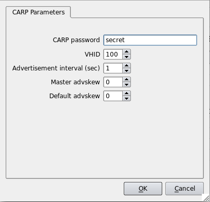

   Failover group that was added to loopback interface

Then I double click on the failover group "web_server_cluster:lo:members" in the tree to open it in the editor and switch the type from "heartbeat" to "None". Once this is done, I recompile the firewall again and inspect generated script:

.. code-block:: text

   # ================ Table 'filter', rule set Policy
   #
   # Rule -2 heartbeat (automatic)
   #
   echo "Rule -2 heartbeat (automatic)"
   #
   $IPTABLES -A OUTPUT -o eth0 -p udp -m udp -d 224.0.10.100 --dport 694 -j ACCEPT
   #
   # Rule -1 heartbeat (automatic)
   #
   echo "Rule -1 heartbeat (automatic)"
   #
   $IPTABLES -A INPUT -i eth0 -p udp -m udp -d 224.0.10.100 --dport 694 -j ACCEPT
   #
   # Rule 0 (eth0)
   #
   echo "Rule 0 (eth0)"
   #
   $IPTABLES -N In_RULE_0
   $IPTABLES -A INPUT -i eth0 -s 10.3.14.152 -j In_RULE_0
   $IPTABLES -A INPUT -i eth0 -s 10.3.14.151 -j In_RULE_0
   $IPTABLES -A INPUT -i eth0 -s 10.3.14.150 -j In_RULE_0
   $IPTABLES -A INPUT -i eth0 -s 10.3.14.108 -j In_RULE_0
   $IPTABLES -A In_RULE_0 -j LOG --log-level info --log-prefix "RULE 0 -- DENY "
   $IPTABLES -A In_RULE_0 -j DROP
   #

The rules attached to loopback are gone.

Last change I am going to do before I upload generated script to my firewalls is switch to iptables-restore format in the generated script. This offers many advantages over entering iptables commands one by one, the most important is that iptables-restore policy update is atomic. If it encounters an error, it aborts without changing running firewall policy. Also the update happens much faster and the firewall does not run in the undefined state with only part of its policy loaded. To switch, find firewall object in the tree, double click it to open it in the editor and click "Firewall Settings" button. Navigate to the tab "Script" and turn on checkbox "Use iptables-restore to activate policy". Do it in both member firewall objects, then recompile again. Generated script now looks like this (this is only relevant part of the script):

.. code-block:: text

   (
   echo '*filter'
   # ================ Table 'filter', automatic rules
   echo :INPUT DROP [0:0]
   echo :FORWARD DROP [0:0]
   echo :OUTPUT DROP [0:0]
   # accept established sessions
   echo "-A INPUT -m state --state ESTABLISHED,RELATED -j ACCEPT "
   echo "-A OUTPUT -m state --state ESTABLISHED,RELATED -j ACCEPT "
   echo "-A FORWARD -m state --state ESTABLISHED,RELATED -j ACCEPT "
   # ================ Table 'filter', rule set Policy
   #
   # Rule -2 heartbeat (automatic)
   echo "-A OUTPUT -o eth0 -p udp -m udp -d 224.0.10.100 --dport 694 -j ACCEPT "
   #
   # Rule -1 heartbeat (automatic)
   echo "-A INPUT -i eth0 -p udp -m udp -d 224.0.10.100 --dport 694 -j ACCEPT "
   #
   # Rule 0 (eth0)
   echo ":In_RULE_0 - [0:0]"
   echo "-A INPUT -i eth0 -s 10.3.14.152 -j In_RULE_0 "
   echo "-A INPUT -i eth0 -s 10.3.14.151 -j In_RULE_0 "
   echo "-A INPUT -i eth0 -s 10.3.14.150 -j In_RULE_0 "
   echo "-A INPUT -i eth0 -s 10.3.14.108 -j In_RULE_0 "
   echo "-A In_RULE_0 -j LOG --log-level info --log-prefix \"RULE 0 -- DENY \""
   echo "-A In_RULE_0 -j DROP "
   . . . . . . more rules here . . . . . .
   # Rule 6 (global)
   echo ":RULE_6 - [0:0]"
   echo "-A INPUT -j RULE_6 "
   echo "-A RULE_6 -j LOG --log-level info --log-prefix \"RULE 6 -- DENY \""
   echo "-A RULE_6 -j DROP "
   #
   echo COMMIT
   ) | $IPTABLES_RESTORE; IPTABLES_RESTORE_RES=$?
   test $IPTABLES_RESTORE_RES != 0 && run_epilog_and_exit $IPTABLES_RESTORE_RES

.. note::

   In addition to rules for the failover protocol, Firewall Builder can automatically add rules to permit packets used by the state synchronization protocol. In case of iptables this is *conntrackd*. Protocol parameters are configured in the "State Sync Group" object that is located in the tree immediately under the cluster.

Installing Cluster Configuration Using Built-in Policy Installer
^^^^^^^^^^^^^^^^^^^^^^^^^^^^^^^^^^^^^^^^^^^^^^^^^^^^^^^^^^^^^^^^^^

More details on the installer and explanation of its options can be found in Chapter 10.

To upload generated script to both firewalls and activate it, use toolbar button "Install" that is located next to the button "Compile". It also opens wizard-like dialog that lists the cluster and member firewalls and provides checkboxes that allow you to choose which firewall you want to install on (both by default).

.. figure:: img/cookbook-119.png
   :alt: Policy installer parameters

   Policy installer parameters

Once you choose which firewalls you want to install the policy on and click Next, you are presented with policy installer dialog Figure 14.111 where you need to enter authentication credential and some other parameters that control installation process.

Policy installer shows its progress in the dialog that looks like this:

   Policy installer progress

Installer copies the script to the firewall using scp (pscp.exe on Windows), then runs it there. If this is the first time you connect to the firewall using ssh, installer recognizes ssh warning about unknown host key and opens another pop-up dialog where it shows the key and asks administrator to verify it. If there were no errors during policy install, corresponding status is declared "success" in the left hand side column and installer tries to do the same for the next member firewall.

Converting Configuration to OpenBSD and PF
^^^^^^^^^^^^^^^^^^^^^^^^^^^^^^^^^^^^^^^^^^^^

Lets see how much effort it is going to take to convert this configuration to entirely different firewall platform - PF on OpenBSD. There are different ways to do this. I could make a copy of each member firewall (linux-test-1 and linux-test-2), set platform and host OS in the copy to PF and OpenBSD and then create new cluster object. This would be a sensible way because it preserves old objects which helps to roll back in case something does not work out. However, to make the explanation shorter, I am going to make the changes in place by modifying existing objects.

I start with member firewalls. Open each one in the editor and change its name, platform and host OS as shown in Figure 14.113 for the first member:

.. figure:: img/cookbook-121.png
   :alt: Converting member firewall to PF/OpenBSD

   Converting member firewall to PF/OpenBSD

Set version of PF to match version of your OpenBSD machine. Do the same change to the second member firewall, then check failover group of interface "eth0" of the cluster object:

.. figure:: img/cookbook-122.png
   :alt: Failover group indicates that the cluster configuration does not match members

   Failover group indicates that the cluster configuration does not match members

Failover group declares status of both members "Invalid", this is because the platform and host OS of members do not match configuration of the cluster object anymore. They should match exactly, so we have to reconfigure the cluster object to platform "PF" and host OS "OpenBSD" as well. This should fix the status of both members in the failover group dialog.

To switch to OpenBSD from Linux we need to change failover protocol from heartbeat to CARP as well. The protocol is configured in the failover group object. List of available protocols depends on the firewall platform chosen in the parent cluster object. While cluster was set up as "iptables", possible choices of failover protocols were "heartbeat", "VRRP", "OpenAIS" and "None". "CARP" was not in the list because it is not available on Linux. After the cluster is switched to "PF", the list consists only of "CARP" and "None" as shown in Figure 14.115:

.. figure:: img/cookbook-123.png
   :alt: Failover protocol choices for PF/OpenBSD

   Failover protocol choices for PF/OpenBSD

Firewall Builder can configure CARP interfaces on BSD. For that, it needs some parameters of the CARP protocol. You can configure these if you click "Edit protocol parameters" button in the failover group object dialog. This brings another dialog where you can configure CARP password, vhid and some other parameters:

.. figure:: img/cookbook-124.png
   :alt: CARP parameters

   CARP parameters

Last thing we have to change is the names of interfaces. On OpenBSD loopback is "lo0" and ethernet interface can be for example "pcn0". To rename interfaces find them in the tree, open in the editor and change the name. This needs to be done with interface objects of both member firewalls and the cluster. Significant difference between CARP protocol and heartbeat on Linux is that CARP creates its own network interfaces named "carpNN". In Firewall Builder terms this means we need to name cluster interface object "carp0" (remember that in case of Linux cluster, cluster interface name was the same as names of corresponding member firewalls). After all interfaces have been renamed, my final configuration looks like shown in Figure 14.117:

.. note::

   I also changed ip addresses of interfaces pcn0 of both member firewalls to avoid conflict with still running linux firewalls.

.. figure:: img/cookbook-125.png
   :alt: Final configuration for PF cluster

   Final configuration for PF cluster

Now we can recompile the cluster again. For PF fwbuilder generates two files for each member firewall. One file has extension .conf and contains PF configuration. The other file has extension .fw and is an activation script.

Looking inside the generated .conf file, we see PF implementation of the same policy rules (this is just a fragment with first few rules):

.. code-block:: text

   # Tables: (2)
   table <tbl.r0.d> { 10.3.14.50 , 10.3.14.152 , 10.3.14.151 , 10.3.14.150 }
   table <tbl.r0.s> { 10.3.14.152 , 10.3.14.151 , 10.3.14.150 , 10.3.14.50 }
   # # Rule -2 CARP (automatic)
   pass quick on pcn0 inet proto carp from any to any label "RULE -2 -- ACCEPT "
   #
   # Rule backup ssh access rule
   # backup ssh access rule
   pass in quick inet proto tcp from 10.3.14.0/24 to <tbl.r0.d> port 22 \
      flags any label "RULE -1 -- ACCEPT "
   #
   # Rule 0 (carp0)
   block in log quick on pcn0 inet from <tbl.r0.s> to <tbl.r0.s> \
      no state label "RULE 0 -- DROP "
   #
   # Rule 1 (lo0)
   pass quick on lo0 inet from any to any no state label "RULE 1 -- ACCEPT "

.. figure:: img/cookbook-126.png
   :alt: Example of a rule associated with a cluster interface

   Example of a rule associated with a cluster interface

Look at the rule #0 in the screenshot Figure 14.106 (the anti-spoofing rule). The same rule is shown in Figure 14.118, except I removed label "outside" from the interface carp0 to make it clear which interface is placed in the "Interface" column of the rule.

This rule has interface object that belongs to the cluster in its "Interface" column. Firewall Builder GUI does not accept member firewall interface in this column. Only interfaces of the cluster are allowed in the "Interface" column of the rule set that belongs to the cluster. Interfaces of the Linux cluster have the same names as corresponding member firewall interfaces. In my example above member interfaces were "eth0" and cluster interface had the same name. This is because cluster interface object is an abstraction that serves several purposes: it is a place where failover protocol parameters are configured and also it represents member firewall interfaces in rules when the program compiles the policy and generates firewall script or configuration file. Cluster interface object will be replaced with interface of the member firewall for which the policy is being compiled. When fwbuilder compiles it for the member #1, it replaces cluster interface objects with interfaces of member #1. When it then compiles the same rules for member #2, it replaces cluster interfaces with interfaces of member #2.

This feels intuitive when we build Linux cluster because names of member interfaces and cluster interfaces are the same. When I use cluster interface "eth0" in the rule, it is essentially the same as using firewall's interface with the same name (except it is not the same, internally) so it is the configuration I am used to when I start configuring clusters have spent some time working with regular firewalls in fwbuilder.

Interfaces of BSD cluster have names that directly correspond to the names of failover protocol interfaces *carpNN* which really exist on the firewall machine. The problem is that PF does not inspect packets on these interfaces and therefore PF rules should not be attached to these interfaces. Yet, fwbuilder uses BSD cluster interfaces *carpNN* in the same way as explained above. If you want to attach rules to particular interfaces using "on <intf>" clause, you need to use cluster interface object in the rules. In this case, just like when we were building Linux cluster, fwbuilder will replace *carpNN* with interfaces of member firewall that are configured in the failover group of the cluster interface.

I realize this can be counter-intuitive, especially to those who know all details of BSD cluster configuration by heart and are very used to working with CARP. We may be able to improve the model in future versions of fwbuilder if there is enough user demand.

.. note::

   In addition to rules for the failover protocol, Firewall Builder can automatically add rules to permit packets used by the state synchronization protocol. In case of PF this is *pfsync*. Protocol parameters are configured in the "State Sync Group" object that is located in the tree immediately under the cluster. Generated script can also configure pfsync interface and some parameters of the protocol.

The bottom part of the activation script is interesting. This is where CARP interface is configured and PF configuration is activated. Here is how this looks like:

.. code-block:: text

   configure_interfaces() {
      sync_carp_interfaces carp0
      $IFCONFIG carp0 vhid 100 pass secret    carpdev pcn0

      update_addresses_of_interface \
    "carp0 10.3.14.152/0xffffff00 10.3.14.151/0xffffff00 10.3.14.150/0xffffff00" ""
      update_addresses_of_interface "lo0 ::1/128 127.0.0.1/0xff000000" ""
      update_addresses_of_interface "pcn0 10.3.14.50/0xffffff00" ""
   }
   log "Activating firewall script generated Thu Mar 18 20:19:42 2010 by vadim"
   set_kernel_vars
   configure_interfaces
   prolog_commands
   $PFCTL   \
      -f \
      ${FWDIR}/bsd-test-1.conf || exit 1

Shell function "sync_carp_interfaces" is defined at the beginning of the same script, it compares list of carp interfaces defined in Firewall Builder with carp interfaces that really exist on the firewall machine. Interfaces that are missing are created and those that exist but are not defined in fwbuilder are deleted. If the set of carp interfaces matches those defined in fwbuilder, this function does nothing. Next, the script configured interface carp0 using parameters entered in the failover protocol dialog Figure 14.116 shown above. Calls to shell function "update_addresses_of_interface" update ip addresses of interfaces, including carp0. This function also does it incrementally by comparing required list of addresses with those that really are configured on the interface. If lists match, the function does not do anything, otherwise it adds or deletes addresses as appropriate.

Basically, you can start with OpenBSD or FreeBSD machine configured with one IP address on the interface that you can use to communicate with it. Script generated by fwbuilder will set up other addresses and failover protocol.

As you can see, conversion required few changes but not that much. I had to change firewall platform and host OS in member firewalls and cluster object, rename interfaces, possibly change IP addresses, change the name of the failover protocol and its parameters. Relationships between the cluster and member firewalls remained the same and so I did not have to add or remove firewalls to cluster failover group objects. Most importantly, I did not have to touch rules at all. Granted, this was very simple example and in more complicated cases some rules may need to be adjusted. Most often this is the case when original iptables policy used some modules and features unique to iptables. Most typical rules can be translated automatically with no change in the GUI.

.. _linux_cluster_using_vrrpd:

Linux Cluster Using VRRPd
~~~~~~~~~~~~~~~~~~~~~~~~~~~

In this example, we work with two Linux machines running VRRPd for failover that form a High Availability (HA) firewall pair, and another machine behind them that will use this pair as a firewall. The set-up is shown in figure Figure 14.119. Machines *linux-test-1* and *linux-test-2* are the firewalls and *linux-test-3* is a workstation behind them. All testing is done on an isolated network using private IP addresses, subnet "outside" the firewalls is 10.3.14.0/255.255.255.0 and subnet "behind" the firewalls is 10.1.1.0/255.255.255.0. In fact, this network was located behind a router and another firewall that provided connection to the Internet. In real configurations, the subnet that is 10.3.14.0 here will probably use publicly routable IP addresses.

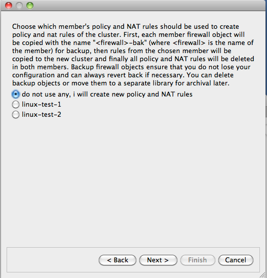

   HA Configuration Using Two Linux Machines Running VRRPd

.. note::

   IPv6 addresses are not used in this recipe. Some interface objects in the screenshots have IPv6 addresses because firewall objects were "discovered" using SNMP, which finds IPv6 addresses. You can disregard these addresses while working with examples in this chapter.

Setting Up VRRPd Daemon
^^^^^^^^^^^^^^^^^^^^^^^^

As shown in Figure 14.119, machines linux-test-1 and linux-test-2 run vrrpd daemon (`VRRPD home page <http://off.net/~jme/vrrpd/>`_) to create virtual IP address on both subnets. VRRPd adds a virtual IP address to the same interface eth0 or eth1. One of the daemons becomes master and takes ownership of the virtual address by adding it to the interface. It sends a UDP datagram to the multicast address 224.0.0.18 every second or so to declare that it is up and running and owns the address. If the machine it is running on shuts down for any reason, this stream of packets from the master stops and after a predetermined timeout, the second machine becomes the master and assumes the virtual IP address. VRRP daemon also replaces MAC address of the interface with a virtual MAC address so that when the virtual IP address is transferred from one machine to another, all hosts on the corresponding subnet do not have to update their ARP tables because the MAC address stays the same.

VRRPd is very easy to configure. It does not have any configuration file; all configuration is provided by parameters on the command line. Here is the command line for the machine linux-test-1:

.. code-block:: text

   vrrpd -D -i eth0 -v 1 -a none -p 110 10.3.14.150
   vrrpd -D -i eth1 -v 2 -a none -p 110 10.1.1.254

Here is the same for the machine linux-test-2:

.. code-block:: text

   vrrpd -D -i eth0 -v 1 -a none -p 120 10.3.14.150
   vrrpd -D -i eth1 -v 2 -a none -p 120 10.1.1.254

The parameter "-D" makes VRRPd become a daemon, "-i" tells it which interface it should work with, "-v" defines the VRID (Virtual Router Identifier), "-a" is used to set up authentication (we used none for this simple test), "-p" configures priority and the last parameter is the virtual address this instance of VRRPd should manage. The VRID used on our two subnets should be different. Here I make the priority of one machine higher than the other to ensure it becomes master when it comes online. This is it: once all instances of VRRPd start on both machines, they configure IP addresses as follows (addresses added by vrrpd are highlighted in red):

.. code-block:: text

   root@linux-test-1:~# ip -4 addr ls
   1: lo: <LOOPBACK,UP,LOWER_UP> mtu 16436 qdisc noqueue state UNKNOWN
       inet 127.0.0.1/8 scope host lo
   2: eth0: <BROADCAST,MULTICAST,UP,LOWER_UP> mtu 1500 qdisc pfifo_fast state UNKNOWN qlen 1000
       inet 10.3.14.108/24 brd 10.3.14.255 scope global eth0
   3: eth1: <BROADCAST,MULTICAST,UP,LOWER_UP> mtu 1500 qdisc pfifo_fast state UNKNOWN qlen 1000
       inet 10.1.1.1/24 brd 10.1.1.255 scope global eth1

   root@linux-test-2:~# ip -4 addr ls
   1: lo: <LOOPBACK,UP,LOWER_UP> mtu 16436 qdisc noqueue state UNKNOWN
       inet 127.0.0.1/8 scope host lo
   2: eth0: <BROADCAST,MULTICAST,UP,LOWER_UP> mtu 1500 qdisc pfifo_fast state UNKNOWN qlen 1000
       inet 10.3.14.109/24 brd 10.3.14.255 scope global eth0
       inet 10.3.14.150/32 scope global eth0
   3: eth1: <BROADCAST,MULTICAST,UP,LOWER_UP> mtu 1500 qdisc pfifo_fast state UNKNOWN qlen 1000
       inet 10.1.1.2/24 brd 10.1.1.255 scope global eth1
       inet 10.1.1.254/32 scope global eth1

.. note::

   Addresses added by VRRPd have a netmask of /32, while the normal netmask in this set-up for all interfaces is /24.

At this point, we can test our configuration by pinging virtual addresses on both sides. Then kill VRRPd on linux-test-2 and observe virtual addresses being added on the other machine. The test ping should register a few seconds of downtime and then just keep going.

Firewall and Cluster Objects for the HA Firewall Configuration with VRRPd
^^^^^^^^^^^^^^^^^^^^^^^^^^^^^^^^^^^^^^^^^^^^^^^^^^^^^^^^^^^^^^^^^^^^^^^^^^

Now we can create objects in Firewall Builder to represent this cluster. We start with two firewall objects configured with IP addresses but no policy or NAT rules. Interfaces and their addresses and netmasks are shown on Figure 14.120:

.. figure:: img/cookbook-128.png
   :alt: Interfaces and Addresses of the Cluster Members

   Interfaces and Addresses of the Cluster Members

Now we can create the cluster. Use the usual "New object" menu and choose the object type "Cluster":

.. figure:: img/cookbook-129.png
   :alt: Creating a New Cluster Object

   Creating a New Cluster Object

This starts the wizard that helps you create new cluster object. First, choose which firewall objects will be used for the cluster. Our test file is small and has only two firewall objects so the choice is obvious.

In more complex configurations, you may have many firewall objects, not all of which need to be used in cluster configurations.

.. figure:: img/cookbook-130.png
   :alt: First Page of the New Cluster Wizard

   First Page of the New Cluster Wizard

.. note::

   Since all policy and NAT rules are configured in the cluster object, the same member firewall object can be used with different clusters. This is a great way to try different configurations or build some temporary ones.

On the next page of the wizard we configure the mapping between cluster interfaces and interfaces of the member firewalls. In this simple set-up the mapping is direct: interface "eth0" of the cluster represents interfaces "eth0" of both members and the same goes for "eth1" and loopback. Things may be more complicated if the failover protocol used for the cluster creates its own interfaces, such as CARP on OpenBSD. In that case the name of the interface that is configured at the top of the wizard page would be "carp0" and we would map it to interfaces of the members, say "en0" on both, using controls at the bottom of the wizard page. However in the case of VRRP, the heartbeat and keepalived on Linux the name of the cluster interface must match the name of the member interfaces; that is, in our case we create cluster interfaces "eth0" and "eth1". The wizard does this automatically: it finds interfaces with the same name in both members and suggests cluster interfaces with the same name, mapped to those interfaces of the member firewalls. Feel free to edit if this guess was incorrect for your set-up. The "+" and "x" buttons in the top corners of the page allow you to add and remove cluster interfaces. See Section 8.1 for more information on the cluster interfaces in Firewall Builder.

.. figure:: img/cookbook-131.png
   :alt: Configuring Cluster Interfaces

   Configuring Cluster Interfaces

The next page of the wizard is used to set up virtual IP addresses and failover protocols for the cluster interfaces. Most protocols require an IP address, which you can add by clicking the "Add address" button. The only exception at this time is Cisco PIX, where the HA pair uses IP addresses of the master instead of using special virtual addresses. In that case, the part of the wizard page where you configure IP addresses will be disabled.

Choose the failover protocol using the drop-down list. Among other "real" protocols list includes item "None". Use this item if you do not want Firewall Builder to add automatic policy rules to the generated configuration and plan to do this yourself. Also use this "protocol" to configure cluster loopback interface. In any case cluster interfaces must be configured with corresponding interfaces of the member firewalls to establish the mapping.

.. figure:: img/cookbook-132.png
   :alt: Configuring Virtual IP Addresses of Cluster Interfaces

   Configuring Virtual IP Addresses of Cluster Interfaces

.. note::

   The address and netmask pair of the cluster interface must be configured exactly the same as done by the cluster software. In the case of VRRPd, the netmask is /32 (see the output of "ip addr show" command above where it is visible that the address added by VRRPd comes with netmask /32). We use the same netmask in the address configuration in cluster interfaces eth0 and eth1. See :ref:`managing_ip_addresses_vrrpd` for the explanation of why this netmask is important.

The final page of the wizard allows you to choose to copy policy and NAT rules from one of the members to the new cluster object. This can be useful if you used to manage a cluster with Firewall Builder by maintaining two firewall objects manually or with the aid of external scripts. If you decide to use this option, the Firewall Builder GUI copies policy and NAT rules from the member you choose to the new cluster object, then creates backup copies of both member firewall objects with the name with suffix "-bak" and deletes all Policy and NAT rules in the rule sets of the member firewall objects it uses for the cluster. This way, you can always return to your old set-up using these backup objects and at the same time, new cluster configuration has all the rules in the cluster object.

.. note::

   This is important because if a member firewall object has a policy or NAT rule set with the same name as the one in the cluster, then Firewall Builder will use rules from the rule set of the member, thus overriding all the rules in the cluster's rule set with the same name. This allows you to create complex configurations where majority of the rules are defined and maintained in the cluster object, but a few rules can be created separately in the members to complement rules of the cluster.

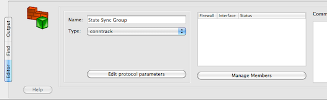

   Final Page of the New Cluster Wizard

The following screenshot demonstrates the newly created cluster object.

.. figure:: img/cookbook-134.png
   :alt: Cluster Object

   Cluster Object

Each cluster interface has an additional child object (located underneath it in the tree) with the name *linux-test-1:eth0:members* and *linux-test-1:eth1:members*. These objects are failover groups; this is where the failover protocol and mapping between the cluster and member interfaces is configured. Screenshot Figure 14.127 highlights failover group that belongs to interface eth0:

.. figure:: img/cookbook-135.png
   :alt: Cluster Failover Group in the Object Tree

   Cluster Failover Group in the Object Tree

The failover group is configured with the name, protocol, and interfaces of the member firewalls that correspond to the cluster interface this failover group belongs to. The failover group object selected on Figure 14.127 looks like this:

.. figure:: img/cookbook-136.png
   :alt: Cluster Failover Group Object

   Cluster Failover Group Object

The failover group for the interface eth1 should look the same, except for using interfaces eth1 of the member firewalls. Use the button *Manage Members* to open a dialog that lets you add and remove member firewall interfaces in the failover group.

Another new type of object that appears in the clusters is State Synchronization group. This group object defines the state synchronization protocol to be used for the cluster and interfaces of the member firewalls where this protocol runs. In the case of Linux firewalls only the *conntrack* protocol is available.

.. note::

   The purpose of this new object is to provide configuration parameters to let Firewall Builder generate policy rules to permit packets of this protocol. In some other cases, such as with PF on OpenBSD where state synchronization is done via *pfsync* interface, Firewall Builder can generate actual configuration for the protocol itself. However at this time Firewall Builder does not generate configuration or a command line for the conntrackd daemon.

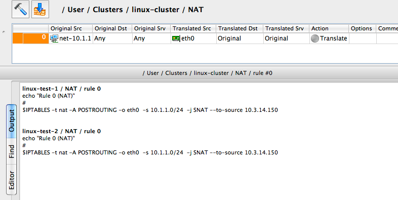

   State Synchronization Group in the Object Tree

Just like as for failover groups, a state synchronization group object is configured with the name, protocol, and member interfaces:

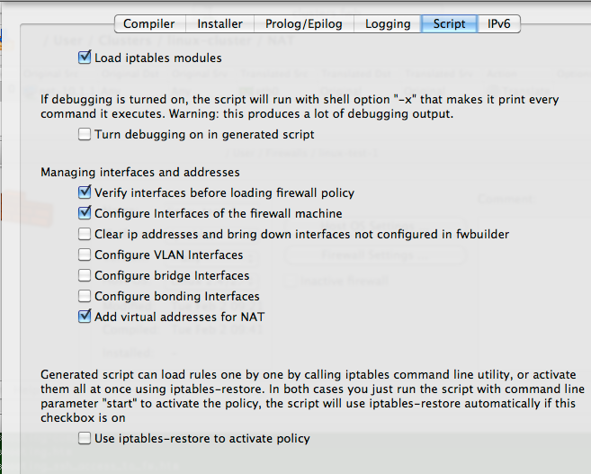

   State Synchronization Group Object

If you do not use *conntrackd* in your cluster set-up and do not need iptables rules to permit its packets in the generated script, then just do not configure state synchronization group object with interfaces of the member firewalls. Such an empty state synchronization group object will look like this when opened in the editor:

.. figure:: img/cookbook-139.png
   :alt: Empty State Synchronization Group Object

   Empty State Synchronization Group Object

You can edit parameters of the state synchronization protocol, such as IP address of the multicast group it uses and port number if you click *Edit protocol parameters* button:

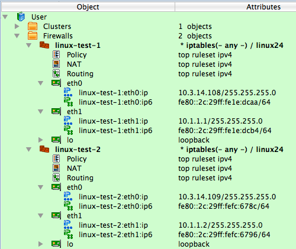

   State Synchronization Protocol Parameters

Firewall Builder uses this information to generate policy rules to permit conntrack packets. See examples of the output generated by the policy compiler below.

Policy and NAT Rules for the Cluster
^^^^^^^^^^^^^^^^^^^^^^^^^^^^^^^^^^^^^^

Now we can move on to building a cluster policy and NAT rules. In the examples below, I am using a feature introduced in Firewall Builder 4.0 that lets you quickly compile single rule and see the result in the bottom panel of the GUI immediately. To do this, right-click anywhere in the rule to open context menu and use item "Compile" or highlight the rule and press the "X" key.

.. figure:: img/cookbook-141.png
   :alt: Compiling a Single Rule

   Compiling a Single Rule

The following figure shows a minimal policy rule set for the cluster that demonstrates general principles used by Firewall Builder to generate configurations for the member firewalls.

.. figure:: img/cookbook-142.png
   :alt: Simple Policy for the Cluster, Also Showing the Generated iptables Commands for the Anti-Spoofing Rule

   Simple Policy for the Cluster, Also Showing the Generated iptables Commands for the Anti-Spoofing Rule

Let's inspect the policy rules shown in Figure 14.134. All rules are built with the global option "Assume firewall is part of any" turned off in both linux-test-1 and linux-test-2 firewalls.

* **Rule 0**: anti-spoofing rule. When we build anti-spoofing rule for a standalone firewall, we put firewall object in "Source", its external interface in "Interface" and make direction "Inbound". When we do this for a cluster, we put cluster object in "Source" instead of the member firewall object. The interface object in "Interface" element of this rule is the one that belongs to the cluster rather than its members. All other aspects of the rule are the same. Firewall Builder generates iptables commands for this rule using the IP addresses of the cluster (10.3.14.150 and 10.1.1.254 in our example) and the addresses of the member firewall it compiles for, in this case 10.3.14.108 and 10.1.1.1 for linux-test-1 and 10.3.14.109 and 10.1.1.2 for linux-test-2. This is clearly visible in the generated output shown in Figure 14.134. In other words, policy compiler processes rules twice, first compiling for the first member firewall and then for the second one. On each pass, cluster object represents corresponding member, plus virtual addresses configured in the cluster's interfaces.

* **Rules 1 and 2**: since VRRPd uses multicast to communicate between daemons running on the member firewalls, it needs IGMP as well. Rules 1 and 2 permit packets sent to the standard multicast address registered for IGMP in both directions (in and out). These rules use standard IPv4 address object "IGMP" that is available in the Standard objects library. The rules could be even more restrictive and also match IP service object "IGMP", also available in the Standard objects library. Since this service object matches protocol number 2 and IP option "router-alert". Unfortunately, only the very latest Linux distributions ship the iptables module ipv4options needed to match IP options so I did not put the service object in the rule. Here is how generated iptables script look like when "Service" field on the rules 1 and 2 is "any":

.. code-block:: text

   linux-test-1 / Policy / rule 1
   $IPTABLES -A OUTPUT -d 224.0.0.22 -m state --state NEW -j ACCEPT
   linux-test-2 / Policy / rule 1
   $IPTABLES -A OUTPUT -d 224.0.0.22 -m state --state NEW -j ACCEPT

   linux-test-1 / Policy / rule 2
   $IPTABLES -A INPUT -s 224.0.0.22 -m state --state NEW -j ACCEPT
   linux-test-2 / Policy / rule 2
   $IPTABLES -A INPUT -s 224.0.0.22 -m state --state NEW -j ACCEPT

If I put standard IP service object "IGMP" in the "Service" field of rules 1 and 2, I get the following iptables commands for the rule 1:

.. code-block:: text

   linux-test-1 / Policy / rule 1
   $IPTABLES -A OUTPUT -p 2 -d 224.0.0.22 -m ipv4options --ra -m state --state NEW -j ACCEPT
   linux-test-2 / Policy / rule 1
   $IPTABLES -A OUTPUT -p 2 -d 224.0.0.22 -m ipv4options --ra -m state --state NEW -j ACCEPT

* The rest of the rules are fairly straightforward and serve to illustrate that building a policy for the cluster is no different than building the policy for a regular standalone firewall. **Rules 3 and 4** permit access from the firewall to internal network and the other way around. The generated iptables commands use INPUT and OUTPUT chains and look like this:

.. code-block:: text

   linux-test-1 / Policy / rule 3
   $IPTABLES -A OUTPUT -d 10.1.1.0/24 -m state --state NEW -j ACCEPT
   linux-test-2 / Policy / rule 3
   $IPTABLES -A OUTPUT -d 10.1.1.0/24 -m state --state NEW -j ACCEPT

   linux-test-1 / Policy / rule 4
   $IPTABLES -A INPUT -s 10.1.1.0/24 -m state --state NEW -j ACCEPT
   linux-test-2 / Policy / rule 4
   $IPTABLES -A INPUT -s 10.1.1.0/24 -m state --state NEW -j ACCEPT

* **Rule 5** permits outbound access from the internal net to the Internet and uses chain FORWARD. The generated iptables code for this rule is no different from that produced for a regular standalone firewall. Note that we don't need to add explicit rule to permit VRRP and conntrackd packets to the policy. This is because Firewall Builder adds these rules automatically. Here is how they look like in the generated iptables script for the linux-test-1 firewall:

.. code-block:: text

   # ================ Table 'filter', rule set Policy
   #
   # Rule -4 VRRP (automatic)
   #
   $IPTABLES -A INPUT -i eth1 -p vrrp -d 224.0.0.18 -j ACCEPT
   $IPTABLES -A OUTPUT -o eth1 -p vrrp -d 224.0.0.18 -j ACCEPT
   #
   # Rule -3 VRRP (automatic)
   #
   $IPTABLES -A INPUT -i eth0 -p vrrp -d 224.0.0.18 -j ACCEPT
   $IPTABLES -A OUTPUT -o eth0 -p vrrp -d 224.0.0.18 -j ACCEPT
   #
   # Rule -2 CONNTRACK (automatic)
   #
   $IPTABLES -A OUTPUT -o eth1 -p udp -m udp -d 225.0.0.50 --dport 3780 -j ACCEPT
   #
   # Rule -1 CONNTRACK (automatic)
   #
   $IPTABLES -A INPUT -i eth1 -p udp -m udp -d 225.0.0.50 --dport 3780 -j ACCEPT

Rules for conntrack are associated with interface eth1 because the state synchronization group is configured with interfaces eth1 of the member firewalls (Figure 14.130).

Now let's look at the NAT rule built for this cluster:

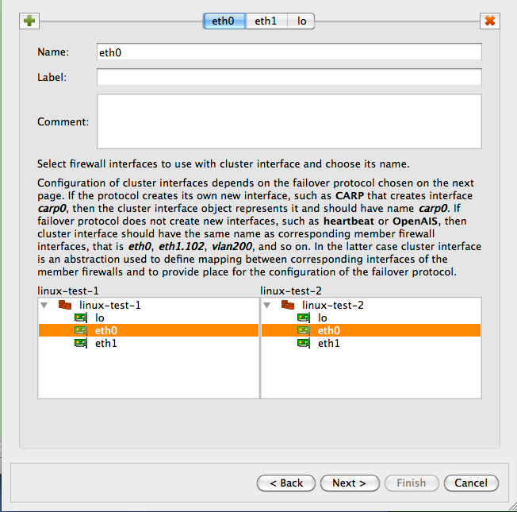

   NAT Rule for the Cluster

Interface eth0 used in the "Translated Source" element of this rule is the one that belongs to the cluster, not member firewalls. The generated iptables commands use cluster interface that belongs to this interface for the translation. Otherwise this is very common SNAT rule.

.. _managing_ip_addresses_vrrpd:

Managing the IP Addresses of the Interfaces in the Cluster Set-Up
^^^^^^^^^^^^^^^^^^^^^^^^^^^^^^^^^^^^^^^^^^^^^^^^^^^^^^^^^^^^^^^^^^

At the beginning of this chapter I mentioned that it is important to create the IP address of the cluster interface with the same netmask it has on the real firewall machine. When virtual IP address is managed by VRRPd, the netmask is /32 (See Figure 14.124). Here is what happens.

The generated script can manage IP addresses of interfaces of the firewall. This is optional and is controlled by checkboxes in the "Script" tab of the firewall object "advanced settings" dialog.

.. figure:: img/cookbook-144.png
   :alt: Options in the "Script" tab of the firewall object dialog

   Options in the "Script" tab of the firewall object dialog

When the checkbox "Configure interfaces of the firewall machine" is turned on, Firewall Builder adds the following lines to the generated script:

.. code-block:: text

   configure_interfaces() {
   update_addresses_of_interface "lo ::1/128 127.0.0.1/8" ""
   update_addresses_of_interface "eth0 fe80::2c:29ff:fe1e:dcaa/64 10.3.14.108/24" "10.3.14.150/32"
   update_addresses_of_interface "eth1 fe80::2c:29ff:fe1e:dcb4/64 10.1.1.1/24" "10.1.1.254/32"
   }

Here calls to the update_addresses_of_interface shell function try to bring ip addresses of the firewall interfaces in sync with their configuration in Firewall Builder. IP addresses that are configured in fwbuilder but are not present on the firewall will be added and those found on the firewall but are not configured in fwbuilder will be removed.

.. note::

   This is done to ensure the environment in which generated iptables rules will work really matches assumptions under which these rules were generated. If the program generates rules assuming certain addresses belong to the firewall, but in fact they do not, packets will go into chains different from those used in the generated iptables commands and behavior of the firewall will be wrong.

When the script adds and removes ip addresses of the firewall interfaces, it should skip those managed by VRRPd. VRRPd (and probably other HA software as well) does not seem to monitor the state of the virtual addresses it adds to interfaces, assuming that it is the only agent that does so. If fwbuilder script were to remove virtual addresses while VRRPd is still working, the cluster operation would break until vrrpd would add them back, which only happens when it restarts or failover occurs. So the Firewall Builder script has to know to avoid these addresses and not remove them. The second argument in the call to the shell function update_addresses_of_interface serves this purpose, it tells the function which addresses it should ignore. The function uses "ip addr show" command to discover addresses that already configured on the interfaces and for the address to match, it should have exactly the same netmask as the one that appears in the output of "ip addr show" command.

.. _linux_cluster_using_heartbeat:

Linux Cluster Using Heartbeat
~~~~~~~~~~~~~~~~~~~~~~~~~~~~~~~

In this example, we work with two Linux machines running heartbeat for failover that form a High Availability (HA) firewall pair, and another machine behind them that will use this pair as a firewall. The set up is shown in figure Figure 14.137. Machines linux-test-1 and linux-test-2 are the firewalls and linux-test-3 is a workstation behind them. All testing is done on an isolated network using private IP addresses, subnet "outside" the firewalls is 10.3.14.0/255.255.255.0 and subnet "behind" the firewalls is 10.1.1.0/255.255.255.0. In fact, this network was located behind a router and another firewall that provided connection to the Internet. In real configurations, subnet that is 10.3.14.0 here will probably use publicly routable IP addresses.

.. figure:: img/cookbook-145.png
   :alt: HA Configuration Using Two Linux Machines Running a Heartbeat

   HA Configuration Using Two Linux Machines Running a Heartbeat

.. note::

   IPv6 addresses are not used in this recipe. Some interface objects in the screenshots have IPv6 addresses because firewall objects were "discovered" using SNMP which finds IPv6 addresses. You can disregard these addresses while working with examples in this chapter.

Setting Up the Heartbeat
^^^^^^^^^^^^^^^^^^^^^^^^^^

As shown in Figure 14.137, machines linux-test-1 and linux-test-2 run heartbeat daemon (`Linux-HA home page <http://www.linux-ha.org/>`_) to create virtual IP address on both subnets. The heartbeat adds virtual IP address to the same interface eth0 or eth1. One of the daemons becomes master and takes ownership of the virtual address by adding it to the interface with the label "eth0:0" or "eth1:0".

.. note::

   Section 8.1 explains that this "eth0:0" is not an interface and should not be used as the name of the interface object in Firewall Builder configuration. See Section 8.1 for a more detailed explanation.

The heartbeat sends a UDP datagram to the multicast address 225.0.0.1 every second or so to declare that it is up and running and owns the address. If the machine it is running on shuts down for any reason, this stream of packets from the master stops and after a predetermined timeout, the second machine becomes master and assumes the virtual IP address. The heartbeat actually is more complex than that: it can be configured to monitor certain resources on the machine and give up the address if some conditions are met. In that case, two daemons negotiate transfer of the address from one machine to another and the second machine becomes active. These aspects of heartbeat configuration are outside the scope of this manual and we will not go into more details about it. See heartbeat documentation on `Linux-HA home page <http://www.linux-ha.org/>`_ or heartbeat manual for that.

Unlike VRRPd, heartbeat does not replace the MAC address of the active machine with a virtual one: it uses gratuitous ARP to announce the changing of the MAC address. This does not change anything in the Firewall Builder configuration for the cluster.

Assuming you have followed installation instructions for the heartbeat and have correct package on the machine, you can build simple configuration for it by creating just three files:

* ``ha.cf``, the main configuration file
* ``haresources``, resource configuration file
* ``authkeys``, authentication information

Here is the configuration for the test setup I am using:

.. figure:: img/cookbook-146.png
   :alt: Heartbeat configuration files

   Heartbeat configuration files

.. code-block:: text

   # cat ha.cf:
   mcast eth0 225.0.0.1 694 1 0
   mcast eth1 225.0.0.1 694 1 0
   auto_failback on
   node linux-test-1
   node linux-test-2

   # cat haresources
   linux-test-1 IPaddr::10.3.14.150/24/eth0/10.3.14.255
   linux-test-1 IPaddr::10.1.1.254/24/eth1/10.1.1.255

   # cat authkeys
   auth 3
   3 md5 hb-auth-key

This tells the heartbeat to run two sessions, on interfaces eth0 and eth1, using multicast with default group address 225.0.0.1 and udp port 694. There are two nodes, "linux-test-1" and "linux-test-2". File haresources defines virtual IP addresses on both subnets and file authkeys sets up MD5 authentication with a simple shared key. A nice aspect of the heartbeat configuration is that all three files are identical on both machines in the cluster. File authkeys should have permissions "0600", other files can have permissions "0644":

.. code-block:: text

   root@linux-test-1:/etc/ha.d# ls -la authkeys haresources ha.cf
   -rw------- 1 root root  648 2010-02-03 09:17 authkeys
   -rw-r--r-- 1 root root 10610 2010-02-03 09:28 ha.cf
   -rw-r--r-- 1 root root  106 2010-02-04 10:21 haresources

Now we can start the heartbeat on both machines using "/etc/init.d/heartbeat start" command (on Ubuntu). If everything is done correctly, the heartbeat daemons should come up and after a while one of them becomes active. Which one is determined by the node name that is the first word in each line of the haresources file. Daemons log their progress, as well as warnings and errors in the /var/log/messages file. When the active daemon takes over the virtual IP address, it is added to the interface and looks like this (virtual addresses are highlighted in red):

.. code-block:: text

   root@linux-test-1:~# ip -4 addr ls
   1: lo: <LOOPBACK,UP,LOWER_UP> mtu 16436 qdisc noqueue state UNKNOWN
       inet 127.0.0.1/8 scope host lo
   2: eth0: <BROADCAST,MULTICAST,UP,LOWER_UP> mtu 1500 qdisc pfifo_fast state UNKNOWN qlen 1000
       inet 10.3.14.108/24 brd 10.3.14.255 scope global eth0
       inet 10.3.14.150/24 brd 10.3.14.255 scope global secondary eth0:0
   3: eth1: <BROADCAST,MULTICAST,UP,LOWER_UP> mtu 1500 qdisc pfifo_fast state UNKNOWN qlen 1000
       inet 10.1.1.1/24 brd 10.1.1.255 scope global eth1
       inet 10.1.1.254/24 brd 10.1.1.255 scope global secondary eth1:0

   root@linux-test-2:~# ip -4 addr ls
   1: lo: <LOOPBACK,UP,LOWER_UP> mtu 16436 qdisc noqueue state UNKNOWN
       inet 127.0.0.1/8 scope host lo
   2: eth0: <BROADCAST,MULTICAST,UP,LOWER_UP> mtu 1500 qdisc pfifo_fast state UNKNOWN qlen 1000
       inet 10.3.14.109/24 brd 10.3.14.255 scope global eth0
   3: eth1: <BROADCAST,MULTICAST,UP,LOWER_UP> mtu 1500 qdisc pfifo_fast state UNKNOWN qlen 1000
       inet 10.1.1.2/24 brd 10.1.1.255 scope global eth1

Firewall and Cluster Objects for the HA Firewall Configuration with Heartbeat
^^^^^^^^^^^^^^^^^^^^^^^^^^^^^^^^^^^^^^^^^^^^^^^^^^^^^^^^^^^^^^^^^^^^^^^^^^^^^^^

Now we can create objects in Firewall Builder to represent this cluster. We start with two firewall objects configured with ip addresses but no policy or NAT rules. Interfaces and their addresses and netmasks are shown on Figure 14.139:

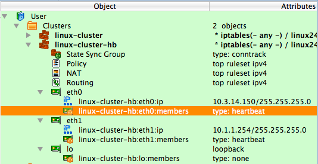

   Interfaces and Addresses of the Cluster Members

Now create the new cluster. First, select firewalls "linux-test-1" and "linux-test-2" in the tree, then click right mouse button to open context menu and use item "New cluster from selected firewalls" as shown on Figure 14.140.

.. figure:: img/cookbook-148.png
   :alt: Creating a New Cluster Object from Selected Member Firewalls

   Creating a New Cluster Object from Selected Member Firewalls

This method opens up the wizard that creates a new cluster object with the list of the firewalls that shows two firewalls that were selected in the tree:

.. figure:: img/cookbook-149.png
   :alt: Creating a New Cluster Object

   Creating a New Cluster Object

After you click "Next", you arrive on the next page where you establish correspondence between cluster interfaces and interfaces of the member firewalls. The program finds interfaces of the members with the same name that can be used for a cluster and preconfigures cluster interfaces using this information. In our case, it created cluster interfaces "eth0", "eth1" and "lo" and mapped them to the interfaces with the same name in both members. See Figure 14.142:

.. figure:: img/cookbook-150.png
   :alt: Arranging Cluster Interfaces

   Arranging Cluster Interfaces

This example is straightforward because there is a direct correspondence between them. In more complex cases, member firewalls may have different number of interfaces, only some of which should be used for the cluster configuration. Or failover protocol used for the cluster may create its own interfaces, such as CARP on OpenBSD. In that case, the name of the interface that is configured at the top of the wizard page would be "carp0" and we would map it to interfaces of the members, say "en0" on both, using controls at the bottom of the wizard page. However, the heartbeat does not create the new interface so the cluster interface objects must have the same name as corresponding member interfaces; in our case "eth0", "eth1" and "lo". You can create new cluster interfaces or delete existing ones on this page using the "+" and "x" buttons. See Section 8.1 for more information on the cluster interfaces in Firewall Builder.

We assign IP addresses and choose failover protocols for the cluster interfaces on the next page of the wizard:

.. figure:: img/cookbook-151.png
   :alt: Configuring the IP Addresses of the Cluster Interfaces

   Configuring the IP Addresses of the Cluster Interfaces

Most protocols require an IP address, which you can add by clicking "Add address" button. The only exception at this time is Cisco PIX, where HA pair uses IP addresses of the master instead of using special virtual addresses. In that case the part of the wizard page where you configure IP addresses will be disabled. Choose the failover protocol using drop-down list. Among other "real" protocols list includes item "None". Use this item if you do not want fwbuilder to add automatic policy rules to the generated configuration and plan to do this yourself. Also use this "protocol" to configure cluster loopback interface. In any case cluster interfaces must be configured with corresponding interfaces of the member firewalls to establish the mapping.

.. note::

   The address and netmask pair of the cluster interface must be configured exactly the same as done by the cluster software. In the case of the heartbeat, the netmask is /24. See the output of "ip addr show" command above where it is visible that the address added by heartbeat comes with netmask /24. The netmask is defined in the "haresources" file. We use the same netmask in the address configuration in cluster interfaces eth0 and eth1. See :ref:`managing_ip_addresses_vrrpd` for the explanation of why this netmask is important.

Final page of the wizard allows you to choose to copy policy and NAT rules from one of the members to the new cluster object. This can be useful if you used to manage a cluster with fwbuilder by maintaining two firewall objects manually or with the aid of external scripts. If you decide to use this option, the Firewall Builder GUI copies policy and NAT rules from the member you choose to the new cluster object, then creates backup copies of both member firewall objects with the name with suffix "-bak" and deletes all policy and NAT rules in the rule sets of the member firewall objects it uses for the cluster. This way, you can always return to your old setup using these backup objects and at the same time, new cluster configuration has all the rules in the cluster object.

.. note::

   This is important because if a member firewall object has a policy or NAT rule set with the same name as the one in the cluster, then Firewall Builder will use rules from the rule set of the member, thus overriding all the rules in the cluster's rule set with the same name. This allows you to create complex configurations where majority of the rules are defined and maintained in the cluster object, but a few rules can be created separately in the members to complement rules of the cluster.

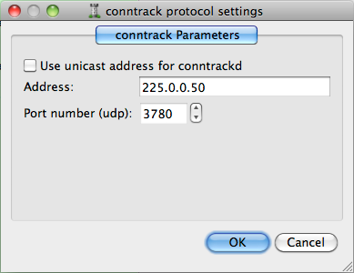

   Final Page of the New Cluster Wizard

The following screenshot demonstrates a newly created cluster object.

.. figure:: img/cookbook-153.png
   :alt: Cluster Object

   Cluster Object

Each cluster interface has an additional child object (located underneath it in the tree) with the name *linux-test-1:eth0:members* and *linux-test-1:eth1:members*. These objects are failover groups, this is where the failover protocol and mapping between the cluster and member interfaces is configured. The screenshot highlights failover group that belongs to interface eth0:

.. figure:: img/cookbook-154.png
   :alt: Cluster Failover Group in the Object Tree

   Cluster Failover Group in the Object Tree

The failover group is configured with the name, protocol, and interfaces of the member firewalls that correspond to the cluster interface this failover group belongs to. Failover group object selected on Figure 14.146 looks like this:

.. figure:: img/cookbook-155.png
   :alt: Cluster Failover Group Object

   Cluster Failover Group Object

The failover group for the interface eth1 should look the same, except for using interfaces eth1 of the member firewalls. Use button *Manage Members* to open a dialog that lets you add and remove member firewall interfaces in the failover group.

Another new type of object that appears in the clusters is the state synchronization group. This group object defines state synchronization protocol used for the cluster and interfaces of the member firewalls where this protocol runs. In the case of Linux firewalls only *conntrack* protocol is available.

.. note::

   The purpose of this new object is to provide all necessary configuration parameters to let Firewall Builder generate policy rules to permit packets of this protocol. In some other cases, such as with PF on OpenBSD where state synchronization is done via *pfsync* interface, Firewall Builder can generate actual configuration for the protocol itself. However at this time Firewall Builder does not generate configuration or command line for the conntrackd daemon.

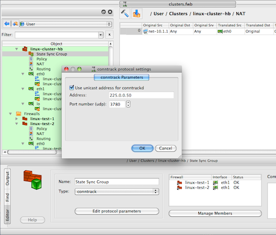

   State Synchronization Group in the Object Tree

Just as for failover group objects, a state synchronization group object is configured with the name, protocol, and member interfaces:

.. figure:: img/cookbook-157.png
   :alt: State Synchronization Group Object

   State Synchronization Group Object

If you do not use *conntrackd* in your cluster set-up and do not need iptables rules to permit its packets in the generated script, then just do not configure state synchronization group object with interfaces of the member firewalls. Such empty state synchronization group object will look like this when opened in the editor:

.. figure:: img/cookbook-158.png
   :alt: Empty State Synchronization Group Object

   Empty State Synchronization Group Object

You can edit parameters of the state synchronization protocol, such as the IP address of the multicast group it uses and port number if you click the *Edit protocol parameters* button:

.. figure:: img/cookbook-159.png
   :alt: State Synchronization Protocol Parameters

   State Synchronization Protocol Parameters

Firewall Builder uses this information to generate policy rules to permit conntrack packets. See examples of the output generated by the policy compiler below.

.. note::

   There is very little difference between building a cluster using VRRPd or heartbeat in Firewall Builder. To switch from one protocol to the other you would need to do the following:

   * Open each failover group object in the editor and change protocol
   * VRRPd uses netmask /32 for the virtual IP addresses, so if your heartbeat setup uses /24, then you need to change these too.

   This is it. If your heartbeat setup uses /32 netmask, then all you need to do is switch the protocol in the failover groups.

Policy Rules for the Cluster
^^^^^^^^^^^^^^^^^^^^^^^^^^^^^^

.. note::

   Examples in this recipe illustrate another useful feature of cluster configurations in Firewall Builder: cluster object "linux-cluster-hb" used in this recipe and cluster object "linux-cluster" from the previous one (:ref:`linux_cluster_using_vrrpd`) use the same firewall objects as member firewalls but generate configurations for clusters based on different failover protocols. The same member firewall object may be used with several cluster objects to test different configurations or for migration.

Now we can move on to building cluster policy and NAT rules. In the examples below I am using a Firewall Builder feature that lets you quickly compile a single rule and see the result in the bottom panel of the GUI immediately. To do this, right-click anywhere in the rule to open context menu and use the item "Compile" or highlight the rule and hit keyboard key "X".

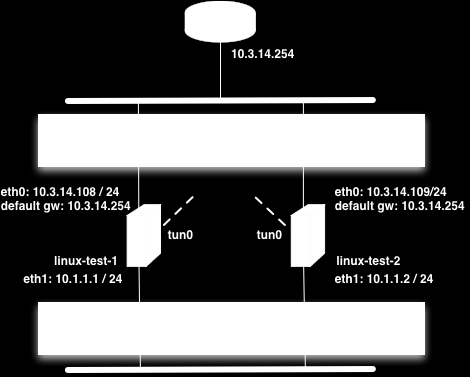

   Compiling a Single Rule

The following figure shows a minimal policy rule set for the cluster that demonstrates general principles used by Firewall Builder to generate configurations for the member firewalls.

.. figure:: img/cookbook-161.png
   :alt: Simple Policy for the Cluster, Also Showing Generated iptables Commands for the Anti-Spoofing Rule

   Simple Policy for the Cluster, Also Showing Generated iptables Commands for the Anti-Spoofing Rule

Let's inspect the policy rules shown in Figure 14.153. All rules are built with the global option "Assume firewall is part of any" turned off in both linux-test-1 and linux-test-2 firewalls.

* **Rule 0**: anti-spoofing rule. When we build anti-spoofing rule for a standalone firewall, we put firewall object in "Source", its external interface in "Interface" and make direction "Inbound". When we do this for a cluster, we put cluster object in "Source" instead of the member firewall object. The interface object in "Interface" element of this rule is the one that belongs to the cluster rather than its members. All other aspects of the rule are the same. Firewall Builder generates iptables commands for this rule using ip addresses of the cluster (10.3.14.150 and 10.1.1.254 in our example) and addresses of the member firewall it compiles for, in this case 10.3.14.108 and 10.1.1.1 for linux-test-1 and 10.3.14.109 and 10.1.1.2 for linux-test-2. This is clearly visible in the generated output shown in Figure 14.153. In other words, policy compiler processes rules twice, first compiling for the first member firewall and then for the second one. On each pass, cluster object represents corresponding member, plus virtual addresses configured in the cluster's interfaces.

* **Rules 1 and 2**: heartbeat can be configured to use either multicast or unicast addresses. See below for the example of configuration with unicast addresses, but by default it is assumed to use multicast. Rules 1 and 2 permit IGMP packets that the system needs to be able to join multicast group. Rules 1 and 2 permit packets sent to the standard multicast address registered for IGMP in both directions (in and out). These rules use standard IPv4 address object "IGMP" that is available in the Standard objects library. The rules could be even more restrictive and also match IP service object "IGMP", also available in the Standard objects library. Since this service object matches protocol number 2 and IP option "router-alert". Unfortunately only the very latest Linux distributions ship the iptables module ipv4options that is needed to match IP options so I did not put the service object in the rule. Here is how the generated iptables script look like when "Service" field on the rules 1 and 2 is "any":

.. code-block:: text

   linux-test-1 / Policy / rule 1
   $IPTABLES -A OUTPUT -d 224.0.0.22 -m state --state NEW -j ACCEPT
   linux-test-2 / Policy / rule 1
   $IPTABLES -A OUTPUT -d 224.0.0.22 -m state --state NEW -j ACCEPT

   linux-test-1 / Policy / rule 2
   $IPTABLES -A INPUT -s 224.0.0.22 -m state --state NEW -j ACCEPT
   linux-test-2 / Policy / rule 2
   $IPTABLES -A INPUT -s 224.0.0.22 -m state --state NEW -j ACCEPT

If I put standard IP service object "IGMP" in the "Service" field of rules 1 and 2, I get the following iptables commands for the rule 1:

.. code-block:: text

   linux-test-1 / Policy / rule 1
   $IPTABLES -A OUTPUT -p 2 -d 224.0.0.22 -m ipv4options --ra -m state --state NEW -j ACCEPT
   linux-test-2 / Policy / rule 1
   $IPTABLES -A OUTPUT -p 2 -d 224.0.0.22 -m ipv4options --ra -m state --state NEW -j ACCEPT

* The rest of the rules are fairly usual and serve to illustrate that building a policy for the cluster is no different than building the policy for a regular standalone firewall. **Rules 3 and 4** permit access from the firewall to internal network and the other way around. The generated iptables commands use INPUT and OUTPUT chains and look like this:

.. code-block:: text

   linux-test-1 / Policy / rule 3
   $IPTABLES -A OUTPUT -d 10.1.1.0/24 -m state --state NEW -j ACCEPT
   linux-test-2 / Policy / rule 3
   $IPTABLES -A OUTPUT -d 10.1.1.0/24 -m state --state NEW -j ACCEPT

   linux-test-1 / Policy / rule 4
   $IPTABLES -A INPUT -s 10.1.1.0/24 -m state --state NEW -j ACCEPT
   linux-test-2 / Policy / rule 4
   $IPTABLES -A INPUT -s 10.1.1.0/24 -m state --state NEW -j ACCEPT

* **Rule 5** permits outbound access from the internal net to the Internet and uses chain FORWARD. The generated iptables code for this rule is no different from that produced for a regular standalone firewall. Note that we don't need to add explicit rule to permit heartbeat and conntrackd packets to the policy. This is because fwbuilder adds these rules automatically. Here is how they look like in the generated iptables script for the linux-test-1 firewall:

.. code-block:: text

   # ================ Table 'filter', rule set Policy
   #
   # Rule -6 heartbeat (automatic)
   #
   $IPTABLES -A OUTPUT -o eth1 -p udp -m udp -d 224.0.10.100 --dport 694 -j ACCEPT
   #
   # Rule -5 heartbeat (automatic)
   #
   $IPTABLES -A INPUT -i eth1 -p udp -m udp -d 224.0.10.100 --dport 694 -j ACCEPT
   #
   # Rule -4 heartbeat (automatic)
   #
   $IPTABLES -A OUTPUT -o eth0 -p udp -m udp -d 224.0.10.100 --dport 694 -j ACCEPT
   #
   # Rule -3 heartbeat (automatic)
   #
   $IPTABLES -A INPUT -i eth0 -p udp -m udp -d 224.0.10.100 --dport 694 -j ACCEPT
   #
   # Rule -2 CONNTRACK (automatic)
   #
   $IPTABLES -A OUTPUT -o eth1 -p udp -m udp -d 225.0.0.50 --dport 3780 -j ACCEPT
   #
   # Rule -1 CONNTRACK (automatic)
   #
   $IPTABLES -A INPUT -i eth1 -p udp -m udp -d 225.0.0.50 --dport 3780 -j ACCEPT

The rules for conntrack are associated with interface eth1 because the state synchronization group is configured with interfaces eth1 of the member firewalls (Figure 14.149).

Using Unicast Configuration for Heartbeat and Conntrack
^^^^^^^^^^^^^^^^^^^^^^^^^^^^^^^^^^^^^^^^^^^^^^^^^^^^^^^^

Failover protocol heartbeat and state synchronization protocol conntrack can work using either multicast or unicast addresses. Configuration described in this recipe so far used multicast addresses for both. To switch to unicast, you need to change configuration of heartbeat in the ha.cnf file to use unicast. Here is how it looks like for the machine linux-test-1:

.. code-block:: text

   # cat ha.cnf
   ucast eth0 10.3.14.109
   ucast eth1 10.1.1.2

Before, when heartbeat was configured to use multicast, the ha.cnf file was identical on both cluster member firewalls. Now that each machine is configured with IP address of the other machine in the cluster, ha.cnf files are different.

Apparently conntrackd can also work using unicast addresses however I can not provide example of its configuration.

To build iptables rules for heartbeat and conntrack working with unicast addresses, open failover group objects associated with cluster interfaces as shown in Figure 14.146 and Figure 14.147, click "Edit protocol parameters" button and turn on checkbox "Use unicast address":

.. figure:: img/cookbook-162.png
   :alt: Using Heartbeat in Unicast Mode

   Using Heartbeat in Unicast Mode

To switch to unicast for conntrackd, open the state synchronization group object in the editor and click the "Edit protocol parameters" button, then check the "Use unicast address" checkbox:

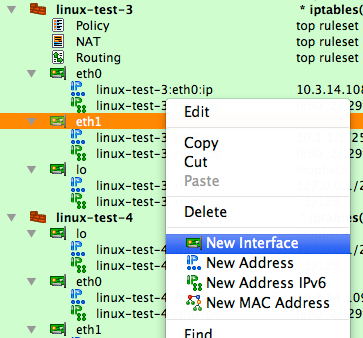

   Using Conntrackd in Unicast Mode

.. note::

   When you switch to unicast, the "Address" input field in the heartbeat and conntrack protocol parameters dialogs becomes disabled.

Switching to unicast makes Firewall Builder generate iptables commands that match IP address of the peer firewall for the corresponding interface pair. Here is the script generated for the machine linux-test-1:

.. code-block:: text

   # Rule -4 heartbeat (automatic)
   #
   $IPTABLES -A OUTPUT -o eth0 -p udp -m udp -d 10.3.14.109 --dport 694 -j ACCEPT
   #
   # Rule -3 heartbeat (automatic)
   #
   $IPTABLES -A INPUT -i eth0 -p udp -m udp -s 10.3.14.109 --dport 694 -j ACCEPT
   #
   # Rule -2 CONNTRACK (automatic)
   #
   $IPTABLES -A OUTPUT -o eth1 -p udp -m udp -d 10.1.1.2 --dport 3780 -j ACCEPT
   #
   # Rule -1 CONNTRACK (automatic)
   #
   $IPTABLES -A INPUT -i eth1 -p udp -m udp -s 10.1.1.2 --dport 3780 -j ACCEPT

NAT Rules for the Cluster
^^^^^^^^^^^^^^^^^^^^^^^^^^^

Now let's look at the NAT rule built for this cluster:

.. figure:: img/cookbook-164.png
   :alt: NAT Rule for the Cluster

   NAT Rule for the Cluster

The interface eth0 used in the "Translated Source" element of this rule is the one that belongs to the cluster, not member firewalls. The generated iptables commands use the cluster interface that belongs to this interface for the translation. Otherwise, this is a very straightforward SNAT rule.

Managing IP Addresses of the Interfaces in a Heartbeat Cluster Setup
^^^^^^^^^^^^^^^^^^^^^^^^^^^^^^^^^^^^^^^^^^^^^^^^^^^^^^^^^^^^^^^^^^^^^

In order to ensure the environment in which generated iptables rules will work really matches assumptions under which these rules were generated, Firewall Builder can manage the IP addresses of the interfaces of the firewall machine. This feature is optional and is controlled by the checkbox "Configure interfaces of the firewall machine" in the "Script" tab of the firewall object "advanced settings" dialog:

.. figure:: img/cookbook-165.png
   :alt: Options in the "Script" Tab of the Firewall Object Dialog

   Options in the "Script" Tab of the Firewall Object Dialog

The reason for this is that if the program generates rules assuming certain addresses belong to the firewall, but in fact they do not, packets will go into chains different from those used in the generated iptables commands and the behavior of the firewall will be wrong.

The code that manages the addresses of interfaces should be able to find and ignore addresses added by the failover daemons such as VRRPd, heartbeat, or keepalived. The program does this by looking at the IP addresses of the cluster interfaces. It is important, therefore, to configure these addresses exactly as they are done by the failover daemons, including both the address and netmask. The heartbeat configuration used in the recipe configures virtual IP address with netmask /24. The addresses of the cluster interfaces must be configured in exactly the same way; otherwise, the generated script will kill them when it activates firewall policy.
Linux Cluster with OpenVPN Tunnel Interfaces
~~~~~~~~~~~~~~~~~~~~~~~~~~~~~~~~~~~~~~~~~~~~~~

In this example, we are working with the same two Linux machines used in the previous example :ref:`Section 14.4.3 <linux-cluster-using-heartbeat>` running heartbeat for failover that form a High Availability (HA) firewall pair. In addition to standard Ethernet interfaces the firewalls in the cluster are using an OpenVPN tunnel interface, tun0, to connect to a remote location.

.. figure:: img/cookbook-171.png
   :alt: Linux Cluster with OpenVPN Tunnel Interfaces

   Linux Cluster with OpenVPN Tunnel Interfaces.

.. note::
   You must configure OpenVPN tunnels outside of Firewall Builder. Configuration of OpenVPN tunnels is outside the scope of this cookbook; you can find more information about OpenVPN and information on configuring tunnels at www.openvpn.net.

In this scenario, in addition to the regular Ethernet interfaces failing over in the event of a failure, we also want the OpenVPN tunnel interface, tun0, to failover automatically as well. This design requires that the OpenVPN tunnel configuration use the outside interface's virtual address as the tunnel source which introduces some complications during a failover event.

The first issue is that the OpenVPN tunnel on the slave firewall, linux-test-2, cannot be started while it is in slave mode. This is due to the fact that the IP address it is configured to use as the tunnel source address, the virtual address, does not exist on the server (remember that master will be configured with the virtual address unless there is a failover event).

This behavior leads to the second issue, which is that the Firewall Builder-generated script will fail to start if the tunnel interface, tun0, is used in any of the firewall rules. Since the tun0 interface does not exist on the slave firewall the script cannot implement the rules as defined which causes it to exit with an error.

The solution to these problems is to use OpenVPN's persistent tunnel interfaces combined with some additional logic in the heartbeat configuration to automate the tunnel interface failover.

Creating Persistent Tunnels in OpenVPN
^^^^^^^^^^^^^^^^^^^^^^^^^^^^^^^^^^^^^^^

OpenVPN provides a feature called "persistent tunnels". These are tunnel interfaces that always exist even if the OpenVPN daemon is not running. The tunnel interface needs to be created early in the boot sequence; you can do this by adding the following to the file ``/etc/network/interfaces``.

.. code-block:: text

   auto tun0
   iface tun0 inet static
       address 192.168.123.1
       netmask 255.255.255.252
       pre-up openvpn --mktun --dev tun0

.. note::
   Examples are based on Ubuntu Server, other distributions may have different network initialization files and syntax.

The ``openvpn --mktun --dev tun0`` command creates a tunnel interface, but note that this is an interface "stub" since the full OpenVPN configuration has not been applied and thus the tunnel interface is not providing any connectivity to the remote site. Later when the OpenVPN daemon is run, the rest of the VPN configuration will be applied to this interface.

Failover Scripts for OpenVPN
^^^^^^^^^^^^^^^^^^^^^^^^^^^^^

Now that we have a persistent tunnel interface, the second part of this solution has two components. First, we need a script to restart the OpenVPN daemon and second we need to add this script to the heartbeat configuration so that it is called if there is a failover event.

Here's an example of a wrapper script that will restart the OpenVPN daemon.

.. code-block:: text

   root@linux-test-2:/etc/ha.d# cat resource.d/OpenVPN
   #
   #!/bin/sh
   #
   # Description: a wrapper to restart OpenVPN daemon at the takeover event
   #
   # Author: Vadim Kurland
   # Copyright: (C) 2010 NetCitadel LLC
   #
   # An example usage in /etc/ha.d/haresources:
   #
   #
   node1 10.0.0.170 OpenVPN::restart
   #
   . /etc/ha.d/resource.d/hto-mapfuncs
   usage() {
   echo "usage: $0 $LEGAL_ACTIONS"
   exit 1
   }
   op=$1
   /etc/init.d/openvpn $1
   exit 0

To execute this wrapper script on a failover event, we need to add it to the haresources file as shown below.

.. code-block:: text

   root@linux-test-1:/etc/ha.d# cat haresources
   linux-test-1 IPaddr::10.3.14.150/24/eth0/10.3.14.255
   linux-test-1 IPaddr::10.1.1.1/24/eth1/10.1.1.255
   linux-test-1 10.3.14.150 OpenVPN::restart

With this configuration in place, you can now use the tun0 interface as you would use any other interface in your Firewall Builder cluster Policy rules.

Linux Cluster Using Heartbeat and VLAN Interfaces
~~~~~~~~~~~~~~~~~~~~~~~~~~~~~~~~~~~~~~~~~~~~~~~~~~~

In this recipe, we are looking at the Linux cluster configuration using heartbeat and VLANs shown in Figure 14.159. Interface *eth1* of both firewalls is configured to run two VLANs, *101* and *102*, connected to the protected subnet and DMZ respectively. The heartbeat runs on all three connections: *eth0*, *eth1.101* and *eth1.102*. This recipe demonstrates use of VLAN interfaces in Firewall Builder.

.. figure:: img/cookbook-172.png
   :alt: Linux Cluster Using Heartbeat and VLANs

   Linux Cluster Using Heartbeat and VLANs.

.. note::
   IPv6 addresses are not used in this recipe. Some interface objects in the screenshots have IPv6 addresses, because firewall objects were "discovered" using SNMP, which finds IPv6 addresses. You can disregard these addresses while working with examples in this chapter.

Configuring Member Firewall Objects
^^^^^^^^^^^^^^^^^^^^^^^^^^^^^^^^^^^^^

As in the previous examples, we start with member firewall objects. The difference between this and previous examples is that now we need to configure VLAN interfaces. Let's start with firewall objects with interfaces *eth0* and *eth1*. In fact, these objects are copies of the *linux-test-1* and *linux-test-2* objects used in :ref:`Section 14.4.3 <linux-cluster-using-heartbeat>`. New objects have names *linux-test-3* and *linux-test-4*. I am going to add VLAN interfaces and rearrange IP address objects to match the network diagram Figure 14.159.

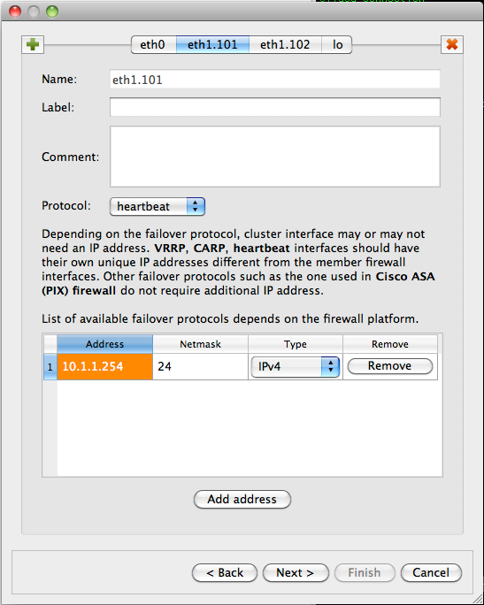

   Member Firewall Objects without VLAN Interfaces.

First, we need to add VLAN subinterface to eth1. To do this, select eth1 in the tree, right-click, and select "New interface" from the context menu to add the interface object:

.. figure:: img/cookbook-174.png
   :alt: Using the Context Menu to Add a Subinterface

   Using the Context Menu to Add a Subinterface.

.. figure:: img/cookbook-175.png
   :alt: Subinterface Created with a Default Name

   Subinterface Created with a Default Name.

The new interface object is created with the default name "Interface". Double-click it to open it in the editor and rename it to *eth1.101*:

.. figure:: img/cookbook-176.png
   :alt: VLAN Subinterface in the Editor

   VLAN Subinterface in the Editor.

Click the "Advanced interface settings" button to verify its VLAN configuration:

   VLAN Configuration of the Subinterface.

Note that interface type has been set to VLAN automatically. This is because Firewall Builder analyses the name of the subinterface and automatically chooses the correct type in the "Advanced" settings dialog. If the interface name matches a standard VLAN interface name for the chosen host OS, then it automatically is recognized as a VLAN subinterface and the program extracts VLAN ID from its name. For example, supported VLAN interface names on Linux are "eth1.101", "eth1.0101", "vlan101", "vlan0101". On other OSs, naming conventions are often different.

Create subinterface *eth1.102* using the same method.

Now you can move IP address objects from the interface *eth1* to subinterface *eth1.101*. Use the context menu items *Cut* and *Paste* to do this. While doing this, I also removed the IPv6 addresses that are not used in this example. You should arrive at the following configuration:

   IP Addresses Reassigned to the Subinterface.

We also need to configure IP address for the second VLAN interface *eth1.102* using context menu item "New address".

Finally, we have the firewall object *linux-test-3* configured according to the network diagram Figure 14.159:

.. figure:: img/cookbook-179.png
   :alt: Adding IP Addresses to VLAN Subinterface

   Adding IP Addresses to VLAN Subinterface.

This is not quite all yet though. Interface *eth1* is now a parent of two VLAN subinterfaces *eth1.101* and *eth1.102*. In this configuration, *eth1* does not have an IP address of its own. To reflect this, open it in the editor and check "Unnumbered" interface button as shown below:

.. figure:: img/cookbook-180.png
   :alt: Interface eth1 Is Unnumbered

   Interface eth1 Is Unnumbered.

We need to configure the second firewall object *linux-test-4* as well. You can repeat the process you just used to add subinterfaces and addresses like it was done for *linux-test-3*, or instead of doing this from scratch, you can copy and paste interface objects *eth1.101* and *eth1.102* from *linux-test-3* to interface *eth1* of *linux-test-4* and then just edit addresses. Here is the final configuration of both member firewalls:

.. figure:: img/cookbook-181.png
   :alt: VLAN Subinterface and Addresses of Both Member Firewalls

   VLAN Subinterface and Addresses of Both Member Firewalls.

Building a Cluster Object
^^^^^^^^^^^^^^^^^^^^^^^^^^^

Now that both member firewall objects are ready, we can create an object for the cluster. Use the "New Object" menu, and select the "Cluster" option to launch the wizard. On the first page of the wizard, choose *linux-test-3* and *linux-test-4* firewalls and enter the name for the cluster object:

.. figure:: img/cookbook-182.png
   :alt: Creating the Cluster Object

   Creating the Cluster Object.

On the next page of the wizard, you can build cluster interfaces. The program finds interfaces of the member firewalls with the same name and preconfigures cluster interface objects. On this page of the wizard, you can add or delete cluster interfaces and establish correspondence between them and interfaces of the member firewalls. The screenshot Figure 14.170 shows this page:

   Interfaces of the Cluster.

.. note::
   You only need to create interfaces of the cluster object that correspond to the interfaces of member firewalls that actually pass traffic and run failover protocols. This means you need *eth1.101*, *eth1.102* cluster interfaces but do not need *eth1*.

Moving on, on the next page of the wizard we configure IP addresses of the cluster interfaces according to our network diagram Figure 14.159:

.. figure:: img/cookbook-184.png
   :alt: IP Addresses of the Cluster Interfaces

   IP Addresses of the Cluster Interfaces.

The next page of the wizard offers an opportunity to use policy and NAT rules of one of the member firewalls for the cluster. However since our member firewalls have no rules, we do not need to use this feature and can just finish creating new cluster object. New cluster object is shown on Figure 14.172:

.. figure:: img/cookbook-185.png
   :alt: Cluster Object Configuration

   Cluster Object Configuration.

Managing VLAN Interfaces and Their IP Addresses
^^^^^^^^^^^^^^^^^^^^^^^^^^^^^^^^^^^^^^^^^^^^^^^^^

Firewall Builder can generate a shell script to configure VLAN interfaces for both member firewalls. The script is in fact a shell function inside the common firewall configuration script Firewall Builder creates for each firewall. To activate this feature, open each member firewall object in the editor by double clicking it in the tree and click "Firewall Settings" button, then navigate to the "Script" tab of the dialog. Screenshot Figure 14.173 shows this tab. Turn checkbox "Configure VLAN interfaces" on:

.. figure:: img/cookbook-186.png
   :alt: Turn VLAN Configuration On

   Turn VLAN Configuration On.

If you compile the policy for the cluster (or a standalone firewall) with the "Configure VLAN interfaces" checkbox turned on, the generated script includes the following fragment that is executed before iptables rules are loaded:

.. code-block:: text

   configure_interfaces() {
       :
       # Configure interfaces
       update_vlans_of_interface "eth1 eth1.101 eth1.102"
       clear_vlans_except_known eth1.101@eth1 eth1.102@eth1
       update_addresses_of_interface "lo 127.0.0.1/8" ""
       update_addresses_of_interface "eth0 10.3.14.108/24" "10.3.14.150/24"
       update_addresses_of_interface "eth1" ""
       update_addresses_of_interface "eth1.101 10.1.1.1/24" "10.1.1.254/24"
       update_addresses_of_interface "eth1.102 10.1.2.1/24" "10.1.2.254/24"
   }

Lines that configure VLAN interfaces are the calls to *update_vlans_of_interface* and *clear_vlans_except_known*. The first command, a call to the *update_vlans_of_interface* shell function, checks if VLAN interfaces eth1.101 and eth1.102 already exist and adds them if they are not there. It uses *vconfig* utility to do this. If VLAN interfaces with these names already exist, the function does nothing. This allows for incremental management of the VLAN interfaces, that is, when the script runs again, it does not try to add interfaces that already exist. It does not remove and add them back, either.

.. tip::
   Several naming conventions exist for VLAN interfaces on Linux and the script recognizes all of them. You can call the VLAN interface "eth1.101", "eth1.0101", "vlan101" or "vlan0101".

To test this feature, you can run the generated script with the command-line parameter ``test_interfaces``. This makes the script analyse interfaces and print commands that it would normally execute to configure them, but it does not actually execute these commands but only prints them. To illustrate this, I start with machine linux-test-4 in the state where it has no VLAN interfaces and some IP addresses do not match configuration defined in fwbuilder. Running the script with ``test_interfaces`` command line parameter demonstrates what it is going to do to bring configuration of the machine in sync with setup configured in fwbuilder:

.. code-block:: text

   root@linux-test-4:~# ip addr ls
   1: lo: <LOOPBACK,UP,LOWER_UP> mtu 16436 qdisc noqueue state UNKNOWN
       link/loopback 00:00:00:00:00:00 brd 00:00:00:00:00:00
       inet 127.0.0.1/8 scope host lo
       inet6 ::1/128 scope host
          valid_lft forever preferred_lft forever
   2: eth0: <BROADCAST,MULTICAST,UP,LOWER_UP> mtu 1500 qdisc pfifo_fast state UNKNOWN qlen 1000
       link/ether 00:0c:29:fc:67:8c brd ff:ff:ff:ff:ff:ff
       inet 10.3.14.109/24 brd 10.3.14.255 scope global eth0
       inet6 fe80::20c:29ff:fefc:678c/64 scope link
          valid_lft forever preferred_lft forever
   3: eth1: <BROADCAST,MULTICAST,UP,LOWER_UP> mtu 1500 qdisc pfifo_fast state UNKNOWN qlen 1000
       link/ether 00:0c:29:fc:67:96 brd ff:ff:ff:ff:ff:ff
       inet 10.1.1.2/24 brd 10.1.1.255 scope global eth1
       inet6 fe80::20c:29ff:fefc:6796/64 scope link
          valid_lft forever preferred_lft forever
   root@linux-test-4:~# /etc/fw/linux-test-4.fw test_interfaces
   # Adding VLAN interface eth1.101 (parent: eth1)
   vconfig set_name_type DEV_PLUS_VID_NO_PAD
   vconfig add eth1 101
   ifconfig eth1.101 up
   # Adding VLAN interface eth1.102 (parent: eth1)
   vconfig set_name_type DEV_PLUS_VID_NO_PAD
   vconfig add eth1 102
   ifconfig eth1.102 up
   # Removing ip address: eth1 10.1.1.2/24
   ip addr del 10.1.1.2/24 dev eth1
   ifconfig eth1 up
   # Interface eth1.101 does not exist
   # Adding ip address: eth1.101 10.1.1.2/24
   ip addr add 10.1.1.2/24 dev eth1.101
   ifconfig eth1.101 up
   # Interface eth1.102 does not exist
   # Adding ip address: eth1.102 10.1.2.2/24
   ip addr add 10.1.2.2/24 dev eth1.102
   ifconfig eth1.102 up

Commands that manage VLAN interfaces are highlighted above. The script adds VLAN interfaces eth1.101 and eth1.102 to eth1 and brings them up, then removes IP address 10.1.1.2 from eth1 and adds addresses 10.1.1.2 to eth1.101 and 10.1.2.2 to eth1.102.

To set interfaces up and load iptables rules, just run the script with command line parameter ``start``. If you only want to try to configure interfaces but not load iptables rules just yet, run the script with command-line parameter ``interfaces``. Here is what happens:

.. code-block:: text

   root@linux-test-2:~# /etc/fw/linux-test-4.fw interfaces
   # Adding VLAN interface eth1.101 (parent: eth1)
   Set name-type for VLAN subsystem. Should be visible in /proc/net/vlan/config
   Added VLAN with VID == 101 to IF -:eth1:-
   # Adding VLAN interface eth1.102 (parent: eth1)
   Set name-type for VLAN subsystem. Should be visible in /proc/net/vlan/config
   Added VLAN with VID == 102 to IF -:eth1:-
   # Removing ip address: eth1 10.1.1.2/24
   # Adding ip address: eth1.101 10.1.1.2/24
   # Adding ip address: eth1.102 10.1.2.2/24

We can now verify that the script added VLAN interfaces and configured IP addresses:

.. code-block:: text

   root@linux-test-2:~# ip addr ls
   1: lo: <LOOPBACK,UP,LOWER_UP> mtu 16436 qdisc noqueue state UNKNOWN
       link/loopback 00:00:00:00:00:00 brd 00:00:00:00:00:00
       inet 127.0.0.1/8 scope host lo
       inet6 ::1/128 scope host
          valid_lft forever preferred_lft forever
   2: eth0: <BROADCAST,MULTICAST,UP,LOWER_UP> mtu 1500 qdisc pfifo_fast state UNKNOWN qlen 1000
       link/ether 00:0c:29:fc:67:8c brd ff:ff:ff:ff:ff:ff
       inet 10.3.14.109/24 brd 10.3.14.255 scope global eth0
       inet6 fe80::20c:29ff:fefc:678c/64 scope link
          valid_lft forever preferred_lft forever
   3: eth1: <BROADCAST,MULTICAST,UP,LOWER_UP> mtu 1500 qdisc pfifo_fast state UNKNOWN qlen 1000
       link/ether 00:0c:29:fc:67:96 brd ff:ff:ff:ff:ff:ff
       inet6 fe80::20c:29ff:fefc:6796/64 scope link
          valid_lft forever preferred_lft forever
   4: eth1.101@eth1: <BROADCAST,MULTICAST,UP,LOWER_UP> mtu 1500 qdisc noqueue state UP
       link/ether 00:0c:29:fc:67:96 brd ff:ff:ff:ff:ff:ff
       inet 10.1.1.2/24 scope global eth1.101
       inet6 fe80::20c:29ff:fefc:6796/64 scope link
          valid_lft forever preferred_lft forever
   5: eth1.102@eth1: <BROADCAST,MULTICAST,UP,LOWER_UP> mtu 1500 qdisc noqueue state UP
       link/ether 00:0c:29:fc:67:96 brd ff:ff:ff:ff:ff:ff
       inet 10.1.2.2/24 scope global eth1.102
       inet6 fe80::20c:29ff:fefc:6796/64 scope link
          valid_lft forever preferred_lft forever

Now that VLAN interfaces are there and IP addresses are correct, let's see what happens if we run the script again:

.. code-block:: text

   root@linux-test-2:~# /etc/fw/linux-test-4.fw test_interfaces
   root@linux-test-2:~#

The script verified configuration and has found that it does not need to change anything.

Heartbeat Configuration
^^^^^^^^^^^^^^^^^^^^^^^^

Heartbeat configuration in this setup is rather straightforward and is not very different from the one we used in the previous recipe :ref:`Section 14.4.3 <linux-cluster-using-heartbeat>`.

.. code-block:: text

   # cat ha.cf:
   mcast eth0 225.0.0.1 694 1 0
   mcast eth1.101 225.0.0.1 694 1 0
   mcast eth1.102 225.0.0.1 694 1 0
   auto_failback on
   node linux-test-1
   node linux-test-2

   # cat haresources
   linux-test-1 IPaddr::10.3.14.150/24/eth0/10.3.14.255
   linux-test-1 IPaddr::10.1.1.254/24/eth1.101/10.1.1.255
   linux-test-1 IPaddr::10.1.2.254/24/eth1.102/10.1.2.255

   # cat authkeys
   auth 3
   3 md5 hb-auth-key

The difference between heartbeat configuration in :ref:`Section 14.4.3 <linux-cluster-using-heartbeat>` and this is that we now run it over three interfaces, using VLAN interfaces *eth1.101* and *eth1.102* instead of *eth1*. Otherwise it works exactly the same and manages virtual addresses *10.3.14.150*, *10.1.1.254* and *10.1.2.254* on corresponding subnets.

Policy and NAT rule configuration in this setup is also the same as in :ref:`Section 14.4.3 <linux-cluster-using-heartbeat>` and we won't repeat it here.

Linux Cluster Using Heartbeat Running Over Dedicated Interface
~~~~~~~~~~~~~~~~~~~~~~~~~~~~~~~~~~~~~~~~~~~~~~~~~~~~~~~~~~~~~~~~

Documentation coming soon...

State Synchronization with conntrackd in Linux Cluster
~~~~~~~~~~~~~~~~~~~~~~~~~~~~~~~~~~~~~~~~~~~~~~~~~~~~~~~~

Documentation coming soon...

OpenBSD Cluster
~~~~~~~~~~~~~~~~~

Documentation coming soon...

PIX Cluster
~~~~~~~~~~~~~

Documentation coming soon...

Examples of Traffic Shaping
-----------------------------

Basic Rate Limiting
~~~~~~~~~~~~~~~~~~~~~

This example shows how you can use Firewall Builder to classify traffic and then use the Linux Traffic Control (tc) feature to rate limit the amount of bandwidth that a specific application can use.

For this example we will be using Firewall Builder to configure a Linux host with a webserver. The generated firewall script will be run directly on the webserver and this is also where the traffic shaping will be done. The goal of this example is to limit the total bandwidth used for HTTP traffic to be 2Mbps or less. You can extend the same principles to more complex scenarios using more advanced features in tc.

**Defining the classification in Firewall Builder**

First we need to create an object with the source port set to 80. This corresponds to the HTTP traffic leaving the server which is what we want to limit.

   HTTP source object.

Next we need to decide what classification class ID we want to use for this traffic. This is the value that will be configured in Firewall Builder to have iptables set the ``-j CLASSIFY --set-class`` target and value. For this example we are going to use class ID 1:10.

To set the class ID for the HTTP traffic originating from the server, we need to add a rule that allows the traffic as shown in Figure 14.176.

   Classify Rule.

To create this rule the following was done:

1. Set Source to firewall object, in our case web-1
2. Set the Service to be the HTTP source object we created previously
3. Set the Action to be Classify
4. Turn logging off (optional)

When we set the Action to Classify, the Editor Panel provides an input box where we can set the class ID value. In this case we used 1:10 as shown in Figure 14.177 below.

.. figure:: img/cookbook-189.png
   :alt: Classify Rule showing class ID setting

   Classify Rule showing class ID setting in the Editor Panel.

**Configuring tc to rate limit traffic**

In this example we want to limit the amount of HTTP traffic being served by this server to 2Mbps. This might be due to usage charges, limited available bandwidth, etc.

Once the traffic has been set with the class ID, in our case we used 1:10, you can use Traffic Control (tc) to match the class ID and limit the bandwidth for a specific class ID. Tc is configured through a set of commands run from a shell. You can find out more about available tc commands by typing ``man tc``.

In this case we want the tc commands to be run every time the Firewall Builder generated script is run, so we are going to add them to the Epilog of the web-1 firewall object.

Double-click the firewall object to open it for editing and then click on the Firewall Settings button in the editor panel. Click on the Prolog/Epilog tab and add the following commands in the Epilog window.

.. code-block:: text

   # rates are in kbit/sec
   RATE_DEFAULT=10000
   RATE_HTTP=2000
   tc qdisc del dev eth0 root >/dev/null 2>&1
   tc qdisc add dev eth0 root handle 1: htb default 90
   tc class add dev eth0 parent 1: classid 1:1 htb rate ${RATE_DEFAULT}kbit ceil ${RATE_DEFAULT}kbit
   tc class add dev eth0 parent 1:1 classid 1:10 htb rate 1kbit ceil ${RATE_HTTP}kbit

Your configuration should now look like Figure 14.178.

.. figure:: img/cookbook-190.png
   :alt: Epilog configuration with tc commands for traffic shaping

   Epilog configuration with tc commands for traffic shaping.

While this example showed controlling bandwidth from a single host, you can also apply the same concepts to a network firewall that provides traffic shaping for multiple systems on a network.
Useful Tricks
-------------

Using Clusters to Manage Firewall Policies on Multiple Servers
~~~~~~~~~~~~~~~~~~~~~~~~~~~~~~~~~~~~~~~~~~~~~~~~~~~~~~~~~~~~~~

In this recipe we are going to cover how to use Firewall Builder clusters to manage a single firewall policy that gets deployed on multiple servers. An example of where you could use this would be managing a shared firewall policy for a collection of web servers that are all providing the same service and should have the same rules.

Normally the cluster feature is used to create high availability firewall pairs, but in this case we are going to use it creatively to create a master firewall policy that gets deployed on multiple servers.

For this recipe, we are going to use the web farm example shown below. The example starts with two servers running Linux with iptables should have identical firewall polices. We'll cover creating the firewalls and cluster and assigning rules to it. At the end we'll walk through adding a third server to the cluster.

.. figure:: img/cookbook-180.png
   :alt: Server configuration showing two web servers connected via eth0 with a note that web servers need to have identical firewall policies

   Server Configuration (top).

.. figure:: img/cookbook-181.png
   :alt: Server configuration showing web-01 at 192.0.2.11/24 and web-02 at 192.0.2.12/24 connected to a router

   Server Configuration (bottom).

On these servers we want to implement the following basic firewall rules.

* Allow system to communicate to its own loopback interface
* Allow inbound HTTP and HTTPS from anywhere to the server
* Allow inbound SSH from a specific set of trusted subnets
* Allow outbound connectivity to port 8009 (jboss) to a group of application servers

**Step 1 - Create Firewall Objects for Your Servers**

To create a cluster, we first need to create the firewall objects that will be members of the cluster. Each server is represented by a firewall object in Firewall Builder. Go through the New Firewall wizard and create a firewall called web-01 with two interfaces. The first interface is the Ethernet interface "eth0" that connects the server to the Internet and the second interface is the loopback interface "lo".

After you have created the firewall object, it should look like this in the object tree:

.. figure:: img/cookbook-182.png
   :alt: Object tree showing web-01 firewall with Policy, NAT, Routing, eth0 interface with web-01:eth0:ipv4, and lo interface with web-01:lo:ipv4

   web-01 firewall object.

By default, Firewall Builder sets the firewall object to route (forward) IP packets. Since this is a server firewall we should disable IP forwarding on the host. Do this by double-clicking the firewall object and then click on Host OS Settings in the Editor Panel at the bottom. Change the setting for IPv4 Packet Forwarding to Off.

   Disable IP Forwarding.

To create a second firewall object for web-02 you can use the Duplicate feature in Firewall Builder.

* Right-click web-01 firewall and select Duplicate -> place in library User
* Edit the name of the newly created firewall object to web-02
* Double-click web-02's IP object under the eth0 interface and set the IP address to 192.0.2.12 / 24

**Step 2 - Create a New Cluster**

To create a new cluster right-click the Clusters folder in the object tree and select New Cluster. This will launch the New Cluster wizard. Name the cluster (for example, web-servers), and select both web-01 and web-02 to be members of the cluster. Since we are not using failover it does not matter which firewall is set to Master.

.. figure:: img/cookbook-185.png
   :alt: New Cluster wizard showing the Clusters context menu with New Cluster option, cluster name set to web-servers, and both web-01 and web-02 selected as members

   Creating a New Cluster.

Click *Next >*

Since both servers use eth0 as the outside interface leave the interface mapping as is. If you have servers with different interface names on your server, for example if one server uses eth0 and the other server uses eth1, you can set the mapping here.

   Cluster Interface Mapping.

Click *Next >*

To make the cluster interface easy to identify, update the label associated with interfaces eth0 and lo. Since we are not running our servers as a high availability cluster with failover set the Failover protocol to None.

   Set Cluster Interface Configuration.

.. note::

   Make sure to update *both* the eth0 and lo interfaces.

Click *Next >*

We want to create new rules for our cluster, so set the source of the cluster rules to be "do not use any, I will create new policy and NAT rules".

.. figure:: img/cookbook-190.png
   :alt: Radio button selection showing do not use any, i will create new policy and NAT rules option selected

   Set the Source of the Cluster Rules.

Click *Finish*

Once you are done you should see a new cluster object in the tree that looks like this:

   New Cluster Object web-servers.

**Step 3 - Define Cluster Policy Rules**

After you create the cluster, the policy object is automatically opened in the Rules Panel. Remember we wanted both of our servers to have the following rules:

* Allow the system to communicate to its own loopback interface
* Allow inbound HTTP and HTTPS from anywhere to the server
* Allow inbound SSH from a specific set of trusted subnets
* Allow outbound connectivity to port 8009 (jboss) to a group of application servers

After you configure these rules your policy should look like this:

.. figure:: img/cookbook-192.png
   :alt: Cluster policy rules showing four rules - rule 0 Any to Any on web-servers:lo Both Accept, rule 1 Any to web-servers:eth0 http/https Inbound Accept, rule 2 Trusted Networks to web-servers:eth0 ssh Inbound Accept, rule 3 web-servers:eth0 to Application Servers jboss Outbound Accept

   Set the source of the cluster rules.

.. note::

   Make sure to use the objects from the cluster when creating the rules. These objects will automatically get translated to the correct object for the individual cluster members.

**Step 4 - Compile and Install Rules**

The next step is to compile and install the rules to our servers. When Firewall Builder compiles the cluster it will generate a firewall script for each of the cluster members including substituting the cluster objects used in the rules for the local object on the cluster member.

For example, the IP address for the eth0 cluster object is automatically translated to the correct address for web-01 (192.0.2.11) and web-02 (192.0.2.12).

You can see this substitution by inspecting the generated file for web-01 after the compile is completed. Note that the destination is set to the IP address of web-01's eth0 interface.

.. code-block:: text

   echo "Rule 0 (eth0)"
   #
   $IPTABLES -A INPUT -i eth0 -p tcp -m tcp -m multiport -d 192.0.2.11 \
     --dports 80,443 -m state --state NEW -j ACCEPT

**Modifying Rules**

Now that you have a cluster setup to generate firewall policies for each of the server firewalls it is easy to make changes that affect all your servers. For example, to add a new rule to all members of the web-servers cluster to allow ICMP from the Trusted Networks object to servers simply add the rule in the cluster policy and compile and install it to the members.

**Adding a New Server to the Cluster**

To add a new server to the cluster, you first need to create the firewall object to represent the server. You can do this manually, or you can follow the same duplication process we used to create the web-02 firewall object.

* Right-click web-02 firewall and select Duplicate -> place in library User
* Edit the name of the newly created firewall object to web-03
* Click the Host OS Settings and disable IPv4 Packet forwarding
* Double-click web-03's IP object under the eth0 interface and set the IP address to 192.0.2.23 / 24

The next step is to add the new web-03 firewall object to the cluster.

   Add the New web-03 Server to the web-servers Cluster.

Repeat this process for the "lo" loopback interface. Remember the steps are:

* Double-click the interface named web-servers:eth0:members
* Click the Manage Members button at the bottom of the Editor Panel
* Click to select the "lo" interface under the web-03 object
* Click the right arrow > button to add the interface to the cluster member list
* Click Ok

**Installing the Firewall Policy on the New Server in the Cluster**

To deploy the firewall policy on web-03 you need to compile and install the cluster policy. Since the cluster policy hasn't changed we don't need to re-install the policy on web-01 or web-02 so we unselect them from the install list.

   Compile the Cluster Policy and Install on web-03.

You can add and remove servers to the cluster as needed. Here's our configuration now that we have three servers in the cluster all running the same firewall rules.

   Cluster with Three Firewalls Sharing the Same Firewall Policy (top).

   Cluster with Three Firewalls Sharing the Same Firewall Policy (bottom).

Creating Local Firewall Rules for a Cluster Member
~~~~~~~~~~~~~~~~~~~~~~~~~~~~~~~~~~~~~~~~~~~~~~~~~~

In the previous recipe, we showed how to use the Firewall Builder cluster object to create a single firewall policy that gets installed on multiple servers. When we finished the cluster was configured with three servers as shown below.

   Cluster with Three Firewalls Sharing the Same Firewall Policy with One Firewall Also Using Local Rules (top).

.. figure:: img/cookbook-199.png
   :alt: Network diagram showing web-01 at 192.0.2.11/24, web-02 at 192.0.2.12/24, and web-03 at 192.0.2.13/24 connected to a router

   Cluster with Three Firewalls Sharing the Same Firewall Policy with One Firewall Also Using Local Rules (bottom).

In this recipe we will show how to create a set of local rules on one of the cluster members. Local rules are evaluated *in addition* to the rules that are configured for the cluster.

For this example we will add a local rule to the web-03 server firewall allowing remote access to the server via SSH from a trusted external vendor coming from a network defined as "Vendor X Network".

* Allow inbound SSH from network object "Vendor X Network"

The following steps assume that we are starting with the same configuration that the previous example finished with.

**Step 1 - Create a New Policy in the web-servers Cluster**

Since we only want this policy applied to *one* of the servers in the cluster, not all of the cluster members, we need to create a separate policy object to hold the local rules.

In this example we name the new policy object "local_rules". The policy name can be any name you choose except that it cannot be the same name as the policy that contains the main firewall rules for the cluster which, by default, is 'Policy'.

   New Policy in Cluster Object web-servers.

After you are done, you should see the new policy named local_rules under the web-servers cluster object.

   Cluster Object web-servers with New Policy local_rules.

**Step 2 - Create a New Policy in the web-03 Server Object**

Next we need to create a policy object on the web-03 firewall *using exactly the same name* as we used for the policy object on the web-servers cluster.

   New Policy in Firewall Object web-03.

.. note::

   You must use the same name for the policy on both the cluster object and the firewall object.

**Step 3 - Define the Local Rule in the New Policy on the web-03 Firewall**

Remember, the rule we want to add only to web-03 server is:

* Allow inbound SSH from network object "Vendor X Network"

When creating local rules use the interface objects of the firewall that the local rule is being configured on. For our example we use the interface object of the web-03 firewall for the destination and interface fields. After you configure the rule in the local_rules policy on web-03 the policy should look like this:

   New Rule in Policy local_rules on Firewall Object web-03.

.. note::

   Make sure to configure this rule in the local_rules policy object on the web-03 firewall object. You can see which firewall policy you are editing at the top of the Rules panel.

**Step 4 - Set Up a Branching Rule in the Cluster Policy to Jump to the Local Policy**

For the rules in the policy 'local_rules' to be applied we need to setup a branching rule in the main policy called 'Policy' to jump to the local_rules policy. You can define the branch rule anywhere in the policy, in this example we are going to make the branch the first rule of the policy. This will ensure that the custom rules defined on web-03 will be run first, then the rest of the rules for the cluster will be applied.

   New Branching Rule in the Main Policy on the Cluster Object web-servers.

.. note::

   Make sure you set the branch target to be the 'local_rules' object from the cluster object and not one of the member firewalls.

After you have configured the branching rule in the main policy your rules should look like this.

.. figure:: img/cookbook-208.png
   :alt: Cluster policy showing rule 0 with Any to Any on All interfaces Both direction with Branch:local_rules action, followed by the regular cluster rules for HTTP/HTTPS, SSH, and jboss

   Cluster Policy with Branch Rule on Top.

.. note::

   Not all firewall platforms support branching, you can find out more about branching in :ref:`Section 7.2.8 <section-7-2-8>`.

**Step 5 - Compile and Install Policy**

Since changes were made to the web-servers cluster and web-03 objects we need to compile and install the updated firewall rules to all cluster members.

When the rules are compiled, Firewall Builder includes the rules defined in the local_rules policy object on the firewall cluster member if they exist. If no rules are found in the member's local_rules Firewall Builder will include the rules from the cluster object's local_rules.

To see an example of this you can inspect the generated firewall script for the web-03 server. You can see the new iptables chains for the local_rules policy in red.

.. code-block:: text

   echo "Rule local_rules 0 (eth0)"
   #
   $IPTABLES -N local_rules
   $IPTABLES -N In_local_rules_0
   $IPTABLES -A local_rules -i eth0 -p tcp -m tcp -s 198.51.100.0/24 \
     -d 192.0.2.13 --dport 22 -m state --state NEW -j In_local_rules_0
   $IPTABLES -A In_local_rules_0 -j LOG --log-level info --log-prefix "RULE 0 -- ACCEPT "
   $IPTABLES -A In_local_rules_0 -j ACCEPT
   # ================ Table 'filter', rule set Policy
   #
   # Rule 0 (global)
   #
   echo "Rule 0 (global)"
   #
   $IPTABLES -A OUTPUT  -j local_rules
   $IPTABLES -A INPUT   -j local_rules
   $IPTABLES -A FORWARD -j local_rules

.. note::

   The compiler will generate a warning for the web-03 firewall object since there is a policy object named local_rules on the web-03. When both the cluster object and a member object have a policy with the same name, if the member object's policy is *not* empty then the member's policy will be used in place of the cluster object for that policy.

This results in the firewall web-03 having the following rules matching applied.

.. figure:: img/cookbook-209.png
   :alt: Diagram showing firewall rules sequence for traffic destined to web-03 where rules in local_rules are evaluated first, then rules in Policy are evaluated for traffic that did not match a rule in local_rules

   Firewall Rules Sequence for Traffic Destined to web-03 (top).

.. figure:: img/cookbook-210.png
   :alt: Diagram showing inbound traffic flowing through local_rules then Policy before reaching web-03 at 192.0.2.13/24 on eth0

   Firewall Rules Sequence for Traffic Destined to web-03 (bottom).

.. note::

   All the other members of the cluster will have an empty rule chain created for local_rules. This means incoming traffic will go through this empty chain first before being passed back to the main rules defined in Policy.

   You can also create custom rules on other members of the cluster using the same local_rules policy name.

Another Way to Generate a Firewall Policy for Many Hosts
~~~~~~~~~~~~~~~~~~~~~~~~~~~~~~~~~~~~~~~~~~~~~~~~~~~~~~~~

This is a simpler, but less powerful and flexible, way to manage multiple hosts requiring the same firewall policy.

Suppose you use Firewall Builder to generate a policy for the firewall running on a server. How can Firewall Builder help you generate a policy for it and how can you do it if you have hundreds of servers like that?

For example, you could run a firewall locally on the web server that should be accessible to anyone on protocol HTTP, but other protocols used to publish content and manage the machine should be open only to a limited number of IP addresses. To configure such a firewall running on a host in Firewall Builder, create a firewall object and configure it with interfaces as usual. You will need to create a loopback interface and Ethernet (if it's a Linux machine, then it will be "eth0"). This firewall object now represents your server with a firewall running on it. You can then build a policy. Most likely you won't need NAT rules there, although there are some cases where NAT rules may be useful too. Compile the policy and transfer it to the server using the Firewall Builder installer as usual. That's it.

This procedure gets really tiresome if you need to repeat it many times. This is so if you have a whole farm of servers and need to generate and install a firewall policy on each one of them. The following trick helps simplify the process if the servers are very similar (like a web servers farm) and use identical firewall policies.

You need to create a firewall object as described above, except its interface "eth0" should be marked as "dynamic". Do not add an address object with IP address to it, just make it look like it gets IP address dynamically. Even if in reality it is configured statically, you make Firewall Builder believe it is dynamic. In this case, the generated firewall script will determine the actual address of the interface and then use it in the policy rules, which allows you to run the same script on many servers with different addresses. You will need to copy the firewall script from the management workstation to the servers by hand or by using some custom script. This should not be difficult though if you use SSH and RSA or DSA keys.

Using Empty Groups
~~~~~~~~~~~~~~~~~~

This example shows how the option "Ignore empty groups" can be used to build a rule controlling access to or from an often-changing group of computers. Suppose we need to set up a rule to control access to or from a group of computers. In principle this should be easy: we create a Host object for each computer, then create a group and put all these Host objects in it. We can use this group in the Source or Destination of the policy rule to achieve our goal. If we ever need to add a new machine to the control list, we create a new host object and add it to the group; if we need to remove the machine from the list, we just remove it from the group. But what should happen if after the last machine has been removed the group becomes empty? If the empty group is in the Source of the rule, shouldn't the compiler treat it as Any? This is confusing, to say the least.

Here is how it works in Firewall Builder. The behavior of the compiler is controlled by the Ignore empty groups in rules checkbox in the "Compiler" tab of the Firewall Settings dialog. If this checkbox is off, then compiler treats empty groups as an error and stops processing of the ruleset as soon as it encounters such group. This is the default setting. However, if this checkbox is on, then compiler simply removes empty group from the rule and continues processing. This makes sense, since an empty group defines no objects and if the rule element has some other objects in it, removing an empty group does not change its meaning. It becomes tricky when the empty group is the only object in the rule element though. In this case, removing the group from the rule element makes it empty, which is equivalent to Any. All of the sudden, instead of controlling access to or from a group of hosts, the rule expands its action to any host. To avoid this unexpected side-effect, compiler drops a rule if rule element becomes empty after the last empty group has been removed. Again, it works this way only if the checkbox "Ignore empty groups" is on.

For example, this feature can be used to set up a rule to control Internet access from a number of student computers. Suppose some students may be denied access once in a while, in which case their machine is removed from the group. If at some point of time all machines were removed from the group, the compiler would simply ignore this rule instead of inadvertently creating a hole in the policy.

How to Use Firewall Builder to Configure the Firewall Using PPPoE
~~~~~~~~~~~~~~~~~~~~~~~~~~~~~~~~~~~~~~~~~~~~~~~~~~~~~~~~~~~~~~~~~

If your Internet connection uses the PPPoE protocol, then your firewall should be configured with interface ppp0.

With PPPoE, the connection is established using the PPP protocol that works on top of the usual Ethernet. As the result, the firewall gets interface ppp0 in addition to the interfaces eth0 and eth1 that correspond to its "normal" physical network adapters. Here is how you can use Firewall Builder to configure such a firewall (assuming interface eth0 is connected to the DSL link and eth1 is connected to internal LAN):

1. Create a firewall object in the GUI.

2. Add interfaces ppp0 and eth1. You can simply skip eth0 as it does not have an IP address and never sees IP packets.

3. If you have a static IP address with your Internet connection, mark ppp0 as "static" and add an address object to it. Configure the address object with the IP address.

4. If your Internet connection uses dynamic IP address, mark ppp0 as "dynamic" and do not add an address object to it. Create a script /etc/ppp/ip-up to restart the firewall every time IP address of ppp0 changes.
