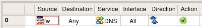

Troubleshooting
===============

.. sectnum::
   :start: 15

.. contents::
   :local:
   :depth: 2

This chapter provides tips for troubleshooting problems with FirewallFabrik.

Installation Issues
-------------------

PySide6 Not Found
~~~~~~~~~~~~~~~~~

When launching ``fwf``, you get an error: ``Python module "PySide6" is not installed; this module is required to run FirewallFabrik in GUI mode.``

Make sure you installed FirewallFabrik with the ``[gui]`` extra:

.. code-block:: bash

   pip install 'firewallfabrik[gui]'

If you are using the distribution's native PySide6 package, ensure your virtual environment was created with ``--system-site-packages``.

Program Startup Issues
----------------------

GUI Does Not Start (No Display)
~~~~~~~~~~~~~~~~~~~~~~~~~~~~~~~

FirewallFabrik requires a running display server (X11 or Wayland). If you are running it over SSH, make sure X11 forwarding is enabled (``ssh -X``) or use Wayland forwarding.

Check that the ``DISPLAY`` or ``WAYLAND_DISPLAY`` environment variable is set.

Firewall Compiler Issues
-------------------------

"ip: command not found"
~~~~~~~~~~~~~~~~~~~~~~~

The generated iptables script uses the ``ip`` command from the ``iproute2`` package. Install it using your distribution's package manager:

.. code-block:: bash

   # Debian/Ubuntu
   apt install iproute2

   # Fedora/RHEL
   dnf install iproute

"Interface eth0 does not exist"
~~~~~~~~~~~~~~~~~~~~~~~~~~~~~~~

The script generated by FirewallFabrik uses ``/sbin/ip`` to verify that the interfaces configured in the GUI actually exist on the firewall machine. This error can occur when:

* The ``iproute2`` package is not installed on the firewall.
* The firewall script runs too early during boot, before all interfaces have been initialized (e.g. a ``ppp0`` interface that requires ``pppd`` to be running first).
* The interface name in the GUI does not match the actual interface name on the firewall machine.

Make sure the interface names in FirewallFabrik match the names shown by ``ip link show`` on the firewall.

"Interface eth0:1 does not exist"
~~~~~~~~~~~~~~~~~~~~~~~~~~~~~~~~~

``eth0:1`` is not a real interface on Linux -- it is just a label for a secondary IP address on ``eth0``. Do not create interface objects like ``eth0:1`` in FirewallFabrik. Instead, add the additional IP address to the ``eth0`` interface object.

You can verify this with ``ip addr show dev eth0``, which will show all addresses on the interface regardless of labels.

"Cannot create virtual address NN.NN.NN.NN"
~~~~~~~~~~~~~~~~~~~~~~~~~~~~~~~~~~~~~~~~~~~~

The policy compiler needs to determine which firewall interface a NAT virtual address belongs to. It does this by checking which interface's subnet contains the address. If no interface matches, compilation fails.

To resolve this, either:

* Ensure the firewall interface has an address on the same subnet as the NAT address, or
* Turn off the "Create virtual addresses for NAT rules" option in the Firewall Settings dialog and configure the address manually.

Issues After Policy Activation
-------------------------------

Cannot Access Only Some Web Sites
~~~~~~~~~~~~~~~~~~~~~~~~~~~~~~~~~~

If the browser times out on certain web sites but others work fine, this might be caused by an MTU/MSS problem, especially on DSL connections using PPPoE.

For iptables firewalls, enable the "Clamp MSS to MTU" option in the Firewall Settings dialog.

For nftables firewalls, a similar MSS clamping rule can be configured.

Firewall Becomes Very Slow with New Policy
~~~~~~~~~~~~~~~~~~~~~~~~~~~~~~~~~~~~~~~~~~

Most likely the firewall needs to perform DNS lookups but your policy is blocking them. Check ``/etc/resolv.conf`` on the firewall for the name server address and make sure your policy permits DNS queries.

If the firewall runs a caching name server (``/etc/resolv.conf`` lists ``127.0.0.1``), you need rules to:

1. Permit traffic on the loopback interface (firewall to itself).
2. Permit the firewall to send DNS queries to external name servers.

.. figure:: img/troubleshoot-dns-on-loopback.png
   :alt: DNS rule on loopback interface

   DNS rule on loopback interface

   DNS rule to external name servers

Cannot Access Internet from Behind Firewall
~~~~~~~~~~~~~~~~~~~~~~~~~~~~~~~~~~~~~~~~~~~

Troubleshooting steps:

* Make sure the policy compiled and activated without errors.
* Check that IP forwarding is enabled (see the firewall object's Host OS Settings dialog).
* Try pinging hosts by IP address to isolate DNS problems.
* Check the firewall log for dropped packets.
* Verify that you have a NAT rule if the protected network uses private IP addresses.
* If NAT is not used, check that routing is properly configured on both the firewall and the hosts behind it.

Updated Policy Seems to Make No Difference
~~~~~~~~~~~~~~~~~~~~~~~~~~~~~~~~~~~~~~~~~~~

* Verify you compiled the correct firewall object and deployed to the correct machine.
* Check the activation output for the "Activating firewall script generated ..." line with the correct date and time.
* Look for rules above your new rule that may permit the traffic you are trying to block. Use the Find function to search for service objects by port number.
* Check if an automatic rule overrides your policy (e.g. the "Always permit SSH access from the management workstation" option in Firewall Settings).

Routing Rules Issues
--------------------

Compile Fails with Dynamic or Point-to-Point Interfaces
~~~~~~~~~~~~~~~~~~~~~~~~~~~~~~~~~~~~~~~~~~~~~~~~~~~~~~~~

If you have interfaces with a dynamic address or a point-to-point address and you try to insert a routing rule for the default gateway, compilation might fail with "gateway not reachable". This typically happens with DSL dial-up links.

Solution: leave the gateway field empty and specify only the interface.

Reporting Bugs
--------------

If you encounter a bug, please file an issue at:

https://github.com/linuxfabrik/firewallfabrik/issues/

Include the following information:

* FirewallFabrik version (``fwf --version``)
* Python version (``python3 --version``)
* PySide6 version (shown in Help > Debugging Info)
* Steps to reproduce the problem
* Any error messages or tracebacks from the terminal
